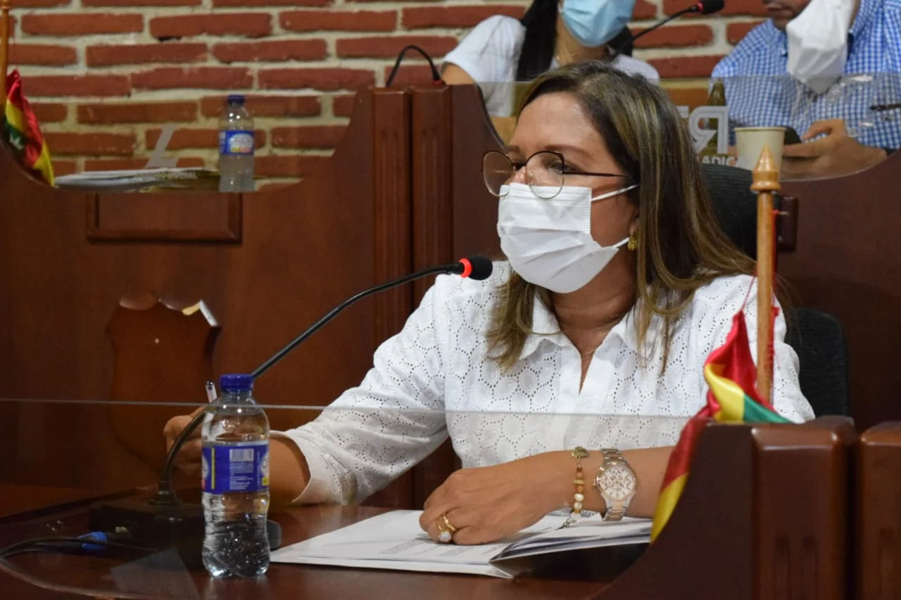
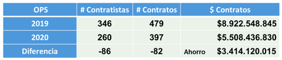
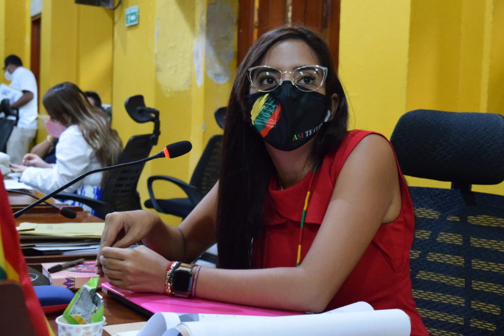

> «La corrupción consiste en el _\[…\] abuso de posiciones de poder o de confianza, para el beneficio particular en detrimento del interés colectivo, realizado a través de ofrecer o solicitar, entregar o recibir bienes o dinero en especie, en servicios o beneficios, a cambio de acciones, decisiones u omisiones \[…\]»_ (Transparencia por Colombia).
> 
> Transparencia por Colombia

*Cartagena va pa'atrás*

**Cartagena _va pa'trás_**. El gerente de Corvivienda, el ex detective del Das Néstor Castro Castañeda —en el 2020— **contrató a  260 contratistas por valor de $5.504 millones para hacer nada**. Esta cifra la hicieron pasar como un logro en el balance de gestión presentado esta semana en el concejo distrital.  Pero la verdad es que **no construyeron una sola vivienda nueva, ni un mejoramiento y ni una legalización** durante el 2020. Esas son las tres misiones fundacionales que tiene Corvivienda. Son los indicadores para establecer una buena gestión pública.

Lo único que la dupleta **Castro Castañeda y William Dau** pueden presentar de su gestión en Corvivienda 2020 es la firma del convenio interadministrativo con **el «nido de ratas» de la Universidad de Cartagena** (UdeC) por valor de **$4.700 millones**.

¿«Nido de ratas»? El nido de ratas está en Corvivienda que engulle **$5.504 millones en burocracia ociosa** para contratar a hijos de malandrines de la talla de **Carlos Coronado.** Este sí es un malandrín sancionado con una suspensión de ocho meses por la Procuraduría debido a su corrupción administrativa. Pero ahora le pondremos la lupa a los $4.700 millones contratados con la UdeC. Es la interventoría a la ejecución del proyecto Ciudadela de la Paz. El Distrito de Cartagena —en el año 2019— apalancó recursos por más de **$100 mil millones** destinados a la vivienda social.

## Cartagena va pa'trás: Negligencia, ineptitud y corrupción

*Elizabeth Díaz, jefe de Jurídica de Corvivienda. Hasta hace un año era del bando de los malandrines. Ahora es de la banda de Dau.*

La jefe de jurídica de Corvivienda, **Isabel María Díaz Martínez**, quien viene del gobierno de Dionisio Vélez, fue la encargada de presentar el informe de gestión contractual ante el concejo. Al concejal Barrios le pregunté que si Isabel Díaz lo representaba en Corvivienda, me respondió:

> «_Nada. Ella ni si quiera hace parte o ha hecho parte de mi movimiento. No tengo nada que ver con esta administración. Mucho menos con la de Corvivienda_».
> 
> Carlos Barrios Gómez

## El debate político

No se sintió un debate firme de control político a los informes presentados por los funcionarios de la administración. Parece que hicieron efecto las cervezas que el presidente del concejo Wilson Toncel y el vicepresidente Hernando Piña se tomaron con William Dau y su secretario del Interior David Múnera Cavadía. Pareció que la coalición mayoritaria del concejo se metió el rabo entre las piernas.

*Este cuadro de Corvivienda demuestra la perversidad cómo la administración de Dau presenta su negligencia y corrupción como si fuera un logro. Disminuyó las OPS porque hicieron nada.*

La funcionaria registró la disminución de las OPS como si fuera un gran logro.  Si bien la cifra es menor a  la de la administración anterior de **Erica Barrios y Pedrito Pereira** en 2019, **esconde una gran verdad: negligencia, ineptitud y corrupción de la actual administración**. A otro perro con ese hueso. Los periodistas de investigación no son susceptibles de que los manipulen. **La ecuación costo—beneficios** se aplica en administración pública, tal como lo presentamos en la **Audiencia de Revocatoria** saboteada por Dau. ¿Qué sucedió en la sesión donde quisieron meter un embuchado?

El gerente Castro Castañeda no asistió para presentar «el gran ahorro» que hicieron de las ops en 2020. Quizás porque hace un año le fue como «perro en misa» en un debate frente a los concejales sobre la Ciudadela de la Paz.

*Carolina Lozano Benitorevollo, concejal de ASI, le hizo la pregunta que faltaba para este informe de investigación. Corvivienda no hizo nada en 2020.*

Díaz Martínez se auto incriminó sin querer queriendo. Ella, al responder una pregunta de la concejal **Carolina Lozano Benitorevollo** de ASI, que explicara por qué ese ahorro de casi el 30% de una vigencia a otra del presupuesto, dijo:

> _«El ahorro se debe a la disminución de los contratos de prestación de servicios (OPS). Nos ahorramos $3.4 mil millones...»_
> 
> Isabel Díaz

Pero Carolina Lozano la interrumpió:

> _«El no contratar a un personal de ayuda a la gestión es porque se dejó de ejecutar algún programa en Corvivienda»._

Elizabeth Diaz, en forma dubitativa, respondió:

> _«Bueno... No teníamos plan de desarrollo. Solo en agosto de 2020 fue el inicio del plan de desarrollo. Y por eso contratamos menos profesionales y personal de ayuda a la gestión»_.

En otras palabras, en el primer semestre hicieron nada. «Solo en agosto» comenzaron a gestionar. ¿Qué gestionaron? Nada. **Por el contrario, casi pierden los recursos del proyecto Ciudadela de la Paz.** Se pudo salvar este proyecto gracias a que los sindicatos del Distrito promovieron un debate de control político en el concejo en julio de 2020. Los recursos para las siguientes etapas de construcción del proyecto se encontraban consignados en la fiduciaria La Previsora desde enero. **Esto se llama negligencia, ineptitud y corrupción administrativa. (**Lea el informe de gestión contractual de Corvivienda) (documento no disponible)**.**

## «La niña de sus ojos»

*Burgos Valets hace parte de la «Cofradía del Anillo» de William Dau en Corvivienda. Cartagena va pa'trás. Se partió el bate.*

Llama la atención que esta vez el informe de Corvivienda no fue rebatido por los concejales. Estaban mudos. Solo la concejal de ASI, **Carolina Lozano Benitorevollo** hizo algunas preguntas que provocaron una información que le faltaba al periodista para este informe de investigación. No escuchamos voces tan agudas e inteligentes como las de **César Pión González** y del mismo **Carlos Barrios Gómez.** (¿Es el pacto que el concejo selló con Dau al tenor de una cerveza?). Esperemos que el humo blanco que salió de esa reunión entre el concejo y la alcaldía no los ponga zambilocos.

Hace un año fue todo lo contrario. Al gerente de Corvivienda le dieron hasta con el balde. Después se fue para el despacho del alcalde William Dau Chamat a quien le presentó el informe de su frustrada participación en la corporación. Con lagrimas en los ojos —según testigos— se quejó del maltrato de los concejales. Algunos dicen que Dau montó en cólera y juró vengarse de los **«malparidos concejales»**.

Esa fue la verdadera causa de la forma grotesca cómo el alcalde Dau se refirió a los concejales en la sesión virtual del 12 de abril de 2020. Lo que no sabían los ediles era que se metieron con «la niña de sus ojos», según dicen a **_sotto voce_** en los bajos de la alcaldía. Hoy parece que están comiendo a manteles tendidos. Algunos concejales tienen sus fichas en diferentes dependencias de la alcaldía. Una de estas es Corvivienda. Los que acompañaron lealmente a Dau en la campaña electoral fueron apartados. Es la dinámica de esta politiquería.

En esta entidad Dau tiene a varios «niños mimados» de su administración. Además del gerente de la Corvivienda, en el 2020 tuvo al abogado **Manuel Ramírez Mejía**. Y esta semana, Castro Castañeda presentó como colaboradores a otros miembros del círculo íntimo del alcalde William Dau Chamat. Aquí se encuentra el también abogado personal **Oswaldo Burgos Valets.**

A raíz de una publicación que hicimos en **VoxPopuli Digital** sobre Burgos Valets ([Una «lumpencracia anticorrupción» gobierna a Cartagena)](/articulos/una-lumpencracia-anticorrupcion-gobierna-a-cartagena/), lo conocen como «el lengua larga». También se caracteriza por insultar histéricamente a las mujeres. Así sucedió con las trabajadoras del peaje en un video que se pudo ver en redes sociales. Igualmente atacó a la líder social Jacqueline Perea. **Su tarjeta profesional la suspendió el Concejo Superior de la Judicatura (CSJ)** por corrupción. Ahora es objeto de otro proceso de investigación disciplinaria por litigar estando suspendido por el CSJ.

## Cartagena va pa'trás: «La cofradía del anillo»

Al parecer, ahora formaron un grupo de contratistas —denominado también a sotto voce— la **«cofradía del anillo de abogados»**  de Corvivienda. Es una especie de dirigentes de la guardia pretoriana de William Dau Chamat. Tienen a su disposición gran parte del presupuesto. Según información de entera confianza, cada asesor tiene 30 órdenes de prestación de servicios a su disposición. Las usan para satisfacer sus bajos instintos. Conforman comités de aplausos y «bodegas digitales» para perseguir a los opositores y periodistas que desenmascaran a William Dau.

Esta semana algunos empleados de Corvivienda se sorprendieron cuando el gerente Castro Castañeda presentó a sus nuevos colaboradores del 2021. Muchos de ellos ganan más de $6 millones. Este año se cuidaron de no sobrepasar los $7 millones debido al escándalo de corrupción de la Ops de **Cynthia Pérez Amador**.

**En «la cofradía del anillo»** participan profesionales de entera confianza de Castro Castañeda y de William Dau. Allí se encuentra **Manuel Ramírez Mejía**, abogado especialista. También uno de los animadores de las «bodegas digitales».

## Así dilapidaron los **$5.504 millones**

*Carlos Coronado Jr. al lado de su padre Carlos Coronado Yances, exsecretario general del alcalde corrupto Dionisio Vélez. ¿Quieres más evidencias de que Cartagena va pa'trás?*

En 2020 Castro Casteñeda contrató al abogado **Carlos Coronado Díaz,** hijo del secretario General de la alcaldía de Dionisio Vélez sancionado por corrupción. Su contrato fue de $59 millones por tres meses de trabajo. Es decir, **$19.666.000 al mes**. Casi tres veces más de lo que ganaba **Cynthia Pérez Amador en el despacho del alcalde o Rafael Vergara** («Dr Mangle») como asesor de **Javier Mouthón** en el EPA.

Pero ese no fue el único caso curioso del contrato de Carlos Coronado en Corvivienda. Como suelen hacer los malandros de la administración pública, publicaron el contrato de Coronado Diaz extemporáneamente. Lo celebraron el 1 de octubre y solo hasta el 8 octubre de 2020 lo publicaron. Aunque esta falta disciplinaria es calificada de leve, denota la falta de sindéresis de esta administración. Menosprecia los cánones de transparencia que deben regir la contratación pública como barrera contra la corrupción. (Personera Carmen de Caro: muestre resultados, ya que la Procuraduría Provincial puede ser una dependencia de Dau).

El caso de Carlos Coronado Diaz es solo un botón de muestra. En la próxima entrega le diremos cómo se gastaron y en quiénes se gastaron los **$5.504 millones de las ops. La misión del periodismo de investigación es quitarle la máscara a los corruptos. ¡Duélale a quien le duela!**

El dinero público es sagrado. Nadie lo puede usar para intereses particulares. Mucho menos para perversiones. En realidad, con esta administración del «incorruptible», **Cartagena va pa'trás.** La clase política corrupta que parió a Dau está callada. Muchos de ellos comen a manteles con el malandrín. En Corviviendo —como en otras dependencias—tienen cuotas burocráticas. La ciudad no puede esperar nada bueno de esos dos bandos.

Ni una sola vivienda nueva. Tampoco un mejoramiento de vivienda. Ni una sola legalización. Hicieron nada en 2020 con tantas necesidades en esta pobre y desigual ciudad. Cartagena va como el cangrejo, pa'trás.

\*\*\*\*\*\*

**Próxima entrega:** _¡Qué hicieron los contratistas de Corvivienda para tumbarse **$5.504 millones**?_

#### Te puede interesar:

## [Una «lumpencracia anticorrupción» gobierna a Cartagena](/articulos/una-lumpencracia-anticorrupcion-gobierna-a-cartagena/)

## [La génesis del despojo de los Santo Domingo-Historia infame (II)](/articulos/la-genesis-del-despojo-de-los-santo-domingo-historia-infame-ii/)