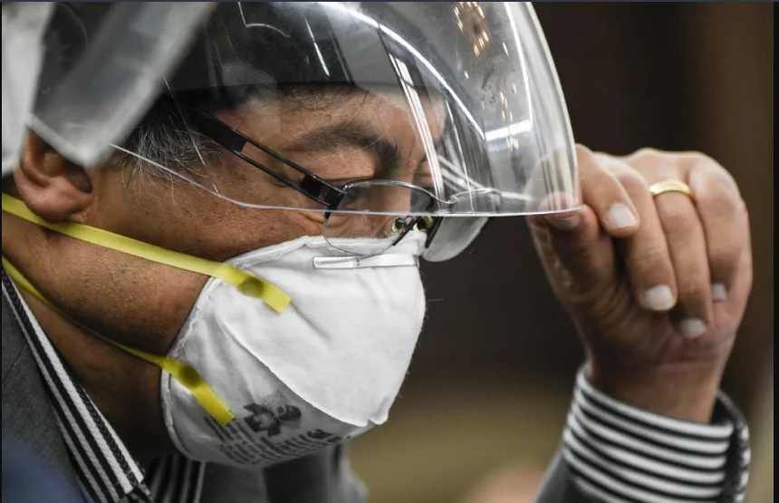
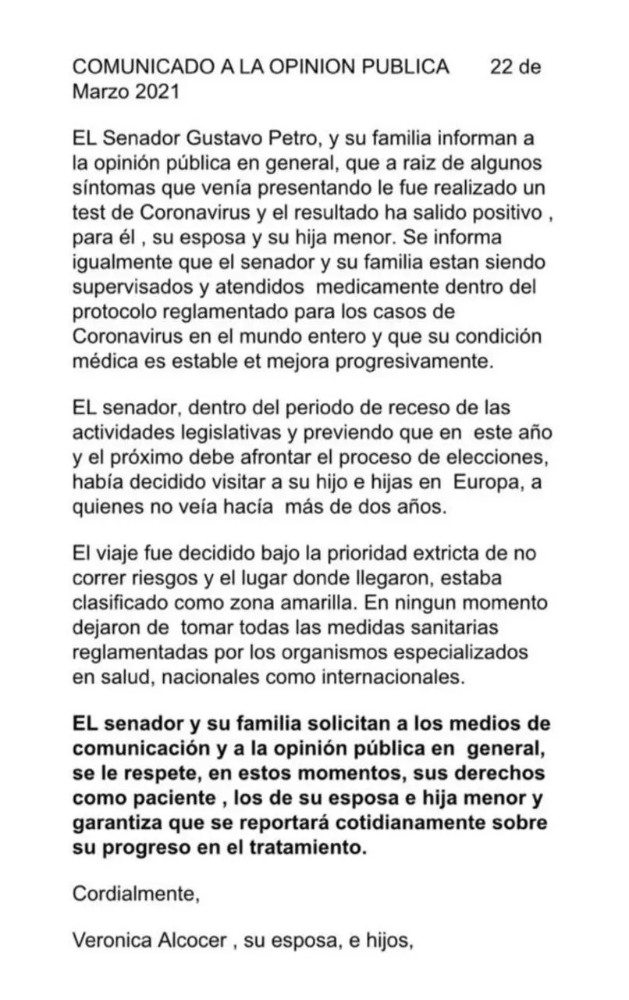

\[caption id="attachment\_14281" align="aligncenter" width="860"\] Gustavo Petro fue dado de alta por Covid-19. Cortesía AFP.\[/caption\]

El senador **Gustavo Petro superó neumonía ocasionada por el virus del Covid—19.** Fue dado de alta de un hospital de Italia **sin los síntomas del virus**. Se encontraba hospitalizado por padecer de una neumonía leve, según lo explicó hoy en su cuenta de tuiter.

A raíz de las informaciones aparecidos en medios de prensa nacionales, el líder de Colombia Humana, dijo en su cuenta de tuiter que salió del hospital sin los síntomas del **Covid—19.**

Es comprensible que la enfermedad del líder político haya causado revuelo en las redes sociales y en los medios de comunicación, debido a su liderazgo construido con base en la confrontación.

## Petro superó neumonía

/articulos/petrogustavo/status/1374434742884438017?s=20

## Respeto por sus derechos

La esposa del senador Gustavo Petro, **Verónica Alcoce**r, había emitido el día anterior un comunicado mediante el cual informó sobre el resultado positivo del **test de Coronavirus** que se le aplicó al senador y a su familia luego de presentar síntomas de virus.

Sin embargo, en dicho comunicado, Verónica Alcocer pidió a los medios de comunicación comprensión y respeto por los derechos del senador y de su familia.

[¿Cómo se vacuna contra el Covid-19 en Colombia?](/articulos/como-se-vacunas-contra-el-covid-19-en-colombia/)