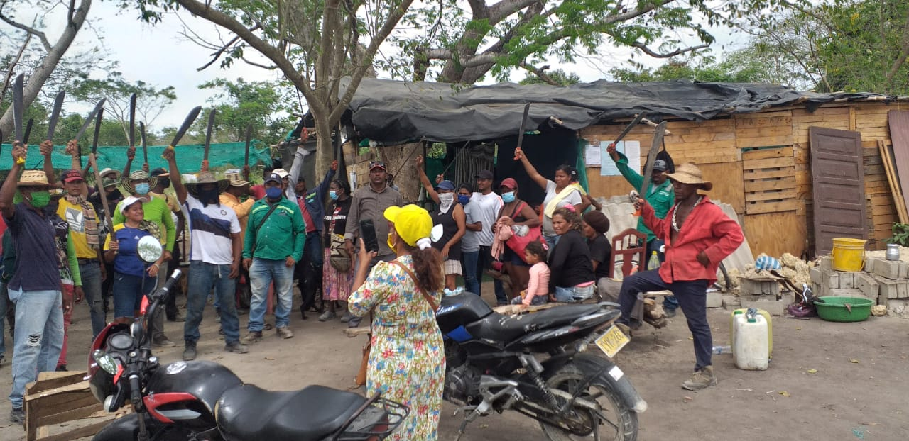

Suspenden desalojo de campesinos en Turbana. La medida fue adoptada por medio de auto de tutela No 057 de 2021 emitida por el Juez Promiscuo del Circuito de Turbaco que conoce en segunda instancia el caso de los campesinos de Cachenche.

A pesar de reuniones entre la gobernación de Bolívar, la Defensoría del Pueblo y representantes de campesinos que ocupan la finca Cachenche, la Sociedad de Activos Especiales-SAE persistió en desalojarlos de esos predios este miércoles 10 de marzo. Pero la medida quedó suspendida hasta cuando se adopte una decisión de fondo de la tutela.

*Suspenden desalojo de la finca de Cachenche. El presidente del sindicato de campesinos Enaldo con el gobernador de Bolívar, Vicente Blel, quien busca ser mediador de este conflicto.*

Esta es la decisión del Juez Promiscuo del Circuito de Turbaco dentro de la tutela que tiene de referencia 13836-31-89-001-2021-00057-00 :

> «Esta casa judicial (...) ordenará como medida provisional la suspensión de la diligencia programada para el día 10 de marzo del 2021, hasta que se dicte sentencia de segunda instancia. Donde se tomará una decisión definitiva. _TERCERO: DECRETAR la suspensión provisional de la diligencia programada para el día 10 de marzo del 2021, ofíciese en tal sentido a la SOCIEDAD DE ACTIVOS ESPECIALES – SAE»_. (JUZGADO (documento no disponible) PRIMERO PROMISCUO DEL CIRCUITO DE TURBACO. (documento no disponible)  Radicación No 13836-31-89-001-2021-00057-00 Suspenden-desalojo2021-00057Descarga (documento no disponible) )
> 
> Según el censo realizado por las mismas organizaciones que ocupan esa finca, son 220 familias campesinas que cultivan productos de pancoger, como maíz, yuca, plátano, hortaliza. Además tienen crianza de animales destinados a la economía local del municipio de Turbana.

## Suspenden desalojo de 220 familias campesinas

*La SAE ejerce cualquier tipo de hostigamiento contra los campesinos de Cachenche.*

Cachenche es una finca de aproximadamente 60 hectáreas que pasó a la SAE por estar en un proceso de extinción del dominio. Se ha planteado una serie de ilegalidades en la tradición de la finca que la misma SAE debe aclarar.

El inminente desalojo desconocería la **directriz No #007 del 11 de junio de 2017** sobre protección Campesinos emitida por de la Procuraduría General de la Nación. En este caso particular, los afectados del posible desalojo, señalan que tienen más de 15 años explotándola económica y pacíficamente.

> _Estás órdenes han sido tan ligeras y repentinas que no hemos podido estructurar una verdadera defensa judicial._
> 
> Asociación de campesinos de Cachenche

Este lunes se conoció que presentaron contra la orden de desalojo una revocatoria directa ante el director nacional de la SAE, Andrés Ávila Ávila. En este recurso los campesinos presentaron la argumentación para una suspensión provisional mientras se estudian las dudas jurídicas y se protegen los derechos fundamentales invocados.

## Denuncia penal

Por otra parte, Erick Ujueta Benavides director de Vejuca, veeduría de la rama judicial, presentó una denuncia penal contra el director regional de la SAE, Juan Pablo Valbuena, ya que presuntamente estarían violando la circular No #007 del 11 de junio de 2017, citada en este artículo.

¿Por qué la denuncia? Ujueta Benavides respondió:

> Por los presuntos delitos de prevaricato por acción, fraude procesal, desplazamiento forzado con agravación punitiva y perturbación a la posesión por el querer desalojar a 200 familias campesinas de Cachenche Turbana – Bolívar
> 
> Erick Ujueta, director de Vejuca

**Te puede interesar**

[Promigas firmó servidumbre por $2 mil millones con la SAE en Cachenche](/articulos/promigas-firmo-servidumbre-por-2-mil-millones-con-la-sae-en-cachenche/)

[Defensoría del Pueblo coadyuva tutela de campesinos de Cachenche](/articulos/defensoria-del-pueblo-coadyuva-tutela-de-campesinos-de-cachenche/)