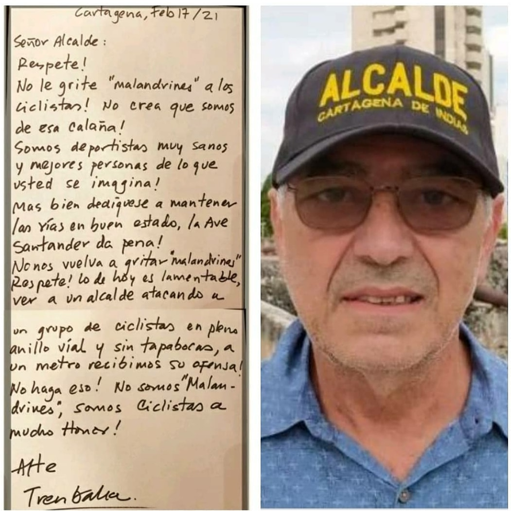
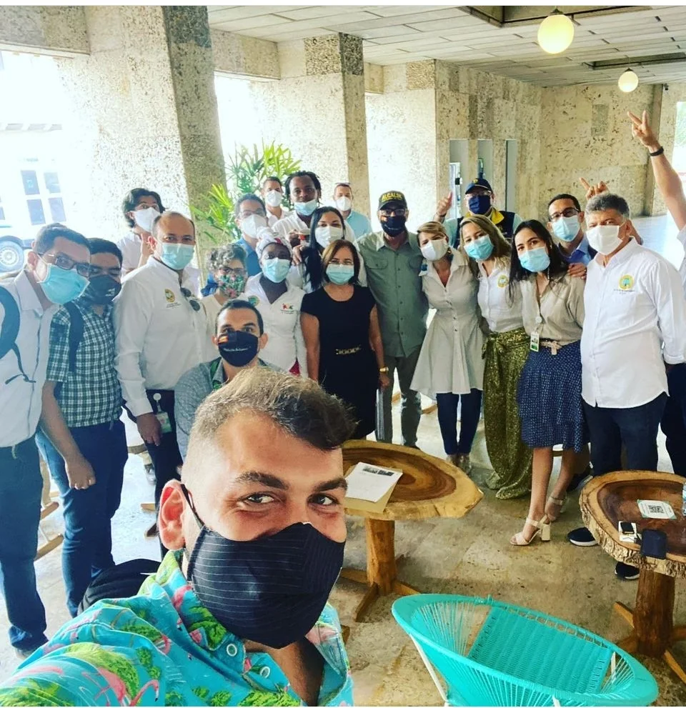

\[caption id="attachment\_13972" align="alignnone" width="1051"\] **Alcaldía zambiloca** para una ciudad que vive del circo. Un **cicletero** le reclama al zambiloco, después que en campaña había prometido ciclovías. ¡Falso!\[/caption\] Esta es una alcaldía zambiloca y de una gran capacidad para engañar. Se levantó el paro camionero que puso **_«patas pa'arriba»_** a Cartagena y a su alcalde **William Dau**. Se levantaron las talanqueras por dos meses, pero los peajes no se levantarán**. El alcalde le mintió al país**. Él sabía que los peajes seguirían. Conocía lo que su gerente de Edurbe, Uriel de Arco, le había dicho: **La Tasa Interna de Retorno (TIR) no se ha cumplido.** De hecho, el paro camionero demostró que estamos en una alcaldía de zambilocos. Nadie sabe para dónde va. Pero andan politiqueando para capturar los votos de la próxima coyuntura electoral. La alcaldía y su concejo es fiel reflejo de Cartagena. Eligió a un alcalde corrupto disfrazado de anticorrupción. Un gobernante ejemplo de mediocridad e incongruencia. Le pone una vela a Dios y otra al Diablo, al mismo tiempo. Mientras pelea con la concesión vial, busca por otro lado que le apoyen a su hijo **Abraham Dau al senado**, según el correo de las brujas. Habla contra los concejales y por debajo de la mesa transa contratos y burocracia con ellos. Difama a la Universidad de Cartagena, pero por la puerta de atrás contrató con ella más de $30 mil millones durante 2020. Se lanza contra el «Turco» Hilsaca, pero luego hace multimillonario trato con él. ¿Dudas que Dau te engañó? ¿Conoces el cuento del marido cachón? Ciertas cosas que suceden en el mundillo político de Cartagena y Colombia hay que analizarlas desde **una perspectiva de la praxis y no desde la teoría política**. Esto es cierto por varios hechos que el común de los mortales de Cartagena no se da cuenta. A guisa de ejemplo, le revelaremos lo que sucede con los peajes.

## Alcaldía zambiloca

Con el caso de los peajes y el paro camionero ¿quién puede dudar que tenemos **una alcaldía zambiloca**? Ninguno de los representantes de la administración distrital tiene coherencia ni congruencia con sus actos administrativos. Empecemos por el alcalde William Dau Chamat. El alcalde se montó en los patines del Antipeajes para manipular a la opinión pública y pescar en río revuelto, como es su costumbre. Con esta conducta loca pretendía conseguir dos cosas. Primero, le bajaba el tono a la REVOCATORIA del MANDATO. Segundo, presionaba a la Concesión Vial de Cartagena para conseguir indulgencias y dádivas. En el primer caso, el tiro le salió culatero. Su imagen salió chamuscada. Ahora hay más gentes que desean salir de una **alcaldía zambiloca**. No sabe para dónde se dirige. Es una veleta loca. O como dijo un abogado prestante, es una cometa sin cola. Por esto nuestro gobernante se parece  un influencer de TikTok dónde puede **«mariconear»**. No tiene nada en el coco como para que los jóvenes les sigan como si fuera «tu papá te quiere». ¿Papá zambiloco de vida loca? ¿Puede un alcalde que se respete, actuar irracionalmente con respecto a actos de gobierno que son de su propia competencia? Explico. Si Dau quiere acabar con los peajes basta que actúe legal y racionalmente con base en la ley 80 de 1993 y la amplia jurisprudencia del Consejo de Estado. Para eso es gobernante. Pero actúa como malandro de barrio con el cigarro prendido entre sus dedos. Zambiloco de vida loca.

## Indulgencias de la Concesión

\[caption id="attachment\_13973" align="aligncenter" width="960"\] **Politiqueando con la alcaldía zambiloca**. A Abraham, el hijo de Alibadau, lo están madurando como al níspero, a punta de periódico, es decir, de redes.\[/caption\] ¿Qué esperaba de la concesión? No hay dudas. Esperaba indulgencias. Dau sabe que existen evidencias que la Concesión Vial financia campañas electorales. Y él está empecinado en buscar la financiación de la **campaña al senado de su hijo Abraham Dau.** **La exsenadora Aida Merlano** puso en evidencia que esa concesión le dió dinero para su campaña electoral. **Recibió $3 mil millones**. Los Dau creen que con ese dinero pueden financiar la elección de Abraham. Y también la de su candidata a la Cámara, Lidy Ramirez, quien se la disputa (literal) a «puño y patá» con otros "dirigentes" de los seguidores de Dau. Son tres grupos que fueron a boicotear la Audiencia de la REVOCATORIA del MANDATO. Existe una rara mezcla de petristas, uribistas, e izquierdistas de estómago, encabezada por David Múnera. Los mismos que estuvieron en los peajes incitados por su jefe, el alcalde Dau. Ellos crearon una comunidad de malandros digitales para denigrar de opositores y periodistas honestos que no pueden comprar con dineros del Covid, sus OPS o millonarios contratos. Alguien de su círculo más cercano le dijo a Dau que se montara en los patines del Antipeajes y desplazara al Comité que históricamente venía desarrollando una lucha incansable. Comité integrado por abogados prestantes, cómo Nausicrate Pérez, Erick Ujueta, Héctor Pérez y Alcides Arrieta. Asimismo, por Fidian García y su **Capitán No a los Peajes**, William Murra y el hoy concejal Javier Julio Bejarano, entre otros.

## Formas de lucha de la alcaldía zambiloca

Sin duda, William Dau tiene la asesoría de su Secretario del Interior, David Múnera Cavadía, (conocido como el «Dr No») para enfrentar a la REVOCATORIA. Múnera, viejo militante del MOIR, tiene viejas mañas para ejercer presión política. Pero también hay otros líderes de la vieja izquierda que aplican la combinación de todas las formas de lucha. Incluso, el choque y la violencia verbal. Esto se vió en la Audiencia de Revocatoria y en los peajes. Ellos instrumentalizaron a jóvenes necesitados de dinero y de amor, sobre todo, de amor. Incluso, jóvenes en riesgo de diferentes partes de Cartagena. Muchos de estos atraídos por jefes que poseen millonarias OPS en el Distrito al estilo de **Cynthia Pérez Amador**. Son proveídos por Abraham Dau, como se pudo observar claramente el pasado 2 de febrero en el centro de Convenciones de Cartagena donde tiene su bar. Es una evidencia que permite colegir la conexión entre las acciones violentas de los tres grupos de choque del alcalde con su hijo Abraham Dau. **¿Qué hace un particular haciendo uso de recursos oficiales para propósitos privados?** Aquí se demuestra la tesis que se señaló en la audiencia de revocatoria. Existen dos élites corruptas que gobiernan a Cartagena desde 1986. Dau pertenece a la élite de **«Papi y Mami»**. Los que viven de sus apellidos de abolengo que se **"fumaron"** las empresas de sus padres o abuelos. Y ahora se "fuman" el dinero del pueblo. **Ellos son los que le van a hacer la campaña al senado a Abraham Dau**. Seguramente esperan la tula de la Concesión Vial. Si ha financiado a los malandrines tradicionales, ¿cómo no hacerlo con estos nuevos malandros que despedazan el presupuesto público con la complicidad de prestantes empresarios de la ciudad y líderes de izquierda?

## Dau engaña por el dinero

Dau quiere dinero y votos. Dinero de los concesionarios. Votos de pendejos que siguen creyendo en la acción salvadora de un buitre sobre el cuerpo agónico del viejo burro de carga. Pero en realidad, al alcalde solo le interesa el dinero. En vez de autoapodarse "el Tractor", debió tener el alias de **«Alibadau y sus 40 malandros».** Con el caso de los peajes, le cae como anillo al dedo. Sin embargo, la historia de Dau es diferente a la de Ali Babá. Éste fue generoso y humilde, pero luego se transformó en un ser despreciable. Cambió su moralidad. Las circunstancias lo convirtió en un ser vil, despiadado y sin escrúpulos. Dau no ha cambiado. Él es lo que es: un mago del engaño. El poder lo pone en evidencia, porque le vendió su alma al diablo. ¿Ejemplo? En su época de veedor —lo demostramos en la Audiencia de Revocatoria— cometió dos engaños que lo llevó a huir a los Estados Unidos en 2004. Engañó a los socios del **Club Bocacanoa** cuando les tomó poder para salvarlo del estafador. Pero luego se alió con él. Así hizo con cinco (5) comunidades negras de Cartagena. Les tomó poder para salvarlas ante un litigio con el **Banco Mundial** sobre el emisario submarino. Pero luego negoció y entregó el movimiento de reclamantes. Y «dejó el pelero». Se hizo accionista de Aguas de Cartagena y recibió un buen puesto en el sector financiero de Nueva York. Pidió asilo fingiendo que lo habían amenazado. ¡Mentira! El gobierno de Estados Unidos debe investigar el Caso Dau. Al regresar de Nueva York, 15 años más tarde, se dió a conocer como salvador de Cartagena con camándula ajena. No hubo un solo caso de corrupción que haya denunciado exitosamente. Todos terminaron como el emisario submarino y el Club Bocacanoa. Se montaba sobre esos patines para engañar a sus víctimas.

## Un ser zambiloco

Me quito el sombrero frente a Dau por su gran capacidad para engañar y manipular. Las personas que sufren Trastorno Histriónico de la Personalidad (THP) tienen esa habilidad. Y los psiquiatras que consulté antes de la Audiencia de la REVOCATORIA, me dicen que su conducta errática (echa para adelante y para atrás sobre un mismo caso) es propio de personas enfermas mentalmente. Es probable que tenga tres patologías mentales que le impiden gobernar. Bipolaridad nivel I. Trastorno de la Personalidad. Adicción grave a sustancias psicotrópicas. El primer acuerdo que hizo con los concesionarios del peaje el pasado 10 de febrero, fue espurio. Publicó el vídeo para darnos "una gran noticia" sobre el no cobro a carros tipo I y II. Allí reconocía en la práctica que los concesionarios podían seguir explotando la concesión. En cambio, le daba un dulcecito a la ciudad. Dau nunca creyó que la Tasa Interna de Retorno (TIR) se había cumplido. El gerente de Edurbe lo mantenía informado. La tesis del interventor es que la TIR no se ha cumplido. **El hecho de que no haya emitido un solo acto administrativo para dar por terminado el contrato es la prueba fehaciente de que le estaba mintiendo a la ciudadanía.** O sea, no solo mintió con alevosía. También incitó al desorden público con el único pretexto de conseguir apoyo popular para la Antirevocatoria. (Nadie lo denunciado penal y disciplinariamente). También, probablemente, esperaba dádivas para la financiación de la campaña al senado de su hijo Abraham Dau. El tiro le salió culatero. ¿Un ser despreciable puede ser gobernante? En absoluto. La ciudadanía se está dando cuenta que **William Dau Chamat es un falso positivo de la anticorrupción.** Te puede interesar: