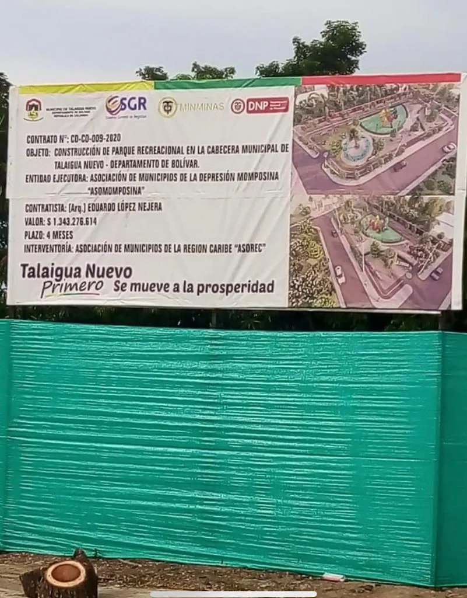

\[caption id="attachment\_14571" align="aligncenter" width="1080"\] **Angelica Carpio Quintana**, alcaldesa de Talaigua Nuevo.\[/caption\]

La alcaldesa de Talaigua Nuevo,  **Angelica Leonor Carpio Quintana**, probablemente contrató sin el lleno de requisitos la construcción de un parque recreacional. Igualmente, **causaron un arboricido de campanos centenarios sin hacer la respectiva compensación**.

Otra de las irregularidades que se cuestiona es la violación de la ley 80 del 94 en el sentido que las asociaciones de municipios deben someterse a la competencia para acceder a la contratación pública. Por esta razón, violaría los principios de transparencia y de igualdad que prima para la adjudicación de contratos con entidades privadas. 

De acuerdo con la denuncia presentada ante la Procuraduría por el líder social y veedor, **Ever Molina Maza**, la alcaldía de Talaigua Nuevo (Bolívar) suscribió el **contrato  No. CD-CO-009- 2020** con la Asociación de Municipios de la Depresión Momposina (**ASOMOMPOSINA**) representada por el  Arquitecto **Eduardo López Nejera**. De igual forma, contrató como interventora a la Asociación de Municipios de la Región Caribe (**ASOREC**).

## Talaigua Nuevo y el contrato

\[caption id="attachment\_14576" align="aligncenter" width="801"\] **La valla del constructor** del parque de diversión de Talaigua Nuevo.\[/caption\]

Talaigua Nuevo  es uno de los municipios de la denominada Depresión Momposina de aproximadamente 11.513 habitantes.  El  valor del contrato se pactó en **$1.343.276.614** y un adicional de **$280.000.000**. Al parecer, la alcaldesa Carpio Quintana realizó dicho contrato sin estudios previos, ya que en poco tiempo hicieron un adicional a pedido de los contratistas. 

En ese orden de ideas, la denuncia ante la Procuraduría señala:

> «_Eso nos indica que hay un aumento desmesurado en el contrato suscrito por la alcaldía de Talaigua Nuevo. Esto nos hace presumir que se configura un detrimento patrimonial para las arcas del municipio, dinero que podría_  
> _ser utilizado en inversión para más solución de vivienda, educación,_  
> _salud, alcantarillado o, en el mejor de los casos, en la misma pandemia_  
> _que atraviesa el país»_.

En ese sentido, el denunciante dice que se afecta el **principio de planificación** que debe primar en el momento de concebir una contratación pública, tal como lo señala la ley 80 de 1994.

## Vigencia futura

De igual manera la denuncia va a enfocada a perseguir otra irregularidad en la contratación del parque de diversión. Se refiere a la vigencia futura. El contrato fue firmado en la vigencia fiscal 2020. Establece que la obra debe construirse en cuatro meses. Esto nos hace inferir que probablemente debían utilizar recursos de la otra vigencia, como en efecto sucedió.

> _«Estamos frente a una flagrante violación del principio de anualidad que nos establece que (…) El año fiscal comienza el 1º de enero y termina el 31 de diciembre de cada año. Después del 31 de diciembre no podrán asumirse compromisos con cargo a las apropiaciones del año fiscal que se cierra en esa fecha y los saldos de apropiación no afectados por compromisos caducarán sin excepción»_. (L. 38/89, art. 10).

El otro sí fue firmado por la alcaldesa de Talaigua Nuevo en la vigencia de 2021. De esta manera se configura la violación del principio de anualidad que debe regir los gastos de la administración pública, tal como lo establece la normatividad vigente.

## El parque de Talaigua Nuevo

\[gallery columns="2" ids="14572,14573,14574,14575"\]

Hasta la fecha, el parque de Talaigua Nuevo no ha sido terminado. De otra parte, el contratista del proyecto cometió un arboricio con campanos centenarios, como si la recreación riñera con el medio ambiente.  En ese sentido se duda que alguna autoridad ambiental haya autorizado este daño ecológico. Si  lo hizo, no tuvieron en cuenta la Ley 99 de 1993 en el artículo 1 numeral 2, que obliga a preservar como principio general ambiental que **“la biodiversidad del país por ser patrimonio nacional y de interés de la humanidad, deberá ser protegida principalmente y aprovechada en forma sostenible”.**

Los arboles —que son pulmón del planeta— debieron ser protegidos. Se pudo observar la tala indiscriminada de especies centenarias en el área de construcción de este proyecto. La evidencia aparece en las fotos que publicamos en este portal de **Vox Populi.Digital**.

Es necesario destacar que el proyecto no presentó autorización ni permiso de la autoridad ambiental, que de seguro les iba a orientar **cómo hacer un plan de aprovechamiento.** Como no gozaron de una licencia ambiental, no pudieron tener un plan de compensación por este arboricidio y daño ambiental.

El denunciante espera que la Procuraduría asuma su rol de disciplinador contra todos aquellos que cometieron presuntamente las faltas señaladas:  violación de la vigencia futura, arboricio y detrimento patrimonial.

**Te puede interesar:**

[¿Se entregará Maríamulata después de la condena?](/articulos/se-entregara-mariamulata-despues-de-la-condena/)

[Juez declaró en desacato al alcalde por La Popa](/articulos/juez-declaro-en-desacato-al-alcalde-por-la-popa/)