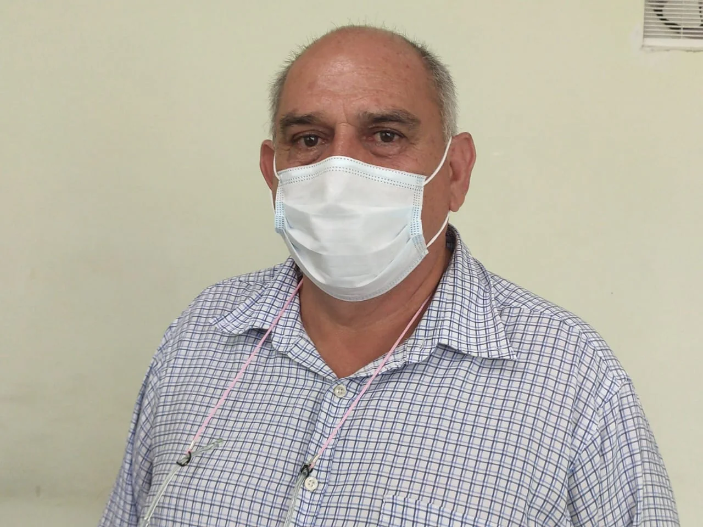

\[caption id="attachment\_14513" align="aligncenter" width="1280"\] La persistencia de **Rafael Zúñiga**, de Ecopopa está dando resultados. Merece el apoyo de la comunidad para la protección de la popa como un pulmón del país.\[/caption\]

Como un triunfo de la comunidad fue considerada la decisión del Juez Octavo Administrativo del Circuito de Cartagena, **Enrique del Vecchio Domínguez**, **al declarar en desacato al alcalde de Cartagena,** **William Dau Chamat**, porque fue negligente. También desatendió las órdenes para que hiciera un censo demográfico y diseñara una política pública de protección integral del **Cerro de La Popa**.

La vista pública se realizó el 7 de abril de 2021. En esta escuchó a las partes.

## Declaró en desacato al alcalde

**La apertura al desacato contra los funcionarios de la alcaldía que debían cumplir y no cumplieron**. El juez tomó las siguientes decisiones: 

> «_**1.-** Por auto separado se ordenará la apertura de desacato contras las personas específicas encargadas de dar cumplimiento a las órdenes de la sentencia de acción popular._
> 
> _**2.-** Se conmina a la parte accionante a colocar las denuncias pertinentes si a bien lo considera ante las autoridades respectivas. También puede presentar las pruebas ante este Despacho, quien de manera inmediata ordenara la remisión de la denuncia antes las autoridades pertinentes»_.

**Al estrado judicial no asistió el alcalde**. La oficina Jurídica del Distrito designó delegó su representación en el abogado Leonardo Mendoza Cohen, quien es parte de Caribe Legal. 

## La audiencia que declaró en desacato al alcalde

Los representantes del Distrito dijeron ante el juez:

> «Se ordenó colocar en marcha una política pública de conservación del Cerro la Popa. Cumplieron las medidas y su seguimiento. También se **hizo un censo por parte de una entidad especializada y por ello considera que se ha cumplido la orden**. Se han construido obras necesarias para combatir los problemas de tipo ambiental. igualmente se ha venido trabajando con Corvivienda».

Por su parte, la abogada del EPA, según el resumen del juez, dijo:

> «_El EPA ha presentado los respectivos informes y proyectos tendientes a dar cabal cumplimiento a la sentencia de acción popular y están prestos a cualquier requerimiento_».

Los terceros en la audiencia, como ECOPOPA y los representantes del Ministerio Público, consideraron que no es cierto que hayan cumplido.

ECOPOPA. Rafael Zúñiga, miembro del Comité de Seguimiento, según el acta, dijo:

> _«No han sido tenidos en cuenta en las reuniones realizadas por el Distrito. Señala que se presentó querella por las invasiones que se estaban presentando en el sector KENEDY. Presentaron acción de tutela. El inspector convoco reunión y el Distrito no asistió. No han tomado acciones para detener las invasiones. Tienen evidencia de que las invasiones siguen._ **_Por todo lo anterior considera que no se ha dado cumplimiento de la sentencia de acción popular_»**.

## El Ministerio Público

En la audiencia pública se hicieron presente la procuradora Agraria y Ambiental, **Margelis Chamorro**, y el procurador Judicial I Administrativo, **Néstor Casado Caliz**. 

**Margelis Chamorro:** _«En cuanto al censo considera que no se ha realizado. Advierte que hay más de mil invasiones en un área de protección de altísimo riesgo para las personas que habitan allí y sus alrededores»_. 

**Néstor Casado Caliz:** «_Señala que no se ha realizado acciones tendientes a evitar los asentamientos ilegales en el cerro la popa. Concluye que no se han cumplido las medidas de carácter general y especificas tendientes a evitar las invasiones_».

En los próximos días el juez señalará la responsabilidad de cada uno delos funcionarios del Distrito que deben responder por esta nueva negligencia. Negligencia que es un fraude a resolución judicial.

#### Te puede interesar:

[En desacato alcaldía para cumplir recuperación de La Popa](/articulos/en-desacato-alcaldia-para-cumplir-recuperacion-de-la-popa/)

[La inseguridad en Cartagena: ¿Secuestro, robo o violación?](/articulos/la-inseguridad-en-cartagena-secuestro-robo-o-violacion/)