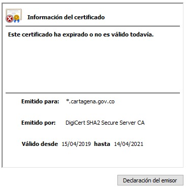
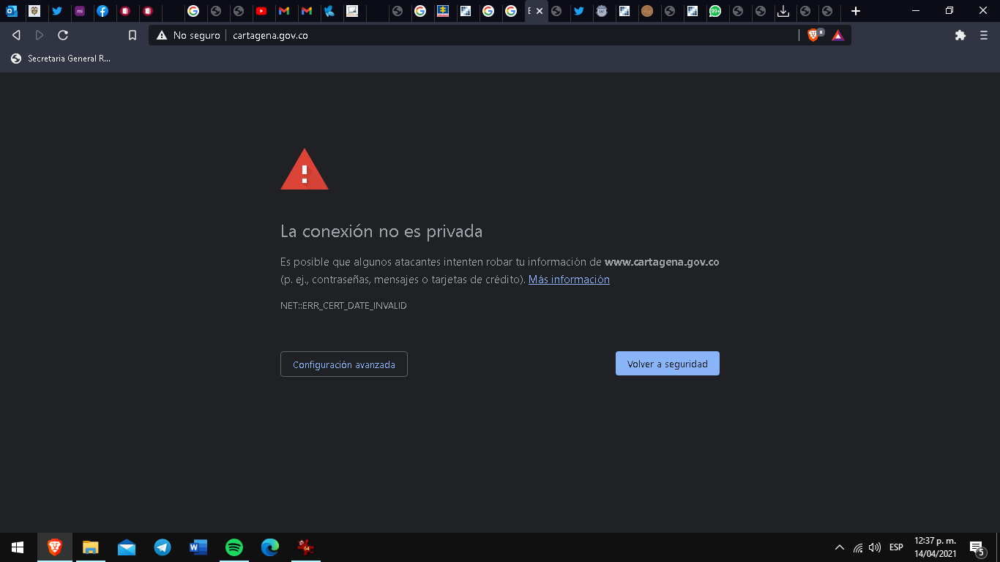

\[caption id="attachment\_14552" align="aligncenter" width="712"\] **William Dau mamando gallo**, mientras la ciudad se desmorona. Se cayó página de la alcaldía.\[/caption\]

**Por ineptitud y negligencia se cayó página de la alcaldía Distrital. Amaneció sin el dominio www.cartagena.gov.co.** Se quedó fuera de servicio. Esta situación incide sobre pagos de impuestos y otras transacciones esenciales para la actividad cotidiana de la alcaldía en esta época de pandemia.

En otras palabras, **la alcaldía desapareció del mundo virtual.** O sea, no existe, por lo menos durante el día de hoy. Pareciera que todo esto está sucediendo no en el Distrito sino en una alcaldía de categoría 6. En ésta época, el portal casi es lo único que la ciudadanía tiene de contacto con la administración distrital. Este hecho es paradójico  en una administración que supuestamente vino con lo último en tecnología gringa. Parece que lo único que han usado con diligencia son las redes sociales para perseguir a los ciudadanos que piden un mejor servicio público. Lo extraño, Dau tuvo la libertad de seleccionar a los mejores.

## Se hunde la alcaldía

\[caption id="attachment\_14568" align="aligncenter" width="1042"\] Se cayó la página de la alcaldía e Ingrid Solano, jefe de la Oficina de Informática no sabe qué hacer.\[/caption\]

Se cayó la página como se cae a pedazos toda la administración de «Salvemos a Cartagena». La Procuraduría, Fiscalía y Contraloria, calladas. Es el reflejo de lo que sucede en las diferentes dependencias de la administración. Nadie sabe para dónde va el barco. Mientras tanto, el piloto fuma compulsivamente ciego por mucho humo en el horizonte.

Se informó que a la jefe de la Oficina de Informática **Ingrid Solano, la CertiCámara** le había informado con un mes de anticipación para la renovación. ¡Negligencia!

Ello también indica que la administración de **William Dau Chamat** usa las redes sociales de la alcaldía solo parea difundir sus **actos pocos decorosos y obscenos.** No le pusieron atención a la plataforma digital. La última renovación la hizo la alcaldía de Pedrito Pereira hace dos años, de acuerdo a la siguiente certificación:  

## Por negligencia se cayó página de la alcaldía

Esta negligencia para la renovación de las certificaciones fue denunciada en redes sociales, especialmente por una de las críticas de la administración, **Jacqueline Perea**. Las certificaciones son necesarias para que los dominios de la página de alcaldía se puedan mantener. Esta negligencia produjo daños materiales y morales a la administración distrital y a la ciudadanía. Las transacciones normales quedaron suspendidas. **¡Parálisis total!**

\[caption id="attachment\_14564" align="aligncenter" width="1366"\] Pantallazo inicial de la www.cartagena.gov.co. Así se cayó página de la alcaldía.\[/caption\]

Así como se presentó este caso con los dominios de la alcaldía, está sucediendo en todas las dependencias. No hay gobierno. **¿Cuánto pierde el Distrito y la ciudadanía por esta ineptitud?**

Además, es necesario resaltar que los actos administrativos que deben mantenerse publicados en la página oficial sufrieron afectación. Esto a su vez le produce un daño mayor a la ciudadanía que debe estar conectada con las últimas medidas adoptadas por la administración con motivo de la pandemia.

¿Qué dice la Personería y la Procuraduría? Silencio total ¿Puede la Contraloría investigar qué sucede con los contratos sobre implementación de tecnología en la administración distrital? ¿Qué consecuencias disciplinarias traerá este nuevo desastre informático?  

La alcaldía de Cartagena está «manga por hombro». Nadie sabe de nada. Salvemos a Cartagena de «Salvemos a Cartagena».