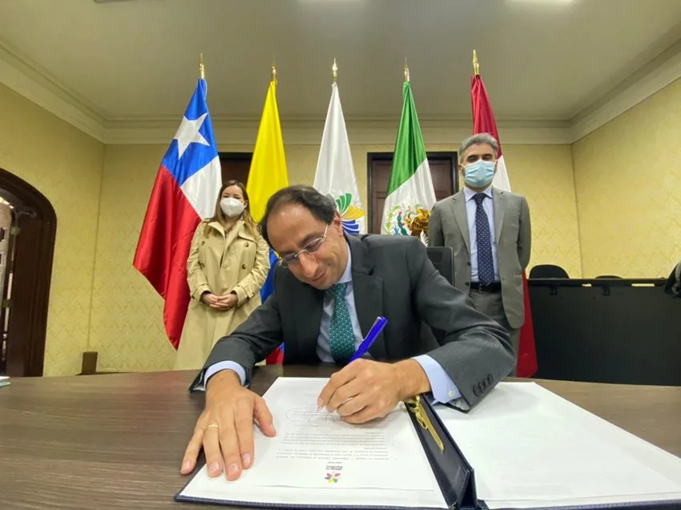

*El nuevo ministro de Hacienda, Jose Manuel Restrepo en reemplazo de Alberto Carrasquilla, el fusible de Duque./Presidencia.*

El fusible de Duque se quemó. En efecto, el ministro de Hacienda, **Alberto Carrasquilla, pasó a ser un fusible** para evitar que el régimen se electrocute con las manifestaciones populares contra la Reforma Tributaria. El equipo económico del presidente **Iván Duque** se quemó junto con el gobierno. **Pero solo cambiarán los fusibles desechables para que la situación siga igual**.

El presidente, al final de la tarde, después de la reunión con los partidos tradicionales nombró en su reemplazo a **José Manuel Restrepo** como nuevo **Ministro de Hacienda.** Actualmente se desempaña como Ministro de Comercio. Tiene Maestría en Economía en El London School of Economics y Doctorado en Administración de U. de Bath, exrector U. Rosario.

Apenas Duque y Carrasquilla prepararon la Reforma Tributaria, advertimos que **no era solidaria ni sostenible**. Pusimos en contraste el pensamiento de Duque senador con el Duque presidente. Fue un cambio camaleónico propio de la demagogia de los oportunistas de derecha. Esa reforma responde a las exigencias internacionales de calificación que emiten las agencias al servicio del sistema financiero corporativo, como **Moody's Investors Service.**

## **El falso consenso**

El consenso de Duque para una nueva reforma tributaria será problemático. Se avizora que **Cambio Radical** **no tendrá una posición arrodillada frente al presidente Duque**. Tienen la presidencia del Congreso y buscan el respaldo político de su candidato **Alex Char**. En la reunión del lunes 3 de mayo no asistió Cambio Radical ni los partidos de izquierda.

## **El fusible de Duque**

\[caption id="attachment\_14802" align="aligncenter" width="2047"\] **El Minhacienda Alberto Carrasquilla**, el fusible de Duque, en la reunión del Consejo Directivo del Banco de la República./Minhacienda.\[/caption\]

El régimen quiere sofocar el movimiento social de protesta contra la Reforma Tributaria solo cambiando sus fusibles. Cree que lo único que tiene que hacer es bajar la palanca, sustituir sus fusibles y volver a subir la palanca para que el circo y el embuste continué. Cambiar los fusibles para que todo siga igual. Es la inveterada costumbre uribista a lo largo de estos 20 años de régimen político.

Como no le funcionó la represión violenta ejecutada por sus fuerzas policivas, que dejó seis jóvenes muertos, ahora quema a los fusibles como respuesta a la amenaza popular. Son ellos el ministro de Hacienda Alberto Carrasquilla, su viceministro **Juan Alberto Londoño** y el director de Planeación Nacional **Luis Alberto Rodríguez**.

En ese sentido, ya tenían los candidatos para sustituir esos **fusibles quemados**. Se decidieron por **José Manuel Restrepo.**  Pero estaban como candidatos Luis **Fernando Mejía**, actual director de Fedesarrollo. Fue director del Departamento Nacional de Planeación (DNP) en el segundo gobierno de Juan Manuel Santos, entre 2014 y 2018. Según fuentes políticas, es cercano al liberalismo de **César Gaviria**, el presidente que puso en marcha la ola privatizadora de Colombia.

También se contaba con **Juan Pablo Zárate**, actual viceministro Técnico del Ministerio de Hacienda y economista de la Universidad de los Andes. Y **Jonathan Malagón**, jefe del Ministerio de Vivienda. Es mano derecha en los temas económicos del presidente Duque.

## **Equipo económico, el fusible de Duque**

De hecho, el equipo económico de Iván Duque es neoclásico heredado del expresidente Uribe. **José Manuel Restrepo confirma este análisis.** Está integrado por defensores a ultranza de las teorías económicas que buscan el desarrollo del país financiando a los grandes grupos económicos. Su filosofía es incrementar los indicadores económicos a costa del proceso de pauperización de la mayoría de la sociedad, incluso, de la clase media. Lo curioso es que utilizan eufemismos azucarados para esconder el sabor amargo del producto. Por ejemplo, Reforma Tributaria de Solidaridad Sostenible.

Esa reforma ni es solidaria ni es sostenible. Solo responde a las exigencias internacionales de las calificadoras financieras y, por ende, a las grandes corporaciones que exigen seguridad inversionista. Esa filosofía se expresa con reformas tributarias neoclásicas del corte como la que fue rechazada por la ciudadanía nacional.

## **Una reforma empobrecedora**

Son reformas que buscan exprimir más a la ciudadanía con el pago de impuestos. Al mismo tiempo, aplican políticas de exenciones a los grandes empresarios con el socorrido concepto de que por esa vía se llega al desarrollo y a la lucha contra la desigualdad.

Pero 20 años de ejercicio de esta política, nos ha demostrado que produce más desempleo (hoy tenemos el 14,5%), más desigualdad (aumentó entre el 2 al 6%) y más pauperización de la clase media.

No obstante, el presidente Duque se gastó más de 200 billones de pesos durante la pandemia sin ayudar a detener estas cifras de profundización de la pobreza Es reflejo de lo que sucede en el mundo. Según el Banco Mundial (documento no disponible), 300 millones de personas alrededor del mundo habrían caído en la pobreza y 115 millones en la pobreza extrema.

## **Una izquierda para el _establishment_**

Los otros sectores políticos tradicionales, incluso, los parlamentarios opositores de la izquierda alternativa solo están pensando en las elecciones al congreso y a la presidencia. Buscan solo acomodarse al sin provocar su ruptura. Y en forma oportunista están tirando sus atarrayas para pescar en río revuelto.

Los sectores burocráticos de izquierda solo defienden su **estatus parlamentarista** cayendo en un cretinismo parlamentario. Se aprovechan del malestar generalizado contra el régimen para reelegirse en este congreso corrupto. Con esta conducta criticable, favorecen la perpetuación no solo del régimen sino también la de un estado opresor. Una élite burocrática que vive del trabajo de la sociedad, especialmente de los sectores populares.  

De verdad, su resistencia parlamentaria **se reduce a un falso control político**. Es un control insulso que no produce conciencia social. Por el contrario, desmoviliza la acción popular expresada en la **Gran Marcha 28A**. Una lucha popular contra la reforma tributaria.

## **Conclusión**

El presidente Duque solo pretende sofocar la protesta social. El precio que pagaría sería cambiar sus fusibles, y echarle la culpa de lo sucedido a ellos. Es la inveterada costumbre aprendida de su patrón Álvaro Uribe. Así se fabrica el efecto teflón.

¿Qué sucederá con una nueva reforma? Tendríamos la misma muñeca con nuevo pollerín. Nos presentarán una reforma consensuada, entre comillas, y después colorín colorado, este cuento se ha acabado. Y seguiremos votando por los mismos: El que diga Uribe, Fajardo, y Gustavo Petro. Una falsa polarización que siempre nos conducirá a lo mismo, gane quien gane.

¿Acaso alguno de ellos nos sacará de la olla? Lo dudamos. Ese país político no nos representa. Ni las élites dominantes ni de los que hacen resistencia parlamentarista. La Gran Marcha 28A se convirtió en una verdadera escuela política para la transformación del país. El futuro de Colombia no estará en manos de Uribe, Fajardo o Petro. Son millones que pensamos un camino distinto, como dicen los filósofos nativos, por el camino del bien común, el camino del medio.

**Te puede interesar:**

**[Duque retira la Reforma Tributaria para maquillarla sin IVA](/articulos/duque-retira-la-reforma-tributaria-para-maquillarla-sin-iva/)**