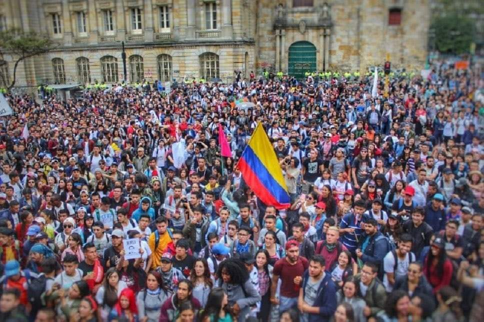
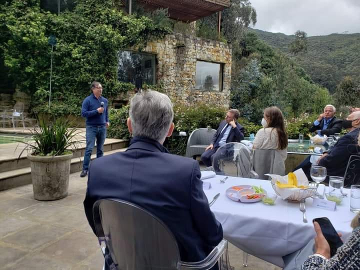
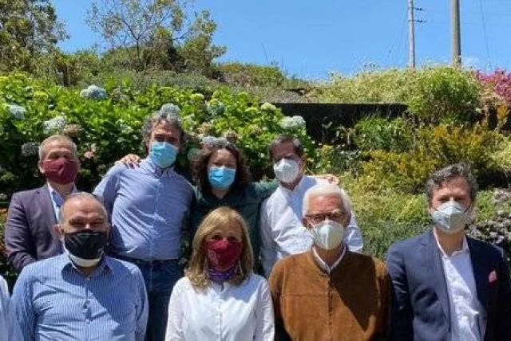

\[caption id="attachment\_15183" align="aligncenter" width="720"\] Después de la horrible noche del 28 de mayo. Las marchas populares del 30 de mayo se hicieron sentir.\[/caption\]

Frente a la crisis del **régimen neobonapartista,** el presidente Iván Duque intensifica más el militarismo. Su propuesta de diálogo lo instrumentalizó para bajar la intensidad de la protesta. No le resultó. ¿Sofocará su crisis de gobernabilidad al sacar el ejército a las calles para acabar con las barricadas del movimiento popular? ¿Detendrá la llegada de la primavera?

El pueblo se levantó por tanta inequidad y no fue una revuelta por «el florero de Llorente». Ni tampoco es el resultado de una supuesta teoría conspirativa antiuribista o una conspiración desde el exterior. Llanamente, el pueblo se mamó de tanta injusticia reinante. **La reacción del régimen y de las élites dominantes no se hizo esperar**. Ahora formalizó el uso de la violencia institucional y paraestatal para sofocar su propia crisis. Entre tanto, las diferentes variantes de la izquierda parlamentarista están confundidas e indecisas entretenidas con su caramelo electoral. Ni la **Coalición de la Esperanza ni el Pacto Histórico** se han ubicado. Solo esperan conservar su votos para reelegir.

## Preparan los cañones contra las barricadas

Entre tanto, el **régimen se prepara para aplastar los focos de resistencia que aún subsisten en 10 departamentos, especialmente Valle del Cauca.** La principal justificación son los bloqueos y el vandalismo. Pero en realidad todo el arsenal militar apunta a las barricadas de jóvenes que aprendieron a resistir y repeler las embestidas violentas del régimen. Cualquier analista sabe que la represión lo que hace es exacerbar más los ánimos **de los** protagonistas**. La violencia trae más violencia**. Aquí cabe un **diálogo edificante** que responda a las peticiones de los actores sin que ello sea considerado una conducta de debilidad. Por el contrario, conversar con un propósito de acuerdo, fortalece la democracia. **Pero el régimen dio patente de Corso al ejército y a la policía para que despejen los bloqueos a sangre y fuego, si es necesario.** Aquí reside su debilidad manifiesta.

> «_**Adoptar las medidas necesarias**, en coordinación con la fuerza pública, para levantar los bloqueos internos que actualmente se presentan en las vías de sus jurisdicciones, así como también evitar la instalación de nuevos bloqueos_».
> 
> Numeral 2 de la cláusula 1 del Decreto No 575 del 29 de mayo de 2021 (documento no disponible).

En la noche del 29 de mayo —un mes después del 28A—, el régimen formalizó el militarismo que de facto estaba implementando desde el mismo momento en que se dio cuenta que el movimiento se transformaba en un **volcán activo**. Emitió el decreto No 575 del 29 de mayo de 2021 (documento no disponible) que refleja su debilidad e incapacidad para manejar la protesta por los canales ordinarios del sistema democrático.

## Un movimiento impredecible y 66 muertos

*El 28 de mayo fueron movilizaciones masivas para sellar un mes de Paro Nacional. El régimen atacó esa noche las barricadas de Cali ocasionando 13 muertos y numerosos heridos.*

Duque abrió la posibilidad legal de sacar al ejército para destrozar la protesta social legal, so pretexto de acabar con el vandalismo. Se dio cuenta que todavía existen varios bastiones de resistencia de la protesta generalizada. Son bastiones con características insurreccionales sostenidas por jóvenes que no tienen nada que perder ni mucho menos obedecen a una conducción política determinada. Entregan todo, hasta sus vidas. [**Son 66 muertos**](/articulos/victimas-de-violencia-homicida-en-el-marco-del-paro-nacional/), según las organizaciones defensoras de **Derechos Humanos.**  La mayoría caídos por las balas estatales o paraestatales. La **Defensoría del Pueblo reportan 43 muertos. Además, hay más de 2.000 heridos y 170 casos** de abuso policial desde el inicio del paro nacional en Colombia. Incluyendo agresiones sexuales contra las adolescentes.

**El movimiento 28A fue impredecible**. Ni siquiera las centrales trabajadoras sospecharon que iba a devenir en un fenómeno político. Ni las organizaciones políticas parlamentaristas de izquierda sospecharon el volcán que ardía en el subsuelo social. ¡PUM! Explotó con una mecha corta detrás de una protesta antireforma tributaria. Este hecho reivindicativo devino en una situación prerrevolucionaria con brotes de insurrección popular. Pero nadie estaba preparado.

Ni los de arriba ni los de abajo intuían ese mar de lava que corría por dentro. Nadie sospechó que solo una mecha pudiera despertar ese volcán social dormido por durante 44 años, desde el Paro Cívico Nacional 1977. Casi 5 décadas después ese pueblo se levantó soñoliento y quizás ciego. Su fuerza volcánica no tiene norte, sur, este u oeste. No hay dirección política del bloque popular para conducir esa manifestación social. Convertirla en una explosión política y tumbar el **régimen neobonapartista**. Esa carga volcánica puso a prueba al régimen uribista, cuyo fin está contado después de 20 años de militarismo, intensificación de la política neoliberal y militarización de la sociedad colombiana.

**Quien esto escribe, entiende que el problema de fondo no son las acciones gubernamentales sino la incapacidad de del sistema político dominante de resolver los problemas fundamentales del ser humano colombiano.** Pero también la incapacidad de una izquierda parlamentaria, que en sus 30 años de existencia (desde 1991), solo ha servido para calentar las sillas del congreso y legitimar las políticas de un régimen ilegítimo. En ese tiempo de parlamentarismo no han conseguido nada significativo para el pueblo, **fuera de lucir sus egos en grandilocuentes discursos.** El pueblo colombiano, en solo dos días, tumbó las reformas, quitó ministro y frenó la política neoliberal que asfixia al ciudadano de pie. Puso de rodillas al régimen uribista que ahora recurre a la fuerza brutal como señal de su propia debilidad.

## Francachela con vino kosher en medio de la protesta

*Gustavo Petro convenciendo a empresarios de la Comunidad Judía colombiana de que él no es un peligro para sus intereses ni para el sistema.*

Mientras en las calles el régimen mataba a los jóvenes, el líder político más sobresaliente de la izquierda —**Gustavo Petro, creador de Colombia Humana**— se sentaba a manteles con empresarios de la comunidad judía colombiana a saborear un vino kosher. Era una suculenta comida, además de vino kosher, habían platos especiales como sambusak y boreka  promovida por **Jean Claude Bessudo.** Un almuerzo servido por meseros de finos modales que calmaban la hambruna del conspicuo líder de la izquierda colombiana. **Petro pedía apoyo implícito para financiar su campaña electoral presidencial.** 

En tanto su segundo al mando, **Gustavo Bolívar**, se moría de miedo de perder los votos para reelegirse en el senado y, de paso, elegir a su tocayo como presidente de la república. Lo sorprendieron cenando en un restaurante en Miami **con la tranquilidad de estar en el país del Tío Sam.** Allí estaba libre de la violencia callejera, de la lucha popular y de la muerte. 

El senador Bolívar justificó su estadía con la visita a su hijo, lo cual es comprensible pero no pertinente para un líder que debería tener otra actitud. En un momento donde el país necesitaba las mentes brillantes para darle luz, estar cenando en Miami o en la embajada Israelí con los del poder, es un mensaje de frustración para muchos petristas que daban la vida por su líder como los uribistas lo hacen con Uribe.

Entiendo que Petro quería aclarar que él es inofensivo para los intereses de los grandes empresarios colombianos y, por tanto, del sistema dominante. Fue una francachela de alto turmequé para disipar el miedo de los grandes empresarios de sus ideas políticas que datan del siglo XIX. **Y así desvirtuar la gran calumnia uribista de ser el «Hugo Chávez» de Colombia.**

## ¿Y la Coalición de la Esperanza? 

*La primera foto distribuida por la Coalición de la Esperanza.*

Si los parlamentarismo del Pacto Histórico andan disgregados y confundidos ¿qué pasa con los de la Coalición de la Esperanza? No tienen nada que hacer. Se desdibujaron cuando fueron a escuchar la demagogia del presidente Duque. Lo primero que debieron hacer es escuchar al Comité del Paro Nacional y a los que estaban del otro lado de las barricadas. Era trazar un puente para el diálogo.

El partido Alianza Verde, uno de los integrantes de esa coalición partidista, por lo pronto se salió con el fin de resolver algunas contradicciones internas. La idea es regresar una vez resuelvan sus contradicciones. El exgobernador de Nariño, **Camilo Romero**, es un reconocido petrista.  La senadora **Angélica Lozano** considera que la decisión de la **Alianza Verde de participar en la coalición fue unánime**. Pero existen expresiones minoritarias «que no se pueden aplastar».

Los aspirantes presidenciales de la **Alianza Verde son: Carlos Amaya, Camilo Romero, Sandra Ortiz, Iván Marulanda, Antonio Sanguino y Jorge Londoño.** Ellos continuarán haciendo campaña dentro del partido.

Como se puede entender, las dos coaliciones están pensando en el futuro electoral de cada quien. No piensan en el presente del país. Carecen de visión sobre el movimiento del Paro Nacional, porque sus mentes están sometidas al régimen que los usa para legitimar su poder. Sin ellos, el régimen sería visto por la comunidad internacional y por el pueblo como una dictadura política, como lo que es.

## ¡Una masacre!

Las garras del militarismo empezaron a destrozar la resistencia en Cali. El viernes 28 de mayo causaron 13 muertos para acabar la resistencia de las 25 barricadas ubicadas en diferentes puntos de esa ciudad. ¡Una masacre! La Comisión Interamericana de Derechos Humanos (CIDH) lamentó los hechos e instó al Estado colombiano a investigar de inmediato. Lo habíamos advertido en análisis anteriores que la escalada militar se veía venir.

La CIDH se pronunció sobre los ataques paraestatales usando tácticas urbanas de guerra contra los manifestantes.

> "La CIDH expresa su **extrema preocupación** ante denuncias de que los ataques a manifestantes con disparos de armas de fuego provienen de personas vestidas de civil ante la vista de agentes de la fuerza pública"
> 
> CIDH

El régimen no está preocupado por la preservación de los derechos humanos. **El patrón del Centro Democrático, Álvaro Uribe**, lo había anunciado en sus tuiters **pidiendo mano** **dura con el fin de buscar gobernabilidad.** Como si ésta se consigue con balas.

Ahora el régimen busca apoyo social. El 30 de mayo se realizó la marcha promovida por la policía nacional y otros sectores de la extrema derecha colombiana. Contrario a lo que se cree, es una situación peligrosa. ¿Por que? El régimen está impulsando una guerra civil promoviendo acciones sociales y políticas contra el Paro Nacional.

Felipe Tascón hizo un análisis interesante sobre las nuevas tácticas de choque paramilitar usadas por el régimen contra las barricadas de Cali.

> «Estas cinco tácticas: hostigar, cazar, infiltrar, dilatar y dispersar, desde el inicio del paro han estimulado el crecimiento de la indignación y con esto las barricadas se mantienen como acción de defensa, y a su interior es mayoritaria la creencia de paro = bloqueo. Lo que estoy diciendo aquí es que el régimen estimuló el caos y su continuidad. Siguiendo el principio de Goebbels de la transposición y la teoría del enemigo interno, busca echarle la culpa de todo a su oponente juvenil».
> 
> [Felipe Tascon](./mas-alla-de-la-horrible-noche/),

Finalmente queremos señalar, que el diálogo es la mejor vía para resolver este conflicto. Pero un diálogo incluyente y edificante. No un diálogo dilatador. Es necesario construir un **Nuevo Pacto Social**. En forma inmediata debe cesar el ataque contra las barricadas y que el gobierno suspenda el decreto No 575 del 29 de mayo. La primavera llegará.