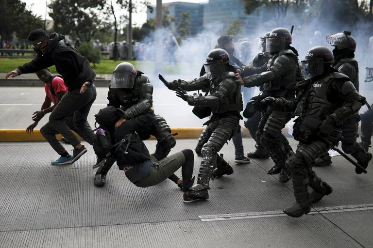

\[caption id="attachment\_14874" align="aligncenter" width="960"\] Un velatón por los 37 muertos. Facebook.\[/caption\]  

Ya van 37 muertos en el Paro Nacional. Cuando se presenta una situación como la que se originó en rechazo de la Reforma Tributaria, se puede analizar sus causas, pero jamás predecir la dimensión de sus consecuencias.

No se sospechaba el gran volcán en ebullición que había por dentro. La rabia contenida. El resentimiento que produce la desigualdad. El sentido de venganza que pervive en el seno de la sociedad colombiana que es una de las más violentas de América Latina. Una sociedad dominada por élites desalmadas que recurren a la violencia sin ningún miramiento.

*El ESMAD no tiene compasión. Son los 37 muertos. Parece que la orden del gobierno es tirar a matar.*

El origen de las protestas fue el rechazo a la Reforma Tributaria del presidente Duque. Posteriormente las movilizaciones exigieron la salida de Duque. Ahora, realmente, lo que se debería plantear es la terminación del **régimen #neobonapartista** que tiene 20 años de existencia. Precisamente en este período se ha acumulado un malestar social producto de la pauperización de la clase media y de los sectores menos favorecidos. Todo esto se agravó con la pandemia. Las estadísticas hablan de 21 millones de colombianos en pobreza y un 14,5% de desempleo.

## VEA NUESTRA PROPUESTA DE GOBIERNO DE TRANSICIÓN

https://youtu.be/eAp1XyUjD8Q

## Estos son los 37 muertos

Esta es una recopilación hecha por la **fundación Indepaz** que retoma www.voxpopuli.digital. El registro se realizó con información directa e inmediata de las organizaciones sociales y defensores de Derechos Humanos a lo largo y ancho de Colombia, tales como **Plataforma Grita**, **Temblores ONG** y **Red de DDHH Francisco Isaías Cifuentes**, **Campaña Defender la Libertad**, entre otras.

/wp-content/uploads/2021/05/viictimas-Paro-Nacional.pdf

### Te puede interesar:

## [«Papá Dau» le echó el ESMAD a «sus hijos» por protestar](/articulos/papa-dau-le-echo-el-esmad-a-sus-hijos-por-protestarpapa-dau-le-echo-el-esmad-a-sus-hijos-por-protestar/)