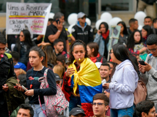

El Comando Nacional de Paro **aceptó reunirse con el presidente Iván Duque Márquez** este lunes al mediodía en la Casa de Mariño. Pero el Paro el 10 de Mayo se mantiene. Los directivos del movimiento de protesta, que tiene en vilo al país, solicitaron el acompañamiento de voceros de la ONU y del Episcopado colombiano.

Insisten en denunciar el uso desmedido de la fuerza por parte del gobierno para contener el movimiento de protesta en las calles. También rechazó la militarización del país y la violencia de la policía y el ESMAD para sofocar la protesta social.

\[caption id="attachment\_14927" align="aligncenter" width="320"\] Paro 10 de Mayo y diálogo con el gobierno.\[/caption\]

**Francisco Maltés, presidente de la CUT**, dijo en la noche de hoy que asistirán para presentar las peticiones consignadas en el Pliego Nacional de Emergencia.

/articulos/cutcolombia/status/1391569291867303938?s=19

Calificaron ese primer encuentro como «exploratorio» en búsqueda de un acuerdo para el pliego de peticiones.

El presidente Duque le presentó una carta de invitación al diálogo el pasado 6 de mayo. Pero solo hoy el Comando Nacional de Paro adoptó esa posición de reunirse con el presidente.

El pasado viernes el presidente Duque recibió a la **Colación de la Esperanza** con el fin de crear puentes para un diálogo directo con el Comando Nacional de Paro.