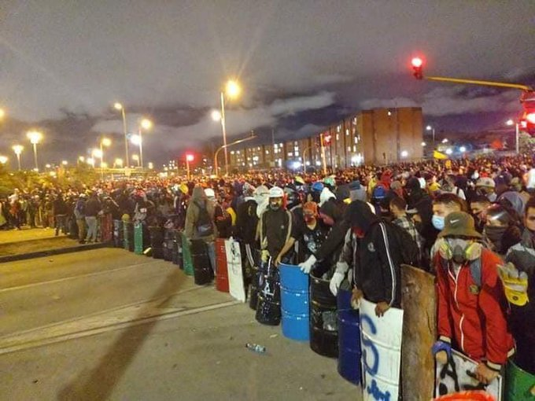

\[caption id="attachment\_15016" align="aligncenter" width="680"\] Los jóvenes realizaron barricadas en Bogotá, Cali, Popayán. **Ni el «venon» detiene la protesta.**\[/caption\]

El Paro Nacional sigue en pie. **Ni el «venon» disparado por el ESMAD detiene a la muchedumbre en las calles**. Tampoco los 42 muertos (41 civiles y un policía) a corte de la jornada 16. La primavera llegará. Y cuando llegue, pocos lo sabrán.

## Denuncian abuso sexual de la Policía

Según denunciaron organizaciones de derechos humanos, una menor de 17 años fue violada por 4 policías en Popayán. **Y dado a esta agresión sexual, se suicidó.** La niña era hija de un policía, se indicó. Otra menor fue agredida verbalmente cuando la detuvieron varios policías. La misma joven presentó su testimonio en un video subido a tuiter que aquí replicamos, ya que la víctima cubre su rostro con el tapaboca. 

/articulos/matachovudu/status/1393050155860078597?s=20

El comandante de la Policía Nacional de Popayán desmintió la versión del abuso sexual de la menor.

https://www.youtube.com/watch?v=qQ1seb8UsFI

## Policía en desacato al usar el «venon»

Los líderes de la protesta denunciaron que el ESMAD está usando no solo gases lacrimógenos sino también «venon». En uno de los videos, un joven captó el momento en que agentes del ESMAD comenzó a disparar los gases contra los manifestantes en Popayán.

https://twitter.com/Gu2Hail/status/1393040400550596609?s=20

Si eso es así, la Policía Nacional entraría en desacato frente a una acción de tutela que tuteló el derecho a la salud y a la vida de una persona contra el Estado colombiano por los constantes ataques del ESMAD con gases tóxicos. El **Juzgado Quinto Laboral del Circuito de Bogotá** (documento no disponible) ordenó, de forma inmediata, al Presidente de la República y a la Nación – Ministerio Defensa Nacional – Policía Nacional **que suspenda el uso de los siguientes agentes químicos durante las protestas ciudadanas que se realicen:**

1.  El dispositivo lanzador de pimienta con propulsión pirotécnica, gas o aire comprimido.  
2.  Las granadas con carga química CS, OC.  
3.  Las granadas fumígenas. 
4.  Los cartuchos con carga química CS, OC.  
5.  Los cartuchos fumígenos y/o cualquier otra sustancia semejante.

Esta prohibición se mantendrá mientras se encuentre vigente la emergencia sanitaria dispuesta por el Gobierno Nacional o sus prórrogas.

Te puede interesar

### [En Colombia, murió Lucas y 39 jóvenes, «pero no detendrán la primavera»](/articulos/en-colombia-murio-lucas-y-39-jovenes-pero-no-detendran-la-primavera/)