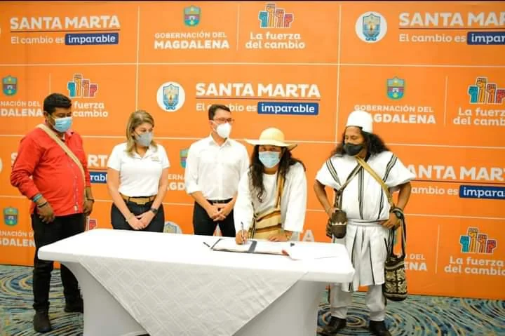
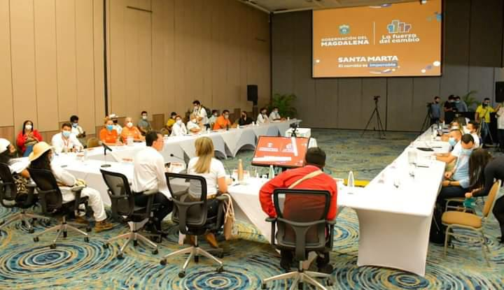

Fue un acuerdo histórico de inclusión con las comunidades indígenas que se plasmó en el día de hoy. Es un convenio de cooperación mutua, inclusión e integración entre los representantes legales de las autoridades civiles (Gobernación del Magdalena y alcaldía de Santa Marta) con las autoridades ancestrales de la Sierra Nevada de Santa Marta. El acuerdo le llevaría agua a Santa Marta y a otras poblaciones de las estribaciones del complejo montañoso. Es decir, que es un beneficio mutuo.

*Aquí firman las autoridades civiles y ancestrales este acuerdo histórico. Carlos Caicedo, gobernador, Virna Jhonnson, alcaldesa de Santa Marta. También Arregoces Conchacala, Gobernador del Cabildo Indígena Kogui; Zarwawiko Torres Gobernador Calbildo Indígena Arhuaco; Jaime Luis Arias Ramírez, Gobernador Cabildo Indígena Kankuamo; y José Bolívar, Gobernador del Cabildo Indígena Wiwa. *

En ese sentido el Gobernador del Magdalena, Carlos Caicedo, la Alcaldesa Virna Johnson y las autoridades indígenas del Magdalena, suscribieron un **Memorando de Entendimiento**. Con este convenio se busca ejecutar 52 proyectos en beneficio de las comunidades ancestrales del Departamento. Firmaron el acuerdo los representantes de los indígenas de la Sierra Nevada de Santa Marta. **Arregoces Conchacala**, Gobernador del Cabildo Indígena Kogui; **Zarwawiko Torres** Gobernador Calbildo Indígena Arhuaco; **Jaime Luis Arias Ramírez,** Gobernador Cabildo Indígena Kankuamo; y **José Bolívar,** Gobernador del Cabildo Indígena Wiwa. 

## Cuatro pilares

Se trata de un plan de acción que parte de 4 pilares. **(1)** Saneamiento y resguardo de sitios sagrados. **(2)** Control de la minería y cambio climático.  (**3)** Regulación del turismo. **(4)** Conservación del agua, en cuyos componentes son protagonistas los pueblos indígenas. **Kogui, Arhuaco, Kankuamo y Wiwa de la Sierra Nevada de Santa Marta y Chimilas.«»**

> _**«**El Memorando de Entendimiento incluye la solución al desabastecimiento de agua en Santa Marta. Se financia con recursos de compensación de Cenit, recursos propios de la Gobernación y del Distrito, sumado a recursos PDET por más de 140 mil millones. Su ejecución estará a cargo de la gerencia social que se creará para tal fin. Queremos mejorar las condiciones sociales y productivas así como la sostenibilidad de la Sierra. Podremos resolver los temas de abastecimiento de agua potable de las comunidades indígenas campesinas y para Santa Marta**»**_.
> 
> Gobernador del Magdalena, **Carlos Caicedo** Omar.

De la misma manera, explicó que por medio de este plan de acción también se busca que los pueblos indígenas tengan asiento en la Empresa de Aguas del Departamento del Magdalena y la Empresa Servicio Públicos de Santa Marta -Essmar-.

Por su parte, **la alcaldesa de Santa Marta, Virna Jhonnson,** se mostró satisfecha por este gran paso que dieron las autoridades civiles con las tradicionales de la **Sierra Nevada**. Además dijo:

> _“Este es el resultado de una serie de mesas de trabajo mancomunado con los pueblos indígenas por el interés que tenemos Gobernación y Alcaldía por reivindicar a los pueblos indígenas e ir saldando la deuda social que el Estado ha tenido con ellos, cuya voluntad de cambio se materializa con la firma del memorando de entendimiento_”.

## Los proyectos con las comunidades indígenas

*La reunión con las autoridades delas comunidades indígenas.*

Entre los proyectos que contempla este plan de acción se encuentran: becas dirigidas a estudiantes indígenas a través de la Institución Universitaria Politécnica; la construcción de aulas de clases y baterías sanitarias para la sede Yemuke de la IED Gunmaku; diseño y construcción del sistema de abastecimiento de agua del resguardo indígena Wiwa corregimiento de Guachaca de Santa Marta.

De igual manera se incluye otros proyectos. El diseño y construcción de las soluciones de saneamiento básico del **resguardo indígena Wiwa en las comunidades de Kemakumake y Goetzseshi de Santa Marta.** El diseño y construcción para la solución de agua potable del pueblo de **Ette Ennaka en Sabanas de San Ángel**; El diseño de la planta de tratamiento del Curval y captaciones en los ríos Piedra, Guachaca, Buritaca y Don Diego. La transformación de la junta directiva de la Essmar para incluir a los pueblos indígenas. Inclusión de la población indígena en el esquema societario de Aguas del Magdalena; entre otros.

[Nuevas becas para universitarios del Magdalena](/articulos/nuevas-becas-para-universitarios-del-magdalena/)

[¿Alcaldía de Arjona prevaricó al revocar consejo comunitario de Rocha?](/articulos/alcaldia-de-arjona-prevarico-al-revocar-consejo-comunitario-de-rocha/)