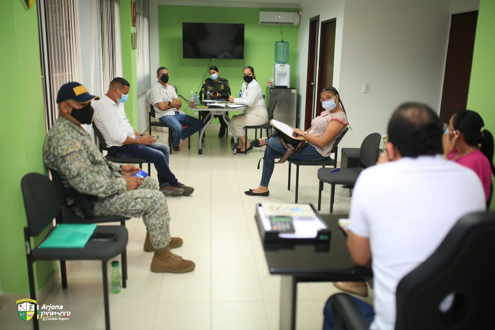
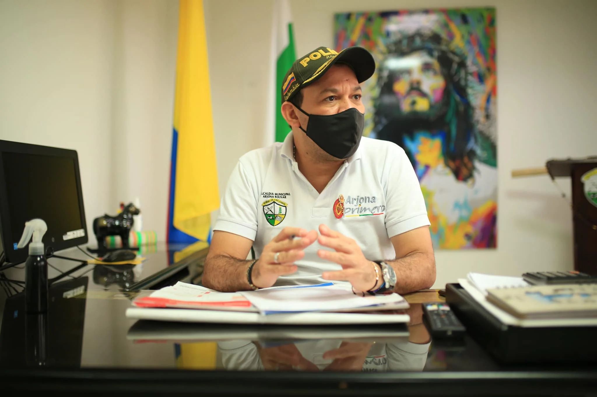
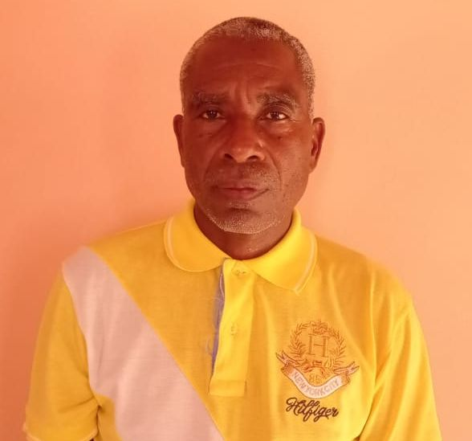

*En el fondo, Dihly Romero Herrera, Secretaria General y de Gobierno de Arjona. En un consejo de seguridad presidido por el alcalde, Isaías Simancas. ¿La Alcaldía de Arjona prevaricó?*

La alcaldía de Arjona prevaricó al revocar sin ningún sustento legal y fáctico la junta directiva del consejo comunitario de Rocha. Esa podría se la conclusión al no seguir el procedimiento administrativo en los términos del **inciso segundo del artículo 95 de la ley 1437 de 2011 para resolver primero las impugnaciones del acto de elección**. Esta ley se conoce como Código de procedimiento Administrativo y de lo contencioso Administrativo. Su sigla conocida, CPACA. **Tal conducta es un atentado a la autonomía de las poblaciones afros que deben tomar sus decisiones libremente sin interferencias del Estado o de entidades privadas.**

Rocha es un corregimiento del municipio de Arjona, ubicado al norte de Bolívar y área del **Canal del Dique**. Está poblado, en su mayoría, por campesinos y pescadores afrodescendientes. Será afectado por el macroproyecto **APP Restauración de los Ecosistemas Degradados del Canal del Dique.** Las obras contemplan la construcción de dos sistemas de esclusas ubicadas en **Calamar y Puerto Badel, respectivamente.** Tendrán compuertas (Calamar) y obras de interconexión entre Ciénaga – Ciénaga, y Ciénaga – Canal, desde el Río Magdalena hasta las ciénagas de Barbacoas y Cartagena.

## ¿Por qué la alcaldía de Arjona prevaricó?

El artículo 94 de la ley 1437 de 2011 (CPACA), señala que **la revocatoria directa a solicitud de parte no procede en los siguientes casos**: **«1.** Por la causal del numeral 1 del artículo anterior, **cuando el peticionario haya interpuesto los recursos de que dichos actos sean susceptibles**. **2.** Ni en relación con los cuales haya operado la caducidad para su control judicial». En el caso concreto, varios de los directivos anteriores del consejo Comunitario impugnaron la elección de la nueva junta directiva. Por esta razón, **Romero Herrera quedaba impedida para ejercer la revocatoria directa. Tenía que resolver las impugnaciones.**

¿Por qué la alcaldía de Arjona prevaricaría con la revocatoria directa de la junta directiva del Consejo Comunitario de Rocha representado legalmente por **Edison Maza Miranda?** Existen varios hechos que demuestran esta hipótesis. Pero analicemos en qué contexto se produjo el hecho revocado, es decir, la decisión de la asamblea del consejo comunitario que es la máxima autoridad a la luz del **Decreto 1745/9**5\. La asamblea es integrada por todos aquellas que estén en el «**censo interno»** que se hayan anotado en un libro. Éste debe estar abierto 30 días hábiles antes de que se realice la asamblea.

Son dos juntas directivas para el **período 2020-2023 invalidadas**. La primera representada por **Linfer Moyar** elegida el 2020. La impugnó Edinson Maza Miranda. En septiembre de 2020 fue revocada por la alcaldía de Arjona. En diciembre el Ministerio del Interior confirmó dicha decisión y ordenó una nueva asamblea para la elección de la junta directiva. Es así que la segunda junta representada por Edinson Maza Miranda fue elegida en marzo de 2021. La alcaldía la confirmó en primera instancia. Fue impugnada por los anteriores directivos revocados. Pero la Secretaria General y de Gobierno decretó la revocatoria directa de su propio acto administrativo sin conocer la impugnación.  

## ¿Alcaldía de Arjona prevaricó?

*El alcalde de Arjona, Isaías Simancas delegó en la secretaria General y de Gobierno atender la primera instancia de las decisiones de los consejos comunitarios. ¿La alcaldía de Arjona prevaricó? Cortesía.*

Para saber si la alcaldía de Arjona prevaricó al revocar su propia **resolución No 2021032902 del 29 de marzo de 2021,** lo primero que debemos analizar es en qué contexto se produjo el hecho revocado. Es decir, el acto administrativo que la misma **Secretaria General y de Gobierno, Dihly Romero Vergara**, adoptó para reconocer la decisión de la asamblea del Consejo Comunitario, que es la máxima autoridad a la luz del Decreto 1745/95. La asamblea es integrada por todos aquellas que estén en el «**censo interno»** que se hayan anotado en un libro. Éste debe estar **abierto 30 días hábiles** antes de que se realice la asamblea.El Decreto 1745/95, en concordancia con el Decreto Único 1066 de 2015, señala:

> _«(...) la Asamblea General es la máxima autoridad del Consejo Comunitario y estará conformada por las personas reconocidas por éste, de acuerdo con su sistema de derecho propio y registradas en el censo interno**»**._
> 
> Decreto 1745/45 (documento no disponible)

Los **Consejos Comunitarios** son un conjunto de familias de ascendencia afrocolombiana que poseen una cultura propia. Gozan de personería jurídica, y constituyen una agremiación de personas con objetivos étnicos específicos.

El abogado Adil Meléndez, abogado con experiencia en el tema, confirmó la tesis de que la secretaria General prevaricó. Dijo que «era una sinvergüenzura».

## El acto que revocó

La **resolución citada, No 2021032902 del 29 de marzo de 2021, reconoció la elección de Edison Maza Miranda como representante legal de la Junta del Consejo Comunitario de Rocha. Para tomar esa decisión precisó en sus considerando:** 

> _**«**Que una vez verificados los documentos aportados, se observa que se debe proceder de conformidad con el parágrafo 1 del artículo 9 del Decreto 1745 de 1995, a efectos de reconocer y actualizar el acto de elección de la nueva junta directiva del Consejo Comunitario Afrocolombiano del corregimiento de Rocha**»**._

O sea que el procedimiento de elegir a la junta representada por **Maza Miranda** llenó todos los requisitos. Tanto es así que Maza Miranda elevó una petición al **Ministerio del Interior Asuntos Étnicos**. Esta dependencia emitió la resolución (puede leerla haciendo clic)  **No 453 de 2020** (documento no disponible) señalándole a los peticionarios los tres pasos que debían realizar para que la elección fuese legal y democrática. De esta manera no cometieran ningún error.

El año pasado, la resolución del ministerio le ordenó a la asamblea general que para convocar una sesión extraordinaria extraordinaria del Consejo Comunitario que modificaría el reglamento interno para **elegir nueva junta directiva**, debían cumplir **tres pasos a la luz del Decreto 1745/95**.  **Primero,** actualizar el censo. **Segundo**, abrir el libro para que los interesados se inscriban. Se inscribieron 120 personas. **Tercero,** el tiempo de apertura del libro debe ser de 30 días hábiles de antelación de la elección de la Junta Directiva del Consejo Comunitario. Así lo hicieron. Estas directrices emanan de la **circular interna No OF119-51482-DCN-2300** del 19 de noviembre de 2019 del Ministerio del Interior.

## El prevaricato

**VoxPopuli Digital** tiene en su poder la documentación necesaria que prueba el hecho de que la conducta de **Dihly Romero Herrera** fue una vía de hecho. Contraria a la ley y a la Constitución. Probablemente con su conducta quiso favorecer a un tercero. En este sentido el prevaricato es eso: **El delito de prevaricato por acción es aquel donde el servidor público actúa de forma voluntaria y arbitraria profiriendo resoluciones o dando conceptos que van en contra de ley y aunque sabiendo que es así, los realiza.**                             

> _**«**El servidor público que **profiera resolución, dictamen o concepto manifiestamente contrario a la ley**, incurrirá en prisión de cuarenta y ocho (48) a ciento cuarenta y cuatro (144) meses, multa de sesenta y seis punto sesenta y seis (66.66) a trescientos (300) salarios mínimos legales mensuales vigentes, e inhabilitación para el ejercicio de derechos y funciones públicas de ochenta (80) a ciento cuarenta y cuatro (144) meses**»**_.
> 
> [https://leyes.co/codigo\_penal/413.htm](https://leyes.co/codigo_penal/413.htm)

Romero Herrera es consciente de que el acto de revocatoria directa que profirió no es legal. Ella misma citó las órdenes emanadas de la resolución **No 453 de 2020 y certificó que habían cumplido los tres pasos —citados anteriormente— para elegir la nueva junta directiva del Consejo Comunitario de Rocha representado por Edison Maza Miranda.** Y si el acto de elección de la nueva junta directiva fue legal, **¿por qué lo revocó?**

## Maza sí está en el censo, la alcaldía de Arjona prevaricó

*Edinson Maza Miranda, el representante legal del Consejo Comunitario revocado en forma irregular. ¿La alcaldía de Arjona prevaricó?*

La asamblea que eligió a **Edison Maza** llenó los requisitos de ley. La primera resolución de la Secretaría General y de Gobierno, delegada por el alcalde de Arjona **Isaías Simancas** para conocer la primera instancia, lo reconoció como representante legal. Certificó que todos los documentos anexados correspondían al procedimiento definido por el decreto y la circular citados. **Pero después Dihly reculó y cometió el error de revocar su propia resolución.**

La segunda resolución (No 2021052402 del 24 de mayo de 2021) que revocó directamente la primera, argumento que Edison Maza Miranda **no se encontraba en el censo interno para elegir a la junta directiva donde él es representante legal.** Sin embargo, Maza Miranda sí está. Lo prueba el mismo libro que se abrió para convocar la asamblea del consejo comunitario, según el procedimiento que había señalado el mismo Ministerio del Interior.  Incluso, el juez del Circuito de Turbaco, **Edison Faciolince Pacheco**, lo confirmó en un **fallo de tutela de segunda instancia No 00060 del 2021** contra la directiva anterior del Consejo de Comunitario. Y por eso le protegió su derecho fundamental de petición. 

Eso es tan verdad que Maza Miranda le presentó a la junta directiva anterior un derecho de petición para que le entregaran toda la información sobre el proceso de elección de esa instancia. Esa directiva, anterior a la de Maza Miranda, estaba viciada y fue revocada por el Ministerio del Interior. Aquí se encontraban **Linfer Moyar Ruiz y Néstor Iriarte**, dirigentes que se quieren perpetuar en esos cargos.

## ¿Por qué Dihly reculó?

Un hecho curioso sucedió cuando se publicó la resolución donde se  confirmaba la elección de Edinson Maza como representante legal de la nueva junta directiva del Consejo Comunitario. Este hecho podría mostrar el móvil de la reculada de Dihly Romero. De esta manera se conferiría el interés a tercero de su resolución revocatoria. **Néstor Iriarte en su pagina de Facebook se lamentó de esta decisión**, ya que ellos (el consejo comunitario revocado por el Ministerio del Interior) votaron a la alcaldía por **Isaías Simancas.** En tanto que Edinson Miranda lo hizo por **Rodrigo Guardo, el candidato perdedor.** Como es obvio decirlo, lo seguidores de Simancas pusieron el grito en el cielo.                                   

> _"Apoyamos al señor I**saías Simancas** a la alcaldía. Nos sentimos traicionados, y el señor Edinson Mirando apoyó a **Rodrigo Guardo.** No es posible que notifiquen al señor Edinson Maza como representante legal del consejo comunitario de Rocha. Una persona que no hace parte del consejo comunitario de Rocha, porque no está inscrito en el censo interno**»**_.
> 
> Néstor Iriarte, Facebook.

Lo anterior indicaría que allí se configuraría el móvil de ese presunto delito. **Hay un interés para favorecer a terceros. Estos terceros son Néstor Iriarte, Linfer Moya Ruiz** y todos aquellos que fueron elegidos el 21 de mayo de 2021 en una espuria junta directiva provisional. 

## Vea las irregularidades en Puerto Badel

## Las curiosidades

Otra curiosidad: La junta provisional fue avalada por la alcaldía de Arjona. Pero la misma funcionaria rechazó la junta provisional de **Puerto Badel** presidida por **Ober Pacheco, por el supuesto hecho de que no es legal la tal provisionalidad. Puesto que ninguno de sus actos administrativos, por tanto, son legales.**. ¿Cómo Así? Si la de Puerto Badel es ilegal ¿por qué la de Rocha es legal? ¿Quién lo decidió? La ley es la ley. No se puede sesgar su aplicación. 

Si desean otros datos curiosos, se los presento. Ese día de la elección de esa junta directiva provisional, el funcionario del Ministerio del Interior, **José Manuel Barros Gnecco,** fue quien lideró y organizó la asamblea espuria para elegir esa junta directiva provisional representada por **Linfer Moyar**. Allí se encontraban funcionarios de Cesia que tiene pensada otra consulta previa  También Aguas de Cartagena y Promigas estan interesados en que les aprueben una consulta previa para sus respectivos proyectos.

De la misma manera podemos citar más curiosidades. El 80% de los que constituyen la junta directiva provisional del Consejo Comunitario de Rocha hacían parte de la junta directiva revocada por la resolución precitada **No 453 de 2020.** El Ministerio del Interior y Dirección de Asuntos para Comunidades Negras, Afrocolombianas, Raizales y Palenqueras, a cargo de Judith Rosina Salazar Andrade determinó que era ilegal.

## Conclusión

**Dihly Romero venía por el camino correcto cuando revocó la junta del 2020 elegida con irregularidades.** El Ministerio del Interior confirmó esa decisión en segunda instancia y ordenó que se realizara otra asamblea, la cual se hizo donde se eligió a Edison Maza. Posteriormente, siguiendo apegada a la ley, avaló la nueva junta directiva representada por Maza Miranda, elegida en el mes de marzo del 2021. **Pero se torció en la tercera actuación. Desatendió lo que dice la norma presuntamente para satisfacer intereses de terceros**.

La administración pública es compleja. Todo está reglado. Puedes hacer todo bien, pero si te equívocas o no sigues lo que dice la ley en un solo paso, puedes caer en un delito. Y esta es la situación de la Secretaria General y de Gobierno de Arjona, **Dihly Romero Herrera. ¿Qué delito se configuraría? Como lo dijimos, prevaricato por acción.**

**Próxima entrega:** ¿Cómo compraron la consulta previa en Rocha? De los **$350 millones** girados por la ANI sacaron en efectivo $326 millones y se los repartieron entre el Consejo Comunitario provisional liderado por Linfer Moyar Ruíz. ¿Cuál fue el papel de David González Cardales?

## Te puede interesar

# [Cómo compran las consultas previas de ANI a los afros](/articulos/como-compran-las-consultas-previas-de-ani-a-los-afros/)

# [¿ANI viola el derecho de la consulta previa? (II)](/articulos/ani-viola-el-derecho-de-la-consulta-previa-ii/)