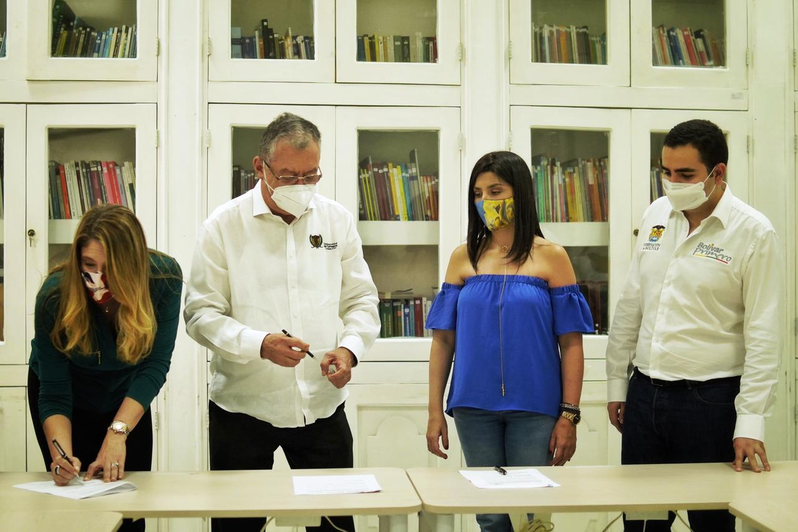
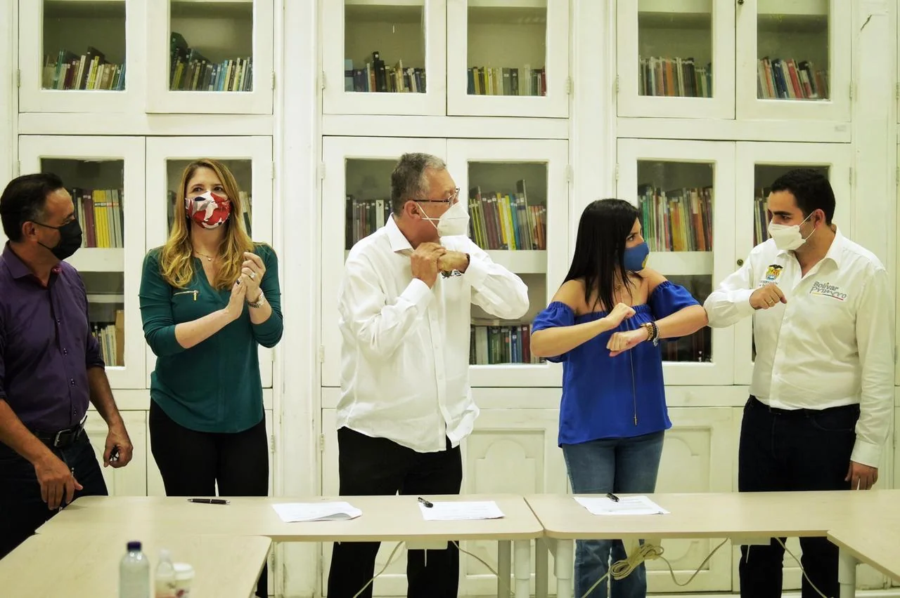

*De izq. a derecha, Sacra Nader (UNIBAc), Edgar Parra Chacón(UdeC), María Victoria Angulo, Ministra de Educación y Vicente Blel, gobernador de Bolívar, una vez firmaron el acuerdo.*

Los estudiantes de la Universidad de Cartagena—**UdeC** y Universidad de Bellas Artes y Ciencias de Bolívar—**UNIBAC**. tendrán matrículas gratis. El gobernador **Vicente Blel firmó el viernes pasado el convenio que ratifica su apoyo al programa Matrícula Cero.** Esta inicia beneficia a estudiantes de los estratos 1, 2 y 3 de esos dos centros de educación superior.

En el acto protocolario asistieron la Ministra de Educación, **María Victoria Ángulo**, y los rectores de las dos instituciones educativas, **Edgar Parra y Sacra Nader**, respectivamente. El Gobernador manifestó que continuará trabajando sin descanso para **«superar las trampas de la pobreza»**, generar desarrollo económico acorde a la vocación productiva de nuestro departamento y mejorar la competitividad de Bolívar.

## Matriculas gratis, «promesa cumplida»

Sin duda, el programa Matricula Cero beneficiará a los hijos de hogares que se encuentran en los estratos más bajo de la sociedad colombiana.

> _«Así lo anunciamos en 2020 y les cumplimos a cerca de 16.000 estudiantes de la Universidad de Cartagena y de Unibac. Es una inversión de 2.550 millones de pesos. Concurriendo con ello al esfuerzo del gobierno nacional… Señora Ministra, cuente con nosotros para continuar impulsando la educación pública gratuita y trabajar en la ampliación de la cobertura de la Educación Superior. Nuestros jóvenes nos necesitan y reclaman todo este empeño. Sumado a la gran apuesta del departamento por la mejora de la calidad e infraestructura educativa en la básica y media, **nos llevará a ser Primeros en Educación»**._
> 
> Gobernador Vicente Blel Scaf

**Matriculas gratis fue una promesa que hiciera el gobernador Blel el año anterior** cuando se presentó el impacto negativo de la pandemia a la economía nacional y, especialmente, al bolsillos de los más necesitados.

## Alianza para matriculas gratis

*¡Celebrando las matrículas gratis! para estudiantes de estratos 1,2,3.*

En tanto que la Ministra de Educación, **María Victoria Angulo**, aseguró que la gratuidad fue un anhelo por muchos años. Fruto de varios procesos y acuerdos. Por primera vez en el país, se está garantizando la gratuidad para los estratos 1, 2 y 3 de todas las instituciones públicas.

> _«_Lo anunciamos. Queremos que toda la gente lo vea en el territorio, con una alianza con cada Gobernador. Aquí, particularmente en Bolívar, hemos hecho un proceso en equipo con el Gobernador (Blel) desde el segundo semestre de 2020. Nos unimos y concurrimos nuevamente en primer semestre de 2021. Ahora para esta noticia estamos otra vez en equipo. Así que juntos firmamos los convenios que hacen realidad en las 3 instituciones de educación pública, la gratuidad_**»**_.
> 
> Ministra de Educación, **María Victoria Angulo**.

El programa de Matrícula Cero aplica para todos los estudiantes del país, admitidos en el sistema público, cobijados por 63 instituciones técnicas y tecnológicas. Con una inversión de 600 mil millones de pesos el Gobierno Nacional busca beneficiar a más de 695 mil estudiantes.

## El acuerdo

Son 720 mil estudiantes que se encuentran matriculados en las 63 universidades oficiales del Sistema Nacional de Información de Educación Superior SNIES. Estas instituciones reciben transferencias del presupuesto nacional. El acuerdo busca que a través del Fondo Solidario para la Educación Superior del ICETEX se pueda financiar las matriculas a más de 695 mil estudiantes. Esto fue autorizado por el **Decreto Legislativo 662 de 2020**. Su objetivo es disminuir la deserción de educación superior debido al impacto económico de la pandemia.

Cada institución involucrada en esta alianza firmó. Es así que los estudiantes de estratos 1,2,3 de la UdeC y de Unibac podrán disfrutar de matriculas gratis. De esta manera debe reducirse significativamente la deserción que fue muy pronunciada en el segundo semestre del año anterior.

### Te puede interesar:

[¿Alcaldía de Arjona prevaricó al revocar consejo comunitario de Rocha?](/articulos/alcaldia-de-arjona-prevarico-al-revocar-consejo-comunitario-de-rocha/)

[La importancia de analizar el IDI como mejora territorial (II)](/articulos/la-importancia-de-analizar-el-idi-como-mejora-territorial/)