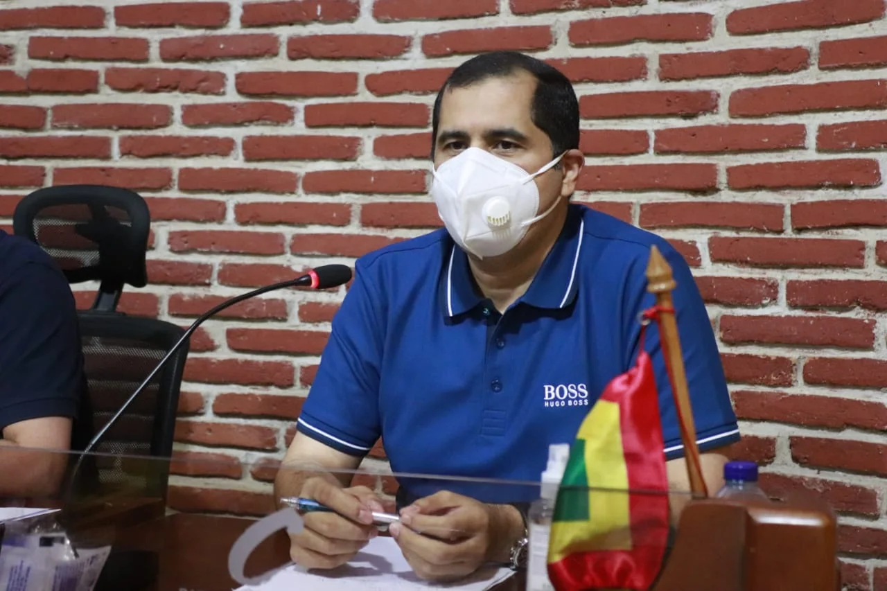
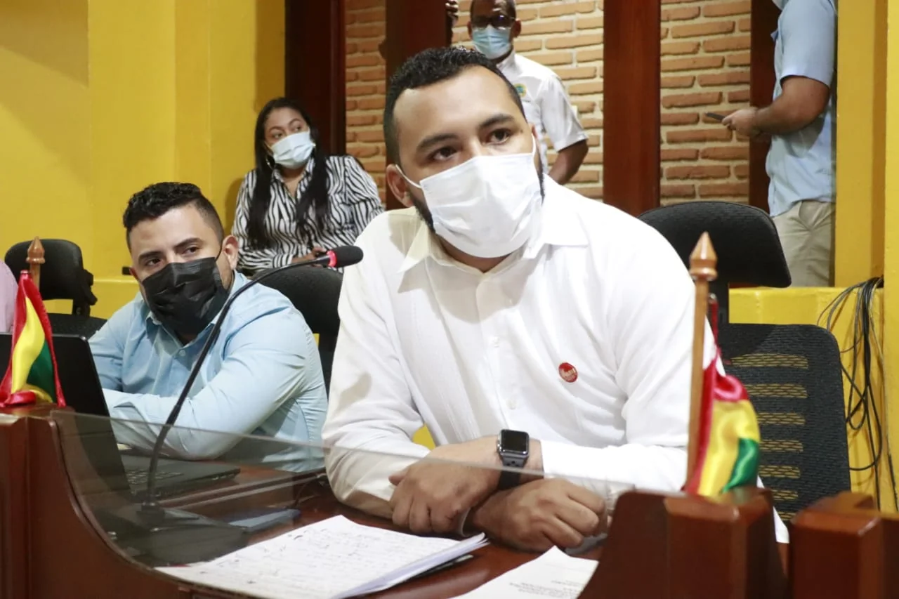

*Armando Córdoba fue como «pagapato». El alcalde se lavó las manos. Cortesía.*

Armando Córdoba Julio, como «pagapato» de Dau, cayó en la moción de censur**a aprobada hoy por el Concejo Distrital de Cartagena. Lo que nunca logró e**l congreso de Colombia con los ministros del presidente **Iván duque**, el concejo distrital de Cartagena lo hizo hoy —por segunda oportunidad— al aplicar con éxito la moción de censura contra un secretario de la alcaldía. Pero el caso es que el jefe del gobierno local, contrario a lo que sucedió con la primera moción de censura, esta vez brilló por su silencio sospechoso. 

Igualmente, el concejo utilizó este instrumento de control político como sanción contra el Secretario de Planeación Distrital, **Guillermo de Ávila Barragán.** Este funcionario se fue en diciembre del año pasado**. La corporación acusó a de Ávila de no cumplir con el plan de desarrollo y otras metas de esa secretaría.** Ahora Córdoba se fue por las mismas razones.

En ese entonces, el alcalde hizo una alocución en su despacho con la asistencia de todo su gabinete. Fue una diatriba contra los concejales, como la que nos tiene acostumbrados. **Hoy, calló**. Ahora anda de «pipí cogido» con los integrantes de la coalición mayoritaria, que por arte de magia, ya no son malandrines. En ese entonces, no había roto con **Javier Julio Bejarano**, el único concejal que lo acompañó desde las elecciones. Pero no hace parte de dicha Coalición.

> _«Nuestro gobierno ha sido víctima de otro de esos golpes bajos a los que nos tienen acostumbrados la mayoría de los concejales como parte de la persecución política en contra de la administración ‘Salvemos Juntos a Cartagena’. Al aprobar esta moción de censura creen los concejales que van a desestabilizarnos, pero se olvidan que este gobierno es de la gente y fue elegido para acabar la corrupción con honestidad y excelencia de los ciudadanos, se concentran en ataques infundados que ponen en riesgo el bienestar de los cartageneros»_.
> 
> William Dau, 10 de diciembre de 2020. Reacción frente a la moción de censura contra Guillermo de Ávila.

## Córdoba, un aliado incómodo

Cabe recordar que Córdoba Julio fue candidato a la alcaldía por la **Alianza Verde**. Faltando varias semanas para las elecciones renunció a su candidatura para adherirse a William Dau Chamat. **El acuerdo era que tendría gobernabilidad, especialmente para administrar las políticas públicas que beneficiarían a los sectores más vulnerables.** Pero Dau Chamat —en las primeras de cambio de su administración— le quitó los poderes a Córdoba. **Expidió el Decreto 0545 del 22 de abril de 2020** mediante el cual le quitó casi todas las facultades al secretario de Infraestructura, Gonzalo Jácome, y al de Participación, Armando Córdoba. Cuando Dau fue elegido, esa noche del 28 de octubre de 2019, Jácome cargó en sus hombros al alcalde electo. En tanto que Córdoba y su combo celebraron hasta en la madrugada soñando con pajaritos preñados. 

Los dos, Jácome y Córdoba, hoy están fuera de la administración. La salida de Armando Córdoba fue una **verdadera traición política de Dau Chamat.**  No solo le quitó el respaldo político, sino porque internamente ya la Trinca del Poder no gustaba de Córdoba. Tanto es así, que la plata destinada a los sectores más vulnerables, Dau la usó para otros menesteres. Así sucedió con el PES, Escuela de Gobierno y Participación. El atenuante de Córdoba es que tenía las manos amarradas. Solo lo dejaron con capacidad para contratar órdenes de prestación de servicios. **Todo el poder lo concentró Dau Chamat con la Unidad de Contratación Distrital.** 

¿Qué debió hacer Córdoba? Renunciar en el mismo momento en que le ataron las manos. Y no «tirarsela de gato bravo» en medio de una jauría que lo había condenado a la moción de censura fulminante. No tenía hechos que mostrar. No tuvo la gallardía de renunciar cuando lo pudo hacer y cuestionar a su aliado que había faltado al acuerdo electoral.

En ese sentido, si se trata de ser justo, los concejales debieron hacerle un juicio político al alcalde. ¿O hizo parte del acuerdo no tocar al burgomaestre?¿Se preguntaron que se hizo el dinero de los viejitos, los jóvenes, de los comunales, las mujeres? ¿Quiénes manejan la contratación? No hubo un solo concejal que atisbara en sus cuestionamientos sobre lo fundamental. Córdoba debió responder con un «mea culpa». Y le hubiese ido mejor. Pero le hizo falta caballerosidad o valentía para hacerlo. 

## Una censura limpia

No escuché divagaciones en las intervenciones de los censores. Fueron precisos. Acertados. Contundentes. Vale destacar las intervenciones de Javier Julio Bejarano, Oscar Marín y César Pión. Córdoba estaba solo. Quedó sin argumento válidos.

De tal manera que fue un proceso limpio, rápido y objetivo. **Limpio**, porque se cumplió todos los términos de un debido proceso. El acusado tuvo oportunidad de controvertir cada uno de los cuestionamientos.

**Rápido**, porque se inició el 8 de junio y una semana después, 15 concejales votaron por la moción. Hubo dos votos negativos de la **Alianza Verde** y dos ausentes: **Fernando Niño (conservador  y Arboleda (Mira)**.

**Objetivo y** técnico. Los concejales mostraron y demostraron las falencias protuberantes de su gestión. Por esta razón, el objeto de este control político —concedido por el artículo **312 de la Constitución Nacional**— se constituyó en una especie de destitución fulminante. Inobjetable.

## Como «pagapato» de Dau

Sin embargo, como ya se dijo, en este proceso de censura hubo algo notorio: **El silencio sospechoso del alcalde William Dau Chamat**. Fuentes que no quisieron dar sus nombres, señalan que el alcalde se siente incómodo con **Armando Córdoba.** Que, al parecer, la Secretaría de Participación haría parte de los acuerdos con la coalición mayoritaria del concejo. Pero el alcalde debía salir de Córdoba. Y la mejor manera era entregárselo a los concejales como presa para los buitres. El mismo Córdoba lo dio a entrever en un tuit que publicó poco después de salir derrotado del concejo. Quedó como «pagapato».

https://twitter.com/ArmandoCordba/status/1405183370577985536?s=20

Alianza macabra y racista, ¿de quién? ¿William Dau y los concejales?

## Los censores de Córdoba

Los concejales de Cartagena realizaron un debate técnico. Igual como lo hicieron contra Guillermo de Ávila, Secretario de Planeación. La diferencia era que de Ávila contaba con el respaldo total de William Dau. En cambio Córdoba estaba solo y casi seguro de que lo iban a sacar. Por eso, en su defensa, se fajó con un discurso político de confrontación contra el concejo. Se hizo la víctima. Una diatriba a la usanza de Dau. No le quedó bien. Perdió la pelea. Los concejales les respondieron con pruebas, argumentos y fundamentos. 

*Oscar marín fue uno de los concejales que refutó contundentemente a Armando Córdoba, quien quedó como «pagapato».*

> _«No fue un control político sino un control social. Hubo una desatención con el adulto mayor que tuvo el Secretario de Participación Ciudadana, Armando Córdoba»._
> 
> **Oscar Marín Villalba**, concejal conservador

*Wilson Toncel, presidente del concejo. A pesar de ser aliado del alcalde Dau, fue uno de los animadores de la moción de censura de Armando Córdoba, quien quedó como «pagapato».*

> _«_Ahora debemos enviar copia del acta de hoy al alcalde. Este debe retirar y nombrar otro secretario. Córdoba no trajo temas técnicos para controvertir lo dicho de los concejales. Le echó la culpa al concejo y a la misma administración por la no ejecución de los programas de esta dependencia_»_.
> 
> **Wilson Toncel**, Cambio Radical, presidente del concejo

*Javier Julio Bejarano no hace parte de la coalición mayoritaria. Es uno de los principales críticos de la administración.*

> _«_Respetamos el debido proceso con la proposición No 047. Las respuestas del secretario demostraron que no estaba cumpliendo con sus funcionales misionales. El 15 de junio escuchamos al secretario Córdoba con un discurso político para defender su gestión. Logramos demostrar que fue negligente. Quince votamos la moción de censura_»_.
> 
> **Javier Julio Bejarano**, concejal MAIS

## ¿Qué dice la comunidad?

*Marelbis Sheck, lideresa del barrio España.*

> _«_La moción de censura fue objetiva. La negligencia de Córdoba no tuvo en cuenta que los adultos mayores están en estado de mendicidad y con hambre. Los dueños de los inmuebles donde funcionan hoy los Centros de Vida no les han pagado en toda la administración de William Dau_»_.
> 
> **Marelbis Sheck**, Adumayor.

## ¿Como «pagapato»?

https://youtu.be/RuxQzsYYmYI

Armando Córdoba Julio quedó solo. Por mucho que pataleó, solo consiguió un lacónico e insulso comunicado de la administración distrital. Al parecer, el alcalde William Dau Chamat, quería salir de Córdoba. Y se lo echó a los concejales como carnada de caimanes. Con esto quedó patentizado la verdadera catadura de Dau. ¿Traicionar a sus propios aliados? Con su mano derecha hace alianza con los concejales. Y con su izquierda, mantiene falsos compromisos como el que suscribió con Córdoba.

De la misma manera, debemos decir Dau usa a sus colaboradores como papel higiénico. La censura de Córdoba, teniendo a la coalición mayoritaria a su favor, es sintomático de que le estaba jugando la doble a Córdoba. No tiene otra explicación política o lógica. 

Primero lo dejó sin poder de contratación. Segundo, el dinero se lo gastó Dau en otras necesidades no sociales. Tercero, lo dejó solo frente al control político que con justicia ejerció el concejo distrital. De esta forma están saliendo los negros y alternativos de su administración. Primero fue el secretario de Hacienda y luego vinieron su primera dama Cinthya Pérez Amador, Kairen Margarita Gutiérrez y ahora Armando Córdoba. ¿Cuándo le vendrá el turno a David Múnera, Cielo Sánchez y otros? Por esta razón, Córdoba es como «pagapato» de Dau.

### Te puede interesar:

## [Tercera ola del Covid-19. Los cadáveres se acumulan en las morgues](/articulos/tercera-ola-del-covid-19-los-cadaveres-se-acumulan-en-las-morgues/)