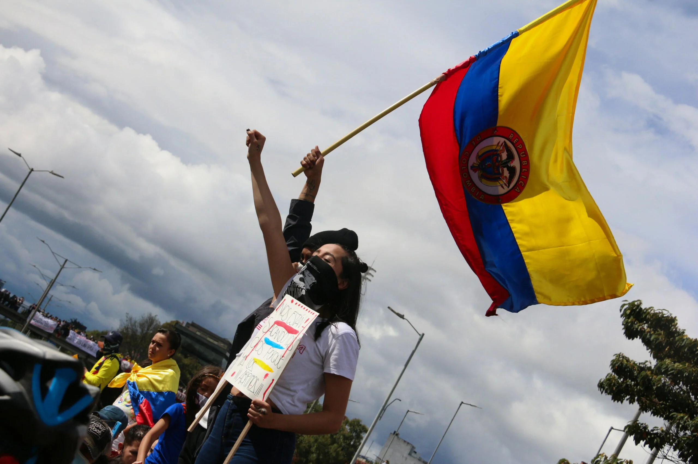
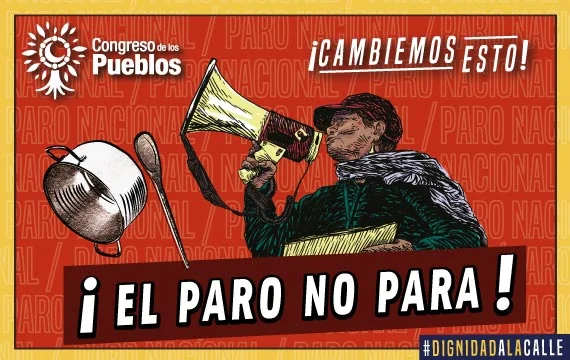

*El Paro No Para. (Creación de Laura Botet).*

**«El Comité de Paro nos da vergüenza»**, gritan jóvenes en las calles en Medellín, Bogotá, Cali, y otras ciudades. **Salieron a marchar los días 16 y 17 de junio** con el objetivo de seguir en la protesta callejera en el marco del Paro Nacional. Fueron acciones contra el **régimen neobonapartista** representado por el presidente Iván Duque. Rechazaron el fracaso del proyecto de ley de **Matrícula Cero** en el congreso de la República. Igualmente lanzaron sus críticas contra la decisión del **Comité del Paro Nacional** con este coro que cantaban en la medida que marchaban: 

> **«No nos representan, el Comité del Paro solo da vergüenza»**

## Gritan los jóvenes

*El Paro No Para. Los jóvenes gritan en las calles.*

El movimiento juvenil —que no tiene nada que perder y no piensa en estrategia electoral— rechazó la decisión de la burocracia sindical de privilegiar el parlamentarismo corrupto. **Gritan los jóvenes** que la dirigencia despreció la lucha directa de la ciudadanía que en una semana tumbó la reforma tributaria, la reforma de la salud y un ministro de economía prepotente. Incluso, hizo tambalear al **régimen neobonapartista del Centro Democrático de Uribe y pidió la renuncia de Duque**.

Como es de conocimiento, el pasado 15 de junio el Comité Nacional de Paro anunció un cambio de estrategia de la protesta nacional con el fin de exigir un diálogo eficaz con el gobierno nacional. Decidió terminar con las movilizaciones. Y en cambio, se propuso elaborar proyectos de Ley que recojan el Pliego de Emergencia del preacuerdo del 24 de mayo. La idea es presentarlo al Congreso de la República el próximo 20 de julio, continuando así la lucha emprendida en octubre de 2019.

> _«Celebraremos un gran concierto nacional que le hemos denominado a un año de presentar el pliego de emergencia 'Duque no negocia'. Vamos a desarrollar un diálogo nacional con todos los actores sociales, gremiales, de las universidades en la perspectiva de construir varios proyectos de ley con los puntos del pliego de emergencia"_.
> 
> **Francisco Maltés**, presidente de la CUT y miembro del CNP.

## ¿Claudicación del Comité de Paro?

https://youtu.be/6VEPDgzC4eU

Los diferentes sectores que no están representados en el **Comité Nacional de Paro (CNP)** manifestaron su desacuerdo con la declaración del 15 de junio. Es así que muchos jóvenes universitarios y otros representados por Primera Línea realizaron —en esta semana que ya termina— movilizaciones para exigir **la renuncia del presidente Duque y denunciar lo que consideración una claudicación del CNP.**

Desde la primera semana del movimiento de protesta se sabía que el Comité Nacional de Paro no agrupaba ni tampoco representaba a todos los sectores, especialmente a la juventud. Existen otras expresiones políticas que no tienen como objetivo estratégico la lucha parlamentaria.

Contrario a ellos, los primeros que plantearon la necesidad de bajarle a las movilizaciones fueron los dos bloques de los llamados alternativos: la **Coalición de la Esperanza y el Pacto Histórico**. El mismo **Gustavo Petro estaba preocupado por los ribetes insurreccionales** en que había derivado la protesta callejera. Petro y Bolívar estan en campaña electoral como los demás candidatos. Sus mentes no estaban en la coyuntura política y social sino en las elecciones de marzo y mayo de 2022. 

Los parlamentarios y candidatos presidenciales solo habían pensado en la protesta social como táctica electoral. Así lo pensó el líder de Fecode, **Nelson Alarcón, cuyas declaraciones causaron estupor en el establecimiento**. Pero cuando se creció el enano, los líderes electorales cogieron miedo. En consecuencia, hicieron todo lo posible para detener el paro. En realidad, fue una claudicación del Comité Nacional de Paro. Pero también de los líderes de la izquierda y de los alternativos que han quedado atrapados en un cretinismo parlamentario.

## ¿Una insurrección fallida?

Cuando los movimientos sociales carecen de dirección política, **la indignación pasa a la frustración.** Y luego comienza el ciclo anterior hasta desmoralizarlos. Inmediatamente llega el reflujo de la lucha social y el pesimismo. Por esta razón, los bastiones de la protesta no pueden aislarse. Deberían forzar para que el presidente Duque convierta su diálogo insulso a un diálogo edificante. 

https://twitter.com/WilliamYeffer/status/1405296010897891329?s=20

Aquí el **personero de Medellín** explicándole a un oficial del ESMAD la defensa de los **derechos humanos** como principal papel del Estado.

De esta manera se debe reestructurar el Comité Nacional de Paro para que incluya otras fuerzas y organizaciones que inicialmente no se encontraban. Ahora deben estar pensando en replegar sus fuerzas, reagruparlas y proponerse otra ofensiva tan contundente como la de la primera semana de mayo**.** **La protesta social es un derecho fundamental de la ciudadanía** cuando no se siente representada por el poder dominante. En un país democrático como Colombia, el Estado debe garantizar ese derecho. **Debemos saber que el Estado está al servicio de la ciudadanía y no lo contrario**.

Es así que en esa primera semana se multiplicaron los cortes de vías. Se construyeron numerosas barricadas en Bogotá, Cali y Medellín. El ritmo iba en aumento proporcionalmente a la intensidad de la represión brutal de las fuerzas policivas. La Policía Nacional, liderada por el ESMAD y apoyada por el ejército, **aplicó tácticas de guerra urbana en barrios populares de las ciudades de mayor importancia en la protesta social.**

Por ejemplo, en Cali crearon **32 barricadas antes de la masacre del 28 de mayo** donde asesinaron a 13 jóvenes. La represión fue tan brutal que la Comisión Interamericana de Derechos Humanos—CIDH le insistió al Estado colombiano que autorizara la visita. Ésta se cumplió entre el 8 y 10 de junio. Constataron las denuncias recibidas de 72 muertos y centenares de heridos por la represión brutal de las fuerzas estatales con el apoyo de grupos civiles armados. 

*El Paro No para, Cortesía.*

## El CNP se defiende

**Los reclamos de Petro y de la Coalición de la Esperanza** para que se atenuara la protesta y se privilegiara el diálogo, creó dudas al interior del CNP que ya presentaba signos de agrietamiento. Al mismo tiempo, el gobierno de Duque desató una e**strategia de desprestigio de la protesta social.** Quiso crear la idea de que toda manifestación de protesta fuera asimilada como si fuera bloqueos de vías.

**De esa manera el régimen buscaba tres hechos.** El primero, **deslegitimar la protesta social**. El segundo, **justificar el uso desmedido de la fuerza policiva**. El tercero, **buscar apoyo social en el uso de grupos civiles armados para la supuesta defensa de la propiedad privada.**

Por su parte, el CNP denunció que el presidente Duque no cumplió la palabra del preacuerdo del 24 de mayo que había avanzado en el pliego de peticiones presentado en el 2019.

> _«Recordamos a la opinión pública que este es un movimiento social que se viene presentando desde el 4 de octubre de 2019, cuando decenas de organizaciones sociales y sindicales se reunieron en Bogotá en un Encuentro de Emergencia para elaborar un pliego de peticiones frente a una serie de reformas anunciadas por el presidente Duque, para cumplir con los compromisos adquiridos con la OCDE y el Banco Mundial, que empeoraban las condiciones laborales, desmejoraban las pensiones y empobrecían a la población con una nueva Reforma Tributaria»_.
> 
> [Declaración CUT](/articulos/declaracion/) del 15 de junio 2021.

## Conclusión: Gritan los jóvenes

> **«No nos representan, el Comité del Paro solo da vergüenza»**
> 
> Gritan los jóvenes

https://twitter.com/Teusaradio/status/1405675389918253057?ref\_src=twsrc%5Etfw%7Ctwcamp%5Etweetembed%7Ctwterm%5E1405675389918253057%7Ctwgr%5E%7Ctwcon%5Es1\_c10&ref\_url=https%3A%2F%2Fcolombia.as.com%2Fcolombia%2F2021%2F06%2F17%2Factualidad%2F1623933698\_354073.html

La situación de Colombia exige de los líderes soluciones sostenibles. El movimiento del Paro Nacional no se puede responsabilizar solamente al CNP. A veces la protesta social —para alcanzar su cometido— **necesita pausa.** Pausa para pensar y actuar con mayor resolución. **Reagrupar fuerzas y redefinir el camino que busque la transformación de la sociedad colombiana.** De esta manera, se evita que la beligerancia juvenil derive en una derrota sangrienta que cause mayor dolor a la sociedad colombiana.

## Te Puede interesar:

[¿El militarismo de Duque sofocará su crisis de gobernabilidad?](/articulos/el-militarismo-de-duque-sofocara-su-crisis-de-gobernabilidad/)

[«¡Vamos a la Gran Asamblea Nacional Popular para salir de la crisis!»](/articulos/vamos-a-la-gran-asamblea-nacional-popular-para-salir-de-la-crisis/)

[El Paro sigue y también la falsa normalidad de Duque](/articulos/el-paro-sigue-y-tambien-la-falsa-normalidad-de-duque/)

[En Colombia, ¡paremos la masacre!](/articulos/en-colombia-cidh-verificara-asesinatos-por-paraestateles/)