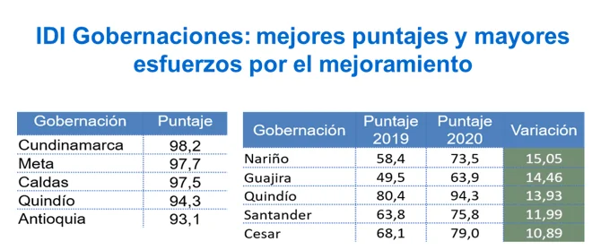
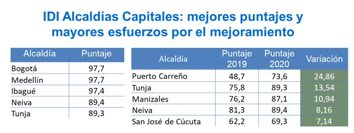

\[caption id="attachment\_15382" align="aligncenter" width="800"\] Director de Función Pública, **Nerio José Alvis Barranco con el gobernador de Cundinamarca, Nicolás García Bustos, puntaje: 98,2  de 100 posibles.**\[/caption\]

¿Por qué es importante analizar los resultados del **Índice de Desempeño Institucional—IDI a la luz de la gestión pública**? Se trata de buscar una mejora territorial. **Los indicadores son síntomas de la enfermedad pero también de la salud en la gestión pública**. No podemos saber si estamos bien o mal si no examinamos el cuerpo administrativo. Más allá de llenar unos formularios, lo que debemos ver **es si los resultados se están dando**. Si las obras se ejecutan o no.

Consciente de esa situación, **la Fundación Vox Populi, en asocio con el portal VoxPopuli.Digital,** viene realizando un **informe pedagógico analítico—crítico** de los resultados divulgados por el Departamento Administrativo de la Función Pública. **No se trata de hacer propaganda positiva o negativa**. Por el contrario, se busca estudiar esos resultados objetivamente para que los mandatarios regionales y locales le cambien el rumbo a su gestión, si ésta es mediocre o pobre.

## Mejora territorial

La medición no es para crear el ranking. El IDI es una información sensible para adoptar las medidas pertinentes y construir una mejora territorial permanente en la gestión pública.

En ese sentido, estamos sintonizados con **María del Pilar García**, directora de Gestión y Desempeño Institucional de la Función Pública.

> _«Las entidades de los departamentos y municipios que obtuvieron los menores puntajes tendrán en Función Pública un aliado para ayudarles a identificar las oportunidades de mejora para avanzar en el Índice de Desempeño Institucional. **Estamos desde ya dispuestos a ayudarles»**. ([Función Pública](/articulos/noticias/-/asset_publisher/mQXU1au9B4LL/content/entidades-territoriales-mejoran-desempe%C3%B1o-institucional-en-2020-y-llegan-a-60-5-puntos))._

Los medios de comunicación solemos tomar los datos oficiales y reproducirlos sin mediar un análisis de los mismos. La semana pasada la Función Pública divulgó los resultados del IDI 2020. Los medios se limitaron a reseñar el resultado como si fuera una encuesta o datos estadísticos fríos. En este sentido, lo que pretendemos es interpretar el dato concreto y ponerlo en contexto con dos años anteriores (2018 y 2019) y el resultado referente del mismo año. Por ejemplo, en la categoría de las gobernaciones dentro de los entes territoriales, establecemos la que ha tenido el mayor puntaje que más cercano o lejano a 100. 

## Los entes con mejores y mayores esfuerzos

*La mayor variación en la mejora territorial la tuvo Nariño con 15,05 puntos. El mejor puntaje es el de Cundinamarca.*

Si observamos los resultados generales, nos encontramos con aparentemente sorpresas. El departamento del Meta con su gobernador **Juan Guillermo Zuluaga** logró ubicarse en el segundo puesto con **97,7,** superando al departamento de Antioquia. El salto cuantitativo que dio la gobernación de Nariño de **15,05** para lograr **73,5** y ubicarse en el puesto 

*El IDI incluye también a 1.101 municipios de Colombia. El municipio con mejor indicador de la Costa es San Juan del Cesar, La Guajira.*

De acuerdo con la Función Pública, el consolidado de los resultados del IDI vigencia 2020 de las 32 gobernaciones del país y de los 1.101 municipios del territorio nacional fue producto del diligenciamiento del **Formulario Único de Reporte a la Gestión (Furag)**. Esta es una herramienta que hace parte del **Modelo Integrado de Planeación y Gestión (MIPG).**

No podemos hacer el análisis de todos los entes territoriales. Solo queremos presentar un modelo de análisis de los datos IDI para que los mandatarios tomen las decisiones acertadas y mejoren su desempeño. Sin duda, este análisis objetivo solo buscar servirle a los gobernantes para que estos le sirvan, a su vez, a los usuarios y a la ciudadanía.

#### Te puede interesar:

### [En gestión pública Bolívar se recuperó, pero sigue abajo](/articulos/bolivar-se-recupero-pero-sigue-abajo-en-la-gestion-publica/)

### [Procuraduría investiga a Múnera, alcalde (e), por dejar sin comida a las reclusas](/articulos/procuraduria-investiga-a-munera-alcalde-e-por-dejar-sin-comida-a-las-reclusas/)