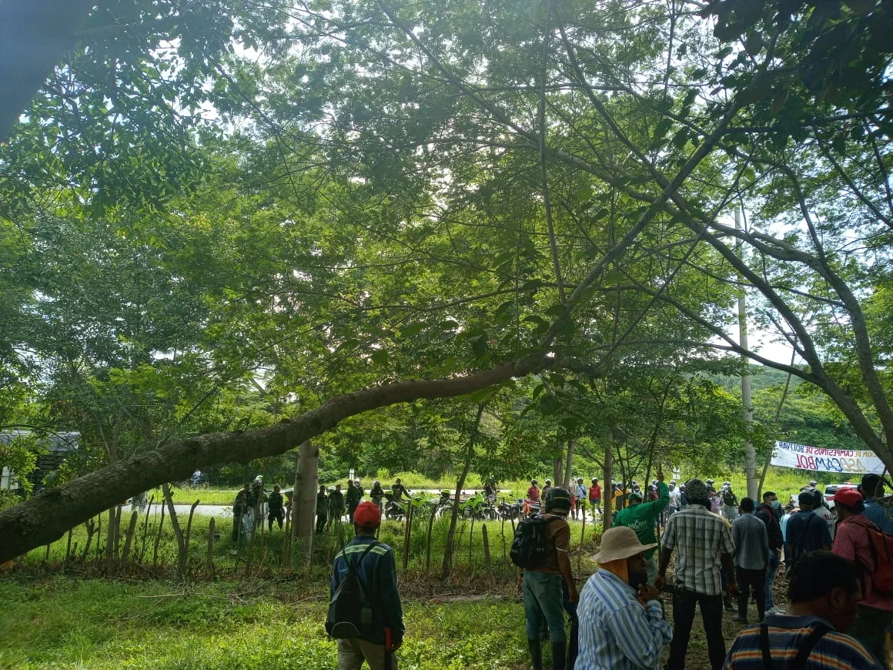
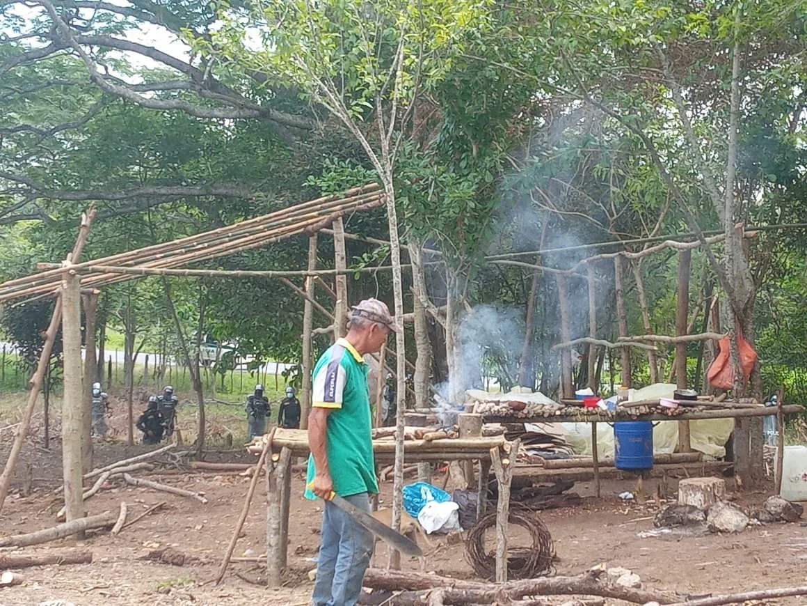
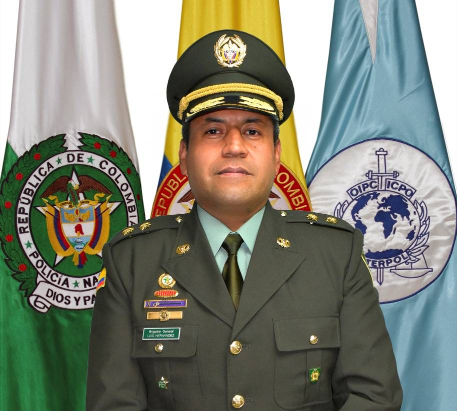

*Un desalojo irregular.Desde las 5 de la mañana del 27 de julio de 2021, el ESMAD se presentó en los predios de la finca La Europa. Uno de los campesinos tomó esta fotografía.En el fondo se ve un piquete de policía motorizada. Cortesía*

Curioso, por decir lo menos, la conducta de la Policía MECAR en un desalojo irregular de familias campesinas de la finca La Europa (corregimiento de Pasacaballos-Cartagena de Indias) ejecutado el pasado martes 27 de julio a las 5 de la mañana. ¿Por qué j**urídicamente fue un desalojo irregular?** Primero llegó un sujeto del interior del país con la policía a ejecutar la acción policiva el 17 de julio. Pero se dieron cuenta de que habían pasado más de **48 horas** desde que se produjo la ocupación del predio. 

Es decir, que no podían **ampararse en una acción preventiva**, como dice la ley. La sorpresa es que regresaron el martes siguiente y, sin mediar ninguna orden judicial, ejecutaron el desalojo. Desconocieron que la mayoría de los campesinos tienen más de 4 meses en la ocupación, puestos que son nativos con posesión ancestral.

Lo anterior lo prueba la existencia de cultivos de pancoger y de otras especies que requieren un tiempo superior de 4 meses. Además, la mayoría de campesinos tienen pruebas fehacientes de su posesión superior a 4 meses. Es decir, son territorios negros que siempre han ocupado. Ellos tienen la posesión por **_secula seculorum_**. Allí nacieron sus tatarabuelos, sus bisabuelos, sus abuelos y sus padres. Ellos se bañaron en los mismos jagüeyes, en las ciénagas  y en el mismo **Canal del Dique**. Pescaron, casaron, criaron su ganadería en armonía con la naturaleza hasta cuando llegaron personas del interior con acento paisa y armados que perturbaron su tranquilidad y su paz.

La Europa hace parte del territorio ancestral que familias negras vienen ocupando desde hace más de 100 años. Incluso, antes de entrar en vigencia la **ley 21 del 21 de mayo de 1851** cuando el presidente liberal **José Hilario López** decretó la **libertad** definitiva de los **esclavos** en **Colombia. Ellos eran quienes cultivaban las grandes haciendas de los blancos europeos.**

## El desalojo irregular

Si nos vamos al **artículo 81 de ley 1801 de 2016** (Código Nacional de policía), **la acción preventiva** es una habilitación a los funcionarios y agentes de la **Policía Nacional** para que, sin mediar autorización previa de autoridad administrativa o judicial, puedan impedir o expulsar las conductas de ocupación ilegal de terceros. Siempre y cuando esta ocupación ilegal esté dentro de las 48 horas siguientes.  

Concomitante con lo anterior,  la MECAR podía ejecutar cualquier actividad administrativa, incluso mediante el uso legítimo de la fuerza para restituirle el bien a los propietarios legítimos. **Pero esta acción de la autoridad debe darse sobre la base del respeto de la ley y de los derechos humanos**. La ley establece los límites de la **razonabilidad, la intimidad y la legalidad**, en garantía de la libertad ciudadana y del derecho patrimonial de los afectados. 

**Este predio de la Europa aparece en las escrituras con 304 hectáreas**, pero en realidad consta de más de 500 hectáreas, según manifiestan los campesinos que la vienen poseyendo. Manifestaron a este medio que son **poseedores ancestrales** de todas estás tierras. Vienen sufriendo un proceso de desalojo y de gentrificación, producto de la violencia y de la pobreza. Esta situación se ha convertido en un círculo vicioso, donde muchos se han visto en la necesidad de vender y se deben desplazar a otras tierras o hacinarse con sus familias. 

**El fenómeno de gentrificación** es una adaptación adecuada al español del término inglés **_gentrification._** Se refiere al proceso mediante el cual la población nativa pobre de un sector o barrio, generalmente céntrico y popular, es progresivamente desplazada por otra de mayor poder adquisitivo. En estas tierras de Barú, Pasacaballos y del norte de Cartagena se inició ese fenómeno con la aparición del narcotráfico en los años 80. Empezaron por comprar gran parte del Centro Histórico a precios exorbitantes. Luego hicieron con fincas en la zona insular y rural de Cartagena.

## Contexto

Este proceso de desalojo y gentrificación en el Canal del Dique se dio desde 1986, según manifiestan los campesinos. Inicialmente llegaron a los predios muchas personas armadas de Medellín. Decían ser dueñas de las tierras, intimidaron a los nativos y sembraron el terror en la zona. Se produjeron los primeros desplazamientos forzados. En aquella época, algunos nativos manifestaron que Europa y otros grandes predios eran propiedad de Pablo Escobar, quien los utilizaba para sus actividades del narcotráfico. 

Evidentemente no quiere decir que todo lo que viene de Medellín sea ilícito o tenga que ver con el narcotráfico. Pensar así sería algo injusto. Pero es curioso lo que sucedió. En 1986 la empresa antioqueña INVERSIONES LONDONO S. en C. hizo un englobe en la Notaría 4 de Medellín. Luego (1988), en notaría 2° de Envigado, transfirió a Comercializadora la Florida Ltda. Esta, a su vez, a **Inversiones y Desarrollo Barranco y Cure S.A**. Luego, en 2007, ésta realiza una división del predio. Hoy aparecen como supuestos propietarios de la finca la Europa.

Para constatar la hipótesis aquí planteada del despojo y del proceso de gentrificación, es necesario hacer un estudio de los documentos (escrituras, matriculas y tradición) por parte de peritos en la materia. Vox Populi Digital le solicitó a un equipo de especialistas y de expertos un análisis técnico de los documentos con el fin de ir informando sobre sus hallazgos. Es posible encontrar una caja de pandora en ese cartapazo de archivos.

## Un desalojo irregular y en secreto

*Un campesino adulto mayor mira como el humo sale de la hornilla donde una hora antes había preparado el café de la mañana. Pero el tinto se le amargó con la llegada de la policía nacional. En el fondo se ve el ESMAD vestido de robocot luego de haber "cumplido con la ley". Cortesía.*

Todo hace indicar que fue un desalojo irregular, pero también secreto. ¿Por qué? La Policía Nacional no le avisó a la Defensoría del Pueblo ni a la prensa. Tampoco conminaron a los campesinos a desalojar voluntariamente los predios y darle la oportunidad de oponerse legalmente. 

El comandante de la MECAR, **BG Luis Carlos Hernández Aldana**, no entregó ninguna información en el boletín dirigido a los medios de comunicación de la ciudad. Hubo silencio total antes, durante y después del desalojo. Como prueba de este hecho, en el boletín entregado a Vox Populi Digital del 27 de julio se refiere a la siguiente noticia: 

*B.G. Luis Carlos Hernández Aldana, comandante de la MECAR deberá responder por esta presunto desalojo irregular.*

> _“La Policía Metropolitana de Cartagena recupera equipo móvil a turista de nacionalidad española”_.
> 
> Boletín de la MECAR, 27 de julio de 2021.

En tanto que el día anterior del desalojo, es decir, el 26 de julio, el subcomandante de la MECAR, coronel **Jorge Carrillo Delgado**, se refirió como noticia importante del día la captura de dos individuos por hurto en el barrio Olaya Herrera.

¿Quiénes son los dueños de esas tierras? No podemos dar vuelta a la hoja sin establecer la posesión ancestral del territorio. **La justicia debe emprender un proceso de saneamiento jurídico haciendo el reconocimiento de la tesis de la posesión ancestral.** Así como los indígenas tuvieron los resguardos, debe haber algún tipo de protección para que fenómenos como la **gentrificación y el despojo se reviertan**. Son dos fenómenos que conducen a la misma situación: la pauperización del campesinado y de la economía campesina.

### [Defensoría del Pueblo coadyuva tutela de campesinos de Cachenche](/articulos/defensoria-del-pueblo-coadyuva-tutela-de-campesinos-de-cachenche/)