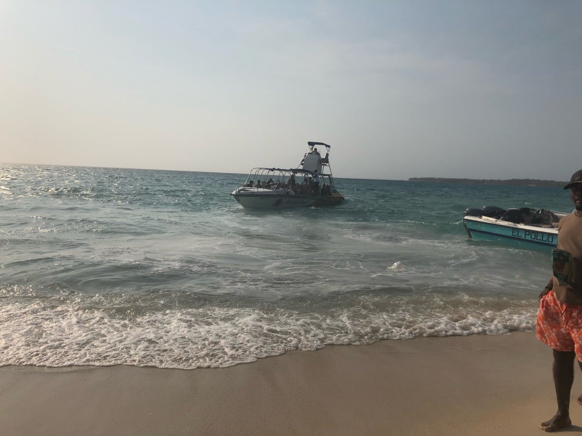
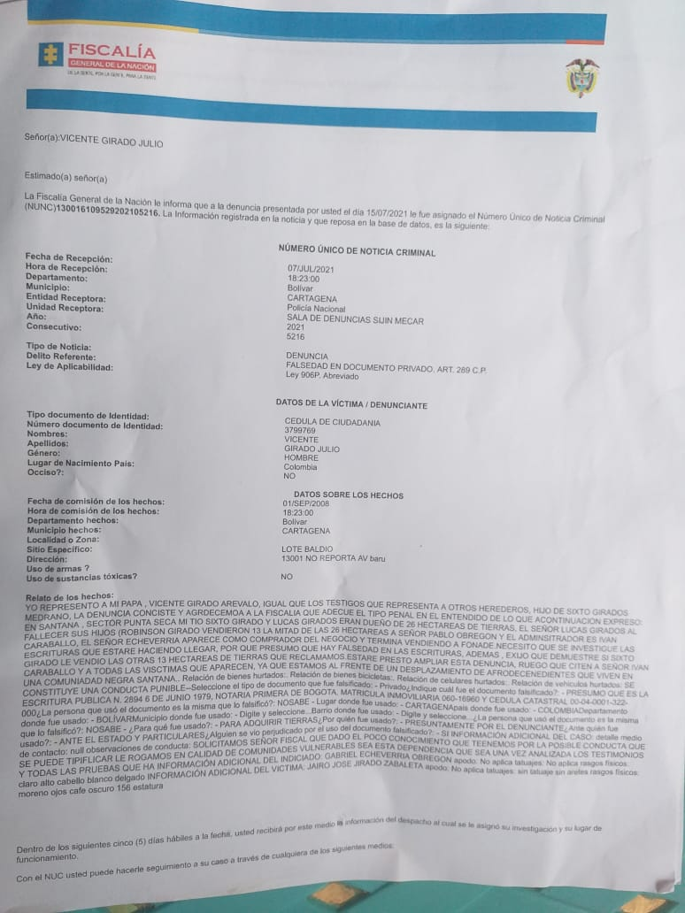

Sin duda, el conflicto por un trozo de tierra de Playa Blanca entre un industrial como Gabriel Echavarría y un nativo como Vicente Girado **refleja el proceso de gentrificación** que se se experimenta en el casco urbano histórico y la zona insular de Cartagena. Por estos hechos denuncian a Echavarría.

Hoy, un trozo de tierra en Playa Blanca cuesta un «ojo de la cara». Si bien eran predios rurales, se han revalorizados como si fueran urbanos. 

**Vicente Girado Julio**, nativo de SantaAna, heredero de predios baldíos dejado por su abuelo, se vio en la penosa decisión de denunciar penalmente al reconocido industrial antioqueño **Gabriel Echavarría**. ¿Por qué? Porque, según él, de los dos hermanos que heredaron las tierras de su abuelo, uno no vendió. El que no vendió se lo dejó en herencia a sus hijos. El que vendió, su comprador fue Echavarría, quien englobó la tierra comprada y la que no fue vendida. Estos predios se encuentran ubicados en Santa Ana, Barú, corregimiento de Cartagena.

## La gentrificación

Es así que ese hecho pareciera un conflicto más, pero en realidad refleja el proceso de gentrificación que se experimenta en Cartagena. La gentrificación se produce cuando los nativos venden sus predios y se ven en la imperiosa necesidad de desplazarse a otros sitios distintos a los de su habita. De tal manera que las tierras o propiedades que poseían toman un valor superior debido al cambio de uso de la propiedad.

*En Punta Iguana, Barú, se hizo la reunión entre Gabriel Echavarría y Vicente Girado Julio. Pero no hubo acuerdo.*

Como se informó, los hermanos Robinson y Vicente Girado tenían un predio de 23 hectáreas en Playa Blanca (Barú—Cartagena de Indias) conocido como «Punta Seca». Cada hermano heredó la mitad del área, es decir 11.5 hectáreas. Robinson le vendió su parte a Echavarría. Pero éste no solo tomó lo que le correspondía sino que también englobó como su propiedad la pertenencia del hermano que no vendió. **Esta es la versión de Vicente Girado entregada a Vox Populi**.                       

https://youtu.be/\_Celgk-jNQE

Esta es la reunión de Punta Iguana donde Echavarría solicita a Vicente que presente los documentos que le acrediten como heredero.

## Denuncian a Echavarría

Por esa razón, Vicente Girado el pasado 15 de julio de 2021 denunció por falsedad en documento a Gabriel Echavarría. Así se constata en la **noticia criminal No 130016109529202105216 de la Fiscalía**. Según el denunciante, los hechos ocurrieron en 2008.

*Denuncian a Echavarría. Esta es la noticia criminal de la denuncia presentada por Vicente Girado contra Gabriel Echavarría.*

Esta denuncia penal busca demostrar que hubo falsedad por parte de Echavarría al englobar la tierra que le vendieron y adicionalmente tomar la tierra que le pertenecía por heredad. 

### **Te puede interesar:**

[En Playa Blanca nativos se toman parqueadero](/articulos/en-playa-blanca-nativos-se-toman-parqueadero/)