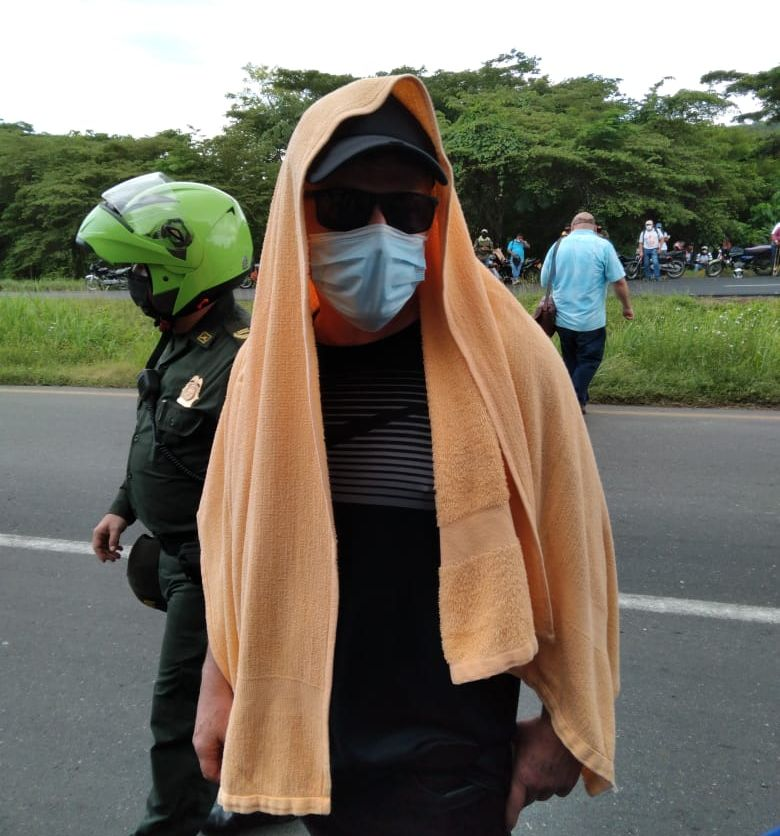

*El 27 de julio desalojaron a los campesinos de la Europa. El 14 de julio el comandante de la Policía de Pasacaballos reconoció en terreno que se habían pasado las 48 horas que tenían para desalojarlos usando la acción preventiva. Que ya no era de su competencia*

El caso de la finca La Europa evidencia que la Policía está al servicio de despojadores en Pasacaballos, corregimiento de Cartagena de Indias. También nos propone dos problemas y, al mismo tiempo, su solución. Uno de carácter legal y otro social. **El desalojo usando una fuerza desproporcional se produjo sin competencia de la policía**. Esta competencia la perdió cuando la acción se **produjo 17 días después.** La ley habla de que la acción preventiva de la policía es de 48 horas.  

El otro problema indica que el predio **está ubicado en territorio ancestral,** por el cual las autoridades policivas deben ser cuidadosas de no violar la ley para restituir la propiedad a los que presentan sus títulos. Todo porque hubo un proceso de despojo y de gentrificación en un territorio de tradición cultural afro.

## Despojadores en Pasacaballos

*Este es el presunto representante del propietario de La Europa que financió el desalojo. La policía al servicio de despojadores en Pasacaballos.*

En el corregimiento de Pasacaballos el narcotráfico apareció en la década de los 80s. Hicieron presencia personas armadas como nuevos dueños de tierras ancestrales, de acuerdo con testimonios de las comunidades.

Constitucionalmente la recuperación de tierras ancestrales despojadas por el narcotráfico, la guerrilla y el paramilitarismo debería ser una acción del Estado. Y no meramente una acción jurídica. También es imprescindible que sea una acción administrativa.  **Así se disminuiría progresivamente la concentración inequitativa de la tierra y se aplicaría justicia social**. También favorecería a las víctimas del despojo, que son los sectores campesinos, indígenas y afros.

De igual manera, las tierras ancestrales pueden retornar a sus originales beneficiarios siempre y cuando garanticen la seguridad alimentaria de la población. La constitución de los resguardos permitió la supervivencia de los territorios ancestrales de los indígenas acechados por el narcotráfico, la guerrilla y el paramilitarismo. 

Dado a este comportamiento arbitrario de la Policía Nacional, como el caso de La Europa, se castiga ilegalmente a los campesinos y afros despojados. De igual manera, favorece la concentración de la tierra y evita el resarcimiento de los daños provocados por ese despojo.

## La recuperación de La Europa

Sin lugar a dudas, la posesión de La Europa por parte de las comunidades negras agrupadas en consejos comunitarios de Pasacaballos y de otras zonas del Bajo del Tigre, es una consecuencia lógica del proceso de recuperación de sus tierras ancestrales.  Está protegido por la Constitución Nacional y por la ley 160 de 1994.         

> _Es deber del Estado promover el acceso progresivo a la propiedad de la tierra de los trabajadores agrarios, en forma individual o asociativa, y a los servicios de educación, salud, vivienda, seguridad social, recreación, crédito, comunicaciones, comercialización de los productos, asistencia técnica y empresarial, con el fin de mejorar el ingreso y calidad de vida de los campesinos_.
> 
> **Artículo 64**  Constitución Nacional.

Si atendemos el artículo 64 de la Constitucional —como **lo dice un estudio de la Universidad de Santo Tomás**— el ordenamiento jurídico actual privilegia el derecho de propiedad campesina. Pero, debido a un sistema administrativo corrupto, en la práctica favorece al despojo y a la propiedad latifundista. 

Ese estudio señala que con la **Ley 160 de 1994** el legislador declaró el interés social de eliminar y prevenir la **inequitativa concentración** de la propiedad rústica o su fraccionamiento antieconómico y dotar de tierras a los campesinos. Para ello, previó la negociación directa y, eventualmente, la expropiación y dejó en manos del gobierno nacional el desarrollo de programas para dotar de tierras a los campesinos. 

## La policía al servicio del despojador

https://youtu.be/wZPcv\_wIjxE

Video del miércoles 14 de julio de 2021. Aquí el comandante de Policía de Pasacaballos reconoce que la supuesta ocupación se hizo el 10 de julio, por lo cual no era competencia de ellos. Pero posteriormente hicieron el desalojo el 27 de julio. Transcurrieron 17 días. O sea, es la prueba reina de que el desalojo fue ilegal, abusivo y violador de los derechos fundamentales de los que poseen a la Europa.

La policía nacional debe estar al servicio de la defensa de la constitución y de la ley. Pero también en la defensa de los derechos humanos. En ese sentido se entiende el **Código Nacional de Policía** respecto a la **acción preventiva** que es potestad de la institución. De acuerdo con el artículo 81 de dicho código, la acción preventiva solo es válida siempre y cuando no sobrepase las 48 horas de la supuesta ocupación.

En este video se ve y se escucha al comandante de la Policía de Pasacaballos explicando **que no podían desarrollar esa acción debido a que habían pasado las 48 horas de las que habla la ley**. ¿Por qué desalojaron a los campesinos de La Europa después de 17 días? ¿Por qué usaron la fuerza desmedida del ESMAD? ¿Qué responsabilidad tiene el comandante de la Policía MECAR, B.G. **Luis Carlos Hernández Aldana**? ¿Cuál es el papel de la Defensoría del Pueblo para defender los derechos humanos violentados? ¿Al servicio de quien está la Personera del Distrito de Cartagena, **Carmen de Caro**? 

**Erick Ujueta Benavides**, vicipresidente de la CGT Bolívar, denunció la arbitrariedad del procedimiento policivo de 200 agentes del ESMAD. Dijo que estuvo al servicio de la empresa que aparece como titular de la finca La Europa. Manifestó que el operativo no contó con la presencia dela Procuraduría ni la Defensoría del Pueblo. Denunició que las tierras fueron usadas en la década de los 90 como zonas operativas del narcotráfico.

El desalojo de La Europa es un ejemplo diciente de la conducta prevaricadora de la policía al servicio de los despojadores. A su vez, demuestra que los administradores de la cosa pública, no aplican las medidas efectivas suficientes para cambiar el panorama de la concentración de la tierra.  Este fenómeno, lejos de disminuir, se ha acrecentado en las últimas 4 décadas gracias a la conducta irregular de instituciones como la policía y la propia justicia ordinaria colombiana.

## Próxima entrega: Consejos comunitarios contra el despojo

**La concentración inequitativa de la tierra aumentó en las últimas décadas por el despojo jurídico**. Este despojo se define como la titulación ilegal de uno o varios terrenos en beneficio de un particular mediante documentos públicos. Estos les atribuyen al despojador un derecho de propiedad del que en realidad no es titular.

Iris Callejas, presidente del Consejo Comunitario Bajo del Tigre y Concordia, Chorro y Legua y Marly Escamillas hablan en **VoxPopuli Digital** sobre este desalojo y el despojo de sus comunidades afros.

[**Te puede Interesar:** _**Desalojo irregular de campesinos en La Europa**_](/articulos/desalojo-irregular-de-campesinos-en-la-europa/)