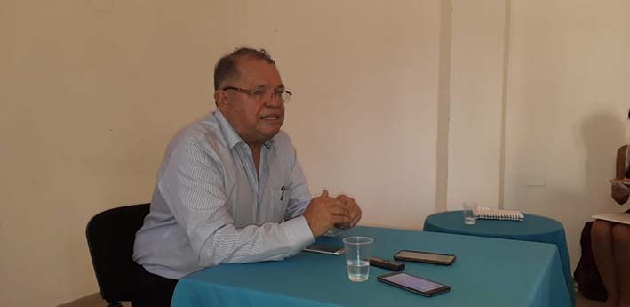
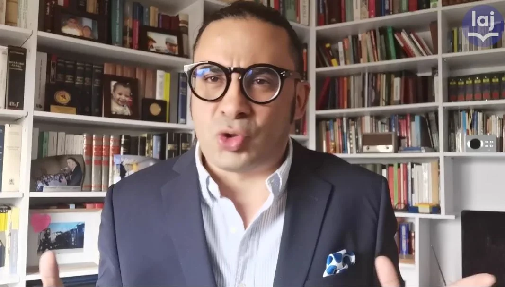

*Ángel Carrillo, abogado de los Hernández, acusados de invasores de los terrenos de Ciudad Bicentenario, le ganó a Francisco Bernate en este primer asalto. Dijo que el juez de conocimiento que conoce la denuncia de la Fundación Santo Domingo, excluyó a sus abogados del proceso porque no demostraron su calidad de víctimas.*

El macro proyecto denominado **Ciudad del Bicentenario**, al suroccidente de Cartagena, donde se construirán 15 mil unidades familiares, quedó en un limbo jurídico.  El Juez Tercero Penal del Circuito de Cartagena, **Luis Fernando Machado López,** **se abstuvo de reconocer como víctimas al Distrito de Cartagena y a la Fundación Santo Domingo** dentro del proceso penal que instauraron contra la familia Hernández. En la audiencia también quedó demostrado que la Fundación **no registró a tiempo las resoluciones que le daban sustento al proyecto de vivienda**, tal como lo exige la ley.

De esta manera, se afectarán más **4 mil familias** que actualmente viven en ese complejo habitacional. Y corre peligro de seguirse construyendo para completar más de 15 mil soluciones de vivienda de interés social que beneficiarían a más de 60 mil personas.  **El Estado no puede invertir en terrenos que no haya claridad jurídica.**

## Bernate sacado de la audiencia

*Francisco Bernate fue sacado del proceso donde la Fundación Santo Domingo denunció a los afros Hernández por invasión de tierra. Lo curioso, Bernate no demostró la calidad de víctima de sus representados en el caso Ciudad del Bicentenario. Cortesía Ámbito Jurídico.*

El juez de conocimiento al no reconocer a la Fundación Mario Santo Domingo  y al Distrito de Cartagena en este proceso penal donde denunciaron a los Hernández por invasión de tierras, **los dejó por fuera**. Por tanto, no podrán participar en los demás eventos que se realicen dentro de este litigio por las tierras de la finca Catalina donde se construye **Ciudad del Bicentenario**. Este predio con matricula No. **060-161513,** está siendo disputado entre la Fundación Santo Domingo y la familia Hernández.

En ese sentido, **Francisco Bernate, _Presidente_ del Colegio de _Abogados_ Penalistas de Colombia y Alfredo Sampayo**, quienes actúan como apoderados de la fundación Santo Domingo y el Distrito de Cartagena de Indias, fueron retirados del estrado. **Este hecho se constituye en un golpe certero a estos profesionales del derecho que baja su buena fama.** En marzo de este año un juez de garantía no escuchó los argumentos de los acusados.

En esa ocasión, blandiendo su ego, Bernate dijo una frase lapidaria en los principales medios de comunicación del país (El Tiempo, El Espectador, Caracol, RCN): 

> "_De forma categórica, la jueza aseguró que los argumentos usados por los invasores de los predios y su abogado (Angel Carrillo) no son claros, que sus pretensiones no tienen fundamento y que las supuestas falsedades en las que, según ellos, habría incurrido la Fundación, no existen"._
> 
> Francisco Bernate.

https://twitter.com/PilotodeCometas/status/1366485172586217474?s=20

Todo lo que dijo el afamado abogado Francisco Bernate en este video, quedó desvirtuado el pasado 6 de agosto por el juez de conocimiento **Luis Fernando Machado López,** Bernate y Alfredo Sampayo quedaron por fuera del proceso

Lo que expresó el prestante abogado **Francisco Bernate** a El Tiempo, El Espectador y a los grandes medios de comunicación en marzo de 2021, no solo no tiene base verdadera, sino que es una clara manipulación mediática. Los papelitos hablan, el juez Tercero Penal del Circuito de Cartagena, **Luis Fernando Machado López,** dijo todo lo contrario en la audiencia del 6 de agosto. Lo excluyó del proceso, porque careció de sustancia jurídica su acusación y no demostró la calidad de víctima de sus poderdantes.

## Ciudad del Bicentenario en limbo jurídico

/articulos/luciotorres/status/1425202446956122128?s=20

CIUDAD DEL BICENTENARIO, construido sobre terrenos con títulos dudosos demostrados por el abogado Ángel Carrillo.

Para que naciera uno de los proyectos de vivienda más grande del país, la fundación Santo Domingo hizo que el gobierno nacional, a través del Ministerio de Vivienda, declarara el área que hoy disputa con los Hernández, como de «utilidad pública». 

**Ciudad del Bicentenario** está **u**bicada en la ciudad de Cartagena. Es el **Macroproyecto de Vivienda de Interés Social más grande de Colombia.** Mediante la **Resolución 2362 de 2008**, modificada con la Resolución **0361 de 2012** fue adoptado por el Ministerio de Ambiente, Vivienda y Desarrollo Territorial, (hoy Ministerio de Vivienda, Ciudad y Territorio. En ese sentido, señalaron que los predios eran favorables para la ejecución.

> Que los predios determinados en la presente resolución evidencian condiciones favorables para la ejecución del Macroproyecto, de acuerdo con los objetivos de impacto territorial planteados en el documento técnico de soporte;
> 
> **Resolución 2362 de 2008**

Sin embargo, el macroproyecto más grande de Colombia se está construyendo sobre predios que no tienen la certeza de su titularidad. Esto lo indicó la determinación del juez de conocimiento en la audiencia del viernes pasado donde fueron retirados los abogados de la Fundación Santo Domingo y del Distrito, Francisco Bernate y Alfredo Sampayo.

## Falsa tradición

Es de señalar que los representantes de los denunciantes no fueron capaces de presentar el registro ante la Oficina de Registro Público con el fin de establecer la tradición de la propiedad. **No aparece en la inscripción de la escritura No 580,** cuya matricula inmobiliaria es la **Nro 060-161513** de acuerdo a la anotación Nro. 006 y 007 del 1 de abril de 2011, cuya radicación es la **No 201 1-060-6-6396** (documento no disponible).  (Dele clic). En este sentido, cuando existe una obra pública y tiene su afectación deberá notificarse —máximo 6 años después— personalmente al propietario e inscribirse en el respectivo folio de matrícula inmobiliaria, so pena de declararse su inexistencia.

> **Artículo  37º.-** _Toda afectación por causa de una obra pública tendrá una duración de tres (3) años renovables, hasta **una máximo de seis (6) y deberá notificarse personalmente al propietario e inscribirse en el respectivo folio de matrícula inmobiliaria, so pena de inexistencia.** La afectación quedará sin efecto, de pleno derecho, si el inmueble no fuere adquirido por la entidad pública que haya impuesto la afectación o en cuyo favor fue impuesta, durante su vigencia._
> 
> Ley 9 de 1989.

De hecho, frente a esa situación los predios de Ciudad Bicentenario quedarán en un limbo jurídico, ya que la Fundación Santo Domingo no los inscribió. Así lo exige el artículo 37 de la ley 9 de 1989. **Ahora pasará a una falsa tradición**. Esto quiere decir que ninguna entidad oficial, esto es la nación o el Distrito, podrán negociar con la Fundación Santo Domingo sobre el uso de esos predios. Esto es, ¿los $80 mil millones invertidos por el Estado y el Distrito se perderán? Las familias beneficiadas que viven en el complejo habitacional, no podrán gozar de la titularidad de sus casas. Lo grave, el proyecto se paralizaría.

## Datos de Ciudad del Bicentenario

Hasta ahora **Ciudad del Bicentenario** se ha venido construyendo como emporio de la Fundación Santo Domingo. Pero la disputa con la familia afro Hernández pone en peligro ese gran proyecto. Los Santo Domingo asumieron esos predios como parte del despojo que se ha realizado contra familias ancestrales de la región.

*   388 Hectáreas
*   55.000 Viviendas Potenciales
*   4.170 Viviendas Construidas (2.826 casas y 1.344 Aptos)
*   7 equipamientos construidos y 8 en construcción o planeación
*   2 Megacolegios (1.440 Estudiantes C/U)
*   1 Centro de salud (CAP)
*   1 Biblioteca Pública
*   1 Punto Vive Digital
*   2 Centros de Desarrollo Infantil

## ¿Y el colegio de Shakira?

La génesis de la falsedad —como dijo el abogado Ángel Carrillo, apoderado de los acusados de invasores— se inició con la falsificación de la tradición de la escritura madre **No 060-54391.** Este hecho demuestra que, incluso, el lote que la Fundación Santo Domingo donó a la Fundación Pies Descalzos de Shakira, es espurio. Es decir, no le pertenece a los Santo Domingo sino a los Hernández. El lote de Sharika se identifica con folio 060-273750 que nace del folio 060-161513. (**PRÓXIMA ENTREGA)**.

TE PUEDE INTERESAR:

## [Shakira inducida a un error](/articulos/shakira-inducida-a-un-error-de-un-horror-de-los-santo-domingo-ii/)