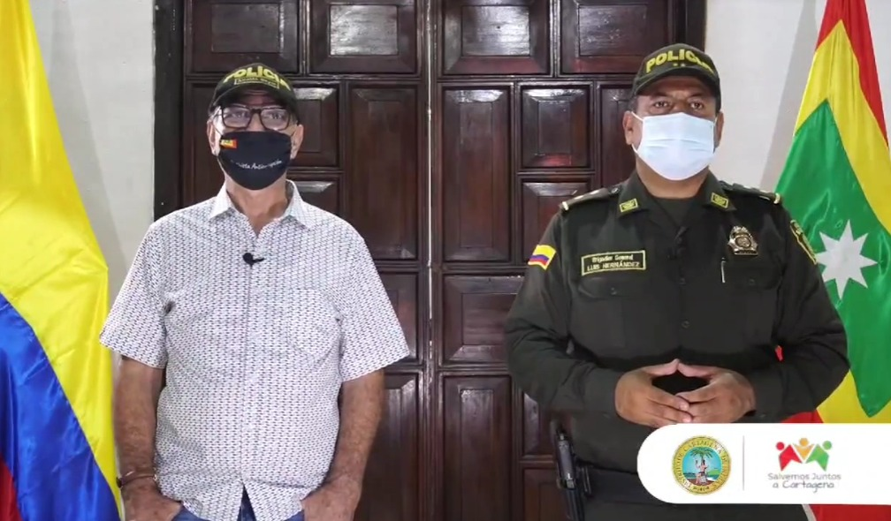

*Descalabro de su imagen artificial. La revocatoria le respira en el oído.*

La ciudad necesita seriedad. Queremos a un gobernante no a un payaso. Una buena persona (estar en la conciencia) puede hacer el bien como gobernante. Una mala persona jamás será un buen gobernante muy a pesar de ser un experto administrador. ¿Por qué? Es un mal árbol. _«**Todo árbol que no da buen fruto, es cortado y echado en el fuego. Así que, por sus frutos los conoceréis**»._ (Mateo 7:15).

**De esa forma, se resume la razón de ser de la revocatoria**. Debemos salir de un mal gobernante que, a su vez, es una mala persona. De ahí no sale sino frutos malos. Sin embargo, la clase política tradicional que causó el estado de cosas en la ciudad y parió al alcalde más inepto de todos los tiempos, no cree en la revocatoria del mandato. **Pero es el único mecanismo de participación que pone a prueba una verdadera democracia participativa.** Los tiranos y totalitarios la detestan, excepto que ellos dominen a las masas que ejercen ese derecho inalienable. Lo demás es pura demagogia.

## La Revocatoria es la vacuna

De tal manera que al no ser un árbol bueno, **utilizará todos los recursos para disfrazar sus actuaciones como si fueran buenos frutos**. Y el alcalde no tiene escrúpulos para esconder la verdad e incumplir la palabra. Detrás de cada show, existe una mentira disfrazada de verdad. A Dau poco se le puede creer. **Una de sus evidentes enfermedades es la mitomanía**. Probablemente es un trastorno de la personalidad no diagnosticado. ¿Quieres evidencia? Más de 20 procesos judiciales lo han obligado a rectificar, retractarse y reparar el daño causado por su **lengua viperina**. Es una lengua de víbora, prueba irrefutable de su mitomanía.

No obstante, **la revocatoria le respira en el oído**. Existe un malestar generalizado que se refleja en las encuestas. Cuando tenía el 86% de preferencias, usaba ese favoritismo para repudiar, humillar y aplastar hasta sus propios colaboradores. Recordemos ejemplos evidentes como el de la misma **Cinthya Pérez Amador**, su fallida primera dama. **Ejerce una tiranía**. Lo grave, tiene un séquitos de extremas que lo secundan. La extrema derecha y la extrema izquierda lo sostienen. La primera tiene el poder real. La segunda se entrega a las migajas del poder. 

Por esa razón, de ahora en adelante lo veras haciendo populismo, mucho populismo barato. Por primera vez fue al Koreano a hacer morisqueta, intentando bailar. Lo veremos visitando medios de comunicación para presentar sus frutos malos. **Ofreciendo el oro y el moro** a los jóvenes, a los sindicalistas, líderes comunales, a concejales y a cuanto políticos que se le acerque. El problema es que le cumpla. La administración rifará en mil pedazos el presupuesto para mantenerse en el poder político.

## La ciudad necesita seriedad

https://youtu.be/S6r\_5Mtv5\_Q

Perder 36% en tres meses es una caída libre. El proceso de revocatoria puso al desnudo el engaño de Dau. Descalabro de su imagen artificial.

Los demagogos obtienen aceptación inicial en la opinión pública con una propuesta discursiva manida, reiterativa y poco coherente. Luego de causar el daño social y material, se desmoronan. Los gobernantes bufones al principio son pintorescos. Nos reímos y mamamos gallo. Luego eso nos fastidia. Esto es lo que sucede con el alcalde de Cartagena. 

Ahora bien, ¿qué es bueno para ti? Si un alcalde hace obras de infraestructura y su pueblo está muerto de hambre, ¿es un buen gobernante? Pero si ese gobernante no hace obras de ninguna clase, no cumple con sus promesas electorales y, además, es un payaso, ¿es un buen gobernante? No basta con crear una narrativa discursiva para ganar simpatizantes, lo fundamental es que el dirigente lo demuestre en el ejercicio de su praxis. **Y la praxis de un gobernante son sus obras**. No su palabrerío.

Los cartageneros **le pagamos a William Dau $17 millones mensuales**, sueldo que él se incrementó desproporcionadamente este año. Es lo máximo que un alcalde de primera categoría puede ganar. Ese dinero, que es producto de nuestro trabajo, ¿es para hacernos reír? Si así fuere, sería mejor contratar a esos bufones de redes sociales que, estoy seguro, lo haría mejor.

Un ejemplo evidente de lo que se narra, es el caso del inicio del reparcheo de la avenida Santander en Marbella de Cartagena. **«Por fin arrancamos»**, dijo. ¿Arrancamos? Nunca han arrancado.  ¿Un reparcheo de $7 mil millones que no llega a la categoría de obra de infraestructura no puede ser presentado como la magna obra . ¿Dónde están las obras? ¿Las estaba inaugurando? ¡No! En un año y medio debió inaugurar, por lo menos, las que inició el gobernante anterior. Tampoco. Por tanto, es un acto de manipulación para las redes sociales donde hay gentes que esperan que algunos vulgares charlatanes o _influencers,_ los influyan. Es un gobernante que manipula mentes blandas. Mentes de borregos.

## Alienados por el poder

*Esta fue la primera caída que sufrió en su imagen. General Juan Carlos Hernández, la ciudad necesita seriedad.*

Mi abuela **Ana Luisa** me decía que la persona que **«nunca ha tenido gallina, la mierda le parece huevo»**. Y eso es lo que Dau habla por los medios de comunicación locales y redes sociales. ¿«Arrancamos»? Quiere mostrarse ante la opinión pública para hacer un populismo barato. Populismo charlatán. Populismo sin obras, sin frutos buenos. Populismo oportunista. Se aprovecha de cualquier cosa para crear falacias que ya nadie le cree, excepto aquellas personas que viven alienadas por el poder. O que viven del erario distrital. O porque están esperanzados que el alcalde le lance un huesito.

En consecuencia, nos preguntamos: **¿El alcalde William Dau Chamat se recuperará del descalabro de su imagen positiva que cayó más de 36% en menos de dos meses?** ¿Las últimas payasadas en redes sociales detendrá su estrepitosa caída? Si se lanzó de culo en un tobogán ¿sería fácil presagiar su final? Sin lugar a equivocaciones, podemos decir que su recuperación será un imposible político. **El árbol malo siempre dará frutos malos, haga lo que haga.**

## ¿Por qué la ciudad necesita seriedad?

https://youtu.be/CInJtJxp-Cc

Este es un análisis de la caída.

En ese sentido, podemos analizar las últimas encuestas sobre la imagen positiva del alcalde de Cartagena. La conclusión es que la gente se está dando cuenta de que estamos frente a un gobernante bufón y un fraude a la opinión pública. Esto cansa a la comunidad. La ciudad necesita seriedad.

El peor castigo para estos bufones gobernantes es que la misma ciudadanía los saquen a sombrerazos del palacio de la Aduana en un **proceso de revocatoria**. No hay otra salida más edificante que la revocatoria. Lo otro es que la clase política tradicional espera que un juez o la Procuradora lo tumbe para que el presidente **Iván Duque** les ponga un alcalde de bolsillo. Así sucedió cuando la Procuraduría y la Fiscalía tumbaron a **Campo Elías Terán y Manolo Duque**. No bastó que fueran buenos árboles, porque para ser gobernantes debemos estar preparados. Su caídas fueron aprovechadas por los buitres que se alimentaron de sus cadáveres políticos. La situación administrativa se agravó con los alcaldes encargados que llegaron para saquear a la ciudad y no para salvarla. La revocatoria, como el principal mecanismo de participación democrática, **es la vacuna para este virus que corroe las venas abiertas de la ciudad**.

Ese estado de cosas que se vive en la urbe lo evitamos con la revocatoria. Se está luchando, no solo por tumbar al alcalde, sino por acordar una alianza ciudadana, un nuevo pacto social, que sea la **Ruta Programática** para celebrar los 500 años de la ciudad, como la más próspera e incluyente de Colombia. En 15 años lo podremos conseguir. **Pero debemos comenzar ahora**. El nuevo alcalde o alcaldesa lo pondremos nosotros, la ciudadanía, y no la clase política tradicional. Salir de un gobernante—fraude amerita un ejercicio inteligente de la ciudadanía. Ésta debe salir de la comodidad de ser gobernada para ser gobernante de su propio destino. Destino que depende de ti. ¿Me hago entender o te lo explico con plastilina?

**Te puede interesar: Cuando uno no insulta sino que dice la verdad, estos son los fallos:**

## [Tribunal Administrativo niega censurar a periodista por publicaciones contra Dau](/articulos/tribunal-administrativo-niega-censurar-a-periodista-por-publicaciones-contra-dau/)