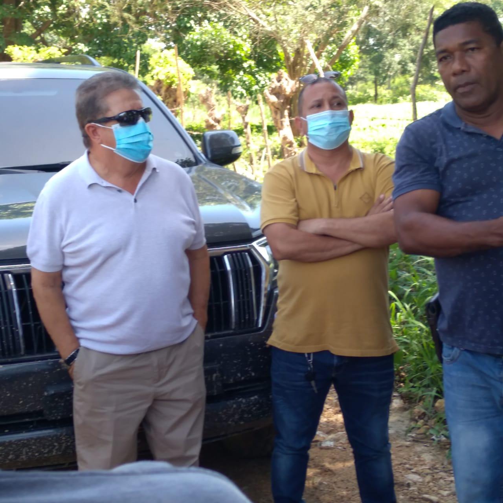
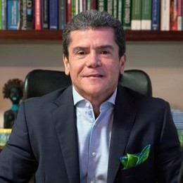

*Aquí está Jhon Villamizar. Se le nota interesado en Cachenche.*

¿Qué quiere hacer la SAE en Cachenche? Es la pregunta que cualquier ciudadano con claridad se hace. La SAE tiene como finalidad recuperar esos bienes del narcotráfico y la corrupción para proyectos de interés social. Entonces, ¿por qué no plantear un proyecto agroindustrial? Un proyecto social donde participen la Gobernación de Bolívar, la alcaldía de Turbana, el ministerio de Agricultura, la Agencia Nacional de Tierra-ANT y los campesinos que ocupan el predio y hayan demostrado su condición como tal. 

En ese sentido, la organización de campesinos le propuso a la gobernación de Bolívar que lo tome en arriendo por un año mientras dure el proceso de clarificación del predio. También el censo de los ocupantes y se diseñe un proyecto agroindustrial que beneficie a esas familias que se encuentran en esa situación.

Y esa propuesta de los campesinos es concomitante a lo señalado por el inciso 2 del artículo 91 de la ley 1708 de 2014 (Ley extinción de dominio):

> "Se exceptúan de estos porcentajes los predios rurales, los cuales una vez cumplidas las destinaciones previstas en el numeral 1.1.1 del acuerdo final para la terminación del conflicto y la construcción de una paz estable y duradera, y agotado lo allí ordenado, deberán ser objeto de enajenación temprana de conformidad con el artículo 93 de esta ley, recursos que en todo caso serán entregados en su totalidad al Gobierno nacional, **para ser destinados a los programas de generación de acceso a tierra administrados por el Gobierno naciona**l". 
> 
> Ley 1708 de 2014

## La SAE en Cachenche

https://youtu.be/ouY44n1pKGc

La SAE en Cachenche ¿cual es el afán?

Pero  **Juan Pablo Valbuena, director de la regional Caribe**, nacido en esta ciudad, está empeñado en sacar a los ocupantes de Cachenche. Por esa razón la decisión del **juez Primero Penal del Circuito de Turbaco al fallar en segunda instancia una acción de tutela** determinó que la ANT hiciera un censo de las 200 familias que dicen ocupar el predio. De acuerdo al fallo no pueden desalojar a los ocupantes si dicho censo no se ha hecho. Apenas han censado un poco más de 10 familias. 

Si no se ha cumplido el fallo condicionado del juez de segunda instancia, ¿cuál es el afán de la SAE de restituir la finca Cachenche ocupada por cerca de 200 familias campesinas? ¿Por qué no desaloja otros predios que también están ocupados por terceras personas? ¿La SAE a quién le pretende entregar Cachenche para su usufructo? Sin dudas son varias de las preguntas que nos hacemos. 

Desalojar a los campesinos en forma exprés, deja mucho que pensar. Y ese es el pensamiento de los labriegos y de los abogados que le acompañan para la defensa de sus derechos.

En efecto, trascendió que Valbuena está preparando la artillería jurídica para lograr que el juez de primera instancia le dé luz verde a la restitución del predio sin cumplir materialmente con lo ordenado por el juez superior. Una fuente dijo a **Vox Populi Digital** que la SAE regresará en menos de 15 días con el ESMAD para desalojar a los labriegos.

## ¿Cachenche para Villamizar?

Los campesinos, en diferentes momentos, han señalado que la SAE quiere entregarle Cachenche a la empresa del bogotano **Jhon Villamizar** dueño de la firma **Biointech Oil SAS** que gerencia su hija **Eliana Villamizar Gallego**. La finca de Villamizar —contigua a Cachenche— tiene un uso industrial. La utilizan para procesamientos de residuos petroleros contaminantes. Son residuos que aparentemente proceden de la Refinería de Cartagena —Reficar.

De acuerdo con los estudios sobre los residuos petrolíferos, el crudo está formado por una mezcla de sustancias que son tóxicas para el medio ambiente. Se dice que el petróleo contiene, además de los hidrocarburos, otros compuestos como azufre, metales pesados, sales inorgánicas y otras sustancias tóxicas. Algunas son radioactivas.

La firma de Villamizar tiene una licencia ambiental concedida por **CARDIQUE mediante resolución No 1426 de 2015.** La firmó Olaf Puello. Obliga a una reforestación y a la creación de rondas para evitar que los liquidos procesados se escapen a las escorrentías que pasan por el predio. Especialmente un arroyo en época de lluvias, lo cual ocasionaría una contaminación generalizada en la zona y en la bahía de Cartagena.

Si CARDIQUE confirma esa presunta irregularidad de la firma de Villamizar, **no solo sería grave para el medio ambiente, sino que sería causal para que le suspendan dicha licencia.** (Miren las fotos).

**Biointech Oil** es una sociedad por acciones simplificadas matriculada el jueves 31 de octubre de 2013 con domicilio registrado en la ciudad de Cartagena. Esta empresa se dedica principalmente a **investigaciones y desarrollo experimental en el campo de las ciencias naturales y la ingenieria**.

## Lo que dice Valbuena

*Juan Pablo Valbuena Anaya. ¿Para qué la SAE quiere a Cachenche?*

En varias ocasiones hemos querido conversar con el director de la SAE, zona Caribe, Juan Pablo Valbuena para que nos responda varias preguntas. Pero no ha sido posible. En el día de hoy nos comunicamos con su asistente **Ana María Sánchez**, pero manifestó que es probable que mañana lunes pueda hablar con este medio.

En una declaración que entregó a Cardenal Noticias manifestó:

> "El hecho de que sean o no campesino no nos impone a nosotros la posibilidad (ojo) de que (Cachenche) sea para ellos. Es justamente la Agencia Nacional de Tierra-ANT, autorizada por la institucionalidad para identificar si son o no campesinos. (Debe) buscar el sitio donde ellos se puedan asentar. Pero por el simple hecho de que se identifiquen como campesinos nosotros no le podemos entregar las tierras. Tenemos tres formas de desprendernos de los bienes: 1) venta de los bienes urbanos, 2) arriendo para bienes rurales, y 3) la disposición para instituciones del Estado. Pero no creo que un campesino tenga los medios para adquirir un caballo de paso fino por valor de 30 millones, tal como lo dijo uno de ellos. Con base en el POT y a la vocación industrial y agropecuaria, vamos a desarrollar proyectos de interés social. Cachenche está prácticamente en el corazón industrial de Cartagena.
> 
> Juan Pablo Valbuena, director zona Caribe de la SAE.

La SAE tiene casi 5 mil bienes e inmuebles urbanos y rurales en la regional norte, señaló Valbuena. También dijo que no es cierto que Cachenche la hayan alquilado por 12 millones mensuales. Agregó que desde el área judicial evaluarán la acción que desarrollarán para recuperar el predio.

A manera de conclusión, si Valbuena quiere hacer una gestión de carácter social, **debe obrar en concordancia con el artículo 91 de la ley de extinción de dominio ya citada**.  Es la oportunidad de entregarla formalmente a través de un acuerdo multilateral con la gobernación, la ANT y la alcaldía de Turbana. Los ocupantes deben demostrar que realmente son campesinos.

Te puede interesar: [SAE desalojará a campesinos de Cachenche.](/articulos/sae-desalojara-campesinos-de-cachenche-en-contravia-de-tutela/)