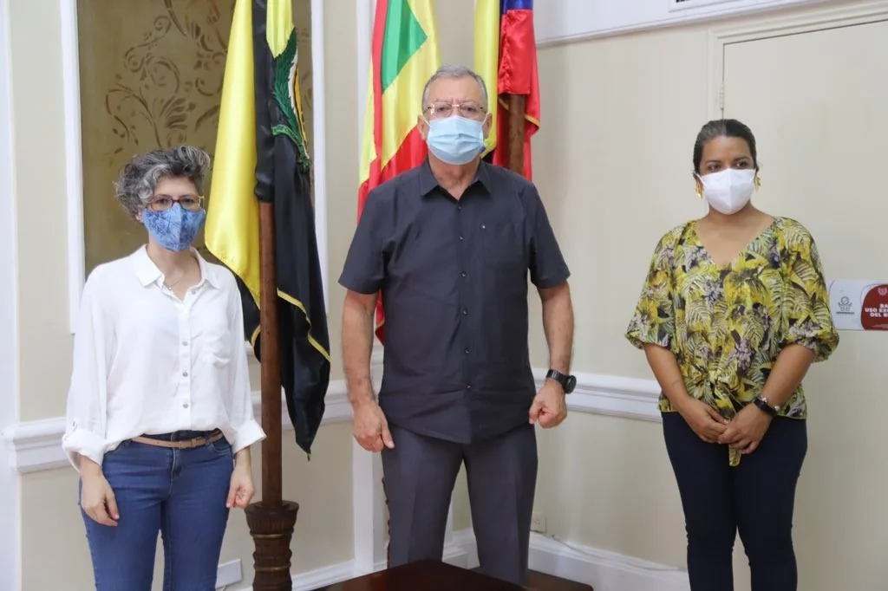

*En el centro, Edgar Parra Chacón, posa al firmar un convenio con el IPCC, después que el alcalde Dau los trató de «nido de ratas». El rector debe responder la pregunta ¿dónde están los dineros de la Caja de Previsión?*

¿Qué se hizo el dinero de la Caja de Previsión de la UdeC? Es la pregunta que los afiliados se hacen. El exgerente de la Caja de Previsión Social de la Universidad de Cartagena, **Senén González Vélez**, salió en punta de lanza contra el **rector de la Universidad de Cartagena, Edgar Parra Chacón**. Le puso el dedo en la llaga a la situación de inviabilidad financiera de esa entidad. Pero también lo retó  para que le diga **qué están haciendo con el 12%** que le descuentan a los afiliados y a los pensionados. 

Al mismo tiempo, invitó a la Fiscalía y a la Procuraduría para que investigan los destinos de ese dinero. Se trata de saber a dónde va a parar. La Caja de Previsión de la UdeC se sostiene financieramente de los aportes de sus afiliados y del 10% del valor de la estampilla de Bienestar Universitario.

## La crisis de la Caja de Previsión de la UdeC

https://youtu.be/s4qxkj3hi3U

La Caja de Previsión de la UdeC está en una profunda crisis. La universidad le debe $25 mil millones.

La situación financiera, administrativa y de asistencia de la Caja de Previsión de la Universidad de Cartagena, que tiene un régimen especial, es crítica. Pero el problema es que la administración del centro universitario le debe la suma de **$25 mil millones.** Este dinero le permitiría a la entidad de salud resolver su inviabilidad financiera. ¿Por qué la administración no le paga? ¿Por qué la pretenden liquidar? ¿Por qué esperan que la Superintendencia de Salud la intervengan? Pero no la puede intervenir, ya que su condición de régimen especial impide que ello suceda.

_«Cuando manejé la Caja de Previsión, los rectores eran de otro talante. Rector (Parra Chacón) para dónde va ese 12% que ustedes me descuentan como pensionado. Solicito a la Procuraría General de la Nación, a la Fiscalía general y a la Dian para que investiguen a todos esos funcionarios que manejan lo económico. Deben presentar su declaración de renta porque muchos entran pobres y salen ricos. Y es eso que mantiene a la Universidad de cartagena sumida en una miseria., cuando fue una de las universidades más prestantes de Colombia»_.

Lo que realmente le molestó al exdirector de la Caja de Previsión es la respuesta displicente «olímpica del rector Parra» ¿Cuál fue la respuesta que le dio al periodista Humberto Mercado?

> «Él (Senén González) es pensionado de la Universidad y afiliado a la Caja de Previsión. Esta EPS esta en condiciones de iliquidez e inviabilidad, conceptos emitidos por la Superintendencia Nacional de Salud en el año 2015 y 2017».
> 
> Edgar Parra Chacón, Rector de la Universidad de cartagena.

Esa respuesta del rector Parra, Senén González la calificó de «olímpica y sutilmente irrespetuosa y desconsiderada». Porque se trata de un hombre que le dedicó mucho tiempo a la Universidad.

## El colectivo de afiliados

La denuncia de Senén González no es la única. Se constituyó un Colectivo de Afiliados para luchar por una atención integral de trabajadores y pensionados que se encuentran inscritos en la Caja de Previsión de la Universidad de Cartagena.

> «El Rector Edgar Parra Chacón, médico pediatra egresado de esta universidad, Presidente de la Junta de la Caja, rector de la Universidad y ordenador del gasto, nos ha venido negando los medicamentos, tratamientos, análisis y todo lo que concierne a conservar la salud y la vida de sus afiliados. Se niega a dar nuestros aportes de manera oportuna, diciendo que si un juez no lo obliga a pagar el no paga. Con esto, viola de paso nuestras convenciones colectivas de trabajo y el artículo 49 de la C. N. que trata de conservar la salud y la vida de los ciudadanos».
> 
> Comunicado

Señala el colectivo, en un comunicado entregado a este medio, que el rector **"se ha negado a hacernos llegar los dineros de la estampilla que fue creada para bienestar y de esos dineros deben consignarse el 10% a la Caja de Previsión Social de la Universidad de Cartagena, dinero que no se sabe dónde están consignados pero que a la Caja nunca llegaron"**.

Todas esas denuncias, según manifiestan los voceros del colectivo, fueron radicadas en los entes gubernamentales como Procuraduría, Fiscalía. Pero no entienden por qué están congeladas esas investigaciones. Dicen que **«nunca fallan a nuestro favor ni en contra, solo dejan vencer los términos»**. Mencionan como ejemplo de esta moratoria cómplice a la Fiscalía 40 Seccional. 

En la próxima entrega sobre este tema, entrevistaremos al rector de la Universidad de Cartagena para que responda en profundidad sobre estos y otros interrogantes que sus afiliados se hacen.

### Te puede interesar: [UdeC en pleno se levanta contra ataque injurioso del alcalde](/articulos/udec-en-pleno-se-levanta-contra-ataque-injurioso-del-alcalde/)