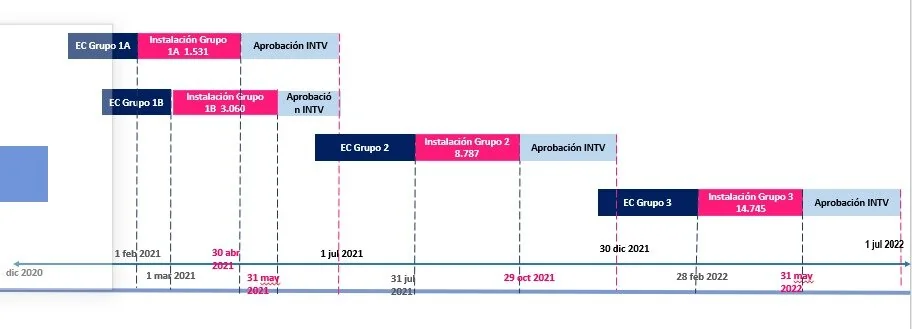

**Karen Abudinen Abuchaibe** convirtió el Ministerio de Tecnologías de la Información y las Comunicaciones (MinTic) en una verdadera piñata —no para niños— sino para los corruptos. Una piñata donde la multinacional Claro recibió el 50% de ese dulce: $1 billón de pesos para construir los Centros Digitales. 

*Carlos Zenteno, presidente ejecutivo de Claro en Colombia. Debe responder por el contrato de la zona A de los Centros Digitales. Piñata para Claro.*

Claro recibió $100 mil millones. Y hasta el 24 de septiembre había incumplido con la entrega del 21% de los puntos digitales a los que contractualmente estaba comprometido entregar.  Su compromiso era que el 31 de mayo esos centros digitales estuviesen funcionando. Ni Claro ni Centros Poblados cumplieron. Hasta ahora ha sido un fraude los dos contratos. El de Claro costó $1.06 billones. El Centros Poblados $1.07 billones. Son más de $2 billones invertidos allí. ¿Serán otros Kioskos Digitales que no sirvieron para nada?

## Claro no ha cumplido

Ese incumplimiento quedó de manifiesto con ocasión del debate de moción de censura contra la entonces ministra **Karen Abudinen Abuchaibe**. En esa ocasión, el representante a la Cámara, **Jorge Alberto Gómez,** aseguró que la empresa **Claro**, adjudicador de la zona A de ese contrato. El representante a la Cámara denunció:

>  “(Claro) el **31 de mayo** tenía que entregar el 21% de la obra a satisfacción y **no lo entregó**.”
> 
> Representante Jorge Gómez..

Los medios de comunicación por estar enfocados en la defraudación de Centros Poblados, adjudicatarios de la Zona B, nos olvidamos de hacerle un seguimiento de los Centros Digitales que debe construir la multinacional Claro. Muchos de los centros no tienen señala de internet que es el producto esperado.

Por ejemplo, **John Ferney Higuita**, rector de la **Institución Educativa rural La Inmaculada** de la vereda Caucheras del municipio de **Mutatá dijo que hasta el 24 de septiembre Claro no había cumplido con ponerle internet.** Instalaron los equipos pero no había señal. La denuncia la hizo ante Caracol radio. 

Si bien Claro tiene una antena a 200 metros de la institución educativa de la vereda Caucheras, la señal no llega. Es la misma antena que comparten con los usuarios de la vereda Caucheras. Usuarios que se quejan por la mala señal de Claro. Por mucho que se han quejado, hasta esos momentos no habían resuelto el problema ni en el colegio ni en la vereda, denunció el profesor.

## La piñata para Claro

De esta manera podemos concretar que Comcel (Claro S.A) no ha invertido los recursos del contrato de operador en el objeto social y misional de llevarle internet a los niños más pobres y vulnerable de Colombia. Basta hacer ubna verificación con varias instituciones educativas para darnos cuenta de ello. Es decir, que la piñata reventada por la hoy ex ministra Karen Abudinen también le benefició a Carlos Slim, el multimillonario mexicano dueño de Claro.

Para corroborar lo anterior, VoxPopuli Digital llamó al colegio La Inmaculada de Cauchera. Contestó el profesor José Gómez, quien manifestó que los técnicos de Claro estuvieron presentes el pasado 24 de septiembre y logró llegar una señal deficiente. Pero no sirve para nada. Es lenta e intermitente.

Sin embargo, este 30 de septiembre quisimos verificar la evolución de la señal. Conversamos con un profesor de esa institución para constatar lo dicho por Claro en el sentido de que todo se había restablecido. El docente José Gómez de la Inmaculada, le dijo a VoxPopuli Digital: 

> **"Casi mil estudiantes siguen sin internet, porque la señal es débil, lenta e intermitente. Los** equipos del programa Centros Digitales están pero es una señal pésima".
> 
> **José Gómez,** La Inmaculada de Cauchera, Mutatá.

Esa situación está generando **una grave afectación** del derecho fundamental a la educación de los menores que estudian en los centros educativos rurales, supuestamente beneficiados por los Centros Digitales instalados por Claro.

## El 50% sin internet

*Alexandra Peláez Botero, Secretaria de Educación de Antioquia: "Solo 8 de las instituciones tienen internet".*

Muchas instituciones educativas carecen de una señal sostenida que pueda conectarse con el mundo, como prometió Karen Abudinen. Ella juró y **_requetejuró_** que en mayo ya estarían cerca de 1.700 instituciones educativas con el servicio de Internet. El cronograma de instalación iba de marzo de 2021 hasta julio de 2022.  Ni Claro cumplió mucho menos Centros Poblados. 

Por su parte la Secretaria de Educación de Antioquia, **Alexandra Peláez Botero**,  corroboró esa situación en declaraciones a la WR, en los siguientes términos : 

> "**Cerca del 50% de los establecimientos educativos aún no reciben ni la visita del MinTic**. **Hasta ahora el Ministerio ha hecho una visita a 468 sitios en los que estarían instalados estos centros digitales, pero la conectividad no ha sido activada sino en 8”.**
> 
> Alexandra Peláez Botero, Secretaria de Educación de Antioquia.

## El cronograma de la piñata

*Hasta el 31 de mayo, Claro debía tener conectadas 1511 instituciones. Apenas en Antioquia lo hizo con 8, de las 448 que debía conectar. Revisen la gráfica que MinTic publicó.*

Según la página web de MinTic, el cronograma de construcción de los Centros Digitales se debía cumplir en las establecidas. Los primeros resultados el 31 de mayo en la zona A ganada por COMCEL S.A. El el 30 de abril en la zona B ganada por Centros Poblados. Precisamente, las irregularidades de esta UT se detectaron por su considerable retraso, el mismo que tuvo COMCEL.

El operador **COMUNICACIÓN CELULAR S.A. - COMCEL S.A.,** ejecutor de la **Región A** del proyecto, conectará **7.468** Centros Digitales. Los departamentos beneficiados son: Antioquia, San Andrés, Atlántico, Caldas, Caquetá, Cesar, Córdoba, Guainía, Guaviare, Huila, La Guajira, Meta, Norte de Santander, Santander, Sucre, Tolima y Vaupés. **El valor del contrato es de $1,06 billones**.

**En tanto que Centros Poblados 2020,** era el ejecutor de la Región B del proyecto, conectará **7.277** Centros Digitales. Ahora asumido por ETB. Se beneficiarán los departamentos de Amazonas, Arauca, Bolívar, Boyacá, Casanare, Cauca, Chocó, Cundinamarca, Magdalena, Nariño, Putumayo, Quindío, Risaralda, Valle del Cauca, Vichad. El valor del contra es de **$1,07 billones.**

## ¿Qué hizo Claro con la piñata de $100 mil millones?

Si los de Centros Poblados se llevaron 17 millones de dólares ($58 mil millones) para una cuenta **offshore en Delaware**, ¿COMCEL para donde se llevó el dinero si no tuvo que invertir en antenas, porque supuestamente ya las tenía? ¿Por qué no cumplió y MinTic no le penalizó por cada día que incumplió?

Claro S.A. debió invertir esos recursos para que la señal de Internet le llegara a las instituciones educativas de los niños más pobres de Colombia. Esos $100 mil millones (26 millones de dólares) no se los podían llevar para las cuentas internacionales de Claro. Hay que buscar la trazabilidad de ese dinero. Además, se trata de un contrato de aporte.

Así como se ha investigado el caso de Centros Poblados, es menester que la Contraloría y la Procuraduría paren las orejas en este contrato con Claro. Es probable que hayan sorpresas. ¿Podremos tener otro Odebrecht? La pregunta es pertinente, porque todo el proceso licitatorio estuvo bajo un manto de sospecha. El hecho de que un asesor de la ministra fuera, al mismo tiempo, apoderado de una de las empresas que participaba en la licitación, de por sí lo dice todo. Además, el ministerio desestimó la recusación que se hizo contra la misma Karen Abudinen.

## Conclusión

De hecho, los grandes contratos de estos gobiernos se convierten en un negociados para la empresa privada y la mafia de la corrupción. Carlos Zenteno es el presidente de operaciones fijas, móviles y de la empresa Claro Colombia. Zenteno, es de origen mexicano. Los medios especialistas señalan que  fue el jefe de Claro en Brasil. Reemplazó a Juan Carlos Archila en Colombia. 

Existen varias cosas claras. La primera. Que está demostrado que Claro incumplió con los términos del contrato, muy a pesar de indicar a varios medios que ya había superado las dificultades. Segundo, que el 50% aproximadamente de las instituciones educativas que ya debían estar gozando del servicio de internet, no lo tienen. Tercero, que Mintic no ha aplicado la cláusula de penalización por cada día de incumplimiento.

**Cuarta conclusión.** Lo peor de todo, es que si Claro no ha cumplido, qué hizo los 27 millones de dólares que el Fondo de Mintic le transfirió. ¿Corrió la misma suerte de los $70 mil millones de Centros Poblados? Se la dejo allí, como dijo Diomes Díaz.

### Te puede interesar:

## [Los que «abudinearon» el contrato de MinTic permanecen ocultos (III)](/articulos/los-que-abudinearon-el-contrato-de-mintic-permanecen-ocultos-iii/)

## [Caso Mintic (IV): El «modelo abudinear» parido en Barranquilla por el «daescharismo»](/articulos/caso-mintic-iv-el-modelo-abudinear-parido-en-barranquilla-por-el-daescharismo/)

## [En clave de «abudinear», la verdad de los $70.000 millones (I)](/articulos/en-clave-de-abudinear-la-verdad-de-los-70-000-millones/)

## [¿Los bandidos están en MinTic o fuera? (II)](/articulos/contrato-mintic-donde-estan-los-bandidos/)

## [Los 7 días que estremecieron a Tecnoglass en Nasdaq y Mintic](/articulos/los-7-dias-que-estremecieron-a-tecnoglass-en-nasdaq-y-mintic/)