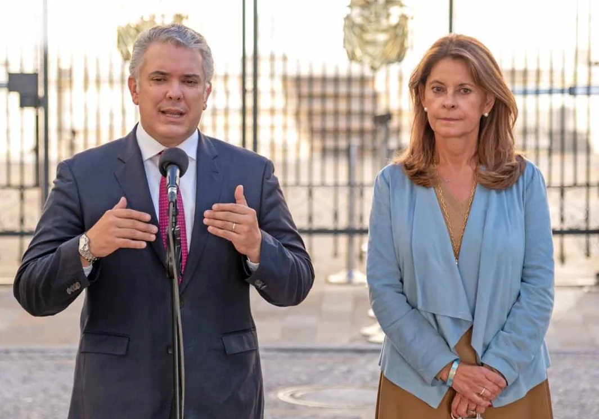
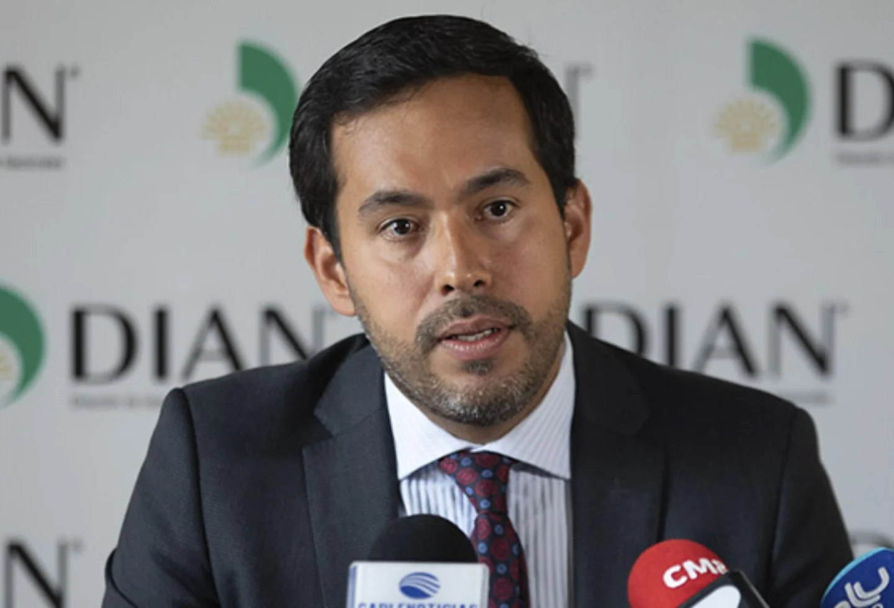
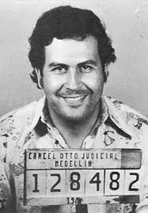
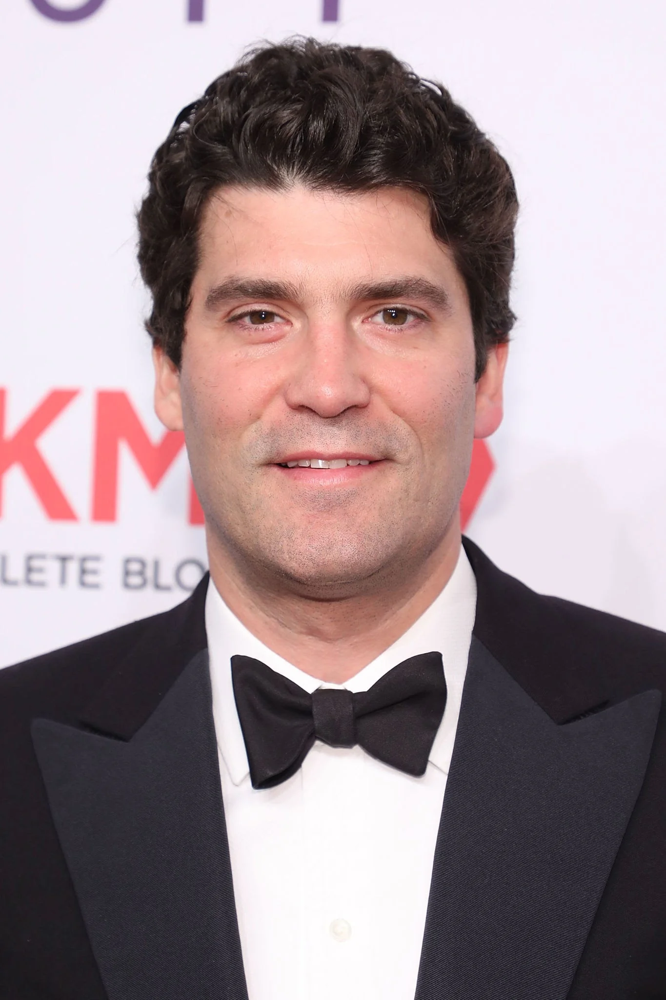
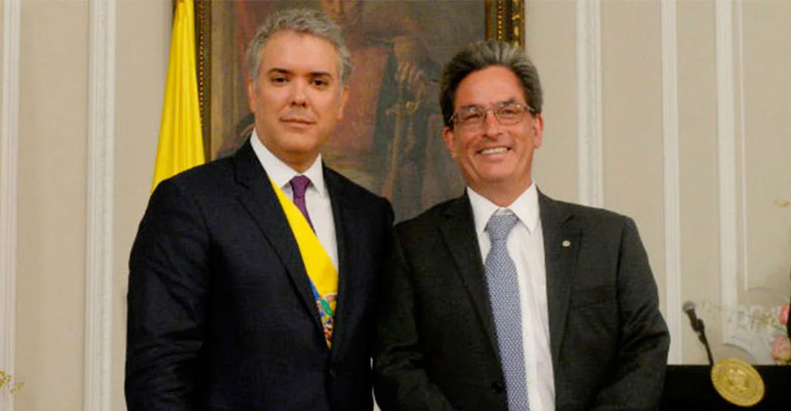
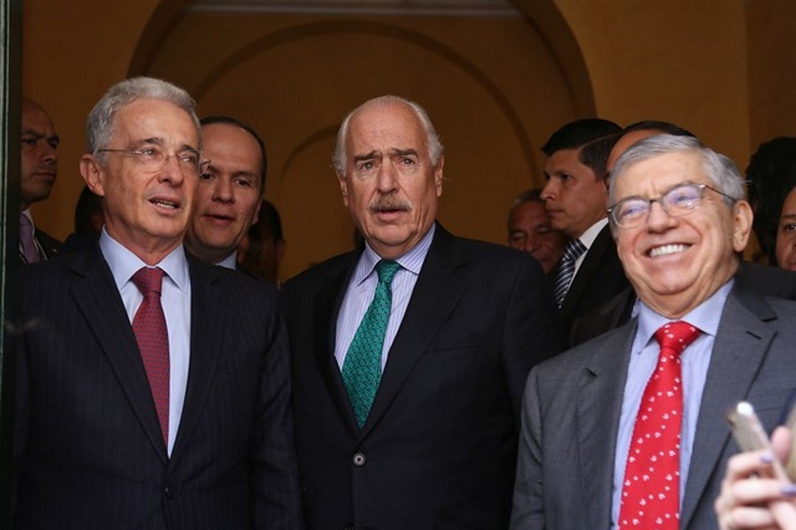
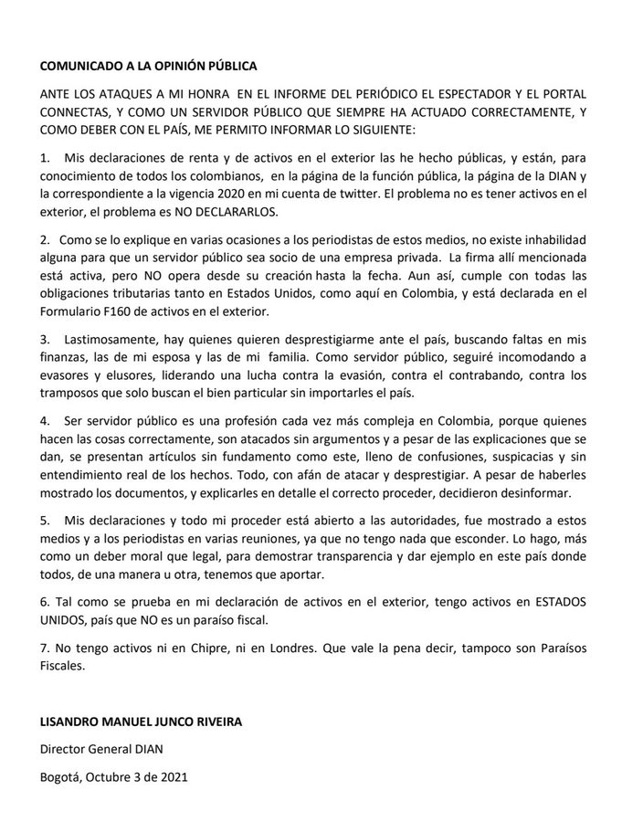

*«cloacas financieras». Un nuevo escándalo para las altas esferas del gobierno del presidente Iván Duque. Su vicepresidenta Martha Lucía Ramírez y su ministra de Transporte, Ángela Orozco, tienen cuentas offshore. Cortesía.*

¿Qué hacen clanes familiares —al lado de expresidentes y líderes políticos — en «cloacas financieras» del mundo? En efecto, varios grupos económicos y financieros colombianos se encuentran reportados en la lista de Pandora Paper's. La vicepresidenta y Canciller Martha Lucía Ramírez, la ministra de Transporte Ángela María Orozco (grupo Char), el director general de la DIAN Lisandro Junco Riveira, entre otros servidores públicos.

Esta nueva investigación periodística de carácter internacional escudriña los secretos financieros de políticos, artistas, empresarios o deportistas en países con grandes beneficios fiscales. Son estados que se convierten en «paraísos fiscales» para la evasión y la elusión fiscal. Pero, al mismo tiempo, empobrecen a los países de América Latina. Por ejemplo, según un estudio de la **Alianza Global por la Justicia Fiscal,** a través de los llamados paraísos fiscales los países sufren fraude fiscal por $467 mil millones de dólares anuales. Colombia, tiene una perdida de 12 mil millones de dólares anuales. Lo que equivale a tres reformas tributarias como la que quería imponer el presidente **Iván Duque**.  Estos sitios se conocen tradicionalmente como _**paraísos fiscales**_. Pero en realidad son unas «cloacas financieras» que se traducen en un empobrecimiento de los países donde residen los beneficiarios de esas cuentas. ¿Por qué? 

## Justifican las «cloacas financieras»

*«Cloacas financieras». El hombre —Lisandro Junco—que está llamado a combatir la evasión, es probable que se beneficie de ella con sus tres cuentas offshore en los paraísos fiscales.*

Todos los personajes cuyas cuentas les han sido descubiertas, salieron a dar explicaciones comunes. Desde el mismísimo director de la DIAN, **Lisandro Junco Riveira,** hasta la vicepresidenta **Martha Lucía Ramírez** con el presidente Duque y demás implicados, afirman que no es delito tener “activos en el exterior”. Junco en vez de presentar su **renuncia irrevocable,** se fue «**lanza en ristre**» contra los periodistas y los medios que abordaron la megainvestigación. Son millones de datos de cuentas offshore que afectan a 70 países.

¿Para que tener una cuenta offshore? Los beneficiarios las utilizan para la especulación financiera, la evasión de impuestos, lavado de activos del narcotráfico y de la corrupción administrativa. En Colombia no es un delito que los empresarios nacionales monten sus empresas de fachadas en esos países. Incluso, a muchos de ellos Colombia no los considera como paraísos fiscales. Como es el caso de Panamá o el mismo Delaware. A este Estado, **Centros Poblados se llevó 17 millones de dólares** ($58 mil millones) de lo $70 mil transferidos por el Fondo de Tecnología de MinTic. Están perdidos. Es probable que los hayan pasado a Panamá y después a las Islas Caymán. Para esto sirven las cuentas offshore.

Pero una cosa es tener activos en el exterior en países con transparencia fiscal y otra buscar **_“guarida fiscal_**” para las fortunas y las riquezas mal habidas.

## Los delincuentes de corbatín

*Pablo Escobar, El patrón del Mal, era un gran beneficiario de las cuentas offshore. En Anguila tenía gran parte de su fortuna del narcotráfico.*

Recordemos que Anguila —reconocido paraíso fiscal— fue el lugar en el que **Pablo Escobar** escondía su fortuna y lavaba sus activos. Pero también recordemos que el negociado de **Interbolsa** se hizo en Curazao y Panamá, que son paraísos fiscales, pero que Colombia no los reconoce así.

Las fortunas de los **delincuentes de corbatín**, la plata de la corrupción, del narcotráfico, de las movidas de gigantes empresariales, del dinero para especular en los mercados de divisas e inmobiliarios están en estos «paraísos fiscales». En fin, los usuarios de estas «cloacas financieras» saben para qué sirven las cuentas offshore.

*Alejandro Santo Domingo, el magnate colombo—estadounidense vendió Bavaria desde una cuenta offshore sin pagarle un peso al Estado colombiano. Su corbatín le luce. Cortesía.*

A manera de ejemplos, tenemos dos casos de elusión fiscal. En 2004 cuando **Olímpica S.A**. compró Megamarket de Costa Rica no pagó impuestos. O cuando el grupo Santo Domingo vendió **Bavaria a SabMiller** por 7.5 mil millones de dólares. Es cierto que la negociación la iniciaron los asesores de **Alejandro Santo Domingo** en Londres. Pero la transacción la hicieron en Delaware desde una cuenta offshore. Solo en este negocio Colombia dejó de percibir por impuesto la suma de **$4.2 billones,** denunció la exministr**a Cecilia López Montaño.** Este es un ejemplo elocuente de elusión fiscal de los hombres más ricos de Colombia. ¿Tienes dudas de que el paraíso fiscal es para eludir el pago de impuestos?

*El presidente y su socio. Iván Duque y Alberto Carrasquilla, el cerebro de la frustrada reforma tributaria. Defensores acérrimos de las «cloacas financieras». Cortesía.*

El ministro de Hacienda de la época, **Alberto Carrasquilla** (¿te suena?), justificó tal transacción haciéndola pasar **como si fuera una fusión**. Claro, Carrasquilla fue mencionado por los **Panamá Paper's** por tener varias cuentas offshore. Nos hace recordar al director de la DIAN de hoy. No tienen autoridad moral para cuestionar este sistema de evasión de impuestos. Si se pagaran seguramente mermaría la pobreza en nuestro país.

## Expresidentes en «cloacas financieras»

*Y se mueren de la risa. Los expresidentes que más impulsaron los paraísos fiscales. Uribe, Pastrana y Gaviria. Esto es «confianza inversionista.» Cortesía.*

Como se informó, **César Gaviria Trujillo** (presidente 1990—1994), **Andrés Pastrana Caicedo** (1998—2002) y la vicepresidenta **Martha Lucía Ramírez** aparecen en la lista de beneficiarios de cuentas de esas «cloacas financieras» del mundo.  Pero no son los únicos. Esta revelación la hizo el consorcio periodístico **International Consortium of Investigative Journalists** (ICIJ por sus siglas en inglés). 

Sin embargo, debemos aclarar que tener una cuenta _offshore_ no necesariamente es ilegal. Pero cuando ellas se encuentran en paraísos fiscales y no son declaradas ante la DIAN, podrían estar lavando activos del narcotráfico o de la corrupción administrativa. O, en el mejor de los casos, evadiendo impuestos. 

No obstante es necesario preguntarse: ¿Por qué un político o un servidor público tiene no una sino varias cuentas offshore? Si aun reportaran dichas cuentas ante la DIAN, ¿no se configuraría un conflicto de intereses? ¿No habría un impedimento ético? ¿Qué justificaría tener una cuenta offshore para un servidor público que vive de su salario?

¿Para qué un político profesional, que vive de la política, tiene una cuenta en un paraíso fiscal? Al expresidente Gaviria no se le conoce como un hombre de empresa. Mucho menos a Pastrana Caicedo. Tampoco a Martha Lucía Ramírez, quien está casada con el arquitecto Álvaro Rincón. Rincón debió declarar ante la Fiscalía el 27 de mayo de 2020 por haber hecho negocios non sancto con **Guillermo León Acevedo, alias «Memo Fantasma».** Este individuo está siendo procesado por servir de financiador de grupos paramilitares y dedicarse a la economía del narcotráfico.

## El colmo de la DIAN

¿No es contradictorio que el director general del Departamento de Impuestos Nacionales—DIAN,  **Lisandro Junco Riveira**, tenga cuentas offshore en esos llamados paraísos fiscales? El director de la DIAN no solo tiene una cuenta offshore sino tres. Es el «diablo repartiendo ostias».

Según los documentos de Pandora Paper's, Junco Rivera tiene **Cyber Security System Company** en Delaware, un estado de los Estados Unidos que tiene las características de paraíso fiscal. Una en Chipre y otra oficina virtual en Londres, las cuales son gestionada desde un bufete en Dubai. Aquí también se fue cierta cantidad de los $70 mil millones de MinTic que **Emilio Tapia** ordenó al presidente de Novatic, Juan Carlos Cáceres —al decir de éste— que se consignara en una cuenta offshore. ¿Para pagarle la coima a quién?

Al respecto, el director de la DIAN, salió disparando su escopeta de Cirilo contra El Espectador y Conecta a los que acusó de enlodar su nombre. «Hay quienes me quieren desprestigiar», dijo. **Aclaró** que él presentó esas cuentas en su **declaración de renta**, la cual publicó en tuiter. 

> “Como se lo expliqué en varias ocasiones a los periodistas de estos medios, no existe inhabilidad alguna para que un servidor público sea socio de una empresa privada. **La firma allí mencionada está activa**, pero no opera desde su creación hasta la fecha. Aun así, cumple con todas las obligaciones tributarias tanto en Estados Unidos, como aquí en Colombia, y está declarada en el Formulario F160 de activos en el exterior”.

Este es el comunicado expedido en el día de hoy:

*Comunicado del director General de la DIAN*

## «Cloacas financieras», narcotráfico y lavado de activos

Las cuentas offshore no solo las han utilizado los evasores de impuestos, los narcotraficantes, el sistema financiero internacional y los políticos corruptos sino también el gobierno de los Estados Unidos. Está documentado que las usó para financiar el terrorismo internacional. Por ejemplo, congresistas negros de Estados Unidos realizaron un debate en 1999  contra la CIA por usar dinero procedente del narcotráfico para financiar a los Contra de Nicaragua.  **Barry McCaffrey**, portavoz del gobierno de Clinton, según la prensa norteamericana, aceptó realizar una profunda investigación sobre esas denuncias.                   

De igual manera, quedó demostrado que la misma CIA usó dinero del narcotráfico para financiar a los grupos extremistas allegados a los Talibanes que peleaban contra facciones proclives a la otrora Unión Soviética en la guerra de Afganistán de los años 80. Todo esto se movió con cuentas opacas.

**El coronel Oliver North** compareció en 1987 ante el Congreso de EE.UU por esas razones. Debió explicar cómo el gobierno de Washington le vendía armas a Irán de forma secreta para financiar a la guerrilla de la Contra, que luchaba contra el gobierno sandinista en Nicaragua. El dinero lo transferían a través de cuentas secretas offshore de esos paraísos financieros.

Afganistán controla el 80% **del suministro mundial de opio**, según la Oficina de las Naciones Unidas contra la Droga y el Delito (UNODC). En tanto que la heroína, elaborada con opio afgano, representa el 95% del mercado en Europa. Mucho de ese dinero llega a esos paraísos fiscales mediante un intrincado sistema de transferencias financieras con empresas de fachadas dedicadas a la exportación.

## «Cloacas financieras» y evasión de impuestos

En Colombia, la evasión del pago de impuesto llega a los **$42,3 billones**. Más de la mitad se debe a la evasión por parte de las empresas.

Según**, Liliana Heredia**, profesora del departamento de contabilidad y finanzas de la Universidad Javeriana de Cali, experta en temas tributarios, le dijo a Forbes que es necesario insistir en que los inversionistas no se van de un territorio solo por temas tributarios. Hay otras variables: competitividad, seguridad, estabilidad jurídica, entre otros. Pero los gobiernos colombianos solo se han enfocado es en garantizarle a los inversión la evasión de impuestos.

Un hombre o una mujer de la clase media al vender su casa por $200 millones debe pagar varios impuestos. Retención a la fuente, impuesto sobre la renta y, probablemente, impuesto sobre la ganancia ocasional. Pero si es **Alejandro Santo Domingo**, no le pagaría un solo peso al Estado colombiano. ¿Justicia tributaria? Santo Domingo se enriquece ilícitamente usando cuentas offshore en las «cloacas» del sistema financiero mundial. ¿Todavía tienes dudas de que existen «delincuentes de corbatín»?

#### **Próxima entrega**:

### «Los delincuentes de corbatín y sus cloacas financieras» (II)

/articulos/pinata-para-claro-y-los-corruptos-en-mintic-v/