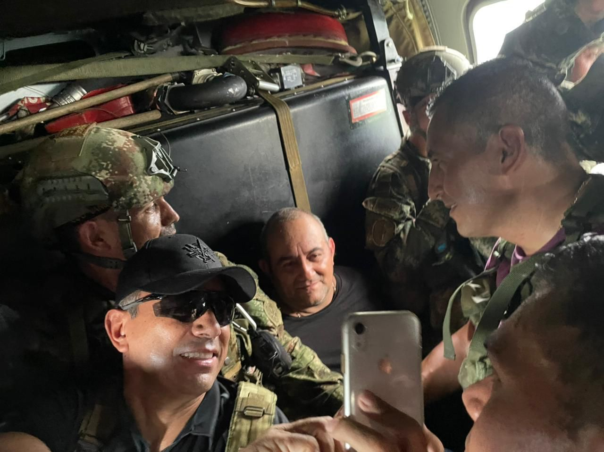
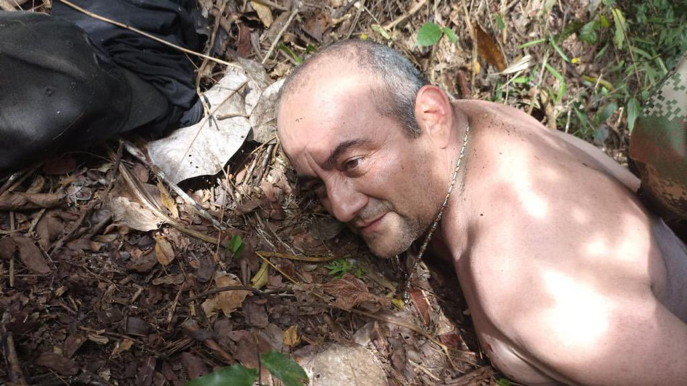

*Uno de los oficiales haciéndose una selfi con Úzuga, quien aparece sonriendo. Cortesía.*

Una selfi con «Otoniel» no queda mal, diría el oficial que se tomó la foto con el capturado en el teatro de operaciones. Pareciera como si el jefe del Clan del Golfo fuera una estrella Hollywoodense.

La caída de uno de los hombres más buscados en las selvas del Darién fue posible gracias al despliegue de 500 hombres de las fuerzas militares en la madrugada de este sábado 23 de octubre de 2021. Esta fuerza de infantería contó con apoyo aéreo. El cerco fue total. No había escapatoria. El día de su captura estaba marcado. Cayó a las 3 de la tarde, según información entregada por las autoridades.

## Una selfi con Úzuga

/articulos/luciotorres/status/1452064391176798208?s=20

En una operación militar denominada «Osiris», las fuerzas militares colombiana capturaron al jefe máximo del Clan El Golfo, una de las grandes agrupaciones ilegales de Colombia dedicada al tráfico de estupefacientes, la extorsión y el secuestro.

## El perfil de un violento

*¿Como cayó «Otoniel»?*

**Dairo Antonio Úsuga David,** nació en Necloclí, Antioquia, el 15 de septiembre de 1971. O sea, que tenía un mes de haber cumplido año. Es conocido por los alias de «Otoniel», «Mauricio» y «Mao». Fue un destacado dirigente de la guerrilla del Ejército de Liberación Nacional- EPL. Esta agrupación se desmovilizó en Tierralta (Córdoba) en 1991 gracias a un acuerdo de paz con el gobierno. 

El capturado formó la disidencia del EPL. Luego se hizo paramilitar. Aprovechó para continuar en sus actividades de producción y exportación de cocaína a los Estados Unidos y Europa. Recordemos que Otoniel constituyó uno de los grupos del paramilitarismo al mando de Carlos Castaño Gil. 

/articulos/infopresidencia/status/1452041908658872323?s=20

En 2012 después de la muerte de su hermano [Juan de Dios Úsuga David](https://luciotorres.local/wiki/Juan_de_Dios_%C3%9Asuga_David "Juan de Dios Úsuga David"), alias «Giovanny» asumió el mando de Clan del Golfo. A los 16 años ya era parte del EPL. Al desmovilizarse esta agrupación por los acuerdos de paz, se integró a las Autodefensas comandadas por los hermanos Castaño Gil, ya muertos. 

## Podrían extraditarlo

A Dairo Antonio Úzuga se le acusa de terrorismo, asesinato, secuestro, extorsión, narcotráfico y otros actos delictivos y criminales.  Además se le han emitido 57 órdenes de captura y presenta una «notificación azul de Interpol para el resto del mundo» por lo que podría ser extraditado a Estados Unidos.

De esta manera, **«Otoniel»** podría ser extraditado a Estados Unidos. Este país lo acusa de exportar miles de toneladas de cocaína a Norteamérica.