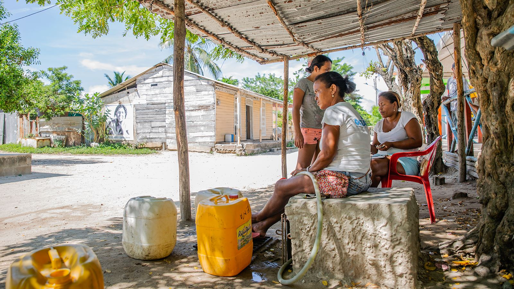

*Los nativos han protestado por el despojo.*

Un debate político sobre la propiedad de la Hacienda Santa Ana y de la titulación de tierras en Barú se está preparando en el congreso de la República. En tanto que en la Notaría Primera de Cartagena reposan las escrituras de 1887 mediante la cual 97 comuneros compraron la Hacienda Santa Ana de Barú por valor de $2.400. Lo particular de esta propiedad es que tiene la calidad de **proindivizo**. Se define como el derecho parcial de una persona sobre una propiedad. Significa que comparte la titularidad con una o más personas, por lo que se considera una comunidad de bienes o copropiedad. Quiere decir que no se podía vender a particulares ni siquiera por sus herederos. 

Pero resulta que después de 134 años, Hacienda Santa Ana de Barú pasó a manos de los Santo Domingo, Echavarría, Fabio Ochoa, Argos, entre otros ricos del país. Ellos tendrán que explicar ante las autoridades sobre los títulos obtenidos de esas propiedades. Podrán decir que las adquirieron conforme a la ley. Pero hay un problema. Hacienda Santa Ana no era susceptible de ser vendida. Cualquier venta estaba preñada de falsedad.

De acuerdo con el veedor **Héctor Pérez Fernández**, el debate que se prepara en el congreso no solo cobija las tierras de Santa Ana sino que se extenderá al proceso de despojo de Barú, Canal del Dique y de la zona costera de Cartagena.

La Hacienda Santa Ana data desde la expansión de la economía colonial cuando el mercantilismo tomó apogeo en Cartagena de Indias. Los comerciantes de la provincia comenzaron a comprar propiedades rurales y montar haciendas en el campo. Pero la Hacienda Santa Ana fue cedida por la Corona a las dos hermanas **Margarita M. Benévolo y Juana de Benoli Paz**, según el protocolo 129 de 1872  de la Notaría Primera. 

En 1872 ese protocolo fue firmado por las hermanas Benévolo cuando le vendieron la propiedad a la afrocedescendiente **Virginia Revollo**, una señora prestante y con suficientes recursos. Allí se fijó los linderos de la hacienda, según constata los jóvenes investigadores **Jadid Martínez Batista y Nays Flórez Benavidez** en su tesis [**Barú 1895—1905**](/articulos/bitstream/handle/11227/286/pdf%20TESIS%20LISTA%20PARA%20IMPR........pdf?sequence=1&isAllowed=y#:~:text=de%20esta%20localidad.-,ANTECEDENTES%20HIST%C3%93RICOS.,de%207500%20hect%C3%A1reas%20de%20extensi%C3%B3n.) para optar el grado de historiador. 

En concordancia con los datos históricos, los 97 comuneros fueron los primeros en realizar una compra colectiva en Barú. Ellos compraron _«la hacienda de campo con su horno para fabricar cal, la coquera fundada en el punto nombrado la puntilla, aguadas y todas sus anexidades, hacienda nombrada Santa Ana, ubicada en la isla de Barú compuesta de tres caballerias de tierras... por la suma de dos mil cuatrocientos pesos»_.

Como está expuesto, esa propiedad colectiva es proindivizo y no podía ser vendida a particulares. Es decir, que los herederos podían explotarla, incluso, cediéndola temporalmente, pero nunca podría ser titulada.

Si embargo, cuando el Estado colombiano inició el **Plan Nacional de Turismo del Caribe** realizado en los años 70, el gobierno centralista modificó sustancialmente la propiedad de Barú. De esta manera se inició la destrucción de la propiedad colectiva perteneciente a las poblaciones afrodescendientes.

Ese plan buscaba integrar las tierras de Barú al desarrollo económico del mercado. De manera que llegaron inversionistas, especuladores, terratenientes que comenzaron a comprar todas esas propiedades. **Pablo Obregón González** fue uno de los que más compró tierras en Baru, al decir de uno de sus lancheros. Él venía en helicoptero o en avión procedente de Barranquilla. Algunos nativos le manifestaron a este periodista que Obregón portaba el logotipo de Bavaria en su camiseta.

## La denuncia

*Guillermo Paniza y Judith Pinedo, los exalcaldes condenados tienen un punto de entronque: son de la Casa Araújo, grupo familiar cuestionado por adquirir tierras en forma fraudulenta en Barú. El mismo Panizza está denunciado por adquirir propiedades en forma ilegal. El actual alcalde, William Dau Chamat, es de la misma cuerda familiar.*

**David Martínez Guerrero**, personero delegado distrital de Cartagena en 1995, según lo informó El Tiempo, presentó una denuncia penal en la Fiscalía General contra el alcalde de la época, **Guillermo Paniza Ricardo**, quien mágicamente había adquirido una propiedad en la isla de Barú. Al respecto, Panizza manifestó que su propiedad fue adquirida en forma legal. Aunque la denuncia incluía a todo Barú, el caso de la hacienda Santa Ana es particular, porque es indiscutible su propiedad colectiva. Todas las escrituras que salieron de esa propiedad están viciadas de nulidad.

Sin embargo, Guillermo Panizza no solo se encontraba involucrado en esa situación. La denuncia también afectaba principalmente a su suegro **Alberto Aráujo Merlano** y sus cuñados Rosa y Gerardo Araújo Perdomo, este último gerente de **El Universal**. De la misma manera la denuncia implicaba a **Pablo Obregón González**, Abraham Payares Martínez, Carlos Quintero Rocamía, Ricardo Cardeles Torres, Mauricio Quintana Calderón y Roberto Alcocer. Todos ellos obtuvieron esas tierras en forma fraudulenta, indica la acusación. 

¿Por qué razón se dio esa acusación? La Personería tiene como finalidad defender los intereses públicos y colectivos. El personero auxiliar encontró que algunos de esos predios tienen una propiedad colectiva y no privada. Esto quiere decir que por mucho que los nativos le vendieran las tierras que poseían, dichos títulos estaban preñados de nulidad, ya que no podían nacer a la luz jurídica. ¿Por qué? Porque eran propiedades colectivas, esto es, proindiviso. Es decir, no se podían vender, enajenar o ceder por títulos diferentes a la explotación colectiva.

El patriarca de los Aráujo, ya fallecido, en su momento se defendió y dijo que esa negociación de la tierra de Barú la hicieron sus hijos y desconoce detalles de la misma.

En tanto que Judith Araújo de Panizza, esposa de Guillermo Paniza, manifestó en esos momentos:

> Los señalamientos del Personero Auxiliar no tienen ningún fundamento. Lo que quiere es crear un mal ambiente aprovechando la situación en la que se encuentra el país. Nosotros hicimos ese negocio hace más de diez años y todo está legalmente establecido. Lo que se pretende es crear la duda entre las personas de bien.

De hecho, las propiedades colectivas no podían ser vendidas: En el protocolo de la compra de la Hacienda Santa Ana de Barú reza textualmente:

> “Las enunciadas tierras (Hacienda Santa Ana) en ningún tiempo puedan pasar a ser propiedad particular, ni patrimonio de ninguna persona ni familia, ni que por el transcurso de los siglos que pudiera consumir totalmente la población del vecindario de Barú aun en jeneraciones futuras, puedan considerarse las referidas tierras como bienes mostrencos i por tanto recaer su propiedad en el gobierno”.29 ( A.H.C. Notaria Primera de Cartagena, 1851, Protocolo, 97. Tomo 1.)

Si el Plan Nacional de Turismo incorporó esas tierras en el mercado de tierra no puede ser el elemento que lleve a particulares comprarlas para destinarlas a proyectos turísticos. Tampoco el Estado las puede adquirir para incorporarlas al mercado. Es una propiedad colectiva, la cual se asemeja a la propiedad de los parques naturales. La diferencia en que aquellas pueden ser explotadas por sus herederos, salvo que no afecte al medio ambiente.

## El debate

La bancada de oposición tiene previsto un debate de control político al inicio del mes de diciembre de este año con el fin de establecer las condiciones de las propiedades colectivas en la Hacienda Santa Ana. Pero la fuente indicó que se extenderá a otras tierras de Barú para establecer la magnitud del despojo del territorio a las poblaciones ancestrales que la poseen desde que se extinguió la esclavitud de la población negra traída de África. 

En estos momentos se tiene diseñado el cuestionario dirigido a los funcionarios que serán citados en el debate de control político. Se prevé que serán citados el ministro de Agricultura, la Agencia Nacional de Tierra-ANT, Agencia de Desarrollo **Rural** - ​ADR, Instituto Agustín Codazzi, Supernotariado, Unidad de Restitución de Tierra. De igual manera serán invitados la Defensoría del Pueblo, Procuraduría General, Fiscalía General de la Nación.

Este debate promete ser candente. Es uno de los temas tabúes que no ha sido resuelto por la justicia colombiana como de las instituciones creadas por el Estado para la defensa del territorio de las poblaciones ancestrales víctimas del despojo.