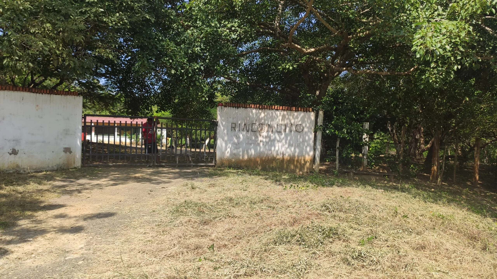

*Este es el Rinconcito del exgobernador Mendívil Ciodaro y de su esposa Evelia Rosa Ayazo, notaría Cuarta.*

El Rinconcito, la casa campestre del exgobernador de Bolívar **Carlos Mendivil Ciodaro,** está posada en todo el centro de la vía que de Pontezuela conduce a Punta de Piedra, corregimientos de Cartagena. Impide el paso de los demás propietarios que al otro lado de la vía. Uno de estos propietarios es **Roberto del Río**, quien tiene una posesión heredada de su padre fallecido **Víctor del Río.** 

Con del Río hicimos una visita ocular a **El Rinconcito** del exgobernador **Mendivil Ciodaro** y de su esposa **Evelia Rosa Ayazo, Notaria Cuarta de Cartagena.**

V**oxPopuli.Digital** no pudo llegar hasta los predios de la casa, porque el exgobernador tiene un celador en el lugar que prohíbe a cualquiera traspasar la talanquera de su propiedad construida en la vía pública. Estuvimos con la guía de **Roberto del Río**, uno de los afectados de la conducta del exgobernador Mendivil que posee más de 4 mil metros cuadrados de la vía. Esta tiene un ancho de 12 metros, según las coordenadas del Instituto Agustin Codazzi.

Por el sur, Mendivil extendió el alambre de púa que impide el paso de los demás propietarios. Por el norte construyó la casa de El Rinconcito, como se puede ver en el video y en las fotos que acompaña esta nota.

## La visita de VoxPopuli Digital a El Rinconcito

https://youtu.be/lFSbkcS0MfM

Te presento una visita ocular a El Rinconcito del exgobernador Carlos Mendivil Ciodaro y de su esposa la Notaria Cuarta de Cartagena, Evelia Rosa Ayazo.

La finca **El Rinconcito**, que aparecía a nombre de su esposa **Evelia Rosa Ayazo de Mendivil** fue construida en toda la mitad de la vía pública**.** Es un predio que le compró a **Orlando Silva Ávila** mediante escritura pública **No 3418 de 1992** inscrita en la Notaría Primera el 28 de enero de 1993.  Empero, en la declaración ante Control Urbano de Cartagena, Ávila dijo que él no le vendió a Mendivil el espacio público que éste se apropio indebidamente.

Definitivamente, el exgobernador Carlos Mendivil Ciodaro, como jurista y defensor del derecho, debería reflexionar y proceder a corregir el error. Debería restituir el espacio público voluntariamente. Así le pondría punto final a un acto que no es digno de una figura de la talla de un exgobernador o de su esposa, Rosa Evelia Ayazo Aguilar, titular de la Notaria Cuarta. ¿Quién puede tener fe en ella si sigue apropiándose de lo que no es suyo sino de toda la sociedad. 

## [Exgobernador usurpa propiedad pública en Arroyo de Piedra](/articulos/exgobernador-usurpa-propiedad-publica-en-arroyo-de-piedra/)