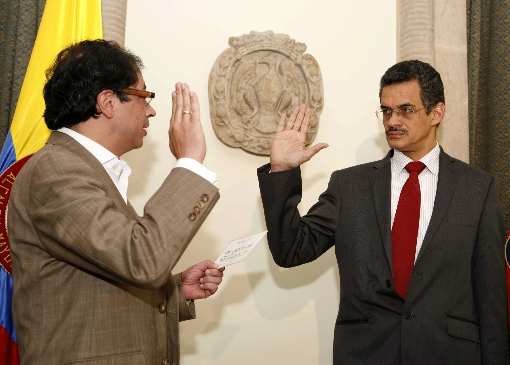
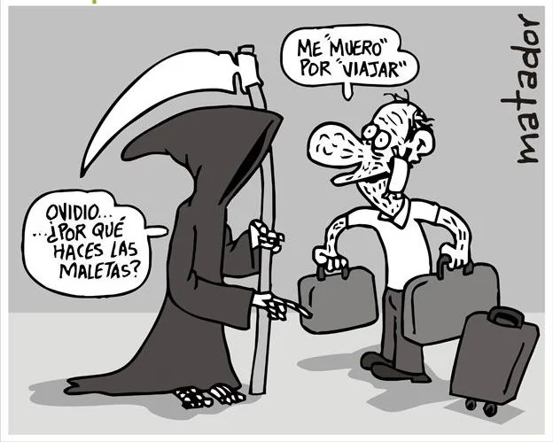
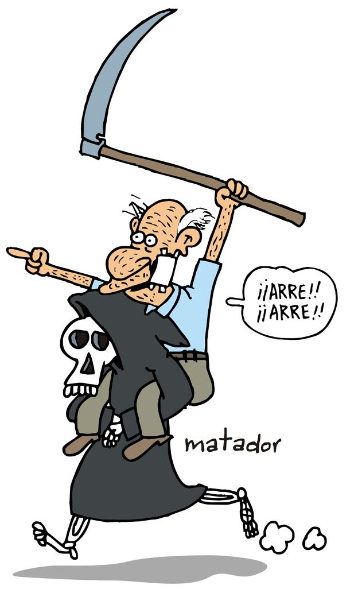

*La eutanasia a Martha fue aprobada pese a que no está en estado terminal. ¿Para qué esperar ese momento?*

La eutanasia a Martha ya está autorizada aunque no esté en estado terminal. El misterio de la muerte produce más polémica prejuiciosa que explicaciones científicas o teológicas. ¿Cuándo se ha visto que una persona recurra a una acción judicial extraordinaria para reclamar **el derecho a morir dignamente**? En Colombia teóricamente estamos en un Estado Social de Derecho, pero una persona para ejercer su derecho debe utilizar, por ejemplo, la acción de tutela. 

Mientras eso sucede, es probable que ya la tutelante le haya informado a la IPS Incodol el día de su muerte. O también es probable que hoy haya tomado esa decisión. Como se informó, **el juez 20 Civil de Medellín** le protegió su derecho fundamental a una vida digna y ordenó a su EPS e IPS que le practicara el procedimiento médico. 

El día de su muerte que, probablemente lo mantendrían en sigilo, como se dijo, puede que esté ya fijado.  Quizás cuando estés leyendo este escrito, **Martha podría ser difunta.** Ya no podríamos buscarla entre los vivos, pues su cuerpo pasaría a otra dimensión. ¿Es el misterio de la muerte? ¿Es la superación del dolor del cuerpo?

## ¿Crisis de fe o valentía?

Martha sufre un dolor de su cuerpo. Nadie puede condenar a otro a mantener el dolor. Si partimos de la teoría profunda de los derechos humanos, llegamos a la conclusión que las personas son dueñas de sus cuerpos. Por tanto, nadie ni el Estado deben interferir en en esa soberanía, salvo en circunstancias especiales. Por ejemplo, el suicidio. Somos una sociedad tan enferma mentalmente que el suicidio se cataloga como un problema de salud pública en Colombia como en Estados Unidos.

En nuestro país 8 personas se suicidan al día, según el Departamento Administrativo Nacional de Estadística (DANE). En el 2020 se reportaron 1.314 casos, y en 2021 en el mismo periodo se han reportado 1.489 casos. O sea, que la tasa de suicidio se ha aumentado considerablemente. Y nadie pone el grito en el cielo.

Martha Sepúlveda reiteró que quiere morir para evitarse un estado lamentable provocado por la **Esclerosis Lateral Amiotrófica (ELA)**, la cual está acabando lentamente con su vida. Mientras tanto, hace dos mil años Jesús le dijo a Marta, hermana de Lázaro, quien cuatro días antes había muerto por una enfermedad:

> «Yo soy la resurrección y la vida; el que cree en mí, aunque esté muerto, vivirá. Y todo aquel que vive y cree en mí, no morirá eternamente. ¿Crees esto?»
> 
> Juan, 11:25

## ¿Qué va entre Martha y la hermana de Lázaro?

https://youtu.be/56LjtshBk0A

La decisión de las dos Martha (Martha Sepúlveda y Marta la hermana de Lázaro) son diametralmente opuestas. Mientras ella quería que su hermano viviera y se lamentó que Jesús llegara cuatro días después de que una maligna enfermedad se lo llevara al otro mundo, **Martha Sepúlveda quiere morir**. Lázaro fue resucitado. 

Las diferencias son enormes. En aquellos tiempos Jesús quería dar testimonio del poder de Dios. Vio la oportunidad de mostrarlo con Lázaro, no porque Jesús quería mostrar su poder. No. Fue porque su hermana creía, tenía fe y creía en la resurrección. La vida es una gracia concedida por la naturaleza, según los científicos. La muerte es consecuencia de la vida. Cuando nacemos llevamos implícita la muerte. Vida y muerte se interceptan. En esta intersección está el misterio de la muerte. 

En el último escrito del 27 de octubre, en su página de Facebook, Martha anunció:

> _A todos los que me dicen que iré al infierno. Ese dios (sic) no es en el que creo. Mi dios (Sic) es de amor..comprensión y perdón y voy hacia él. Gracias a todos los que me han acompañado. Es un día de victoria para mí. En hora buena._

## Hawking y Asprilla

*Cuando Guillermo Asprilla tomó posesión como secretario de Gobierno del alcalde Petro. Murió en 2014 cuando había cumplido 54 años.*

**Stephen Hawking**, uno de los grandes físicos teóricos contemporáneos, sufrió de **ELA**. Su cuerpo estaba paralizado. Lo único que movía eran sus párpados. Todas las demás partes de su cuerpo quedó inmovilizado. Pero aún así, pudo  escribir sus últimos libros con una interfaz. Así evitó que el cerebro quedara atrapado en un cuerpo que ya no le respondía para nada. Murió en 2018 a los 76 años. En 1963 le detectaron la misma enfermedad que sufre Martha y la que mató al escritor O**scar Collazos y al político Guillermo Asprilla.** 

A Guillermo Asprilla Coronado lo conocí en 2009. En esos momentos era el asesor político de Gustavo Petro y uno de los líderes de Progresistas. Yo era de la dirección Nacional del Polo fui seleccionado como precandidato presidencial en la consulta popular del Polo con **Carlos Gaviria y Gustavo Petro**. En esos momentos Asprilla estaba lleno de vida, fogoso e ingenioso. Era el hombre que Gustavo Petro escuchaba. Me propuso un debate político con Petro. En septiembre de 2009 se produjo ese gran debate transmitido en vivo por la televisión oficial. Tres años más tarde, me encontré con Guillermo Asprilla siendo el responsable de la _Unidad_ Administrativa Especial de Servicios Públicos. Hablamos sobre el tema de basura Cero.

En abril de 2014, ya estaba en una silla de ruedas. Siendo secretario de Gobierno de Petro seguía cumpliendo sus labores muy a pesar de que su cuerpo se iba deteriorando progresivamente. Cuando nos vimos en el hotel Charleston de Bogotá  me preguntó: **«Lucio ¿qué estás haciendo?»** Le conté que me había venido a Bogotá desde diciembre del 2012 por amenazas de muerte en Cartagena. Me dijo: **«¿Quieres hacer Vox Populi en Bogotá?»**. «¡Me encantaría!», le respondí. Me puso a hablar con **Daniel Winograd**, el superasesor del alcalde Petro. Aunque me regresé a Cartagena, le agradecí su gesto solidario. Pero el 21 de junio de 2014 murió en medio de una batalla jurídica con el procurador **Alejandro Ordoñez**. Lamenté su muerte. Fue un hombre brillante.

Así como Asprilla, en los últimos días, Hawking no movía nada. Sus sistema nervioso no respondía. Pero su cerebro seguía pensante y actuante, vivo y activo. No obstante, había un detalle, el resto de su cuerpo no le obedecía. Si no fuera por esa interfaz conectada a su cerebro para que una computadora transformara sus impulsos eléctricos cerebrales  en voz, no hubiese transmitido sus pensamientos. Su cerebro hubiese quedado secuestrado por un cuerpo que no respondía a sus órdenes. Era el puente que lo conectaba al mundo. **Era un brillante cerebro que podía transmitir sus brillantes ideas.**

## Ovidio: «Me muero por viajar»

*"Me muero por viajar".*

 En Pereira «un zapatero bohemio, anarquista y ateo» decidió hacer un viaje al otro mundo. Quería morir dignamente aquejado de un singular cáncer que le estaba destruyendo toda su cara. Los dolores eran insoportables. Su espíritu estaba menguado. Su formación liberal lo llevó a tomar una determinación que está amparada en la Constitución Nacional: la eutanasia. Pero en su camino —hacia ese viaje sin tiquete de regreso— se hizo largo y tortuoso. Encontró muchas trabas del sistema de Salud. Como este es un sistema guiado por el vaivén del mercado y no por el derecho a vivir dignamente, le negó la solicitud Ovidio González. Como quien dice, sigue sufriendo en esta vida.

*El 3 de julio de 2015 se cumplió la eutanasia a Ovidio González, padre del caricaturista Matador. Cortesía.*

Sin embargo, el 3 de julio de 2015, Ovidio González, padre del caricaturista Matador, recibió el pasaporte para la otra vida. Ese día debió enfrentarse a la muerte. Pero lo que no sabemos —quizás nos morimos de la duda— es si se fue a quitarle el báculo a San Pedro o el trinche al Diablo. Ovidio no creía en ninguna de los dos personajes. Estamos en un país de libertad de credos.

**Julio César González,** el famoso caricaturista llamado Matador, se burló de la muerte y le hizo, a su manera un loa a la vida. Su padre Ovidio González, por fin, podía morir en paz. Bienvenida la muerte, le dijo.

## La orden judicial

Regresemos al caso de Martha Ligia Sepúlveda. El juzgado 20 Civil de Medellín comprobó que la IPS Incodol vulneró el derecho de Sepúlveda a morir dignamente: Por tanto, ordenó:

> _“Cumplir con lo establecido por el comité científico interdisciplinario para morir dignamente, en acta emitida el pasado 6 de agosto del presente año, por medio de la cual, se le informa y reconoce a la tutelante, que cumple con los requisitos para ejercer su derecho a morir dignamente a través de la eutanasia”._

¿Por qué una EPS o IPS tiene que esperar una orden judicial para cumplir con la constitución y la ley? ¿Prejuicio? ¿Voto de fe? Sin lugar a dudas, Colombia es el único país donde morir dignamente es legal. Es una de las conquistas más liberales de la humanidad. Debemos ser respetuosos de las decisiones de las personas aunque uno no esté de acuerdo. 

## Vida o muerte: ¿quién decide?

Una de las muertes que más me impactó en mi época de adolescente, fuera del circulo familiar y de amigos cercanos, fue la de Andrés Caicedo, quien se suicidó en 1977 con solo 24 años.  Un post publicado por Martha Ligia en su blog reprodujo apartes de la carta que el autor del libro **_Viva la música_** le dejó a su madre:

> ..._Acuérdate solamente de mí. Yo muero porque ya para cumplir 24 años soy un anacronismo y un sinsentido, y porque desde que cumplí 21 vengo sin entender el mundo. Soy incapaz ante las relaciones de dinero y las relaciones de influencias, y no puedo resistir el amor: es algo mucho más fuerte que todas mis fuerzas, y me las ha desbaratado._

https://twitter.com/Pontifex\_es/status/1455512516860260353?s=20

En el mundo, solo 7 países han legalizado la eutanasia: España, Países Bajos, Luxemburgo, Nueva Zelanda, Canadá y Colombia. Lo curioso, en los países donde existe la pena de muerte, la eutanasia está prohibida y llena de prejuicios. En Colombia fue despenalizada en **1997\.** Reglamentada en en 2015. Para esto el Ministerio de Salud y Protección Social de Colombia emitió la **resolución 971.**

Tomar la decisión de morir no deja de ser perturbador para familiares y la sociedad entera. Pero en el caso de Martha Ligia cuenta con el apoyo de familiares. Así como Ovidio González contó con el total respaldo de su hijo Matador. 

¿Quién es el titular de la vida? A la luz de los de los derechos humanos la vida es un derecho fundamental. Su titular la posee y por esta razón él decide su propia suerte, siempre y cuando se haga en términos como lo prevé la ley y el reglamento. Vivir dignamente es el equivalente a morir dignamente. Entre la vida y la muerte existe una **intersección desconocida**. Este es el misterio de la muerte que da lugar a la especulación y a juicios morales. **Martha Ligia Sepúlveda tiene derecho a morir en paz.**