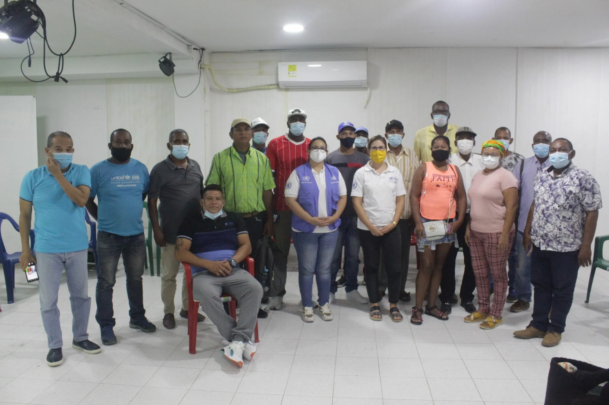

*El proyecto «Restauración de los Ecosistemas Degradados Canal del Dique» es impulsado por la vicepresidenta Martha Lucía Ramírez.*

Recorrer las huellas de los negros cimarrones del siglo XVI, XVII y XVII, es confirmar que la esclavitud sigue siendo una institución anacrónica, infame, deshumana. La Ruta del Cimarrón nos confirma que existe una esclavitud diferente, moderna, soterrada, pero esclavitud al fin y al cabo. La historia negra del Caribe y del Pacífico es la historia del despojo de sus bienes preciados. El macroproyecto **_Restauración de los Ecosistemas Degradados del Canal del Dique_** confirma el enfoque degradante y colonialista del desarrollo económico colombiano. 

Los habitantes de la **ecoregión Canal del Dique** son considerados de segunda categoría. La visión centralista y el afán de negocios desaforados que guía el macroproyecto del Canal del Dique está a punto de acabar con los últimos vestigios de la resistencia cimarrona: **el territorio ancestral**.  Si se le acaba el agua a la pecera ¿qué será del pez? Hoy, la situación de la mayoría de la población del Canal del Dique presenta unas condiciones materiales peores a las que tenía cuando se abolió la esclavitud. Muchos de ellos quedaron con tierras de explotación colectiva y ancestral. Esas tierras fueron despojadas cuando el Estado dio luz verde a proyectos de desarrollo en territorio ancestral. Ejemplos sobran. Podemos citar, **Aguas de Barcelona** (1994), **Camarones del Caribe** (1987), **Océanos S.A.** (1990), **Manuelita S.A**. (1990)  **Cultimar S.A**. y **Cartagenera de Acuicultura** (1987).

## Es un proyecto criminal

https://youtu.be/qVwwpN5U9a8

No hay restauración con el macroproyecto de **"restauración de los ecossistemas degrados del Canal del Dique**".

«El proyecto es criminal, porque es destructivo, completamente destructivo», manifestó uno de los viejos líderes de Lomas de Matunilla, corregimiento de Turbana, Antonio Gody en este diálogo franco que sostuvimos en VoxPopuli Digital.

## El Canal es un cementerio vivo

https://youtu.be/WUa5OPtXaTY

El Canal del Dique es el cementerio más grande de los desaparecidos de Colombia. Según el relato de Antonio Godoy, sobreviviente del holocausto paraestatal, en la **_Loma del Muerto_**, ubicada entre San Onofre (Sucre) y Arjona (Bolívar), los paramilitares mataban a campesinos y luego arrojaban sus cadáveres al Canal del Dique. En sus profundidades pudieron echar cerca de 20 mil cuerpos de gente humilde. ¿Los organismos de justicia transicional conocen de este hecho? Vea el relato de Antonio Godoy. 

## Desarrollo, inclusión y reparación

Por esa razón, cualquier proyecto de desarrollo económico que afecte al territorio ancestral debe tener el **enfoque de afrorreparaciones** o de etnoreparación. **Julio Arboleda**, hermano de Sergio Arboleda, nombre que lleva la universidad en su honor, fue uno de los grandes esclavistas del suroccidente colombiano. Se opuso férreamente a la ley de abolición de la esclavitud. Pretendía que los esclavos o el Estado indemnizara a los amos para liberarlos.

https://youtu.be/41ovDf8PpGo

Debemos recordar que a través de la llamada trata transatlántica, entre los siglos XVI y XIX, al menos **12,5 millones de africanos esclavizados** fueron traídos violentamente a las Américas. ([Eltis y Richardson 2010](/articulos/iconos/article/view/4700/3804)). En la Gran Cuenca del Caribe llegó la inmensa mayoría. Aquí se crearon puertos negreros desde donde eran exportados a diferentes partes de las Américas. Cartagena fue uno de los principales puertos donde se compraban y vendían negros esclavizados por lotes.

En el momento de la abolición real, los grandes propietarios de negros esclavizados ejercieron un poder en los diferentes gobiernos para mantener esa detestable institución económica. El esclavo era un producto, cuya inversión representaba un gran costo para el amo. Es decir, el esclavo era su propiedad privada como cualquier activo de su hacienda o de su mina.

## Promesa incumplida de la independencia

La promesa de la revolución de la independencia de liberarlos una vez se despidiera al imperio español, solo fue posible con la **ley de 1951**. Materialmente la libertad no se dio. Un año después hubo necesidad de otra ley para eliminar la esclavitud de aquellos que eran entregados en adopción a familias pudientes. O sea, que la promesa de Bolívar de liberarlos una vez triunfara, fue una promesa de cumbiambero.

El negro del Canal del Dique, por ejemplo, resistió los peores momentos de su historia. Y hasta nuestros días esa ha sido su realidad. Fue arrinconado en su territorio ancestral por la industrialización, la explotación exacerbada de los recursos naturales, el afán desmedido de lucro y la violencia paramilitar y guerrillera.

https://youtu.be/X6tgI9KFsCI

¿Qué libertad pueden tener más de 150 mil hombres y mujeres que no pueden disfrutar de su territorio, usos, y costumbres? Si el proyecto de Restauración de los Ecosistemas Degradados del Canal del Dique desconoce a los pobladores de esos territorios ¿qué espacio tendrán para disfrutar de su libertad, de su seguridad alimentaria, de la movilidad, de los frutos del territorio, de las relaciones sociales y del entorno ambiental sano?

## Proyectos que destruyen

Escuchar esos testimonios en este seriado de videos hace sentir al espectador de que la esclavitud, los días aciagos de la Violencia Política o de la violencia paramilitar o los proyectos económicos vendidos como restauración, destruyen lo más preciados que tiene la gente negra: el territorio. Esa es su vida y la herencia que le dejan a sus próximas generaciones.

Por esa razón, la lucha que libran los líderes de las asambleas de los consejos comunitarios del territorio busca que se les reconozcan como sujetos de desarrollo y de derechos. Este es el papel que viene librando la Alianza para la Integración, Defensa, Autonomía y el Desarrollo del Territorio del Canal del Dique, de la cual hace parte la fundación **Vox Populi Corporación, conjuntamente con Corpolucha, la Ruta del Cimarronaje y la Agencia Nacional Étnica.**

Esas comunidades no están contra el desarrollo, quieren hacer parte del desarrollo. Pero pretenden detener la voracidad de convertir todo en negocios mezquinos a costa de los recursos naturales y de la supervivencia de esta población olvidada y excluida por el gobierno centralista.

## Desarrollo y violencia

*En la sede de Vox Populi Corporación se reunieron representantes de la ONU para hacer una escucha con los líderes de las comunidades del canal del Dique.*

La línea de violencia asociada al desarrollo en el ecosistema Canal del Dique se pretende prolongar con el macroproyecto Restauracación de los Ecosistemas Degradados Canal del Dique (nombre real Ruta 5G). La Agencia Nacional de Infraestructura (ANI) viene imponiendo violentamente dicho proyecto. Las consultas previas, más que un diálogo intercultural, las han transformado en una acción violenta de amenazas y desplazamientos. Testigos de ese accionar es la misma comunidad de Boca Cerrada. 

El día 29 de agosto de 2021, dos individuos armados llegaron a la residencia del líder comunitario [**Onilson Amaranto**.](https://www.google.com/url?sa=t&source=web&rct=j&url=/wp-content/uploads/2021/09/ALIANZA-COMUNICADO-No2.pdf&ved=2ahUKEwjDg6aM_aH0AhWCTDABHZLVCscQFnoECAcQAQ&usg=AOvVaw0w1Id0QpOEeqNKl0OHQyoV) Uno de ellos accionó su arma corta pero ésta afortunamente no respondió debido a que se engatilló. Amaranto es una de las personas que se ha opuesto a la forma como vienen imponiendo tales consultas previas que solo responden a los intereses de los promotores del proyecto.

El 19 de octubre también en Boca Cerrada, se presentó una escuadra de 10 hombres, portando fusiles y pasamontaña. Se transportaron en un bote impulsado por motores 350 caballos. Visitaron casa a casa, cuadra a cuadra, convocando a una reunión. Dijeron que «no querían» a determinadas personas en la comunidad y debían aprobar la consulta previa del proyecto.

A raíz de esa situación, varias familias de Boca Cerrada se vieron obligadas a desplazarse, ya que temen por su vida. Este hecho fue denunciado ante la Procuraduría General de la Nación y es de conocimiento público.