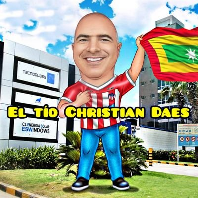
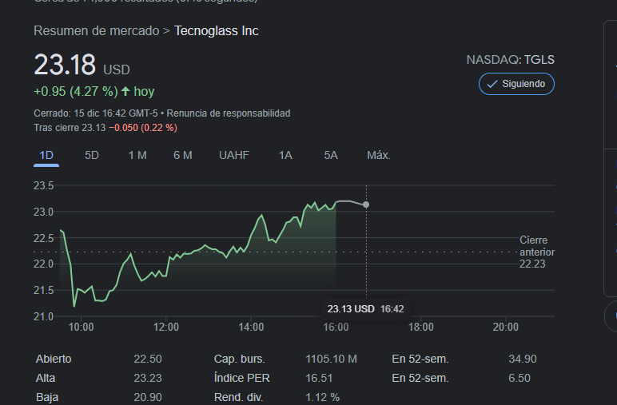

*El CEO de Tecnoglass, Samuel Azout Papu. Con el informe de Hindenburg Research se inició la caída libre de Tecnoglass. Cortesía Twiter.*

La caída libre de las acciones de Tecnoglass parece que no podría recuperar el terreno perdido, por lo menos, antes de que finalice el año. ¿Por qué? Existe un pequeño detalle que se quiere desconocer. En un mercado bursátil tan competitivo como el de Nueva York, cualquier presunta irregularidad, la cobran muy caro. Las exportaciones ficticias, por ejemplo, es una práctica más vieja que «cagar agachao», como expresará coloquialmente cualquier barranquillero. Pero es una operación deshonesta y se constituye en un fraude a la economía y a las arcas oficiales.

Lo que un colombiano desearía es que una empresa nacional triunfe en el mercado norteamericano. Esto no es un problema de orgullo o envidia, es fundamentalmente un acto de confianza y transparencia. Pero especialmente, de legalidad. Juego limpio en la economía para los inversores.

## Siete bufetes contra Tecnoglass

¿El beneficio de inocencia lo tiene Tecnoglass? Claro que sí. ¿Está bien soportada la información que denuncia las operaciones ficticias de Tecnoglass? Sin duda, si. Pero la empresa afectada solo se limitó a manifestar que la «información amañada solo busca engañar a los inversionistas». Para los directivos de Tecnoglass, la intención de esa información era hacerles caer sus acciones:

> "Contiene declaraciones inexactas, afirmaciones infundadas, **ataques personales** y especulaciones con la intención de engañar a los **inversionistas** y hacer caer el valor de las acciones de la compañía para su beneficio personal. Los ataques personales, y posiblemente discriminatorios contra los ejecutivos de Tecnoglass realizados por el vendedor de corto plazo parecen haber sido hechos para distraer la atención de los logros y el progreso de la compañía”.
> 
> Comunicado de prensa de Tecnoglass.

Mientras tanto, siete bufetes de abogados anunciaron hoy que preparan una demanda contra los directivos de Tecnoglass. Por ejemplo, medios de prensa de los Estados Unidos señalan que **Hagens Berman Sobol Shapiro** LLP, de San Francisco, California, llamó a los inversores de Tecnoglass Inc. (Nasdaq: Tgls) con pérdidas significativas a presentar sus balances ahora. 

De igual manera, también los bufetes **Kessler Topaz Meltzer & Check, LLP** de Pennsylvania y **Bragar Eagel & Squire, P.C.**, de Nueva York. Inicialmente otros tres bufetes **Johnson Fister, Gibbs Law y Holzer & Holzer** habían anunciado una acción contra Tecnoglass. La investigación se centra en las afirmaciones de los directivos de Tecnoglass sobre la **_«expansión de la cartera de pedidos y el crecimiento general de los ingresos»_**, información desdibujada por la investigación forense de **Hindenburg Research**.

El CEOO de Tecnoglass, **Cristian Daes**, señala que lo publicado por Hindenburg Research es un «amañado informe». Además, que no exportaron 76 millones de USD sino dos a Componenti.

https://twitter.com/ChrisDaes/status/1469445966117978115?s=20

## ¿Exportaciones ficticias?

*El tío Cristian no come caviar, prefiere revoltillo de huevo con arroz, como prefería Pablo Escobar, el patrón del mal.*

El informe de  Hindenburg Research —que marcó el inicio del desplome de las acciones— presentó una situación característica en la práctica comercial de los Daes. En honor a la verdad, es una práctica de muchos empresarios de la nueva ola de Barranquilla que en la década en los 80s se vio inundada de dineros de mala procedencia. Esos empresarios estuvieron vinculados a la industria textil y otros sectores de la economía asentados artificialmente en la Vía 40 de la ciudad. **Se trata de las exportaciones ficticias. Exportaciones de papel.**

La tesis central del informe es que sospechan de los ingresos de Tecnoglass:

> "S_**ospechamos firmemente que Tecnoglass ha falsificado una parte significativa de sus ingresos**. La compañía siempre ha tenido dificultades para recaudar ingresos, con el indicador DSO (DSO, Days Sales Outstanding) duplicando al que tienen empresas similares._

En otras palabras, lo que demuestra el informe es que el 100% de las ventas de Tecnoglass no es real. Un alto porcentaje viene de ventas ficticias con clientes vinculados a ellos por nexos, incluso, familiares.

> _El mayor cliente de Tecnoglass de 2013 a 2016, una compañía llamada **GM&P,** representó el **26% de las ventas solo en 2016**. El CEO del cliente «independiente» es primo del CEO y COO de Tecnoglass, según los registros públicos. No se encontró revelación de la relación familiar._
> 
> Hindenburg Research-HR.

https://twitter.com/ChrisDaes/status/1471125227425968143?s=20

Esta es una manifestación de respaldo a los Daes, con Cristian a la cabeza.

De comprobarse judicialmente el informe de HR, tendría consecuencias funestas para la empresa, directivos y sus propietarios. Las exportaciones ficticias es una práctica, como lo dijimos, muy vieja en la economía colombiana. Esto permite cambiar **dinero _mal habido_** por **dinero limpi**o. Sería una situación fraudulenta que pondría más nerviosos a los inversionistas y se abstendrían de comprar acciones en la Bolsa de Nasdaq. ¿Qué pasaría? Sería el desastre para Tecnoglass, la familia Daes Abuchaibe y sus socios. Incluso, para el CEO de Tecnoglas, el reconocido ejecutivo empresarial Samuel Azout Papu.

## La caída libre de Tecnoglass

El jueves y viernes de la semana pasada sus acciones se desplomaron a más de 40% de su valor, **33,70 dólares**. Este martes 14 de diciembre se detuvo la caída transitoriamente. Abrió con **20,45** USBD ,y al terminal el horario comercial, se cotizó en **22,23 USD**. O sea que recuperó **1.13** de lo perdido el jueves y viernes (**13,5**) de la semana pasada. Pero fuera del horario comercial, las acciones están en **22,07 USD**. 

Hoy, 15 de diciembre, la operación abrió con 22,65, y, al momento de escribir este artículo, las acciones cerraron a 23,18 USD. Una leve recuperación con una variación de 0,53.

Hoy, sin embargo, las fluctuaciones de las acciones de Tecnoglass, dieron signos de una leve recuperación.

/articulos/samuelazout/status/1470413445157769225?s=20

## La caída libre con expedientes judiciales

La veracidad de los informado por Hindenburg Research —retomando información de contexto que había publicado **Voxpopuli.Digital**— **está soportada por expedientes judiciales**. Un expediente, en particular, nos acerca a uno de sus aliados estratégicos, el conglomerado de los Char Hermanos. Este hecho, en su oportunidad, despejará todas las dudas de la presunta vinculación de los Char al lavado de activos.

¿Cuál es ese pequeño detalle que puede presagiar un desastre en Tecnoglass? **José Manuel «Yuyo» y Cristian Daes Abuchaibe** —los dueños de Tecnoglass— tienen antecedentes que los persiguen en sus vidas como viejos demonios esperando devorar sus almas.  Es un detalle que solo lo conocen los que realizan esa practica desde hace mucho tiempo.

Según las fuentes testimoniales y documentales de Vox Populi, «Yuyo» Daes y Eduardo José Lozada eran socios en 2004. ¿La prueba? Rodrigo Tovar Pupo, alias «Jorge 40», estando recluido en **San José de Ralito**, los mandó a matar. Esta versión contraría a la que se venía tejiendo, en el sentido de que fue el Cartel de Cali que mató a Lozada. NO. Fue «Jorge 40», porque Lozada era un alfil del «Yuyo», según me informó una fuente que estuvo vinculada con Lozada. Al parecer, en el gobierno de Hoenigsber 2004, «Yuyo» y Lozada no estaban dando cuenta al jefe paramilitar de la época por el manejo de los recursos de **Método & Sistemas,** la firma que manejaba los impuestos del Distrito de Barranquilla.

Lozada le trabajaba a los Daes. Era uno de los calanchines para desarrollar la vieja operación de las exportaciones ficticias. Se suponía que a través de los puertos de La Guajira salían las mercancías para el exterior. Pero todo el proceso era ficticio, cuenta la fuente consultada por VoxPopuli Digital.  El dinero malo entraba clandestinamente del exterior. Luego lo hacían aparecer como ingresos de las exportaciones legales ficticias, y la empresa legal lo recibía como producto de las exportaciones a través de los Certificados de Reembolsos Tributarios—CERT del Banco de la República.

## ¿Cómo funciona la lavandería?

La fuente que trabajó con Lozada, indica que recibían doble beneficios. Por un lado, lavaban el dinero del narcotráfico, y por el otro, recibían las bonificaciones de los CERT. Estos títulos son un instrumento de apoyo a las exportaciones de acuerdo con los productos y condiciones de los mercados a los **que** se exporte. De hecho, es una devolución de todo o una parte de los impuestos indirectos pagados por el exportador.

Por ejemplo, si el dolar sucio del mercado subterráneo costaba menos $100 ó $200, al convertirlo en dolar limpio, no solo se lavaba el dinero sino que además recibía el valor oficial de la divisa y la compensación de los alicientes por la exportación. Es decir, que los Daes recibían triple beneficio. Por un lado, la comisión por el lavado de capitales al Cartel de Cali y, por el otro, la equivalencia del cambio y los incentivos gubernamentales por las divisas recibidas de las exportaciones. «¡Eso es mucha plata!», dijo la fuente.

Esa es una práctica consuetudinaria por un importante sector de empresarios del país. Este sector se caracteriza por tener capacidad de maniobra política, porque es capaz de financiar campañas de parlamentarios, gobernadores y alcaldes. Incluso, hasta financian presidentes. Los Daes apoyaron financieramente las campañas de los últimos presidentes de Colombia, Incluso, tienen cuotas políticas en sus gabinetes. 

## Karen, la cuota de los Daes

La que fuera Mintic, **Karen Abudinen Abuchaibe,** era cuota política de los Daes y los Char. Por tanto, ella no llegó sola. Estuvo allí porque sus familiares y socios fueron unos de los empresarios que ayudaron a la elección de Iván Duque Márquez. Lea este informe en los próximos días.

## Un viejo negocio

El negocio de los Daes, también lo tuvieron en Barranquilla los Slebi, Yidis, Dacaret, Vargas, entre otros. Aplicaron el misma esquema de las exportaciones ficticias. Con esta práctica no solo se expandieron en el mundo económico sino también en lo político. Conozca los orígenes del negocio de las ventas y exportaciones ficticias en el próximo artículo

Las Megaempresas para la lavandería que han funcionado en Barranquilla. Estos y otros temas desarrollaremos en las ediciones venideras de VoxPopuli Digital como regalo del Niño Dios.

### Este es el informe en español:

[Hindenburg Research denuncia ingresos ficticios de Tecnoglass en Nasdaq](/articulos/hindenburg-research-denuncia-ingresos-ficticios-de-tecnoglass-en-nasdaq/)

## [Ventanas a Trump e «ingresos ficticios» ¿la verdad de Tegnoglass en Nasdaq?](/articulos/hasta-hace-unos-dias-tecnoglass-se-mostraba-como-el-orgullo-barranquillero-hoy-sus-acciones-en-la-bolsa-de-nueva-york-han-caido-estrepitosamente-como-resultado-del-informe-que-se-publica-a-continuac/)

## Te pueden interesar algunos de estos artículos relacionados

[En «cloacas financieras» clanes familiares, expresidentes y vicepresidenta (I)](/articulos/en-cloacas-financieras-clanes-familiares-expresidentes-y-vicepresidenta-i/)

[Costa Caribe: «Los Talibanes de la economía» en «cloacas fiscales» (II)](/articulos/costa-caribe-los-talibanes-de-la-economia-en-cloacas-fiscales-ii/)

[¡Piñata para Claro y los corruptos en Mintic: (V)](/articulos/pinata-para-claro-y-los-corruptos-en-mintic-v/)

[La narcoeconomía: el atentado a «Yuyo» Daes y asesinato de Losada (IV)](/articulos/el-atentado-a-yuyo-daes-y-el-asesinato-de-losada-clave-de-la-narcoeconomia/)

[Los 7 días que estremecieron a Tecnoglass en Nasdaq y Mintic](/articulos/los-7-dias-que-estremecieron-a-tecnoglass-en-nasdaq-y-mintic/)

[¿El Betto, el nuevo Baloto de la corrupción en el ICBF? (I)](/articulos/el-betto-pone-en-peligro-el-sistema-de-proteccion-infantil-del-icbf/)