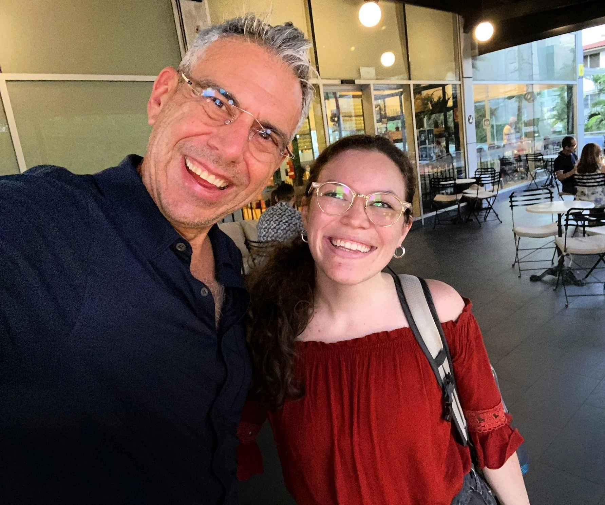
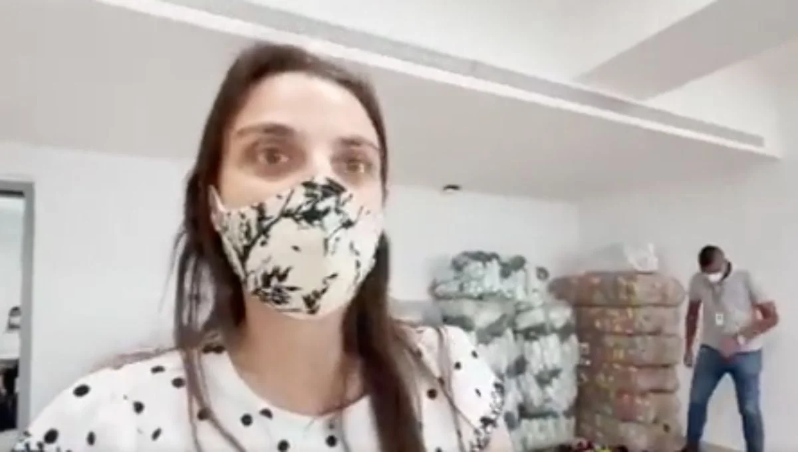
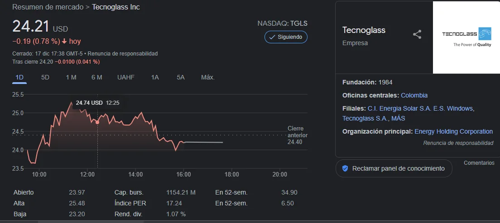

*Del cielo al infierno fue la caída de Tecnoglass en Nasdaq, la bolsa de Nueva York. Cristian Daes,*

Del cielo al infierno, es la brusca caída de Tecnoglass en Nasdaq. Mientras la empresa barranquillera hace todo lo posible para enfrentar las fluctuaciones críticas del mercado bursátil de Nueva York, definió su estrategia de defensa para recuperarse de la brusca caída de sus acciones. Pero, sobre todo, pretende defenderse de la amenaza de siete bufetes de abogados de los Estados Unidos que representarán a los inversores afectados.

La Tecnoglass de los hermanos Daes Abuchaibe pasa por un momento difuso del cielo y el infierno, la alegría y la incertidumbre. ¿Podrán reponerse de este desplome? La respuesta es clara: si. Siempre y cuando reconstruyan la confianza entre sus inversores. Aquí les presentamos nuestro análisis en video.

## Del cielo al infierno

https://youtu.be/5ymZKLGxaOw

Vea el video. **Periodismo de análisis** de Lucio Torres.

Para ir del cielo al infierno solo hay un paso. Desde 2013, es decir, 8 años después de lanzarse a la gran aventura de cotizar en una bolsa tan competitiva como Nasdaq, los hermanos Daes (**«Yuyo» y Cristian**) y el CEO **Samuel Azout Papu**, están cruzando el _**Niágara en bicicleta.**_ Las aguas turbulentas llevadas por las corrientes de la competitividad, están a punto de hacer naufragar el barco de Tecnoglass en el mundo de la cotización bursátil. 

Esas aguas turbulentas, que solo se pueden comparar con las de **Bocas de Ceniza**, tienen tambaleando el barco de Tecnoglass. Ni siquiera un buen timonel como **Samuel Azout Papu**, el popular Sammy, podría llevarlo a puerto seguro.  El timonel no funciona si los motores no responden. ¿El naufragio le espera? No necesariamente. Esta es la segunda ocasión en que sus acciones han caído. Fueron siete días que su espiral alcista se vio resentida por el escándalo de la que fuera ministra de Las Tescnologías y la Comuninicación (MINTIC), Karen Abudinen Abuchaibe.

## Reconstruir la confianza

*Samuel Azout Papu, el CEO de Tecnoglas, el popular Sammy, quien juega como James en el mundo empresarial.*

Para enfrentar esta nueva situación, los CEOs de Tecnoglass se vieron en la necesidad de estructurar un **Comité Especial** integrado por directores externos de su firma con el fin de reconstruir la confianza vuelta añicos por la compañía **Hindenburg Research** (HR) con su informe que tiene una gran influencia en los medios bursátiles de Nueva York. 

¿Por qué no adoptaron esa decisión desde el mismo momento en que conocieron el informe de HR? ¿Por qué reaccionaron 10 días después? Una respuesta tardía que en el vaivén bursátil se hace costosa y, a veces, es irreparable la falta de una acción oportuna. 

En el mundo de la **Era Virtual**, tal como lo hemos explicado en la **Escuela de Liderazgo y Emprendimiento de VoxPopuli University**, **nada puede existir sin transparencia.** Tarde o temprano la verdad fluirá. Las cosas materiales huirán como el agua entre los dedos. Estamos en una sociedad liquida a la manera de Bauman. En la vida **líquida,** según el sociólogo y filósofo Zygmunt Bauman, la sociedad se basa en el individualismo.

Cuando en 2018 me invitaron a dictar una charla en el Tecnológico de Comfenalco de Cartagena, le dije a los jóvenes estudiantes que todo es efímero, como el arte efímero. El performan, la nada. Todo es temporal e inestable que carece de aspectos sólidos. Todo lo que tenemos es cambiante. Si hoy tus acciones cuestan 34,90 dólares, mañana (¡hoy mismo!) pueden valer 18. **Todo tiene fecha de caducidad**. ¿No lo has entendido? Te explico. No estamos en las estructuras fijas del siglo XX. **Estamos _ad portas_ de una nueva era.** Todo pasará, incluso, este mal momento de Tecnoglass. ¿De qué dependerá su eternidad? Indudablemente de la acción de sus ejecutivos.

## La transparencia, el mayor activo

El mayor activo de las empresas de hoy es la transparencia. En un solo instante todo se puede derrumbar si no hay transparencia. Es el mayor activo de toda empresa de la Era Virtual. En la Era Industrial las grandes corporaciones y empresas multinacionales se podían dar el lujo de mentir, y de mentir con alevosía. Hoy no es tan fácil. Fíjense lo que le pasó a **Facebook** después de que **Cambrige Analytica** manipuló los datos suministrados por esa red social de internet. **¡Perdió 37 mil millones de dólares!** 

La famosa compañía **Enron** se vio sumida en uno de los grandes escándalos de la historia empresarial de los Estados Unidos. El **Escándalo Enron (2001),** como se denominó en su momento**,** marcó su desaparición. Pasó a la historia empresarial de los Estados Unidos como uno de los escándalos empresariales más grandes de la historia de ese país. No entendieron que iniciaba una era donde la **transparencia es fundamental para los negocios**. Una era donde cada individuo tiene una cámara y un micrófono en su teléfono que lo puede hacer llegar a un periodista o a un medio como **VoxPopuli Digital**. **Ahora los secretos empresariales son escasos**. ¿No ves que la competitividad se basa en la cooperación?

Si bien los CEOs de Tecnoglass inicialmente le dieron poca importancia a la información descalificando a la firma como vendedores de corto plazo, ahora sintieron el **_meque_**.  Fue un golpe duro, pues, sus acciones no levantan cabeza desde ese fatídico 10 de diciembre de 2021. Hoy, cierra sus acciones en rojo con **24,21 dólares**. O sea, 10,69 dólares menos que la máxima obtenida hace 11 días.

El ascenso vertiginoso e impecable de Tecnoglass fue golpeado inicialmente en el mes de agosto de 2021, después de haber tocado por segunda vez la campana de cristal de Nasdaq. 

## Un antecedente

*Karen Abudinen y sus regalos de Navidad.*

Cuando se produjo el primer golpe titulamos el análisis de ese momento [Los 7 días que estremecieron a Tecnoglass en Nasdaq](/articulos/los-7-dias-que-estremecieron-a-tecnoglass-en-nasdaq-y-mintic/). En ese instante, la curva de sus acciones se volvió loca. Y fue su primera caída que duró una semana. Pocos se habían explicado las causas de este hecho. Pero lo cierto es que se produjo por el escándalo de **Mintic. Karen Abudinen Abuchaibe** es socia de sus primos Daes Abuchaibe. De alguna manera Tecnoglass sufrió el coletazo del escándalo que estalló en el mes de agosto de 2021. 

En aquel momento publicamos en ese artículo:

> Como se puede apreciar en la gráfica de [**Investing**](/articulos/equities/andina-acquisition-corp-historical-data) (dele clic) que se adjunta, las acciones de Tecnoglass comenzaron a caer desde el 11 de agosto. Ese día **Abudinen Abuchaibe** pidió aplazar la audiencia que tenía prevista sobre la caducidad del problemático contrato. Al día siguiente desde que se dio a conocer el hecho en el mercado internacional de los Estados Unidos, las acciones en Nasdaq cayeron. Toda vez que los pequeños ladrones de cuello blanco (Centros Poblados) se llevaron el dinero para los Estados Unidos supuestamente para adquirir implementos tecnológicos con el fin de montar los puntos de internet del contrato con Mintic.

De pronto, el 11 de agosto, las acciones de Tecnoglass — que costaban más de 26 dólares— comenzaron a caer. El caso sucedió poco después de conocerse que el **Banco Itaú** denunciara la falsedad de las garantías presentadas por **Centros Poblados**. Los inversores se pusieron nerviosos. Vinieron 7 días consecutivos de caída hasta el 17 de agosto. Aperturó en rojo con **21,00** con una variación **\-3,98%**. Nada halagüeño.

## La recuperación

*Del cielo al infierno. A 24.21 dólares cerro esta semana Tecnoglass. Muy lejos de los 34 dólares que había alcanzado antes de que se desplomaran por segunda vez.*

No obstante, desde el pasado 7 de septiembre comenzó una recuperación hasta sobrepasar el nivel que tenía antes del escándalo de Mintic. Ese día sus acciones alcanzaron 26 dólares hasta llegar a 34 dólares poco antes de su segundo desplome.

Los expertos consideraron que esa turbulencia era algo normal en un mercado bursátil que se mueve con el nerviosismo de los inversores. Pero, sobre todo, con la conducta de los CEOs que están al frente de esas entidades. ¿Qué distrajo a los inversores en aquellos momentos? Todo se le atribuye al escándalo de **Karen Abudinen Abuchaibe,** MIntic de la época. Ella estaba en el ojo del huracán. Como nunca, había sido sometida a uno de los peores acoso que los medios de comunicación podrían someter a funcionario alguno.

No obstante, en el segundo desplome la situación es distinta. Sus causas no son extrínsecas. Es decir, se debieron a factores que están por fuera del control de los CEOs de Tecnoglass. Y así, es más fácil manejar una situación de crisis delas acciones. El problema de hoy es que las causas son intrínsecas. Es decir, que hacen parte de la naturaleza misma de Tecnoglass.

## Causa estructural

Recordemos que la economía y, específicamente, las cotizaciones en la bolsa, se basan en la confianza que debe generar las compañías. En una bolsa como la de Nasdaq, donde cotizan las empresas más importantes de la tecnología en redes, se debe tener en cuenta varios hechos. El **tiempo** de las fluctuaciones, la **seguridad**, el **potencial**, la **consistenci**a, el **análisis** del sector, en el caso de Tecnoglass, la construcción y la **diversificación.** Se trata de no poner todos los huevos en la misma canasta.

De esa manera podemos colegir que las causas de la segunda caída en picada de las acciones de Tecnoglass son profundamente intrínsecas. Según Hindenburg Research, tienen la hipótesis de que falsificaron sus ingresos y aplicaron operaciones opacas en su contabilidad. Todo esto matizado por los antecedentes de los hermanos Daes Abuchaibe.

La creación del Comité Especial ¿podrá sanear la situación? Es lo que pretenden los CEOS de la empresa. Debemos decir que es una labor muy difícil. La única manera de lograrlo es que se demuestre lo contrario a lo informado. O también que corrijan el camino torcido, si todo eso es verdad. 

No obstante, los antecedentes personales de los hermanos Daes Abuchaibe no se podrían borrar. Quizás tendrían que vivir con ese estigma. ¿Es justo todo esto? Los seres humanos tenemos derechos a corregir nuestro andar. La historia de la humanidad nos ha demostrado que muchos criminales se convirtieron posteriormente en santos. Es el caso de Pablo, quien aprobara la lapidación de Esteban, protomartir del cristianismo, y después se convirtió en santo y en el canciller de las naciones cristianas. Del cielo al infierno, del infierno al cielo, solo nos separa el ser, más que el tener.

/articulos/caida-libre-de-tecnoglass-en-nasdaq-por-exportaciones-ficticias/#:~:text=En%20%C2%ABcloacas%20financieras,el%20ICBF%3F%20(I)