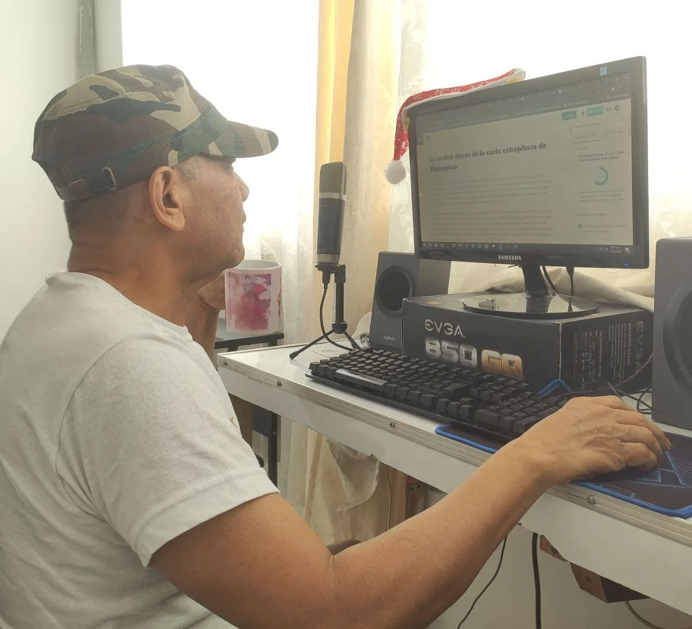
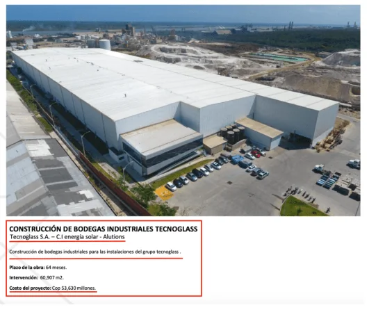
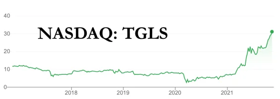

(imagen no disponible)
*Cristian Daes Abuchaibe, sin la calva que hoy lo caracteriza,CEOO de Tecnoglass, en los tiempos mozos cuando llegaron a Barranquilla procedentes de La Guajira, centro del contrabando de la Costa Caribe. Foto tomada de álbum particular. Cortesía.*

Tecnoglass en Nasdaq. La principal sospecha que ahora se suma al camino torcido de los Daes es la creación de ingresos ficticios de su empresa matriz, cuyas **acciones crecieron este año un 390%**. Este crecimiento, **Cristian Daes, el CEO del grupo, lo explica porque más del 70% de sus ventas va a satisfacer la demanda de los Estados Unidos.** Saltó del garaje de una casa a funcionar en 260 mil metros cuadrados con una venta mayor de **$1.2 billones anuales**. Además, a venderles los ventanales a 14 torres construida por Trump. **Tecnoglass es el orgullo barranquillero en la Bolsa de Nueva York.** Pero, en esta semana que termina, la caída estrepitosa de sus acciones en Nasdaq nos pone a pensar que sus días están contados en la cotización internacional. 

La causa de esa caída se explica con la información revelada por la firma [Hindenburg Research](https://hindenburgresearch.com/), lo cual confirma lo informado en **VoxPopuli Digita**l. En concordancia con la propaganda de los medios de comunicación dominantes de Colombia, el registro sutil de esta noticia, desdibuja la importancia que ello significa. Pero también muestra que el esfuerzo de presentar una información alternativa, tarde o temprano tiene su receptividad en el plano nacional e internacional.

El informe la citada firma lo publicó con el siguiente titulo: «**Tecnoglas: Conexiones con carteles de cocaína, acuerdos familiares no revelados e irregularidades contables, todo en un Nasdaq SPAC».**

## El mejor periodismo

*Plasmar en el texto las ideas centrales de la investigación y saborear un buen café, dan como resultado "el mejor periodismo". Un lector amigo nos hizo caer en la cuenta de la necesidad de hacer este autoreconocimiento, lejos del autobombo.*

No se trata de hacerse autobombo. Recibimos la información de Hindenburg Research con mesura. Pero sentimos la satisfacción de que nuestros intereses periodísticos van en dirección del deber ser y **no responde a marquillas políticas ni comerciales, como reza nuestro eslogan**. En esto, deslindamos territorio con los grandes medios de comunicación.

Gran parte de esa revelación es coincidente con lo divulgado por www.voxpopuli.digital en diferentes seriados sobre la economía de Barranquilla. Ahora que lo presenta una de las firmas más importantes de Nueva York especializada en investigaciones de finanzas forenses, **demuestra que lo investigado por nuestro portal responde a los cánones del mejor periodismo mundia**l.

## Un ascenso vertiginoso

El ascenso vertiginoso de Tegnoglass en el mundo bursátil de Nueva York fue recibido con alborozo por el conjunto de medios del país y, especialmente de Barranquilla. El hecho de tocar la campaña de cristal de Nasdaq, por segunda vez, no era una noticia de poca monta. ¡Era extraordinaria! El mundillo financiero y los periodistas especializados publicarontoda clase de lisonjas para el grupo empresarial de los Daes, aliados estratégicos de los Char. Estos dos grupos económicos ejercen un poder totalitario en la economía, la política, la cultura y la información de Barranquilla y de todo el departamento del Atlántico.

El mismo **Cristian Daes** reconoce que Tecnoglass, en solo 24 años _«ha tenido un crecimiento monumental que emplea más de 5.500 personas»_. Además dice que la empresa fabrica a diario unas 2.500 ventanas, y que sus productos se distribuyen a más de 30 países, como Estados Unidos, Singapur, Alemania, España, Turquía, Israel y la mayoría de naciones de América Latina. 

El Grupo Tecnoglass —señala en su portal empresarial— abarca actualmente tres compañías: **Energía Solar ESWindows, Tecnoglass y Alutions**. Todas lideran el negocio de ventanas, fachadas de aluminio y vidrios para proyectos residenciales y comerciales. Destacan que este liderazgo se debe a «su capacidad de innovar y en su habilidad para conquistar mercados internacionales». Dicen que aprendieron a vender sus productos en momentos de crisis al adaptarse a las tendencias y necesidades de la industria extranjera.

## En 2013 Tecnoglass en Nasdaq

Luego del atentado a «Yuyo» Daes, (2004), primer CEO de Tecnoglass, de donde salió milagrosamente vivo, tuvo tanto éxito que el 90 por ciento de sus productos iban a parar al mercado extranjero. De hecho, uno de sus clientes más fieles fue **Donald Trump**, el anterior presidente de Estados Unidos. Tecnoglass trabajó en la construcción de ventanas y marcos de aluminio en 14 torres de los Trump. 

> Pero años después, cuando la depresión llegó al país norteamericano, la compañía capoteó la crisis al ampliar sus mercados a nuevos destinos de Centroamérica y Europa. Desde ese momento, Tecnoglass creció en forma extraordinaria. Debutó en 2013 en la bolsa de valores Nasdaq, el mercado bursátil más importante de acciones tecnológicas, en el que cotizan empresas de la talla de Apple, Facebook, Microsoft y Amazon. En enero de 2016 ingresó a la Bolsa de Valores de Colombia (BVC), bajo el mnemotécnico TGLSC. **Hoy es una de las compañías más valiosas del país y, al mismo tiempo, una de las más transparentes, pues ejerce rigurosos procesos de control anticorrupción y de lavado de activos.**
> 
> Tecnoglass hecho en Colombia.

## ¿Una gran lavandería?

*¿Tecnoglass una fábrica o una gran lavandería?/Foto cortesía.*

Pero todo ese poder no lo han conseguido respetando los cánones del ejercicio libre del comercio, la política o la cultura. No. Se han valido de la triquiñuela, el soborno y del poder económico alcanzado para elevar a Barranquilla, probablemente, en la gran lavandería del narcotráfico y de la corrupción político—administrativa colombiana.

Lo sorprendente es que Barranquilla se ha sometido a ese poder totalizante con el apoyo de sectores de las élites cachacas. ¿Cómo es posible que esto se dé en una ciudad que se precia de cosmopolitan, liberal, democrática y abierta a las nuevas tendencias internacionales? ¿Por qué no ha surgido un movimiento social que se sacuda de este estigma? ¿Por qué no se ha apelado a la historia de Barranquilla como cuando en la década de los 90 surgió un gran movimiento en contraposición del _establishment_ instaurado por **Name, Slebi, Martín Leyes, Noguera Carbonel, Gerleín Echeverría**? ¿O cuando en los 60 y 70 surgieron movimientos cívicos que se contraponían a los intereses de las élites políticas dominantes?

Pareciera que en Barranquilla todos y todas comen en el mismo plato de los Daes y los Char. Mejor dicho, da la impresión que toda Barranquilla come de las migajas que caen de la meza de «Los talibanes de economía colombiana», el **«Daescharismo»**. Si los talibanes de Afganistán viven de la producción y procesamiento de la amapola (heroína) ¿de qué vive el «Daescharismo»? La hipótesis que habíamos manejado en VoxPopuli Digital hoy es confirmada por una firma internacional especializada en finanzas forenses Hinderburg Research.

## Los Daes en Pandora Papers

De hecho, en el último informe que publicamos —a propósito de los Pandora Papers— que titulamos **[«Los Talibanes de la economía» en «cloacas fiscales» (II)](/articulos/costa-caribe-los-talibanes-de-la-economia-en-cloacas-fiscales-ii/)** dimos cuenta que no era gratuito que las firmas Offshore de los Daes y los Char aparecieran. Por el contrario, nos confirmó las informaciones que habíamos difundido a lo largo de estos años. Partimos de fuentes de entero crédito, ya que existen expedientes judiciales que hasta ahora no se han explorado.    

Esta caída estrepitosa podría marcar la continuidad de un fenómeno que apareció en el mes de agosto cuando estalló el escándalo del Ministerio de Tecnologías de la Información y las Comunicaciones de Colombia—**Mintic.** En el ojo del huracán estaba Karen Abudinen Abuchaibe, prima hermana de los CEO de Tegnoglass, Carlos Yuyo Daes y Cristian Daes. Y no es cualquier prima. Es una vieja socia que estuvo vinculada en los inicios de Tecnoglass. Regresó de los Estados Unidos para enrolarse en la administración del alcalde de la época Alejandro Char.

## Tecnoglass en Nasdaq y Karen en Mintic

Efectivamente, en la segunda quincena de agosto de 2021, cuando el escándalo de Mintic estaba en todo su furor, publicamos el articulo titulado «Los 7 días que estremecieron a Tecnoglass en Nasdaq y Mintic». Sus acciones en Nasdaq cayeron por cinco días consecutivos, pero la variación no fue tan abismal. Su variación fue de US 23.58 a 22.33. Es decir, US 1.23. En esta publicación dijimos:

> _En tanto si uno ahonda en las causas de los siete días que estremecieron a Tecnoglass, notará que la economía y, específicamente el sistema financiero, es el resultado de la conducta humana. Así lo explica la psicología cognitiva. Esto es, que como **Karen Abudinen Abuchaibe (Mintic)**, es prima y socia de **los hermanos Daes Abuchaibe, dueños de Tecnoglass Inc.**, los inversionistas son presas del temor. Tanto como que casi todos los **$70 mil millones** del anticipo se fueron para Estados Unidos. Y ya Karen tenía lista la resolución de pago de los otros $25 mil millones que debían anticiparle a Centros Poblados. ¿Por qué Karen Abudinen prefiere ser ejecutiva del gobierno y no de la exitosa empresa de sus familiares y mecenas? La respuesta se puede resumir en una sola frase. **Los Daes Abuchaibe ganan más como contratistas del Estado que con Tecnoglass**._ 

La segunda caída tuvo una variación de 40% de la cotización de sus acciones. En el día en que se escribe este artículo, se cotiza en 21.55. Sus acciones habían alcanzado un valor de US 34.90. O sea, que en este segundo desplome sus acciones han perdido a la fecha 13.45. O sea que Tecnoglass cuesta menos ahora. Esta situación se complicaría porque las predicciones de los expertos es que la industria de la construcción ya alcanzó el pico que se esperaba. Quiere decir, que la demanda se contraerá al cubrir sus necesidades.

Recordemos que la primera caída se produjo cuando estalló el escándalo del famoso contrato del Ministerio de Tecnologías de la Información y las Comunicaciones de Colombia—Mintic, cuyo dinero, al parecer, se lo llevaron a una cuenta Offshore en Delaware. 

## La información relevante de Tecnoglass en Nasdaq

*José Yuyo Daes "Oye, te hablo desde Nueva York"*

*La curva que indica el crecimiento de las acciones de Tecnoglass en Nasdaq.*

Sin lugar a dudas, **Hindenburg Research**, es una firma dedicada a investigar los antecedentes de firmas que cotizan en las bolsas de Nueva York. Aplica una metodología de finanzas forenses. El dato más importante que reveló y que Voxpopuli Digital presentó anteriormente se refiere a sus orígenes asociados al narcotráfico y al lavado de capitales. Pero lo nuevo que mostró esa firma —que nosotros nunca tuvimos acceso a dicha información— son las informaciones financieras que muestran un manejo poco ético de sus ingresos. Es decir, que pueden ser ingresos ficticios. Es la misma estructura que se utiliza para las exportaciones ficticias. Exactamente, la conclusión de Hindenburg es la siguiente:

> _Dado lo anterior, **sospechamos firmemente que Tecnoglass ha falsificado una parte significativa de sus ingresos**. La compañía siempre ha tenido dificultades para recaudar ingresos, con el indicador DSO (DSO, Days Sales Outstanding) duplicando al que tienen empresas similares._

Por ser de mucho interés, publicamos el texto completo de Hindenburg Research. Es una traducción del equipo de redacción de VoxPopuli Digital. Así lo titula: **[«**Tecnoglas: Conexiones con carteles de cocaína, acuerdos familiares no revelados e irregularidades contables, todo en un Nasdaq SPAC»**](/articulos/hindenburg-research-denuncia-ingresos-ficticios-de-tecnoglass-en-nasdaq/)**.

## Te puede interesar publicaciones relacionadas

[En «cloacas financieras» clanes familiares, expresidentes y vicepresidenta (I)](/articulos/en-cloacas-financieras-clanes-familiares-expresidentes-y-vicepresidenta-i/)

[Costa Caribe: «Los Talibanes de la economía» en «cloacas fiscales» (II)](/articulos/costa-caribe-los-talibanes-de-la-economia-en-cloacas-fiscales-ii/)

[¡Piñata para Claro y los corruptos en Mintic: (V)](/articulos/pinata-para-claro-y-los-corruptos-en-mintic-v/)

[La narcoeconomía: el atentado a «Yuyo» Daes y asesinato de Losada (IV)](/articulos/el-atentado-a-yuyo-daes-y-el-asesinato-de-losada-clave-de-la-narcoeconomia/)

[Los 7 días que estremecieron a Tecnoglass en Nasdaq y Mintic](/articulos/los-7-dias-que-estremecieron-a-tecnoglass-en-nasdaq-y-mintic/)

[¿El Betto, el nuevo Baloto de la corrupción en el ICBF? (I)](/articulos/el-betto-pone-en-peligro-el-sistema-de-proteccion-infantil-del-icbf/)