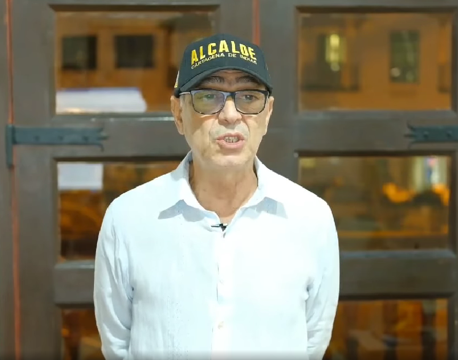

(imagen no disponible)
*La revocatoria a Daniel Quintero Calle, alcalde de Medellín, es un proceso diferente al de Cartagena.*

Cartagena y Medellín son, gracias a la intervención de la Registraduría Nacional del Estado Civil, dos caras de la misma moneda de la revocatoria en Colombia. Su intervención es tan incierta que no le da garantías democráticas a ninguna de las partes. Los procesos participativos del país (Cartagena, Medellín, Cúcuta, entre otros), independientemente de sus intenciones y motivaciones, son un ejercicio de **democracia directa**. Pero la tercerización de la actividad misional de la Registraduría Nacional boicotea las garantías constitucionales que demanda los procesos participativos y electorales.

**La Registraduría Nacional del Estado Civil es dominada por políticos del régimen neobonapartista.** Ellos no nos representan. Ellos se representan así mismo y no necesariamente a los intereses de la ciudadanía. Pero el registrador nacional, **Alexander Vega Rocha**, del partido de la U, para que su labor se destaque, debe darle garantías a sus colegas los políticos.  Sin embargo, las comunidades que deciden intervenir en procesos participativos como la revocatoria no esperan menos.  Vega Rocha debería desmantelar y denunciar el presunto **«negocio de las firmas»** donde están involucrados contratistas privados que realizan la verificación.  

Por tanto, la Registraduría se ha descompuesto hasta el punto de que es incapaz de garantizar el derecho al voto. Esto es clave en una democracia representativa. Pero también es incapaz de garantizar la participación ciudadana, esencial en una **democracia participativa**. El centro del debate está aquí. No como dice el editorialista del [espectador.com](/articulos/opinion/editorial/revocatorias-mucho-ruido-poca-democracia/): _«las revocatorias deberían guardarse para casos extremos. De lo contrario, pasa lo que hemos visto varias veces en el país. Mucho ruido electoral, poco bienestar para las personas»_. Esa es una mirada superficial de la realidad democrática contemporánea.

## Una monstruosidad contra la revocatoria

*Alexander Vega Rocha Registrador Nacional puede corregir el error de los contratistas de la Registraduría.*

Por consiguiente, el punto del debate son las garantías del ejercicio democrático, —y no otro— lo que propone la negación de la Registraduría del derecho a la participación de **Cartagena Revoca**. Al solo validar el **14,5% de las 68.500 firmas presentadas, l**os contratistas de la Registraduría le tuercen el pescuezo a la democracia participativa. Pero ese fraude, si el registrador lo quiere, se puede detener. Es un fraude que pretende abortar el proceso participativo de los cartageneros para salir de un mandatario inútil. Ese fraude a la voluntad ciudadana se puede detener. Cartagena Revoca **tiene debidamente foliado cada formato** que contiene, a su vez, 15 apoyos cada uno. **¡Es la prueba reina!**. 

Esto desbarata la pretendida intención de la Registraduría de abortar la manifestación de la democracia participativa, cuya revocatoria del mandato es la expresión máxima de la garantía ciudadana a ejercer su soberanía. Previamente, la revisamos y nos encontramos que las **firmas válidas constituyen el 79,7%**

## Una farsa verificación de firmas

https://youtu.be/OtOtVrfpB8w

Recusamos el informe técnico de la Registraduría sobre las firmas de Cartagena Revoca.

La primera observación que encontramos es la forma descarada y sinvergüenza como descalificaron el 80% de los apoyos.  La Registraduría delegó esa función en **empresas privadas** que responden a intereses económicos y electorales  de sus patrocinadores. No tuvieron ningún empache para descalificar los apoyos sin ninguna sustentación fáctica. 

Pero hay más. El informe que nos traslada la Registraduría para la observación (**Radicado: RM-2021-09-003-05-00**1) presenta varias inconsistencias técnicas. Pero veamos la más protuberante. Por ejemplo, tomamos el folio **No 150**, foliado en el acta de entrega a la Registraduría Distrital de Cartagena el **8 de noviembre de 2021**. Los apoyos están enumerados del 1 al 15.  Verificamos que los apoyos 1, 2, 3, 4, 5, 6, 10, 11, 13, 14, y 15 no incurren en ninguna de las 7 causales de invalidez establecidas por la **Resolución 6245 de 2015 del CNE**. Esto es, que del folio, 11 firmas son válidas. Pero, la Registraduría estima que son solo válidas 4 firmas. Corroboramos que el **90% de las firmas tachadas por la Registraduría, son válidas**. ¿Qué hay detrás de esta monstruosidad?

## Democracia representativa y democracia directa

**Norberto Bobbio**, el jurista y politólogo italiano, publicó un ensayo sobre el futuro de la democracia donde señala la integración de la democracia representativa con la democracia participativa. Es decir, que no no se repelen, sino que se integran.

> _“La democracia representativa y la democracia directa no son dos sistemas alternativos, en el sentido de que allí donde existe uno no puede existir el otro, sino que son dos sistemas que pueden integrarse recíprocamente. (…) En un sistema de democracia integral las dos formas de democracia son necesarias, pero no son, consideradas en sí mismas, suficientes”_
> 
> **“[El futuro de la](http://www.fondodeculturaeconomica.com/Librerias/Detalle.aspx?ctit=005135R) [democracia](http://www.fondodeculturaeconomica.com/Librerias/Detalle.aspx?ctit=005135R)”**

En efecto, esos procesos revocatorios son manifestaciones superiores que buscan ajustar y superar las limitaciones de la **democracia representativa**, la cual entró en crisis en el siglo XX. El congreso como la presidencia ya no representan al ciudadano común. Esta situación se profundiza cada día más que el **régimen neobonapartista** se acerca a su fin.  

No obstante, la profunda corrupción que se percibe en la Registraduría Nacional, no le da garantías ni a la democracia representativa ni a la democracia participativa. Gracias a las maniobras de la Registraduría, Cartagena y Medellín representan las dos caras del tráfico de influencia y del ejercicio indebido del poder político en las revocatorias. 

## Los huérfanos del poder en Medellín

De manera que Medellín es escenario de la confrontación política donde el uribismo perdió uno de sus principales **feudos electorales frente a procesos alternativos** y sin experiencias electorales. El alcalde **Daniel Quintero Calle** no está en el gusto de **Álvaro Uribe** y de sus seguidores. Éstos quedaron **huérfanos del poder**. Esta situación, al parecer, la está capitalizando el candidato presidencial **Gustravo Petro** lanzando trinos a favor del burgomaestre de los medellinenses. 

Sin embargo, la situación de Medellín difiere de la de Cartagena. Mientras Quintero entiende el camino y sabe para dónde va, Dau está perdido y carece de inteligencia emocional para situarse como verdadero timonel de la ciudad. Cartagena está manga por hombros. **Nadie sabe dónde está el piloto**. La elección de Dau fue un salto al vacío de una ciudad cansada de su clase política corrupta.

Ante una situación patética de una administración inútil y de un mandatario desorientado como el caso del Distrito de Cartagena, representado por William Dau, alias «el Tractor», la revocatoria es un mecanismo efectivo para corregir el error garrafal de su supuesta elección. Se trata de avanzar hacia una democracia representativa que corrija los errores inducidos por los candidatos o los aparatos de los partidos a través de la **propaganda política engañosa**.

## Cartagena

*William Dau Chamat, el peor alcalde que ha tenido Cartagena en toda su historia, según el pensamiento de muchos cartageneros que quieren revocarlo.*

Aclaremos —en honor a la transparencia periodística— quien esto escribe, es vocero del comité promotor **Cartagena Revoca**. Nunca he estado en el poder. Ni somos aliados de ninguna fuerza política tradicional. Obramos bajo nuestra independencia ciudadana. ¿Por qué queremos revocar el mandato de **William Dau Chamat? Existen tres razones.**  Tres hechos inobjetables:

**(1)** **Es claro su engaño** para cumplir con lo que prometió: erradicación de la pobreza y de la corrupción. De cada 10 cartageneros, 4 pasan hambre. El 97% de la contratación se hizo a dedo en este año 2021. 

**(2)** Existe un **malestar general ciudadano** por su pésima gestión administrativa: indicadores de inseguridad crecieron (41,31 muertes violentas por cada 100 mil habitantes), la salud es un fiasco, la ciudad está deteriorada. En estos dos años ha sido un fiasco administrativo.

**(3) Su incapacidad mental** para gobernar es diciente. Un gobernante debe tener los cinco sentidos bien despiertos para tomar decisiones rápidas, eficaces y sostenibles.

## La revocatoria, iniciativa ciudadana

Uno no entiende como personas ilustradas no comprendan la razón de ser de las revocatorias, independientemente de sus intenciones. Si la ciudadanía las apoya, es menester que el Estado respete los procesos y facilite la expresión o la voluntad ciudadana.

Como iniciativa ciudadana, la revocatoria es un proceso mucho más difícil que los procesos electorales de la democracia representativa. **Cartagena Revoca** y el Comité de Líderes Sociales recibieron los formatos para recolectar los apoyos en el mes de julio. Cartagena Revoca presentó formalmente **68.415 apoyos el 8 de noviembre de 2021**. El 23 de diciembre a las 5:57 de la tarde, la Registraduría presentó el informe técnico de la verificación señalando que no alcanzó los **34.272** que se exige para Cartagena. 

¿Es difícil hacer entender que estamos ante un demente que nos gobierna? ¿Por qué la Registraduría apoya este tipo de fenómeno? Sin duda, **William Dau Chamat** está secuestrado. No tiene capacidad de pensar y mucho menos de hacer. Pero tiene la complicidad del **establishment** que lo tolera, porque lo puede manejar. Él sabe que tiene el bolígrafo, pero no sabe para qué sirve. Dau solo sabe de corrupción cuando ésta es de sus oponentes. Él dice: «agarren el ladrón», mientras se roba el presupuesto de Cartagena con una contratación **_dedocrática_** en los dos años de su administración.

## La democracia directa

En una democracia directa, las iniciativas ciudadanas no cuentan con las maquinarias y empresas electorales de los políticos. No son estimuladas por el **_establishment_**. Por el contrario, le ponen todas las trabas para que no prosperen estas iniciativas. En los últimos 30 años solamente solo ha sido revocado el acalde de Tasco, Boyacá, Nelson García Castellanos. 

Un líder campesino de Tasco, **Pedro Abel Castañeda Rincó**n, lideró la campaña de revocatoria al alcalde de su municipio que llevó a 1.609 habitantes de Tasco a votar para echar al alcalde García Castellanos. Lo consiguieron el 29 de julio del 2018

Nuestra motivación es fundamentalmente ciudadana, producto de la impotencia de un periodista que en las primeras de cambio se dio cuenta del **gran engaño al electorado cartagenero**. Me dí cuenta que en su campaña mentía descaradamente. Y eso no es bueno en un proyecto supuestamente alternativo. Mintió que siendo veedor adquirió mágicamente acciones en Aguas de Cartagena. Mintió de quiénes le apoyaban. Siendo veedor, engañó a las comunidades negras frente al Banco Mundial con relación al proyecto emisario submarino. 

Sin embargo, lo que nos llevó a impulsar este proceso de revocatoria fue ver la incapacidad de cumplir con lo que prometió. Peor, ver que engañaba a la ciudad acusando de ladrón a los políticos tradicionales, pero que él hacía peor. Como el mal panadero, mientras acusa a sus colegas de malo, él daña la masa y la panadería se queda sin pan. Todo esto me hizo saltar de la silla del periodismo de investigación para asumir el papel de un mero ciudadano que le duele su ciudad. ¿Podemos los periodistas de investigación seguir investigando la corrupción cuando al frente de la sociedad están personas inútiles, incompetentes y malas personas?