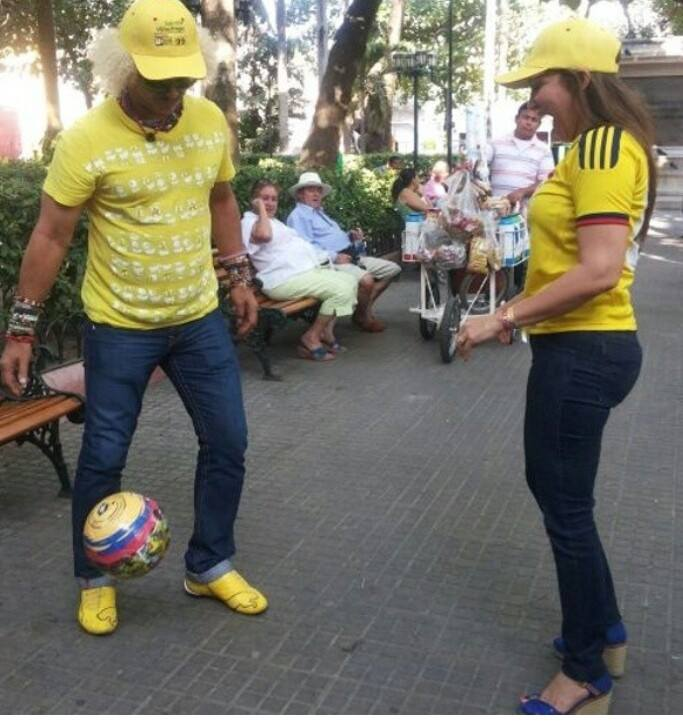
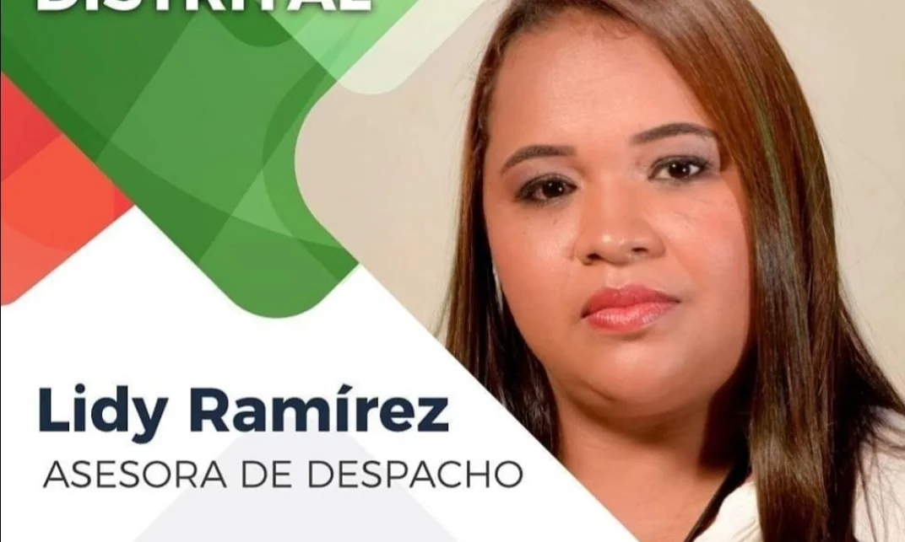
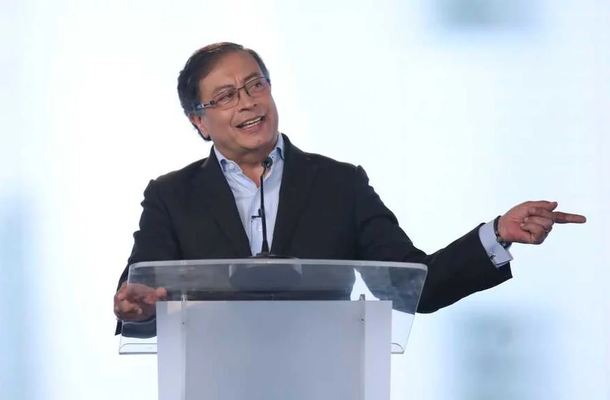

*Y se quedó Sandra en Pacto Histórico con el apoyo del Pibe. Será la primera votación en la cámara de Bolívar.*

Finalmente **Sandra Villadiego se quedó en el Pacto Histórico**. El Caballo de Troya no era ella. Si se trata de buscar un responsable de que ella esté en la lista de Bolívar es nada menos que el líder de ese frente, **Gustavo Petro Urrego**. Eso estaba cocinado desde hace varios meses. Gustavo Petro no podía despreciar una cámara segura con Villadiego. Tampoco renunciar al gran apoyo que recibirá en su campaña presidencial con la esposa de **Miguel Rangel Sosa**. Rangel y Petro son viejos conocidos del congreso.

Las decisiones para conformar la lista a senado y cámara fueron tomadas por el **Colegio Electoral (CE) de Pacto Histórico** con el visto bueno del precandidato presidencial **Gustavo Petro Urrego**. Pero **Eduardo Noriega** y los demás que le hablan al oído a Petro  en materia electoral, no hacen nada sin la anuencia del jefe del frente de izquierda.  De hecho, la lista a cámara de Bolívar quedó como se había inscrito. Sandra Villadiego se inscribió por decisión del CE de Bogotá con la señal preconcebida de Petro.

La candidata Sandra Villadiego entra con pie firme. Es la dueña del balón. Los que se opusieron a ella se tendrán que morder el codo. Algunas fuentes allegadas a la exparlamentaria, dicen que su proyecto es poner 40 mil votos en Bolívar y coadyuvar en la elección de una formula a senado que, por supuesta, será de su movimiento ADA, liderado por Roy Barreras. La más perjudicada de la jugada maestra de Sandra y Petro es la otra exparlamentaria del partido conservador, **Colombia Villamil.** En un momento te lo explico.

## Las críticas del Pacto histórico

*Consuelo Ahumada Beltrán*

Desde el interior del Pacto, surgen muchísimos cuestionamientos por incumplimiento de la metodología de configuración de las listas. A **_Consuelo Ahumada_**, una de las líderes muy cercana a Petro, la mandaron al puesto 34. Sin duda, no tendría posibilidad de ser elegida. Los más optimistas hablan de 30 escaños. Sin embargo, **Álvaro Uribe Vélez** tiene el récord de haber elegido a 19 curules encabezando él la lista cerrada.

https://twitter.com/PalmaEdwin/status/1472965452611604491?s=20

Por ende, los cuestionamientos más fuertes provienen desde el mismo seno del frente. EL Partido de los Trabajadores (PTC), creado por **Mosquera y Marcelo Torre**s, muy ligado a Gustavo Petro, fue uno de los movimientos que tuvo la valentía de ejercer su derecho a la expresión. Su secretario general, senador **Yesid García**, publicó la siguiente declaración:

> El PTC también fue afectado por algunos de los hechos indicados. Se nos asignaron en la lista de Senado los renglones 25 y 34, respectivamente, para el compañero **Edwin Palma** y la compañera **Consuelo Ahumada**. **Y fuimos excluidos** de la lista de Cámara por Bogotá para la cual habíamos postulado el nombre del compañero F**rancisco Castañeda.**

Los sectores sociales y populares fueron excluidos a favor de políticos profesionales con capacidad electoral y de recurso para financiar sus campañas. Esa fue realmente la orientación del Colegio Electoral que al principio funcionó, pero luego se tornó en un pequeño grupo de personas muy cercanas a Gustavo Petro.

> Lo cierto es que las decisiones sobre listas se ventilaron y tomaron en reducidos eventos que contaron con unos voceros y sectores y de los cuales fueron excluidos otros. De hecho, se adoptó así la vía de clasificar, discriminatoriamente, como de primera y de segunda categoría a los sectores del Pacto Histórico

## Análisis del Pacto Histórico

https://youtu.be/BayJ1qFE\_Qk

El análisis del Pacto Histórico.

## Colombia Villamil

Hasta hace poco, Colombia Villamil era del partido Conservador. Hace unos 45 días la vieron rondando en la sede del Pacto Histórico de Bogotá. Guillermo Alfonso y Eduardo Noriega del Colegio Electoral, la recibieron. Salió de esas reuniones graduada como militante de Colombia Humana. Sorpresa causó que fuera inscrita, no como conservadora arrepentida, sino como militante de Colombia Humana. ¡Explícame eso!

De tal manera, le pregunté a varios de los integrantes que si sabían de que Colombia Villamil fue inscrita como miembro de Colombia Humana. ¡Sorpresa! Nadie sabía. Creían que era de ADA, pero nunca de Colombia Humana. ¿Qué pasó con las otras mujeres que gracias al hecho de estar en la lucha de ese movimiento, pudieron ganarse el primer lugar de la lista.

## Lidy, por fuera

*Lidys Ramírez, cayó en desgracia política.*

El caso de Lidy Ramírez es digno de analizar. ¿Por qué le ha ido tan mal si todo lo tenía en sus manos? No la incluyeron en la lista al senado ni a la cámara del Pacto. Le fue como perro en misa.

Por ejemplo, lancemos varias preguntas para hacer una reflexión política. ¿Por qué Lidy Ramirez no lideró la lista del Pacto Histórico? Ella estuvo coordinando la campaña de Petro Presidente en Bolívar. Entró como la mano derecha de William Dau. Tenía el mundo a sus pies en la administración distrital. 

Recordemos que Ramírez hablaba con Petro y con la cúpula de Colombia Humana. Desplazó de ese lugar a muchos viejos líderes del petrismo en Bolívar. Incluso, a Carlos Efraím Vargas, del corazón de Petro. Y de pronto ¡Pum! Quedó sin nada. ¿Por qué no la quiere la mayoría del Pacto Histórico, incluso, de Colombia Humana? Se metió en **Fuera malandrines,** y todo se le desvaneció. ¿Por qué entró en desgracia? Quedó sin hacha, sin calabazo y sin miel. Su vida política se volvió líquida. Se fue como por agua entre los dedos. ¿Se quemó Lidys Ramírez? (Exijo otra explicación).

## El pragmatismo por la presidencia

Como Petro quiere ser presidente, lo ideológico y las propuestas son irrelevantes. Con la conformación de las listas, Petro ha sido pragmático, muy pragmático. Solo le interesa dos cosas. Votos y dinero. Con los votos gana curules, y con el dinero él gana la presidencia. No le interesa que el candidato sea un líder social de historia o la lumbrera política. Quiere ganar y va a lo seguro.

El fin justifica los medios, es la verdadera catadura del Petro 2022. 

Esa lógica primó en la conformación de la lista. Los que integran el tal Colegio Electoral serán el sambá (saco de boxeo) que desde esta noche recibirán los golpes de los seguidores de Petro. Será una rabia contenida contra los miembros del Colegio que actuarán como fusibles. Pero justificarán a su dios político. Es la irracionalidad de los seguidores que caen en un fanatismo político que les nubla el pensamiento. Así son los uribistas que le justifican al caudillo, por ejemplo, su responsabilidad en los «**falsos positivos**» ¿Hay alguna diferencia?

Por tanto, si se trata de analizar lo qué pasó, es menester desprenderse de la dictadura de la alienación. En la cúspide del Pacto Histórico no se mueve una hoja sin el conocimiento del caudillo, me explicó una fuente del CE . Es más: la inclusión de la exsenadora **Sandra Villadiego** contó con la aquiescencia de Petro, de acuerdo a lo señalado por esa misma fuente a este periodista. Ella es candidata de ADA que lidera el senador Roy Barrera. El problema es más complejo, y Petro no quiere reconocerlo. ¿Cuál es?

## El Pacto Histórico y el discurso

*Gustavo Petro*

Gustavo Petro fue uno de los líderes de la bancada de izquierda que desarrolló una estrategia de control político basada en la denuncia contra la parapolítica. Comenzó sus grandes debates en 2007 cuando los jefes paramilitares ya habían dado el paso hacia su desmovilización. En el 2006, los jefes del paramilitarismo revelaron muchos nombres de los que fueron sus aliados durante la expansión del paramilitarismo.

¿Por qué Petro ha sido indeciso, duditativo, en sus respuestas a los medios de comunicación con respecto al caso de Sandra Villadiego? Sencillo, si lo acepta publicamente, se le desmoronaría todo el discurso que construyó a lo largo de 10 años de debate sobre la parapolítica. Pero el caso del esposo de Sandra Villadiego es diferente. La familia de **Miguel Rangel Sosa** estuvo haciendo política en la depresión Momposina desde cuando el ELN ejercía un dominio en ese territorio, y después entró las FARC. En aquella época la familia Rangel tuvo que pactar con la guerrilla para hacer política en la zona. Ellos eran los mandamaces.

## ¿Por qué fue condenado Rangel?

Cuando el Bloque Central Bolívar se impuso en el territorio y echó a la guerrilla, el que quería hacer política electoral debía contar con su permiso. Eso fue lo que le pasó a Rangel. Asistió a una reunión en Pueblito Mejía (2003) acompañando a **Alfonso López Cossio**, candidato a la gobernación. Todos se tuvieron que bajar del bus con el  comandante del Bloque Central Bolívar (BCB), alias «**Ernesto Baez**». De esa reunión López Cossío salió como candidato a la gobernación con el apoyo del BCB. Tuvo varios compromisos. Entre ellos que su sucesor en la cámara (Rangel Sosa) incluyera en su UTL a la hermana, nada menos, de Báez.

A esa reunieron, tal como lo documentamos en su momento en **Vox Populi Radio**, asistieron exalcaldes, alcaldes, candidatos a alcaldes, exconcejales, concejales y aspirantes a concejales. Estaba en todo su furor el movimientos **No al Despeje y Asocipaz.** Fueron senadores, representantes y lideres políticos del departamento de Bolívar. Eso se llamó E**l Pacto de Barranco de Loba.** 

No obstante, Miguel Rangel fue condenado a 7 años de prisión por la **Corte Suprema de Justici**a. No puede compararse a Rangel Sosa como un sujeto cómplice de las actividades del paramilitarismo, tal como lo fue **Álvaro García Romero,** alias «el Gordo» García, uno de los determinadores de la masacre de 16 campesinos del corregimiento de Macayepo.

Esa situación la conoce muy bien Gustavo Petro, pero no fue capaz de ser claro con los medios de comunicación para expresar que apoyaba a Sandra Villadiego, quien finalmente se quedó en la lista abierta. Es decir, voto preferencial, tal como fue inscrita.

## Coronell y Petro

/articulos/petrogustavo/status/1472010808603422727?s=20

Igual que Coronell, como lo dijimos, teníamos fuentes bien informadas que nos aseguraron que Gustavo Petro sí conocía el proceso de inscripción de **Sandra Villadiego**. Incluso, lo ratificó una vez el Colegio Electoral le informó la decisión de inscribir a Villadiego.

En ese sentido, **Daniel Coronell** está bien informado. Cuando un periodista de investigación difunde una información tiene una intencionalidad y un determinado interés. ¿Para qué? En mi caso, me dejo guiar por el interés general, que, casi siempre, choca con mi interés particular. Mi filosofía es que el interés particular solo se satisfaría  obedeciendo el interés supremo. 

Los que seguimos de cerca el tejemaneje del CE fuimos incapaces de difundir que el tal Pacto Histórico era una mierda. Que no es como lo pintan. Se está sellando con saliva de loro. El día siguiente en que se inscribió la lista a Cámara de Bolívar, otra fuente cercana a Petro, me explicó que esa decisión debía llevarse no como lista cerrada y de cremallera sino abierta para que fuese alineada por el mismo electorado.

Petro es líder de Colombia Humana. Pero es el que manda en el Pacto Histórico. Fue creado a su imagen y semejanza. Hacen parte del Pacto Histórico, entre otros,  la Unión Patriótica, Polo Democrático, Mais, ADA, Colombia Humana, Fuerza Ciudadana, Comunes, la Red de Comités Ambientales del Tolima, la Federación Comunal del Tolima, Colectivo M-19 y el Colectivo Poder Local, AICO.

Lo que sucedió con Sandra Villadiego en la inscripción, la catapulta como la candidata más reconocida a nivel nacional del Pacto Histórico. Fue una semana donde su nombre permaneció en los medios de comunicación.

## [En Pacto Histórico:«¡No hay cama pa´tanta gente!»](/articulos/en-pacto-historicono-hay-cama-patanta-gente/)