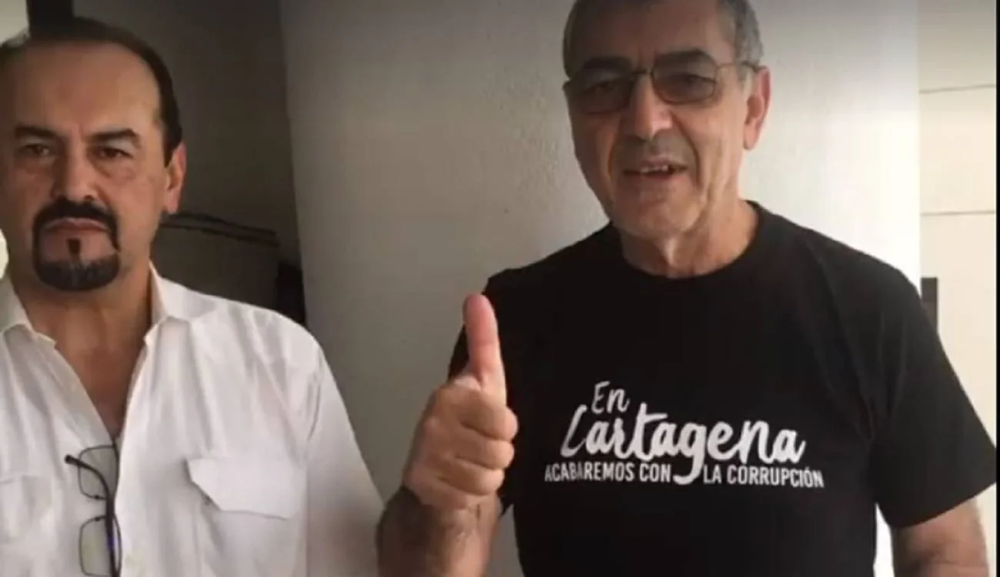
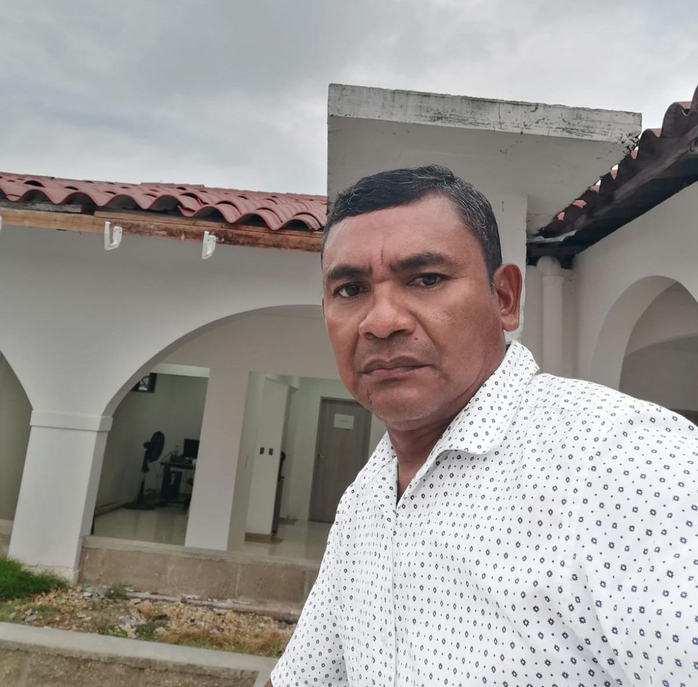

*Vestido de civil, el excoronel Luis Roa, secretario General de William Dau. La teoría del complot no se puede descartar. ¿Qué dice el comandante de la policía de Cartagena y el CTI?*

El kilo de cocaína hallado en la camioneta donde se transportaba la presidenta del concejo distrital de Cartagena, **Gloria Estrada**, deja más sombras que luces. Pero también arroja las claves para comprender la idiosincrasia de una ciudad asociada al imaginario cultural sobre la política, el narcotráfico y la moralidad. Estas claves presuponen una pregunta problemática: **¿Es el caso de Gloria Estrada comida para buitres de doble moral o un falso positivo?** 

Antes de entrar en el análisis, vale la pena aclarar que no tenemos ningún nexo con Gloria Estrada, Martín Barreto y Avelino Villamizar. **No pretendemos juzgar o absolver a nadie**. No conocemos personalmente a los protagonistas. Mucho menos tenemos alguna relación de negocios con la alcaldía de Cartagena. El periodismo profesional no puede estar al servicio de nadie. Su reto es buscar aclarar la realidad que se empaña por los múltiples lentes con que se ven los hechos. (Te invito a leer [Periodismo Inesperado](/articulos/periodismo-inesperado-ver-la-actualidad-para-mirar-la-realidad/)).

/articulos/episode/1BYQDVGjaBwgNmEpv22QB3?si=7b08e56a53594c6f

Puedes escuchar este episodio del Podcast de Lucio Torres por Spotify cuando estés viajando o en cualquier momento.

En ese sentido, contemplaremos dos escenarios que se pueden contraponer. La siembra de un kilo de cocaína al interior de la camioneta provocó un escándalo político que afecta directamente al concejo de Cartagena. Al mismo tiempo, el contralor distrital **Rafael Castillo Fortich** denunció un plan para matarlo. ¿No es sospechoso que dos entes que le hacen control al alcalde **William Dau Chamat** estén sometidos en esas situaciones extra políticas? ¿No son las medidas de hecho anunciadas por el propio alcalde? 

Por tanto, este análisis no es descabellado. Es necesario e imperativo para plantearse luces frente a hechos que ensombrecen la actividad política en Cartagena. Situación que se ha tornado más peligrosa desde que llegaron otros actores.

## In dubio pro reo

La decisión d**el Juez 18 municipal de control de garantías, Rubén Galarza Mendoza, de ordenar medida preventiva** consistente en detención domiciliaria contra **Gloria Estrada Benavides**, la presidenta del concejo, y **Avelino Villamizar**, empresario musical, refleja una decisión dudosa y ambivalente. Es dudosa, si la comparamos con la decisión de imposición de medida preventiva intramural contra **Martín Barreto,** a la postre, conductor y dueño del vehículo.  

Sin embargo, Barreto poseía un arma con salvoconducto de porte. Pero como es una pistola 9mm, de uso privativo de las fuerzas militares, se ampara con un salvoconducto especial, cuyo decreto había fenecido el 31 de diciembre de 2021.

La decisión del juez Galarza se podría señalar como ambivalente. Le dio temor  adoptar una decisión imparcial en ese caso al abstenerse de poner en práctica el principio _**In dubio pro reo.**_ De acuerdo a la jurisprudencia colombiana, es un principio jurídico en Derecho Penal según el cual si el juzgador tiene dudas sobre la culpabilidad del acusado tras valorar las pruebas, este debe ser considerado inocente. Pero también los defensores de Estrada y Villamizar se quedaron corto en su defensa. No fueron capaces de exponer con claridad la duda material que se exponía en el caso.

¿Dónde está la duda? Si el 14 de enero Martín Barreto fue al concejo por su compañera sentimental que funge como presidenta del concejo de Cartagena, contrapoder del alcalde, la esperó.  Luego ella se embarcó en el puesto del copiloto de la camioneta. Estos dos hechos proponen una realidad irrefutable de tres aristas. 1) Ella no es la dueña de la camioneta. 2) No la conducía. 3) Ella era transportada no transportadora. Es decir, es un sujeto pasivo en el verbo transportar. De la misma manera, como el kilo de cocaína era transportado, también sucedería lo propio con Gloria Estrada. Si yo tomo un taxi y el taxista tiene un kilo de cocaína escondido ¿qué responsabilidad penal tendría? La respuesta irrefutable es no.

## La teoría del complot

*Manuel Mercado, el veedor de San Onofre que junto con dos funcionarios de la Contraloría fue objeto de un complot al ponerle un kilo de cocaína en la camioneta donde iban. Presuntamente una abogada de la alcaldía fue la compradora de la cocaína para crear un falso positivo.*

Veamos un caso similar. En el 2012, en San Onofre (Sucre), sucedió algo similar al caso de **Gloria Estrada**. Habiendo un control excepcional a la gestión del alcalde de aquella época, **Nelson de Jesús Pinedo Lozano**, tres veedores y dos funcionarios de la Contraloría General de la República (CGR) fueron a verificar varias obras fantasmas. En papel se decía que las obras se habían ejecutado cabalmente, pero los veedores señalaban que las obras no existían. Había una pugna política de control social sobre la alcaldía.

Por tanto, los auditores de la CGR **Borys Llamas Fernández y Rafael Antonio Echavarría Lozada**, y los veedores **Manuel Mercado Palencia y Arnold Gómez Anaya,** cuando se transportaban en una camioneta Toyota Fortuner del excandidato a la alcaldía de San Onofre, **Francisco Romero Hormechea** (quien murió de Covid el año pasado), fueron interceptados en un sitio de control de la Policía. Uno de los agentes del operativo fue directo donde se encontraba el alcaloide. De inmediato fueron detenidos y conducidos a la URI de la Fiscalía. El abogado de los encartados pidió la libertad inmediata, la cual fue concedida por dos razones: la droga la habían adherido en la parte inferior de la camioneta y todo **encuadraba en un complot**. Además, ninguno tenía antecedentes judiciales ni relación con el narcotráfico.

En efecto,  el 2013, se pudo establecer que el kilo de cocaína lo compró una funcionaria de la alcaldía de San Onofre. Lo había adquirido en el corregimiento Rincón del Mar, según relató hoy a VoxPopuli Digital **Manuel Mercado.** Todo indica que se lo vendieron personas relacionadas con el **Clan del Golfo**.

## Prejuzgar

Las arremetidas de William Dau Chamat contra Gloria Estrada deben recibirse con sospecha. Pretenden desviar la profunda **crisis de su administración** y, de paso, salir de una de sus rivales que mayor dolor cabeza le ha ocasionado. Ya lo describimos en anteriores artículos. Le ganó la contraloría distrital. Le indujo al **«vómito negro»,** ya que tuvo que devolver $1100 millones que se autopagaron en perjuicio del tesoro público. Le suspendió a su alcalde local **Andy Reales**, el pechichon de su administración, **protegido de los Araújo y de Pedro Apont**e. Le hizo dos importantes debates sobre el PAE en 2020 y 2021, y ahora ejerce como presidenta del concejo. Distinto a los dos presidentes anteriores que fueron timoratos y le aprobaron todo al alcalde. Salieron con el rabo entre las patas, a la manera de una pelea de perros.

Desde el punto de vista periodístico, esa es la realidad. Lo demás, es puro comentario. Es decir, presunción y, por tanto, todo está dentro de la especulación. El deber del periodismo es escudriñar más allá de la presunción. Se necesita la interpretación de los hechos y de la relación dialéctica de las pruebas para llegar a una conclusión concreta.

Algunos colegas, como María Bernarda González, entendieron bien nuestro papel como periodista en la publicación en Vox Populi Digital sobre el caso de Gloria Estrada. La verdad no aparece clara ante los ojos de la ciudadanía ni delos periodistas. Siempre hay escarchas y elementos que contaminan la realidad. Pero lo importante es el lente con que uno ve los hechos. Si tienes los lentes opacados, jamás verá la realidad. Te dejarás atrapar por las apariencias. Entonces, todo lo que sale de tu boca o de tus pensamientos será fruto de tus preconceptos y prejuzgamientos. Cuando Jesús de Nazaret le dijo a sus discípulos yo no he venido aquí para juzgarlos, le estaba diciendo al mundo que prejuzgar es la carencia de amor así mismo. Es decir, se juzga así mismo. 

Por esa razón, en la política, la religión o el deporte, los individuos prejuzgan a los demás en razón de sus ideologías y no en la realidad de los hechos. Por ende, ello conduce a un desconocimiento del mundo circundante y de la verdad periodística. Por eso es que nos alegramos del mal del que creemos que son nuestros enemigos. Incluso, justificamos los holocaustos siempre y cuando se lo hagan a nuestros enemigos. La sociedad colombiana aceptó los falsos positivos porque las víctimas supuestamente eran guerrilleros o simpatizantes de la guerrilla.

## Gloria Estrada, comida para buitres

Quien puso el kilo de cocaína en la camioneta de placas IXT—443 debe tener una relación directa con algunos de los sectores del **Clan El Golfo de Cartagena.** Adquirir ese alcaloide tipo exportación no lo puede hacer sino personas que se relacionan con las mafias del narcotráfico o agentes del Estado que por sus funciones deben relacionarse con los operativos de decomiso de droga.

Sin duda, el principal sospechoso es Martín Barreto. Es el conductor y dueño de la camioneta. El alcaloide lo encontraron justo debajo del puesto del conductor. Él pasó por Gloria Estrada, su novia y no lo contrario. Le dio el chance a Avelino Villamizar. Si el novio le ocultaba a la novia que traficaba con droga, en el supuesto caso que ello fuera cierto, ¿qué responsabilidad tendría ella?

No obstante, ¿la administración distrital y la misma policía podrían haber creado un falso positivo para conseguir dos resultados con una misma acción? Esta hipótesis no es descabellada. Dau es un hombre rencoroso y de bajos instintos y de una mente invadida por el resentimiento y el rencor. Es vengativo, dicen sus allegados. Es un ser humano lleno de temores. Por tanto, se hace rodear de personas similares o de pusilánimes. Si bien tenía motivos para vengarse de Gloria Estrada, ¿cómo podría crear ese falso positivo? En medio de una mala imagen por causa de la ola de inseguridad ciudadana que vive Cartagena, un golpe de opinión metiendo presa a la presidenta del concejo pone en la gloria a la Policía. Necesariamente debería existir una complicidad aislada de parte de algunos agentes de policía.

## Dau, rodeado de exmilitares y expolicías

*Una de las últimas apariciones del coronel Roa Merchan, secretario General de Dau*

¿Cómo podrían crear ese falso positivo? Recordemos que el alcalde William Dau Chamat tiene una docena de exagentes del DAS en su administración. Algunos de estos tienen relaciones con la inteligencia tanto de la Policía como de otras fuerzas. Otros fueron procesados por falsos positivos y tuvieron que salir de sus instituciones. De igual manera, se encuentran tres altos exoficiales de la policía que ocupan cargos importantes en el Distrito. El secretario General excoronel **Luis Enrique Roa Merchan** y el director de Distriseguridad, excoronel **Pedro Rafael Rodelo Asfora**. Así mismo tiene altos exoficiales de las fuerzas militares. Todo esto se consolidó cuando el presidente del concejo distrital, **Wilson Toncel** y el alcalde estaban de **«pipí cogido»**, como el mismo Dau lo reconoció en la Reina y en La Cariñosa.

Algunos exoficiales también estuvieron como antinarcóticos. Por tanto, si la alcaldía entra dentro de los actores sospechosos de haber colocado el kilo de cocaína, habría razones suficientes para que los investigadores de la Fiscalía miren un poco esta teoría del complot.

Lo que ves no es cierto. El nuevo periodismo debe buscar la realidad aplicando lo esencial de la investigación y no conformarse con la información oficial. Para ver la verdad, basta con llegar a lo más profundo de nuestro interior y hacer fluir los principios que deben regir al ser humano.

/articulos/periodismo-inesperado-ver-la-actualidad-para-mirar-la-realidad/