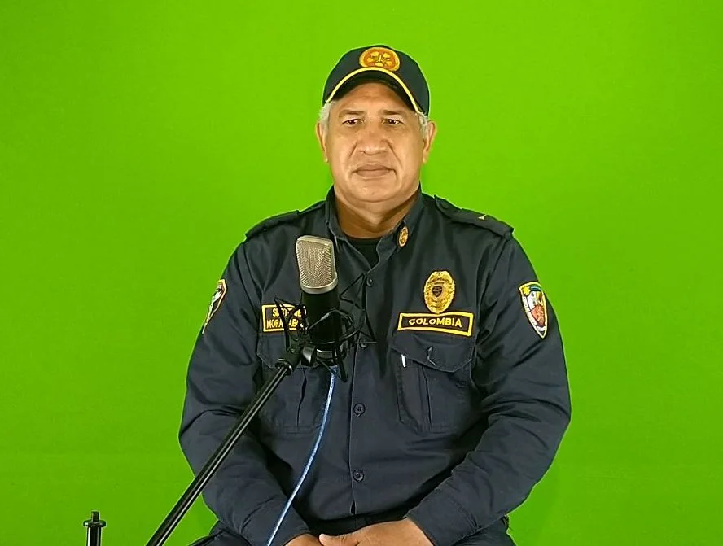
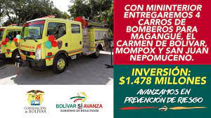

*Pablo Net Mora, comandante del Cuerpo de Bomberos de Clemencia Bolívar.*

En colombia el servicio de bomberos se podría declarar en emergencia. La causa se debe a que los entes territoriales no les garantiza los recursos de funcionamiento a pesar de existir la tasa bomberil. En Clemencia y Arjona, como en casi todos los municipios de Bolívar y del país, los bomberos se sostienen como si fueran mendigos.

Para resolver la situación de indigencia de los cuerpos de bomberos, que en su mayoría son voluntarios, el gobierno nacional creó la sobretasa bomberil que los dota de recursos. Pero los alcaldes quieren manejar ese dinero a sus anchas panchas y a espaldas de  las unidades bomberiles. Los mandatarios locales deben hacerle las transferencias a los cuerpos de bomberos y estos, a su vez, puedan hacer las contrataciones necesarias para su funcionamiento.

La Procuraduría General de la Nación y la Defensoría del Pueblo deben actuar y lanzar una alerta temprana para prevenir una situación grave como ha sucedido en diferentes partes del país. El abogado Jair caro, de Corpolucha, hizo un llamado para que los entes de control intervengan en este tema que no es de poca monta.

## Los alcaldes omiten la ley

https://youtu.be/rVJRdEFkOhU

¿Por qué las administraciones locales no han garantizado los recursos para un buen funcionamiento del servicio bomberil? En emergencia.

¿Cómo se puede resolver esa contradicción entre lo que dice la ley y lo que realmente hacen los mandatarios locales? Mientras que los comandantes de cuerpos de bomberos piden autonomía en el manejo de esos recursos, los alcaldes creen que tienen la potestad de la contratación. Ellos consideran , por ejemplo, que las unidades bomberiles no pueden administrar los fondos de la **sobretasa bomberil.** En tanto los bomberos consideran que de esa forma no pueden desempeñarse a cabalidad en una eventual emergencia que pudiera presentarse en su jurisdicción.

Como se sabe, los cuerpos de bomberos en Colombia son entidades sin ánimo de lucro regidos por la Ley General de Bomberos en Colombia o ley **1575 de 2012. La nueva norma** derogó la Ley 322 del 4 de octubre de 1996. Ésta norma fue la pionera en materia de normatividad sobre el manejo técnico, administrativo y operativo en los cuerpos de bomberos en Colombia. 

En Colombia se cree que las leyes pueden resolver por sí solas los problemas. El caso bomberil no es la excepción. Pero en la práctica los alcaldes carecen de voluntad política para garantizar el derecho colectivo de la seguridad ciudadana. De esta manera, las administraciones no están en condiciones de prevenir cualquier tipo de emergencia que pone en peligro la vida del ciudadano.

## Fondo de Bomberos

En Bolívar se creó el Fondo Departamental de Bomberos. Esto permitirá, según la ordenanza departamental, resolver el consuetudinario problemas de la administración de los recursos dirigidos a los cuerpos de bomberos oficiales y voluntarios de los municipios de Bolívar. 

A pesar de esa interesante iniciativa del gobernador de Bolívar, **Vicente Blel Escaff**, el fondo no está funcionando después de casi un año de su gestación. Hoy, ningún municipio ha suscrito contratos con los cuerpos de bomberos. Esto inevitablemente nos lleva a la conclusión, que la población está desprotegida de cualquier incendio o algún siniestro que se pueda presentar.

En las postrimerías del mandato de **Juan Carlos Gossaín** (2015) se hizo una inversión cercana a los $6 mil millones para dotar a 12 municipios de maquinarias a sus cuerpos de bomberos voluntarios. Los municipios beneficiados son: **Mahates, Arjona, Cicuco, Mompox, Turbaco, Santa Rosa del Sur**. También Santa Rosa de Lima, Magangué, Turbana, Marialabaja, El Carmen de Bolívar y San Juan Nepomuceno. El siguiente gobernador, Dumek Turbay Paz, entregó cuatro máquinas de bomberos. Los municipios beneficiados: Magangué, El Carmen de Bolívar, San Juan Nepomuceno y Mompox.  

Lo curioso es que la mayoría de este parque automotor se encuentra paralizado. Unos porque carecen de combustibles, aceites y aditamentos. Otros porque se encuentran averiados y no hay plata para los respuestos. Algunas máquinas no se les ha renovado sus pólizas de seguro.

## En emergencia

*Jacqueline Howard se tiró del segundo piso del edificio de la alcaldía de San Jacinto en 2017. Fue un incendio que acabó con la edificación.*

En febrero de 2017, mientras el gobernador de Bolívar Dumek Turbay Paz realizaba una reunión en el segundo piso de la alcaldía de San Jacinto con el titular de la época Abraham Kamell y funcionarios de de ambas administraciones se produjo un incendio que dejó 28 heridos. Allí se encontraba Jacqueline Howard, quien cayó del segundo piso. Sufrió lesiones en la cadera y en las extremidades inferiores.

En esa época apagaron el incendio con baldes de agua y usaron escaleras de madera. Por supuesto, el edificio se incendió por completo, ya que las máquinas aledañas estaban muy distantes.

No obstante, las administraciones locales han carecido de sentido de pertenencia para dotar a los cuerpos de bomberos de los recursos necesarios para su debido funcionamiento. Pareciera que estuvieran esperando un hecho más grave como el caso de Fundación (Magdalena) que resultó incineradas 32 personas, la mayoría niños, al incendiarse el bus escolar en 2014.