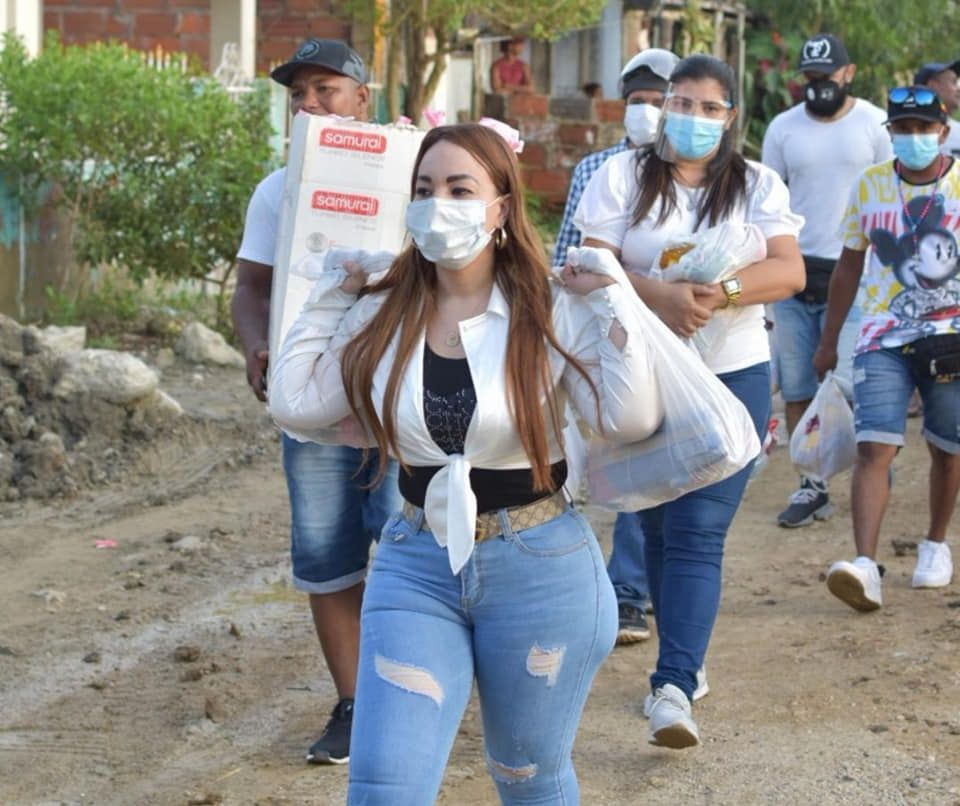

*Gloria Estrada ha sido la piedra en el zapato de William Dau. Lo arrinconó con el PAE y le ganó la elección del contralor Distrital. Quizás está pagando por su valentía al enfrentar la guerra sucia del sátrapa.*

El hallazgo de un kilo de cocaína en la oficina móvil de Martín Barreto, compañero sentimental de Gloria Estrada Benavides, presidenta del concejo de Cartagena, es la punta de un gran bloque de hielo que flota en las profundidades de las aguas turbulentas de la política local.  Pero, ¿quién ordenó sembrar ese narcótico? 

Además del kilo de cocaína en la camioneta de Estrada, la denuncia penal que puso hoy el contralor distrital, **Rafael Castillo Fortich**, ante la Fiscalía, sobre un **plan para matarlo**, debe hacer sonar las alarmas a las autoridades competentes. La Defensoría del Pueblo debe pronunciarse y reseñar el panorama de los derechos humanos. Las amenazas de muerte y hostigamiento a voceros y líderes de la Revocatoria es un caso especial de estudiar. Todo este panorama se complica con el incremento de casos sicariales en los primeros días del año.

## La guerra sucia

El 31 de diciembre de 2021, en su última diatriba, William Dau Chamat se lanzó contra Gloria Estrada Benavides y el contralor Castillo Fortich. Fue una respuesta a la batalla del PAE librada por Estrada y a la medida adoptada por la Contraloría Distrital para que el alcalde y sus secretarios devolvieran $1.100 millones que se pagaron indebidamente. Se trata de un contrato para entregar mercaditos a los niños pobres del distrito de Cartagena. Sobre el PAE, como lo informamos, el contratista no había cumplido en su totalidad con el contrato. Suministró alimentos en estado de descomposición. Ni las denuncias del 2020 y ni las del 2021 han surtido efecto. Parece que no existiera ni Fiscalía ni Procuraduria. Están durmiendo el sueño del olvido. La única entidad que ha enfrentado a Dau es, paradójicamente, la Contraloría Distrital. Entonces, no es gratuita la denuncia lanzada desesperadamente por el Rafael Castillo Fortich.

¿Cómo ocurrieron los hechos?

Martín Barreto fue por Gloria Estrada al concejo de Cartagena al mediodía del 14 de enero de 2022. Se subió en el puesto del copiloto. En el puesto de atrás estaba **Avelino Villamizar** y un conocido del él que hasta ahora se conoce como Braulio, de San Jacinto. Si Barreto fuera narco, sería un narco tonto pasearse con un kilo de cocaína e ir a buscar a su novia que tiene la investidura de ser presidenta del concejo. Y, además, el control de la contraloría, la única entidad que ha tratado de contrar al desbocado sátrapa persa. El solo creer que Barreto transportara un kilo de cocaína, no tiene presentación. De lejos se puede deducir que es una trampa. ¿Un kilo? ¿Se puede creer que hay complicidad de la misma policía para el diseño de esa trampa? En la próxima entrega analizaremos este espinoso tema de la trampa.

## La guerra sucia y el sátrapa

Si bien ese kilo de cocaína se ha convertido en un escándalo nacional, **lo que aparentemente observamos es un complot para destruir la dignidad de una mujer** que tuvo la valentía de enfrentarse a un alcalde que se ha convertido en un sátrapa persa en una ciudad caótica como Cartagena. Un sátrapa que ha sido un inquisidor moral contra una clase política tradicional autora de la degradación de la política cartagenera. Pero, al mismo tiempo, su lengua de víbora la ha usado contra todos aquellos que lo han enfrentado y para defender su propia corrupción, la cual es más galopante.

https://youtu.be/ML5YLvyyY0c

Vea y escuche el análisis. El kilo de cocaína es el iceberg de la guerra sucia.

William Dau Chamat no tiene escrúpulos ni límites para destruir moralmente a personas, especialmente a las mujeres. Se ha comportado como en la época decadente de la inquisición cuando el marido cachón se quejaba ante el inquisidor por el comportamientos de bruja de su mujer. Dau le puso una emboscada a la concejala Liliana Suárez del partido ASI, y la acribilló moralmente. Así lo hizo con mujeres que lo apoyaron en su campaña electoral, como la abogada **Lía Margarita Muñoz**, quien lo denunció ante la Procuraduría, o la misma primera dama, **Cynthia Pérez Amador**. Es una conducta no solo misógina sino perversa de este alcalde sátrapa. Es un peligro ambulante, lo pronosticamos en octubre de 2019.

## La degradación de la política

En el país nunca se había visto la degradación de la política como la que se presenta ahora. Al producirse la desaparición de los viejos jefes políticos corruptos y ser reemplazados por mercaderes y mafiosos, la **cosa pública** se convirtió en una **cosa privada** de pequeños mafiosos. La política la transformaron en un vehículo de enriquecimiento ilícito.

En el Caribe colombiano, por ejemplo, la situación es más patética. Lo que sucede en Cartagena es producto de ese proceso de descomposición. El sistema política dominante basado en la corrupción, beneficia a mandatarios que son unos verdaderos **sátrapas persas** que destruyen los valores morales de la sociedad.  Nicolás Curi, quien fue alcalde tres veces en Cartagena, es un angelito ante el monstruo moral de William Dau Chamat. ¿Nos merecemos esto?

Ese kilo de cocaína que le colocaron en laoficina móvil del novio de **Gloria Estrada Benavides** resume el estado de la política en el país. Hemos caído tan bajo en la confrontación política que para sacar del paseo al contricante debemos usar el fusilamiento moral o la eliminación material. 

## Las diatribas de un sátrapa y su guerra sucia

La inconsciencia de la ciudadanía produce los fenómenos políticos que se devuelven en su contra. Lo grave de esta situación es que somos capaces de elegir personas que no piensan en el país sino en la desgracia del otro. Creemos que solo con escuchar las diatribas perversas de un personaje bastaría para seguirlo y elegirlo. Pero el caso de Dau en Cartagena nos demuestra que la transformación del país no se puede lograr con la eliminación material o moral del otro.