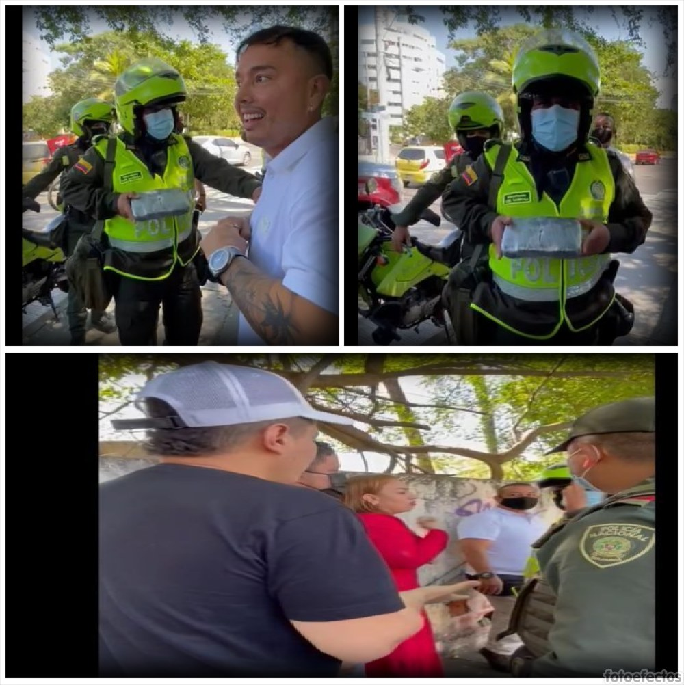
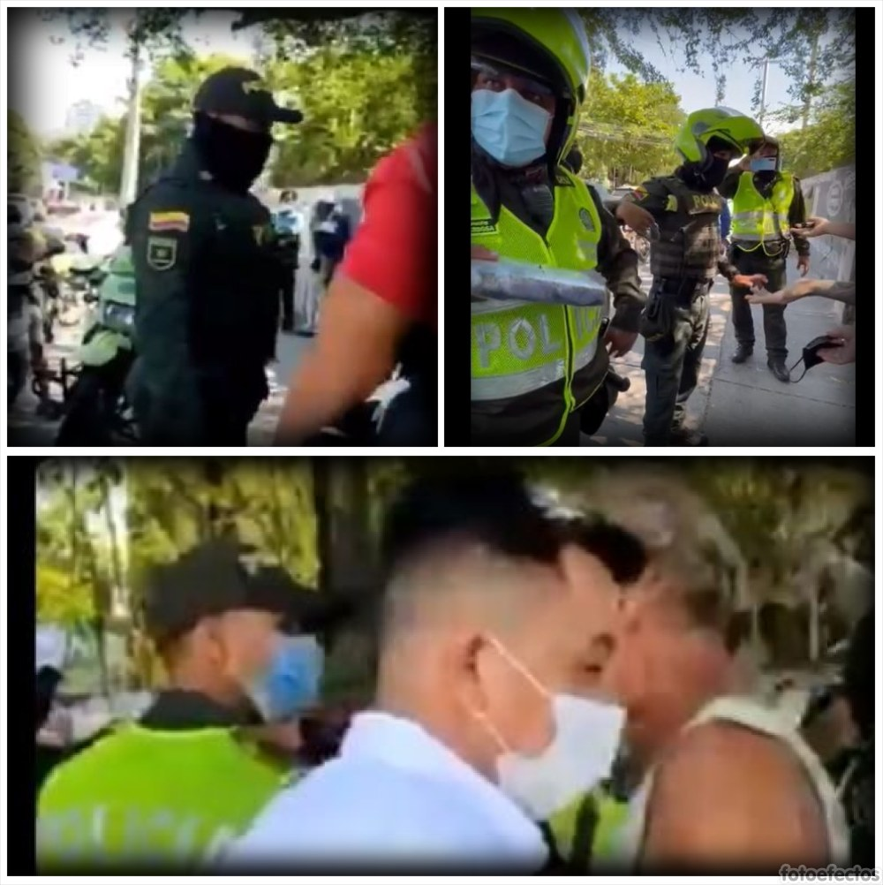

*El agente de policía Luis Barboza hace el procedimiento de captura. Pero no participó en el operativo de decomiso del supuesto kilo de cocaína. El informe policivo lo firmó el agente Alexander Salas, quien halló la droga.*

Estamos transitando —probablemente— por el camino de un falso positivo en el Caso de Gloria Estrada. Luego de más de un mes desde el operativo policivo del pasado 14 de enero que terminó con la captura de la presidenta del concejo del Distrito de Cartagena, **Gloria Estrada Benavides**, promete revelar hechos sin precedentes que refleja la degradación del ejercicio de la política en la Costa Norte de Colombia. Con estas nuevas revelaciones que antecedieron al operativo y las irregularidades que cometió la policía no buscamos construir un **_iter criminis._** Pero confirmarían la teoría según la cual **terceros quieren incriminarla para sacarla de la actividad política.**

En esta entrega analizaremos dos elementos que conducirían a la teoría del complot que expusimos desde el comienzo. Ello presupone responder una pregunta madre que surge de la hipótesis. **¿Quién o quiénes tendrían los motivos suficientes para acometer dicha acción?**

## Los encartados

Aparentemente el operativo policivo, realizado por tres agentes de la policía nacional en un retén fantasma ubicado a la entrada de Manga al final del Puente Román, presenta como sospechosos de tráfico de estupefacientes a la presidenta del concejo **Gloria Estrada Benavidez**, su pareja sentimental **Martín Barreto de la Hoz** y a un amigo de éste, **Avelino Villamizar**. Así se presentó ante los medios de comunicación.

Todo indica que la acción iba dirigida a la presidenta del concejo que solo tenía 10 días de estar despachando con esa investidura. La forma cómo se produjo el operativo lo explica claramente.

No obstante, como ya se dijo, ninguno de los implicados tiene antecedentes policivos o judiciales sobre tráfico de estupefacientes. Aunque Barreto y Villamizar tienen poses de traquetos de nueva ola, nada indicaría que se encuentran en esas vueltas raras.  

¿Por qué Barreto y Villamizar tienen poses de traqueto de nueva ola? Barreto suele usar ropa de marca, cadenas, armas con salvoconducto, carros de alta gama. ¿Qué mensaje está transmitiendo con este estilo de vida? Todo indica que es inversionista, prestamista y financista de contratistas del Estado. Es un negocio que da más plata que el narcotráfico, al decir del exsenador **Luis Carlos Martínez Sinisterra,** quien fue condenado por enriquecimiento ilícito, nexos con el narcotráfico y el paramilitarismo**.**

## ¿Narcotráfico?

https://youtu.be/mHRWrleGxy0

Si Gloria Estrada no tiene vínculo con el narcotráfico ¿lo tendrá Barreto? Hasta dónde investigué, su actividad principal no es el narcotráfico ni la bacteriología. Tampoco el dinero que tiene procede de una herencia. No. Su principal ingreso es prestarle dinero a los contratistas del Estado. 

Por otro lado, de Barreto podríamos decir que sus ingresos pudieron incrementarse exponencialmente a través de los negocios realizados con los contratistas de la localidad No 3. Así como el edil Pedro Aponte ha hecho con los de la localidad No 2. Cada uno de ellos podría tener un ingreso superior a $4 mil millones anuales. Se dice que Barreto presta el dinero para la ejecución del contrato y recibe a cambio, por lo menos, el 20 o el 30%. Si el presupuesto de la localidad llega a $14 mil millones ¿cuánto les podrían quedar a los financistas?  

La elección de Gloria Estrada prometía un duro control político al alcalde de Cartagena, **William Dau Chamat** y, en especial, a la alcaldía de localidad No 2, cuyo titular es **Andy Reales**. Este funcionario fue suspendido por el contralor distrital **Rafael Castillo Fortich** por una serie de irregularidades en la ejecución del presupuesto. **La elección de Castillo se dio gracias a la coalición liderada por Estrada Benavides.**

De tal manera que el concepto de Martínez Sinisterra es válido si analizamos el ingreso de cada uno de los financistas políticos y de sus contratistas. Los inversionistas de la política se enriquecen tan rápido como los narcotraficantes. ¿Cuál de estos dos enriquecimientos es más grave?

## El camino de un falso positivo

*Arriba, izq. Alexander Salas, quien halló la droga. Der. el agente Esneider López. No aparece el tercer agente del operativo Yosman Orozco Benavides. Abajo, Braulio Vanegas, el cuarto ocupante de la Ford, permanece impávido, pero lo dejaron libre. El informe policivo habla de tres ocupantes. ¡Falso!*

Por esa razón, la teoría del complot cobra mayor fuerza. Sobre esto hay dos elementos que debemos tener en cuenta para definir los caminos que nos pueden conducir al esclarecimiento de este hecho criminal. **La autoría material y la autoría intelectual.** Según los expertos, para incriminar a alguien de un delito que no cometió, necesariamente surge de la mente de quien lo concibió. ¿Qué lo motivó para concebir esa idea? Empecemos por la primera. Las circunstancias, modo y forma de cómo acontecieron los hechos, despeja el camino de un falso positivo. Esto, a su vez, nos conduciría a los autores intelectuales y a los determinadores del delito. 

En primer lugar, los autores materiales del presunto complot. ¿Quién o quiénes, desde la parte trasera, pudieron colocar el kilo de cocaína debajo del sillón del conductor? En segundo lugar, la autoría intelectual. ¿Quién diseñó y financió el complot?

Frente a esos dos interrogantes, existen otros interrogantes subyacentes que parcialmente despejaremos en este segundo informe. No se trata de que jugar a lo Agatha Christie, la escritora de hechos policíacos más leída de los años 70. No. Proponemos una narrativa que construya teorías, incluso, a contrapelo del informe oficial.

## Los autores materiales

¿Quiénes serían los autores de este hecho que marca el camino de un falso positivo? En esta oportunidad nos detendremos en el primer interrogante, la autoría material. Para la próxima entrega hablaremos sobre la autoría intelectual.

Sobre la autoría material, en nuestra investigación periodística podríamos contemplar la idea de dos sospechosos. A los dos quisimos entrevistar para darle el beneficio de la duda, pero no aceptaron dialogar con el periodista. Se trata de **Mauro Martínez de la Puente**, designado alcalde encargado de Barranco de Loba 2018. Y el agente que halló el kilo de cocaína, **Alexander Salas**.

## El podcast de Lucio

/articulos/episode/2NnmsBmZ9wsWoBpVy1PBIt?si=0c100b31892f416f

Escuche desde su equipo de sonido móvil o estático este análisis.

## A los hechos

Empecemos con el sospechoso **Manuel Martínez de la Puente**. Pueden ver el documental visual inserto en este post. 

El 14 de enero de 2022, 11:43 de la mañana, en la entrada principal del concejo Distrital de Cartagena, Avenida El Arsenal, una hora y media antes de que la policía hallara 1 kilo de cocaína en la camioneta Ford conducida por Martín Barreto, sucedió un hecho significativo. **De las personas que no hacían parte del círculo cercano de Barreto o Gloria Estrada era Mauro Martínez de la Puente.** Este personaje tiene sus nexos con Pedro Aponte. Sobre su relación con el edil de la localidad No 2, hablaremos en la próxima entrega.  

La pantalla muestra la camioneta parqueada en la puerta del concejo. Se distingue por la propaganda política del senador Lidio García. En su interior se encontraba al volante Martín Barreto de la Hoz. **Estaba solo hasta cuando** **Mauro Martínez de la Puente entró por la parte trasera izquierda,** es decir, del lado de la acera. **Tiene un sueter azul tipo polo sin encajar**. Abre la puerta trasera, justamente detrás del sillón donde se encuentra Barreto. Entra y permanece un rato al interior del vehículo. Ahora observamos que el abogado César Sotomayor, quien habla por teléfono abre la puerta trasera derecha.

## Martínez de la Puente

Al terminar la llamada, Sotomayor trata de subirse, pero en la entrevista que le hice, me manifestó que Martínez de la Puente le hizo señas para que se fuera para adelante, en el puesto delantero del copiloto. Sotomayor cerró la puerta y posteriormente abrió la puerta delantera de la camioneta y entró. Al poco tiempo entraron dos amigos cercanos de Barreto, Carlos Barraza y Manuel Eljaiek. Con casi todos hablé sobre el hecho. A Mauro Martínez de la Puente lo llamé varias veces hasta que me respondió. Me dijo **«que no tenía nada que hablar conmigo».**

Cuando la presidenta del concejo entró a la camioneta, se bajaron todos los ocupantes excepto Martín Barreto, quien estaba al volante. **Subieron Braulio Vanegas y Avelino Villamizar,** quienes lucían camisa blanca.

Uno de los testigos citados entrevistados por **VoxPopuli,** manifestó que ese día Martínez de la Puente no había sido convocado por Barreto, quien le habría dicho: **«Jefe, hoy la voy a pasar todo el día con usted»**.

## La sospecha

**¿Qué interés tenía Martínez de la Puente de ir donde Barreto si no estaba citado?** No lo sabemos, porque no accedió a la entrevista. ¿Pudo él colocar el kilo de coca debajo del sillón del conductor? Hay algunos elementos que sustentan esa sospecha.

Primero se colocó justamente en el sillón trasero del piloto y de allí no se movió hasta cuando llegó la presidenta del concejo. Si él puso ese kilo de droga, lo pudo hacer cuando estuvo solo. Al entrar y sentarse en la camioneta, lo hizo en forma incómoda. Posteriormente, cuando ya se iban a bajar del vehículo, alguien se dio cuenta que misteriosamente tenía el yin descocido a la altura del muslo interior.

¿Qué móvil tendría Mauro Martínez de la Puente para participar en ese complot? En la siguiente entrega sobre la posible autoría intelectual, tendremos detalles del móvil.

## El retén: camino de un falso positivo

Ahora, veamos sobre el caso del segundo sospechoso. El agente de policía que halló el kilo de cocaína. Su nombre es **Alexander Sala**s. Está asignado al CAI de Manga que se encuentra en el parque lineal ubicado entre el puente Las Palmas y el Puente Román. 

De acuerdo con los testigos y a las evidencias, los policías detuvieron primero la camioneta asignada por el concejo a su presidenta. Pero como no la vieron, los agentes se dirigieron a la Ford que se había desviado a la estación de gasolina para abastecerse. Era la camioneta donde se encontraba Gloria Estrada, quien en ese momento estaba atendiendo una llamada.

Los tres policías, como señalan las evidencias, al principio no pidieron la identificación de los ocupantes de la camioneta del concejo ni tampoco de los que estaban en el vehículo que conducía Martín Barreto. Los videos existentes demuestran que no hubo conos de retén policivo. Uno de los agentes que llegó de apoyo, debió colocarse como agente de tránsito para guiar la movilidad. Así lo indica el documental visual que publicamos. **Parece que su única misión era incriminar a la presidenta del concejo.** El agente Salas fue directo a la puerta trasera. La abrió y con su cuerpo tapó la visibilidad. Después —por arte de magia— salió con el paquete en la mano, el supuesto kilo de cocaína.

Por su puesto, ello causó sorpresa entre los ocupantes de la camioneta. Eran expresiones de asombro y de sorpresa. Así repitió Barreto: «**Nos la hicieron, Glory»**. Gloria Estrada no lo podía creer. **«¿Cómo se le ocurre que yo voy a tener un kilo de cocaína?»,** le dijo a los agentes.

Sin embargo, más que la reacción de los ocupantes, lo que se podría colegir de esta narrativa es la sospechosa forma del retén fantasma de la policía. En ese sitio, jamás y nunca colocan retén policivo. Por el contrario, ponen agentes de tránsito para que la movilidad sea más fluida.

## Cinco curiosidades

Al analizar los hechos del 14 de enero de 2022, nos encontramos con 5 casos curiosos que desdicen del operativo de la policía.  Además, demuestran que el informe policivo falseó la realidad. Veamos.

**1.** Quien lee los derechos a los detenidos no fue ninguno de los que participó en el operativo, como dice el informe policivo firmado por Alexander Salas, quien supuestamente descubrió el kilo de cocaína. En el video se ve claramente que es el agente de policía Luis Barbosa, quien apareció posteriormente de hallarse el supuesto kilo de cocaína. Una detención en flagrancia supondría que debe hacerlo los participantes del operativo.

**2.** Se formó una guachafita con el kilo de cocaína. Pasó de manos en manos, incluso alguien, que no era policía, le pasó la llave para romper el plástico que la envolvía. Por momentos el paquete lo tiene el Agente Esnaider, otras veces lo tiene Barbosa, por momento se desaparece. Así se puede constatar en este video.

## No son tres

**3.** No eran tres, como falsamente dice el informe policivo. Son cuatro los ocupantes de la Ford conducida por Martín Barreto. El cuarto ocupante es **Braulio Vanegas**, quien aparece en el video delante de los policías. El mismo que se montó en el concejo de Cartagena.

**4.** Los $7.900.000 no se lo decomisaron a Barreto, ni tampoco estaban en la camioneta, como dice el informe. Los tenía un acompañante que venía en otro carro. En ningún momento a Barreto le decomisaron el bolso donde estaba el dinero. El video muestra cuando Barreto se quita la cadena y se la entrega a uno de sus colaboradores.

**5.** No se indicó quien transportó la droga al CAI como evidencia de la captura de los detenidos y si se guardó la cadena de custodia.

## La policía falsea la realidad

El informe policivo y la realidad de los hechos que determinó la captura de Gloria Estrada y sus acompañantes son totalmente diferentes. El informe policivo falsea la realidad, por lo menos en cuatro hechos. El número de detenidos en el retén (no eran 3 sino 4), la cadena de custodia de la droga (no se sabe quién la llevó al CAI) , el decomiso del dinero (no lo hicieron a Barreto) y el agente que realmente hizo la detención no fue Salas sino Barbosa.   

De confirmarse todas estas irregularidades y despejar las dudas de los supuestos sospechosos que aquí se revela, ¿cuál sería el futuro de la investigación de la Fiscalía? ¿Llamarán a proceso a los sospechosos?

Una detención donde existe este número de irregularidades, a juicio de penalistas reconocidos, se cae por su propio peso. ¿Por qué la Fiscalía no vio estas presuntas irregularidades? ¿Por qué el juez de garantía no se fijó en el derecho fundamental al debido proceso? Aquí parece que hubiere gato encerrado.

## Te puede interesar

### [En Cartagena, ¿Policía, de la negligencia a la Gloria?](/articulos/en-cartagena-gloria-para-una-policia-de-capa-caida/ "En Cartagena, ¿Policía, de la negligencia a la Gloria?")

### [Caso Gloria Estrada: Sospechosa conducta de una juez y un edil (I)](/articulos/caso-gloria-estrada-sospechosa-conducta-de-una-juez-y-un-edil-i/)