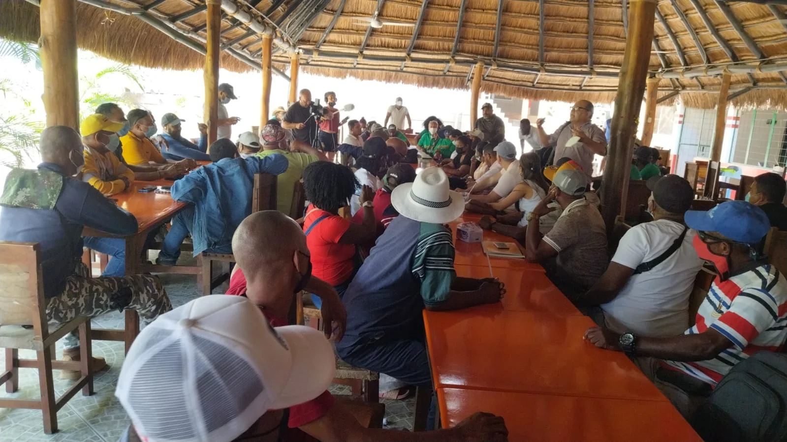

*Aspecto de la reunión realizada en Turbaco. Tema: despojo afro y megaproyecto Canal del Dique.*

El megaproyecto del Canal del Dique que impulsa el gobierno del presidente Iván Duque no cuenta con el apoyo de la mayoría de las comunidades organizadas. Señalan que esta iniciativa hace parte del proceso de despojo que históricamente sufre la población afro en el Caribe colombiano. Su ejecución enriquecería a los grandes inversionistas y traería más pobreza a la población históricamente excluida.

## Denuncia internacional por despojo Afro

https://youtu.be/bFVFpiGR\_e8

Efectivamente, representantes de diferentes comunidades del área de influencia del Canal del Dique se dieron cita en Turbaco este domingo para denunciar, ante el mundo, la forma irregular como el gobierno nacional, departamental y local le están dando la espalda al desarrollo del territorio ancestral.

## Despojo afro y megaproyecto Canal del Dique

El despojo afro y megaproyecto Canal del Dique son fenómenos que la comunidad internacional debe conocer de viva voz de los afectados. En el evento se contó con la presencia de Vox Populi Digital y de algunos medios internacionales que están haciendo un documental sobre el despojo. Además del Megaproyecto Canal del Dique, se analizó los procesos de despojos de Barú, **Santa Ana, Hacienda Arroyogrande, y los casos de las fincas Cachenche, la Europa, entre otras**.

El equipo de abogados que representan a las víctimas del despojo está integrado, entre otros, por los abogados **Héctor Pérez Fernández**, **Adil Meléndez** y **Erick Urueta**. Los representes de las comunidades pidieron a la Procuraduría y a la Fiscalía actuar de conforme con los preceptos constitucionales y legales para la protección del territorio, el trabajo de los campesinos y la seguridad alimentaria.

Se trata de preservar la naturaleza, el medio ambiente y la seguridad alimentaria. Estos bienes naturales y comunes están afectados por el macroproyecto del Canal del Dique y del despojo sistemático de la propiedad ancestral de la población afro.