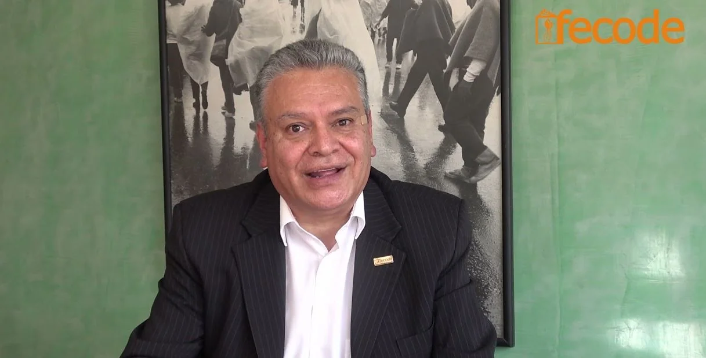

*Los presuntos perseguidores Jesús Ávila y Luis Grimaldo, directivos de la ADEA.*

La filial de FECODE en el Atlántico ejerce una **encarnizada persecución política contra uno de sus dirigentes** por el mero hecho de haber cumplido con la ley laboral. En efecto, mediante denuncia penal y llamado en garantía ante jueces, la junta directiva de la **Asociación de Educadores del Atlántico (ADEA)**,  desató  una sistemática persecución contra el expresidente [**Medardo Drago León**](https://twitter.com/Medardodrago). Y todo porque en 2015 normalizó la situación laboral a 6 trabajadores que venían siendo vinculados irregularmente a la entidad sin recibir las prestaciones sociales y otros derechos que debe disfrutar un empleado.

Todo indica que la persecución política se produce desde 2016. La Fiscalía resolvió la denuncia favorable a Drago y archivó el proceso por no haber mérito para continuar. Asimismo, dos sentencias del Tribunal Superior de Barranquilla Sala Laboral falló favorable a cuatro trabajadores que despidió el presidente del momento, [**Luis Grimaldo Mejía.**](https://twitter.com/Luigrim) Tres de ellos por haber hecho un plantón en la puerta del sindicato. Si se tratara de buscar una acción de repetición contra los responsables de tales irregularidades, debe hacerse contra la actual directiva que ha actuado contrario a la ley y a los preceptos sindicales.

Con el ánimo de esclarecer la situación, **VoxPopuli Digital** entra a investigar el hecho y espera que los 16 mil afiliados de la [ADEA](http://www.adeaorg.co/adea.php) sepan qué está sucediendo. Pero, sobre todo, para que hagan respetar la democracia sindical.

## Persecución política totalitarista

*Medardo Drago León, se siente perseguido por sus propios camaradas.*

De tal manera, porque Medardo cumplió la norma laboral, es perseguido por el sindicato. ¿Qué otra razón pueden argumentar? Una organización que está llamada a cumplir con los derechos laborales de sus empleados así como lo exigen para sus asociados, debe estar guiada por hombres y mujeres íntegros. Un directivo sindical no puede ser un patrón despiadado dentro dentro de la organización y, fuera, un demócrata que le exige al Estado todo tipo de prebendas. ¿Doble moral?

Recordemos que Luis Grimaldo despidió a tres empleados de la ADEA porque le hicieron un plantón en las puertas del sindicato. ¿Despotismo? ¿Totalitarismo? Ellos reclamaban sus derechos como trabajadores. Derechos que la directiva de la ADEA se los había negado. ¿Dónde quedó la ética? ¿Pudo más la soberbia y la arrogancia personal que el deber de un líder sindical de conducir a sus asociados por el camino correcto? Quien despidió debe asumir la responsabilidad política de sus actuaciones y debería ser procesado por la comisión de ética del organismo, si es que existe. En este caso, es Grimaldo quien debería ser **[llamado en garantía](/articulos/file/d/1yz7SR7TogEMI6-Kj8QOC5yHaR7rX7ip5/view)** y no Medardo Drago. Quien despidió fue Grimaldo.

En esa primera cochada de la masacre laboral, Grimaldo declaró la insubsistencia de **Fabian Vidal, Cilia Cassiani, Dany Diaz**. Ante esa situación se vieron en la necesidad de demandar. Lo hicieron y la ganaron en segunda instancia ante el Tribunal Superior de Barranquilla. 

## ESCUCHE ESTE ANÁLISIS MIENTRAS CONDUCE

/articulos/episode/6l36j5BmNtRsOLw7u9Nivx?si=a216e07e17bd45ac

## Los perseguidores

Son tres directivos que aparentemente aparecen como perseguidores políticos. Pero lo hacen a nombre de la junta directiva. Son ellos: **Luis Grimaldo Mejía**, quien siendo presidente de la ADEA (2016) presentó las denuncias penales contra Drago. Ahora Grimaldo se desempeña como fiscal de la entidad. También están **Jesús Ávila Terán**, presidente actual, y **Carlos Noriega Pertuz**, tesorero. Lo otros directivos o son cómplices, o son indiferentes.  

Pero sus actuaciones las hacen a nombre de la junta directiva. Es decir, que toda la junta directiva se puede considerar como perseguidora de su propio compañero de lucha como en los viejos tiempos del **anarcosindicalismo estalinista**. De esa manera, repiten los modelos totalitarios del estalinismo burocrático que mandaron a exterminar a sus viejos camaradas simplemente porque pensaban diferente. Ahora lo hacen para defender sus intereses burocráticos.

Lo curioso es que los tres directivos de educadores (Grimaldo, Noriega y Ávila) se vienen rotando los cargos claves de la junta directiva de la ADEA desde 2016 con el fin de hacerle burla a la democracia. No deben repetir períodos. Pero el que fue presidente pasa a ser fiscal y en el otro período se postula nuevamente para la presidencia. Esto explica la conducta poco transparente de sus directivos. Situación que no solo se da en el seno del Estado sino también en sindicatos tan poderosos como FECODE y, en particular, ADEA.

## La transparencia

¿Por qué los directivos sindicales usan los recursos del sindicato para perseguir a sus compañeros? ¿Cuantos se han gastado en todo esos procesos? Ello demuestra que la corrupción no es un problema del sistema sino del ser humano. Si el individuo es de mentalidad perversa, su actuación será idem si es cura, pastor, educador, sindicalista o estadista. Los estudios del comportamiento humano así lo señala. 

En cualquier lugar donde esté, la mente de ese individuo lo llevará a una conducta indecorosa o indecente. Al final, lo que primará son sus intereses particulares en detrimento de los intereses colectivos de quienes le delegaron la autoridad. Esto también explica las trincas que se forman en los sindicatos y partidos políticos de izquierda o de derecha que dilapidan los recursos del colectivo haciendo creer que es para el beneficio de todos. Pero no es cierto. 

**Este hecho particular de la ADEA lo asumiremos como un estudio de caso.** Así se demostrará la decadencia del sindicalismo latinoamericano que perdió sus derroteros primigenios. Esto obligará a una reinvención del sindicalismo y de la lucha por los derechos de los trabajadores a la luz del Código Sustantivo del Trabajo y de la Constitución Nacional.

## ¿Por qué la persecución?

Cuando Medardo Drago era presidente del sindicato de educadores (2005), se encontró que había varias personas vinculadas al sindicato con órdenes prestación de servicios (las populares ops). Por esta razón, entró a normalizar su vinculación laboral y les hizo el contrato según lo indica el Código Sustantivo Laboral. O sea, que actuó conforme a la ley.

Sin embargo, en 2016, cuando Luis Grimaldo asume la presidencia de la ADEA, lo primero que hizo fue **despedir** a los trabajadores: **Fabian Vidal, Cilia Cassiani, Dany Diaz**. ¿Por qué Grimaldo despidió a esos trabajadores? Porque le habían hecho un mitin exigiendo sus derechos laborales. No conforme con ello, el presidente procedió a despedir a otros tres trabajadores: **Aura Márquez, Jaime Granados** (junio 2016) y **Rafael Acendra** (diciembre de 2016).

De manera que Grimaldo asumió el papel del patrón abusivo y conculcador de los derechos de los trabajadores. Su conducta fue calificada por los trabajadores de perversa, indecorosa y arrogante. Los despedidos estaban dispuestos a conciliar, pero ellos no quisieron, según lo manifestó Grimaldo en una audiencia ante el **Juzgado Noveno Laboral de Barranquilla**. La Sala Laboral del Tribunal Superior de Barranquilla, por su parte, falló a favor de los trabajadores. 

No conforme con ello, la junta directiva de la ADEA utilizó el recurso excepcional de casación y se fue para la Corte Suprema de Justicia. Cuando ya vio que esta Corte iba a favorecer a los trabajadores, en forma oportunista y aprovechada buscó a los despedidos para hacerle una oferta de transacción. Al final debieron pagar a los cuatro primeros demandantes casi la suma de $400 millones de pesos.

## El discurso no refleja la práctica

*William Henry Velandia Puerto, presidente de FECODE.*

¿Por qué esta pugna interna ha trascendido la autoridad sindical para dejarlo en manos de la justicia ordinaria? ¿No existe la capacidad de la autocrítica con el fin de remover los obstáculos que impiden una verdadera democracia sindical? ¿Por qué para sí piden justicia y se la niegan a los que están bajo su sujeción?

Recientemente el presidente de Focode, **William Henry Velandia Puerto**, en el plenario de juntas pronunció un discurso que pareciera le estuviese jalando las orejas a los directivos de la ADEA: «»

> «No es posible, compañeras y compañeros, la agresión. No es posible la difamación. Ese choque entre compañeros de juntas directivas. Si estamos hablando de la Escuela Territorio de Paz, si estamos hablando de la democracia, si estamos hablando de que para nosotros es fundamental acabar con ese odio que se genera por sectores como el partido de gobierno y otros candidatos, los maestros no podemos utilizar esas mismas estrategias en nuestras organizaciones. Por eso, con todo el respeto y la fraternidad, hacemos un llamado para que busquemos la manera de resolver las diferencias en el diálogo, en el debate sano y con argumentos. Pero con el respeto entre nosotros y nosotras, compañeras y compañeros. Nosotros no podemos seguir dándole papaya a este gobierno, llevando nuestras mismas pelea a los estrados judiciales, en vez de buscar cómo resolvemos nosotros al interior de nuestra organizaciones.»
> 
> **William Henry Velandia Puerto**, presidente de FECODE/ 8 de febrero 2022/Plenario de juntas.

**Los hechos hablan por sí solo**. Las denuncias de los directivos sindicales contra Medardo Drago, el «llamado a garantía» por el despido injusto de la trabajadora **Aura Márquez**, la derrota laboral sufrida en dos ocasiones por la junta directiva, el archivo de la Fiscalía del proceso penal, y el uso de los recursos de los afiliados de la **ADEA para la persecución política**. En fin, nos encontramos con una cascadas de irregularidades que no le ha servido para nada al fiscal de la directiva (¿adivinen? ahora es el mismo Grimaldo, o sea, _**«yo con yo»**_) porque es juez y parte. Sobre este tema versará la próxima entrega.

**Te puede interesar:**

### [El camino de un falso positivo. Caso Gloria Estrada (II)](/articulos/caso-gloria-estrada-el-camino-de-un-falso-positivo/)

/articulos/aidaescandalo-que-pasara-con-el-califato-de-barranquilla-i/