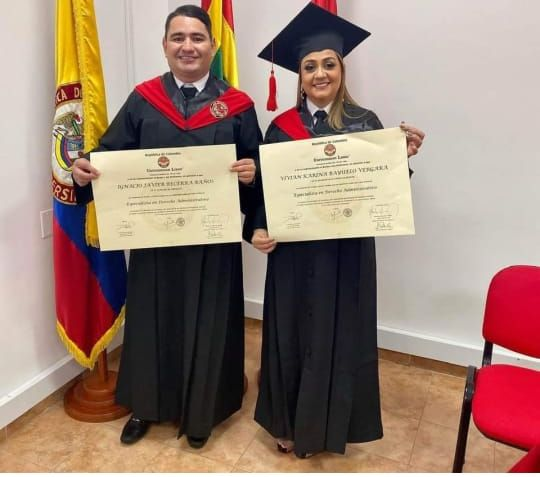

*Happy Becerra en Hatillo de Loba.*

Hoy es un día crucial para diferentes campañas electorales, especialmente para el candidato a la cámara de representantes por el partido liberal de Bolívar, [Ignacio «Happy» Becerra](https://www.facebook.com/happy.becerra). El Consejo Nacional Electoral (CNE), en audiencia de fallo, resolverá la petición de inhabilidad por el hecho de que su presunta compañera permanente, **Vivian Karina Bayuelo Vergara**,  es la contralora Provincial de Cartagena y, además, su hermana **Nadia Milena Becerra Baños**, es la subgerente de Infraestructura del Iderbol. 

La denuncia de inhabilidad la presentó [Erick Urueta Benavides](https://www.facebook.com/erick.j.benavides) de la Veeduría de la Rama Judicial-VEJUCA. Como es lógico, ante esa petición, la defensa de Becerra presentó varias pruebas que el CNE viene estudiando. Entre ellas está una **declaración juramentada** donde consta que que desde hace más de un año se encuentra separada de su expareja que está vinculada en la gerencia departamental de la Contraloría.

## La denuncia de inhabilidad de "Happy" Becerra

Según el denunciante, Ignacio Becerra Baños, quien ocupa el número 104 de la lista del partido Liberal, y apoya al senador Lidio García Turbay, estaría violando el régimen de inhabilidades estatuido en los artículos **179 y 180** de la Constitución Nacional. Además, violaría la Ley 617 de 2000 así: «»

> «**ARTICULO 179**. No podrán ser congresistas (...) **2.** Quienes hubieren ejercido, como empleados públicos, jurisdicción o autoridad política, civil, administrativa o militar, dentro de los doce meses anteriores a la fecha de la elección. (...)» **5.** Quienes tengan vínculo por matrimonio o unión permanente, o de parentesco en tercer grado de consanguinidad, primero de afinidad, o único civil, con funcionarios que ejerzan autoridad civil o política.

## Las pruebas

En poder de [**VoxPopuli Digital**](https://www.facebook.com/voxpopuli.digital) se encuentra un cartapacio de documentos donde existen contratos, manual de funciones, y otros, sobre las actividades de la subgerente del Iderbol. Una de esas funciones es la supervisión de 80 órdenes de prestación de servicios. En la cláusula decimoprimera de dichos contratos dice textualmente:

> «El supervisor del contrato resultante designado por el Gerente General será el subgerente de Infraestructura y Planeación o quien haga sus veces.»

*Esta foto fue publicada por Facebook el 21 de julio de 2021. Happy Becerra y Vivian Bayuelo se graduaron de abogados en la Universidad Libre en 2019.*

Quisimos contactar a «Happy» Becerra, pero no fue posible. Una fuente allegada a él manifestó que esperan resolver la situación ante el CNE y salir victorioso de esa situación.

## La defensa

Mientras tanto, su defensa confía que las pruebas allegadas al magistrado ponente sean valoradas debidamente. De esta manera esperan rebatir cualquier vestigio de inhabilidad que el veedor Urueta le ha imputado a la candidatura del joven político.

Sin embargo, son dos presuntos vínculos familiares que podrían inhabilitar a Becerra para que siga adelante con su candidatura. La declaración juramentada de que conste que no tiene ningún vínculo de pareja sentimental con la Contralora Provincial lo podría absolver. Lo segundo, la certificación del manual de funciones de su cargo como Subgerente de Infraestructura y Planeación. El hecho de que su hermana **Nadia Milena Becerra Baños** sea la supervisora de un contrato, ¿inhabilitaría a su hermano "Happy" Becerra? Esperemos qué decide el CNE.

/articulos/caso-gloria-estrada-el-camino-de-un-falso-positivo/