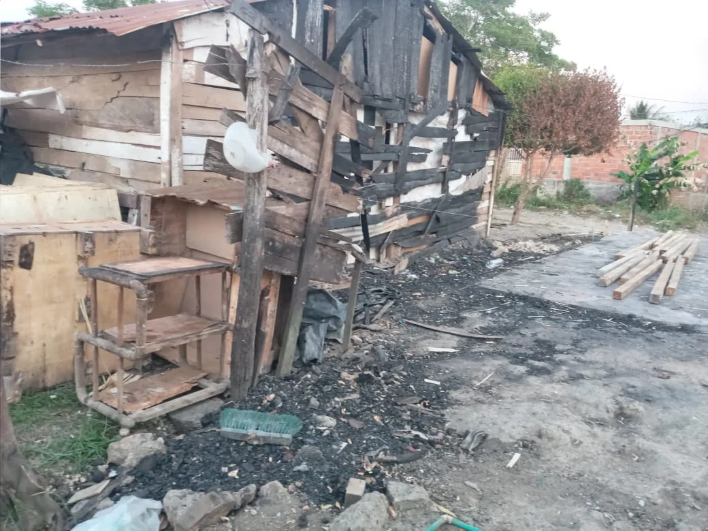
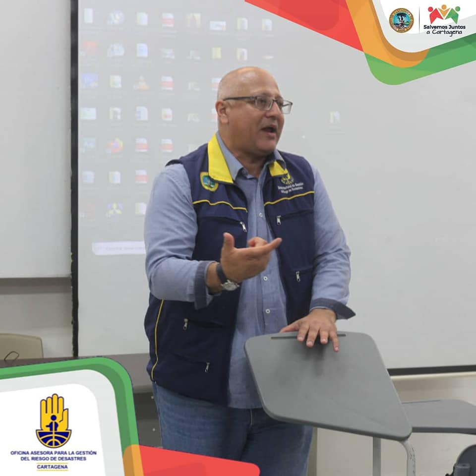

*Los sueños de tener casa propia quedaron reducidos a cenizas. Lo que el incendio se llevó: cinco casas y los sueños de 17 personas. Ocho días después, la alcaldía los olvidó.*

Lo que el incendio se llevó en Bayunca fue la esperanza y el sueño de cinco familias que habían construido sus míseras viviendas con su esfuerzo. El sueño de tener casa propia y construida con el sudor de sus frentes, literal, quedaron reducidas a cenizas a las 2 de la madrugada del 29 de enero. Desde esa fecha, **el gran ausente es la alcaldía del Distrito de Cartagena**. Así lo denuncian dos de las 17 víctimas, Y**adira Ballesteros y Wilfrido Cáseres** en este audiovisual de **VoxPopuli Digital** que está adjunto al artículo.  

En tanto el alcalde, Dau Chamat, brilla por su silencio y negligencia para la atención integral de las víctimas. Los que más sufren la inutilidad de estas clases de gobernantes son las personas que están sumidas en la pobreza. Esto fue lo que ocurrió con el incendio en el sector **_5 de Febrero de Bayunca_**, corregimiento al suroriente de Cartagena el pasado 29 de enero.

## Lo que el incendio se llevó ...

https://youtu.be/AN7Qw5v5K7k

El audiovisual del incendio del sector 5 de Febrero de Bayunca.

Ese día, el cuerpo de bomberos del Distrito llegó cuando las casas quedaron transformadas en meros troncos ardientes. La Oficina Asesora para la Gestión del Riesgo de Desastres (OAGRD), que dirige el psicólogo **Fernando Antonio Abello Rubiano**, no le ha hecho una atención integral a las víctimas. Ese sábado les llevó unas colchonetas y un mercadito que duró para dos días. Hoy las víctimas están aguantando hambre y viven hacinadas entre los vecinos solidarios.

Desde ese fatídico día, las víctimas no le han visto ni el forro a los profesionales y técnicos de la OAGRD.  Algunas deben dormir teniendo como techo el cielo estrellado de Bayunca.

## Dau y Abello

*La inutilidad de una oficina que no atiende los diferentes frentes de las víctimas de los últimos desastres en Cartagena. Lo que el incendio se llevó y la desesperanza de esta oficina a cargo de Fernando Abello Rubiano.*

Son 17 víctimas, entre adultos y menores de edad que Abello Rubiano tiene olvidado. La alcaldía cree que con llevarles algunos kits y mercaditos puede resolver el problema de los damnificados de este incendio. La situación amerita una atención integral: salud, trabajo, vivienda y ayuda humanitaria urgente.

Ninguna de las familias ha sido atendida. La Oficina Asesora para la Gestión del Riesgo de Desastres y el alcalde William Dau Chamat se han olvidado de ellos. Solo hicieron presencia para mostrar a los medios de comunicación que son diligentes en la atención de las víctimas.

Lo que el incendio se llevó: cinco casas y los sueños de 17 personas. Ocho días después, la alcaldía los olvidó. ¿Dónde está la personera Distrital, Carmen de Caro? Se está bañando con Saniká.

Te puede interesar: