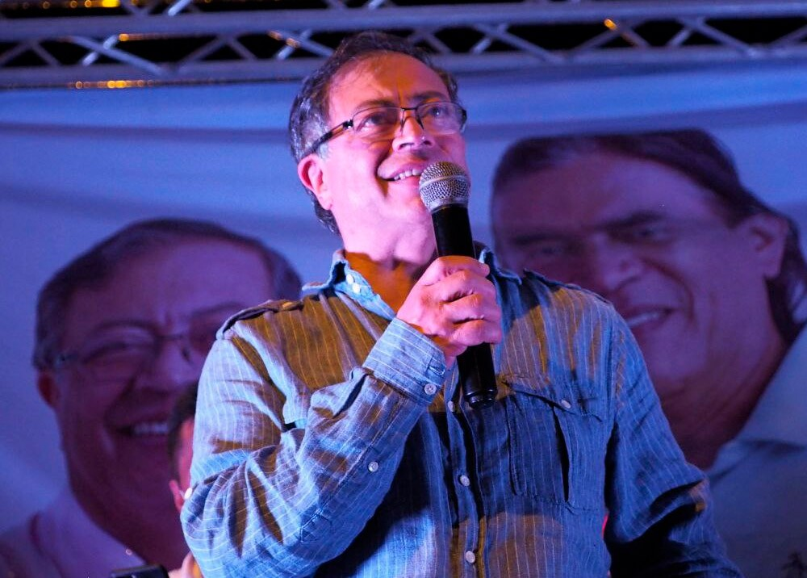

*Gustavo Petro, favorito en las encuestas, dijo que tuvo un mal trago.*

Por mal trago, Gustavo Petro quedó zambiloco en Girardot. Luego de la controversia en las redes sociales y en los medios de comunicación, el precandidato presidencial Gustavo Petro, Pacto Histórico, pidió excusa a los asistentes a la manifestación. Reconoció, en su cuenta de tuiter, que se debió a un mal trago que se tomó luego de un largo viaje por Europa. 

Gustavo Petro se encontraba al lado de Gustavo Bolívar, al parecer, uno de los organizadores del evento de Girardot.

En las redes sociales se difundió un video donde Petro no hilvanaba sus ideas. Sus críticos manifestaron que estaba borracho. En tanto los petristas creían que era un montaje de los uribistas. Esto fue lo que dijo Gustavo Petro, quien estaba al lado de Gustavo Bolívar:

https://twitter.com/OrlvndoA/status/1491147655636221952?s=20&t=Qi5JCbj0b74PLYAU5AKajQ

> "_Que de nuevo las banderas rojas se alcen y que esta ciudad pueda ser llamada de nuevo la capital roja de Colombia. ¿cómo hacemos? si votaron por Uribe, si votaron por Duque. Si la realidad fue condenar a la ciudad de Girardot a la pobreza_". 

## Por mal trago

Ante la controversia, los dimes y diretes en redes sociales y medios de comunicación, Petro publicó un tuit donde pidió perdón. 

/articulos/petrogustavo/status/1491142092835344385?s=20&t=Qi5JCbj0b74PLYAU5AKajQ

La prensa internacional también se refirió al mal trago de Gustavo Petro, el favorito de las encuestas para las presidenciales.

https://twitter.com/AFPespanol/status/1491200177478242305?s=20&t=Qi5JCbj0b74PLYAU5AKajQ

Por causa del mal trago de Gustavo Petro, no solo se convierte en una afrenta a sus seguidores y potenciales electores, sino que pone al descubierto un problema que puede ser sensible en el eventual caso que gane la presidencia de la república.