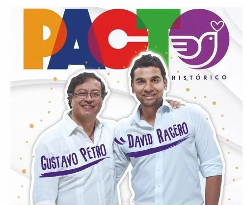

*¡Rebelión del PH Bolívar!*

¡Rebelión del PH Bolívar! La coordinación territorial Bolívar del Pacto Histórico (PH) se rebeló contra el supremo jefe nacional de la coalición, **Gustavo Petro Urrego**. Presentó una contrapropuesta para la solución del problema de la lista a la cámara. En un comunicado difundido en la tarde de hoy **señalan que la lista se mantenga tal y cual como se inscribió**. También proponen que Colombia Villamil sea reemplazada por **Lia Margarita Muñoz**, de Colombia Humana.

La lista a cámara de representantes del Pacto Histórico en Bolívar estaba en el precipicio con la decisión deliberada de Colombia Villamil de no firmar en el tiempo estipulado. Pero, la decisión de **Gustavo Petro y de la Colombia Humana Bogotá** de cambiar su naturaleza, orden y sustitución de sus integrantes, era el empujoncito que los parlamentarios **David Racero y Gustavo Bolívar** esperaban para sacrificar la participación democrática bolivarense.  

## ¡Rebelión del PH Bolívar! contra el centralismo

El centralismo cachaco dio a conocer que la nueva lista debe ser cerrada y encabezada por **Dorina Hernández,** una destacada profesora palenquera, viuda de Dionisio Miranda Tejedor, un destacado líder de la lucha afrocolombiana. Pero tal decisión fue calificada por muchos líderes de Bolívar como populista y egocéntrica. Si bien con esa decisión Petro queda elegante frente a la opinión pública nacional, conlleva a un sacrifico del territorio de Bolívar que siempre le ha acompañado en sus pretensiones políticas sin contraprestación alguna. 

Bogotá siempre viene a los territorios a buscar los votos con las manos vacías, y se regresan al centro del poder a ocupar sus curules practicando un cretinismo parlamentario. Pero se tiene la seguridad que, cada cuatro años, regresan al territorio a buscar los votos. Es la misma práctica de los políticos tradicionales, siendo que éstos vienen con las alforjas llenas para comprar los votos del Caribe colombiano. Por esta razón la ¡rebelión del PH Bolívar! es una bocanada de oxigeno para la lista de Bolívar.

## La puñalada trapera de Racero

*Gustavo Petro y David Racedo, tal para cual. ¡Rebelión del PH Bolívar!*

Dentro de este proceso de la lista Bolívar, hay algo singular. El enemigo del Pacto Histórico no fue externo. El fuego amigo vino de Bogotá y del círculo cercano del jefe supremo del Pacto Histórico. ¡Explicame eso! Bogotá diseñó la lista que se inscribió el 13 de diciembre de 2021. Petro y los demás jefes de la coalición firmaron el acta donde se incluyó a Sandra Villadiego. Pero, después el mismo Petro hizo como Pedro, negó no una sino seis veces su participación en esa decisión. ¿Cómo se llama eso? 

La lista de los cachacos era distinta a la que fue aprobada por la coordinación territorial Bolívar del Pacto Histórico donde no estaba Sandra Villadiego.

Todo esto confirma lo que al principio dijimos de la naturaleza del Pacto Histórico de que estaba pegado con saliva de loro y sus bases no eran programáticas sino de quienes estuvieran más cerca del jefe supremo. (Déle Clic:[En Pacto Histórico:«¡No hay cama pa´tanta gente!»).](/articulos/en-pacto-historicono-hay-cama-patanta-gente/) Esto causa desconfianza e intrigas cortesanas y _**bembeo**_ de la jerarquía bogotana a la participación democrática. De hecho, refleja la verdadera realidad de este acuerdo político emboscado por la **desconfianza y las rencillas hipócritas procedentes de Bogotá**. La propuesta de Petro es el empujoncito que necesitaba la lista —ya en el precipicio— para que se estrelle en el abismo. 

Esa fue la pretensión del parlamentario **David Racero,** quien abrazando a Sandra Villadiego en la oficina de Gustavo Petro, fue capaz de meterle una **puñalada trapera.** Este es el mejor estilo de la hipocresía cachaca heredada de esa España medieval cuando los Trapera se mataban con los Aranda siendo de la misma condición. A esta empresa, calificada por algunos de sus integrantes como depredadora, se dedicó no solo David Racero sino también el senador Gustavo Bolívar. Y todo porque querían meter en la lista a las protegidas de William Dau, Lidy Ramírez y María Alejandra Benites.

## La propuesta de Petro

En la tarde de hoy se conoció que la Colombia Humana y el sector del precandidato Camilo Romero, al parecer, presentaron una modificación a la coalición. Los nombres que difundieron son: **Dorina Hernández (**Colombia Humana**)**, **Javier Marrugo** (Polo), **María Alejandra Benites** (candidata de William Dau y Camilo Romero), **Carlos Vargas (**Colombia Humana**)**, **Lía M. Muñoz** (Colombia Humana) y **Aden Elles (UP)**. Excluyen a **Sandra Villadiego** (ADA) y **Rainel Rodríguez** (Alianza Verde). Pero consultamos esta noche la lista de inscritos de la Registraduría Nacional y siguen los mismos del pasado 13 de diciembre de 2021. O sea, oficialmente la nueva lista no está inscrita.

No obstante, la coalición Pacto Histórico debe presentar la lista modificada con la aprobación de los coaligados en su conjunto. Es decir, no podrían excluir a ninguno del pacto, como lo está proponiendo la Colombia Humana y otros sectores. Puesto que si esa lista es cierta, se estaría cometiendo dos irregularidades.

**La primera.** Dorina Hernández es profesora. La consulta que Vox Populi hizo en la Secretaría de Educación Departamental y Distrital no aparece aprobación de alguna licencia o renuncia a su cargo. Si ella aceptó tal postulación, podría estar participando en política y susceptible de un disciplinario

**La segunda.** La nueva lista puede ser rechazada al excluir a dos de sus integrantes. ADA y Alianza Verde la pueden impugnar. Pero también los dos excluidos. Les asiste razón, porque alegarían daños y perjuicios. Lo más grave, se podría caer definitivamente. Los perjudicados podrían presentar una acción de tutela.

## La coalición modificaría la lista

Por obligación los diferentes firmantes del Pacto deben estar de acuerdo para la modificación de la lista. Son ellos:  **Alexander Lopez Maya** (Polo Democrático Alternativo), **Paulino Riascos Riascos** (Alianza Democrática Amplia), **Gabriel Becerra Yañe**z (Unión Patriótica), **Martha Isabel Peralta Epieyú** (Movimiento Alternativo Indígena y Social), **Gustavo Petro** (Movimiento Político Colombia Humana), **Rodrigo Romero Hernández** (Partido Alianza Verde) y  Jaime Navarro Wolff (Partido Alianza Verde).

En ese sentido la última resolución del CNE sobre la lista del Pacto Histórico, señaló lo siguiente en la página 28:

> Es así como los partidos tienen hasta el 13 de febrero para inscribir las respectivas listas de candidatos y candidatas con el cumplimiento de la cuota de género. (.) Ahora bien, frente a la aclaración solicitada sobre la **conformación de las listas debe indicarse que la elección de las listas implican un trámite netamente interno, en cabeza de las autoridades de los partidos que integran las coaliciones**, en atención a la autonomía interna de la que gozan dicha colectividades y que en esos términos esta Corporación no puede realizar pronunciamiento alguno sobre el particular.
> 
> Res. No 1235- febrero 2022

Pese a ello, la lista solo la puede salvar un acuerdo unánime de sus integrantes. Es decir, los que firmaron el acta que permitió inscribir la lista ante la Registraduría Nacional del Estado Civil el pasado 13 de diciembre de 2021. Si no se respeta este principio, los afectados pueden presentar una acción de tutela para el respeto de sus derechos fundamentales.

Por eso, la coordinación ampliada del Pacto Histórico que tiene la firma de Dagoberto Polo y  Nixon Torres proponen a Petro que la lista se mantenga abierta y se le dé cabida a Lía Margarita Muñoz en sustitución de Colombia Villamil.

## Bolívar y Racero, los oráculos de Petro

Fuentes del Pacto Histórico del centralismo bogotano, señalaron a **VoxPopuli Digital** que quienes **vienen conspirando contra la lista son el representante David Racero y el senador Miguel Bolívar**, quienes se han presentado como **los oráculos de Gustavo Petro**. Ellos son los que interpretan lo que su caudillo quiere, según manifestó una de las personas de la coalición. Llamamos a Bolívar para que nos aclare la situación, pero no responde. En tuiter él dijo que se declara fans de William Dau, por lo que se entendería el deseo de incluir a **María Alejandra Benites** en la nueva lista.

https://twitter.com/GustavoBolivar/status/1484351943296184326?s=20&t=NyERJiTo9VqPDlUaIWQgTA

Algunos expresaron que esa es lambonería de Bolívar, porque solo busca votos en Cartagena alabando al alcalde e impulsando una de sus candidatas. No le importó que su aliado los trató de «**aves carroñeras»**. María Alejandra Benites aparece en la nueva lista que pretenden inscribir en la Registraduría Nacional.

De hecho, la conducta de Gustavo Bolívar y David Racero es un **canibalismo político made in Bogotá**. La pelotera de Colombia Humana contaminó al conjunto de esta coalición de izquierda que desdice de su integridad  ética y de los principios programáticos que anunció con bombos y platillos. 

https://youtu.be/DcASD2R6p40

## ¡Rebelión del PH Bolívar!

Efectivamente, la decisión de la coordinadora territorial Bolívar del Pacto Histórico es una auténtica rebelión democrática y de autonomía territorial.

Con esa decisión la lista se puede salvar. Así se conjuraría el problema que se le presenta a la lista. En tanto que Colombia Humana, cuya candidata (**Colombia Villamil**) en forma deliberada firmó extemporáneamente su inscripción, debería ser reemplazada por otra candidata. En este caso se propone que sea Lía Margarita Muñoz. Villamil no ha respondido las llamadas para que explique las razones de su conducta poco transparente para con sus compañeros de lista. 

El jueves 10 de febrero se publicó la Resolución No **1235 de 2022** del Consejo Nacional Electoral (CNE) que denegó la impugnación presentada por el abogado de los integrantes de la lista del Pacto Histórico, **Nixon Torres Cárcamo**. Aquí publicamos el comunicado de prensa de la coordinación del PH Bolívar que explica su decisión.

## Comunicado de prensa PH Bolívar

/wp-content/uploads/2022/02/COMUNICADO-DEL-PACTO-HISTORICO-BOLIVAR-1\_220212\_160152.pdf

## ESCUCHE ESTE PODCAST

/articulos/episode/0PUbfQMPaORETFboPHBrH3?si=Heli1N7XTp6IRQUQMy36zA

Puede escuchar este análisis sobre la suerte de la lista a Cámara de Representantes de Bolívar.

## El centralismo cachaco

Existe una preocupación entre muchas personas del Pacto Histórico de Bolívar debido a que el centralismo cachaco es el que tiene en sus manos el futuro de la lista, Ellos pretenden que los votos de Bolívar deben canalizarse para senado. El mismo Nicolás Petro lo dijo en su visita a Cartagena el mes pasado. 

No es raro que Bolívar y Racero pretendan buscar votos a costa de la desgracia del otro. Sus intervenciones siempre giran en la descalificación y eliminación del otro. Uno pretende reelegirse y el otro subir de nivel en ese congreso corrupto. Ellos quieren que los seguidores del Pacto Histórico voten al senado aunque los votos a cámara se pierdan. Lo grave, muchos son los borregos costeños que siguen los designios de Bogotá con la cabeza gacha. Y algunos se molestan cuando publico estas verdades. Así como un sector de la feligresía del falso profeta uribista, Miguel Arrázola, lo aplaudían cuando me amenazaba de muerte por haberlo puesto al desnudo a nivel nacional. La conducta hipócrita del centralismo cachaco impide que la izquierda costeña tenga líderes nacionales de peso. Es una izquierda condenada a ser borrega de tiranos.

### **AQUI LES DEJO LA ÚLTIMA RESOLUCIÓN DEL CNE**

## [Andrés y Emeterio Montes, epicentro del Aidaescándalo en Bolívar (I)](/articulos/andres-y-emeterio-montes-en-el-epicentro-del-aidaescandalo-en-bolivar-i/)