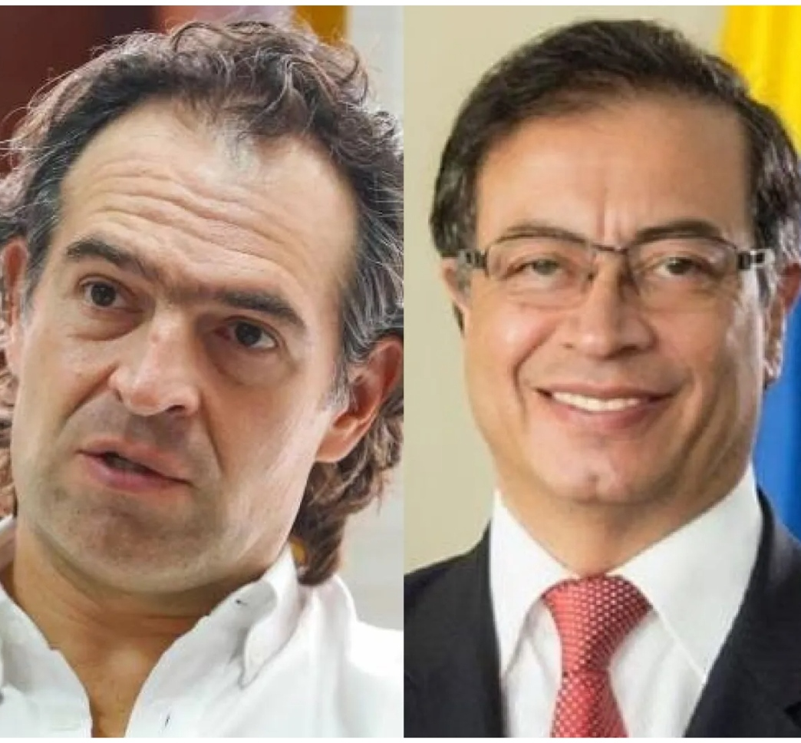

*El régimen busca salvador con Federico «Fico» Gutiérrez. ¿Se polarizará el debate presidencial entre Gustavo Petro y Gutiérrez?*

Con la renuncia y adhesión a la candidatura de **Federico «Fico» Gutiérrez** del candidato del Centro Democrático, **Óscar Iván Zuluaga,** ¿el régimen busca salvador presidencial? Por esta razón se polarizará el debate electoral. Sin duda, el debate se decantará. Las tres coaliciones políticas que participaron en la consulta presidencial se reducirían en la práctica a dos, ya que Sergio Fajardo está objetivamente muy debilitado para enfrentar a Gustavo Petro. 

No obstante, ¿por qué razón se predica que el ganador de la coalición de la Esperanza, Sergio Fajardo, se diluirá sin posibilidad de pelear en una eventual segunda vuelta? La debilidad manifiesta de Fajardo tiene tres causas. **1.** Su coalición recibió la peor votación de las tres, apenas sobrepasó los 2 millones. **2**. El mismo Fajardo recibió 723 mil votos, menos que Francia Márquez, la segunda en Pacto Histórico. **3\.** La polarización del debate entre Petro y «Fico» en nada favorecería a Fajardo, ya que ese no es su terreno. 

La dinámica de la discusión, por tanto, debilitaría más la candidatura de Sergio Fajardo que en las elecciones de hace 4 años se constituía en una alternativa frente a la polarización propuesta por Petro y el candidato del Centro Democrático Iván Duque Márquez, quien finalmente derrotó a Petro en la segunda vuelta.

Sin demeritar la acción de los candidatos Rodolfo Hernández, Ingrid Betancourt, Enrique Gómez y Gilberto Murillo, todo hace indicar que el foco de la lucha por la presidencia girará entre Gustavo Petro y **«Fico» Gutiérrez.**

## Un triunfo agridulce

https://youtu.be/\_K4ChaTfUEY

El régimen busca salvador.

## ¿El régimen busca salvador presidencial?

Los resultados electorales en la consulta sugieren que la hegemonía dominante alcanzó a seleccionar a su verdadero candidato. El régimen busca salvador de su crisis y no solo presidente. El proceso de selección fue diferente al de hace 4 años, donde todavía el Centro Democrático tenía directamente un mayor peso político.  En estos momentos de crisis del régimen puesta al descubierto por el movimiento social en las jornadas de abril y mayo, están buscando un gobernante para resolver no la crisis del país sino la crisis del régimen.

> Ahora redefinirán la estrategia electoral para «Fico» Gutiérrez en tiempos donde el **régimen _neobonapartista_** uribista se encuentra en una etapa de desgaste y de crisis.  Quieren un salvador y no a un presidente.

## Escuche el análisis

/articulos/episode/1RHHiNBQdpPb348FXIhB9E?si=f09d170307d642fc

## Segundo aire para «Fico»

En ese sentido, una de las principales acciones es buscar consenso entre los sectores dominantes. Los diferentes grupos financieros y económicos ahora podrían concentrarse en el elegido para suceder a Iván Duque. Estos grupos de poder percibirán al candidato antioqueño como el sujeto sobre el cual le confiarán la misión de derrotar a Gustavo Petro. Pero no será fácil esta misión, puesto que las encuestas y los resultados de la consulta, lo hacen un candidato imparable en su camino hacia la presidencia. Cualquier error que cometa el candidato de Pacto Histórico se lo cobrarán sin misericordia.

La ventaja que **«Fico» Gutiérrez** tiene sobre Petro se fundamenta en el desgaste de la imagen de Petro, quien aparece imparable. **«Fico»** viene de un proceso ascendente y de una carrera política reciente. Carece de una larga estela. Tampoco tiene precedentes de paramilitarismo, parapolítica o corrupción administrativa. En tanto, que Gustavo Petro desde hace rato se encuentra en la cúspide de las encuestas y debe lidiar con el estrés de estar en el primer lugar desde antes de darse la partida hacia la presidencia de la república. Y ahora es el número 1 en los resultados electorales. 

Recordemos que en 2002, Horacio Serpa se encontraba imparable y finalmente fue alcanzado por Álvaro Uribe, quien ganó en primera vuelta. La estrategia de **«Fico» será diferente.** Buscará llegar a primera vuelta con la menor diferencia de votos respecto a Gustavo Petro. En la segunda vuelta, con los pulmones llenos de aire fresco, piensan darle el golpe definitivo a Gustavo Petro a través de una flexible política de alianzas.

## ¿Petro tocó techo?

¿[Con los resultados del domingo 13 de marzo](/articulos/senado/0/colombia), Gustavo Petro tocó techo? Sin equívocos, debemos decir que no. Pero su crecimiento será más lento. Todo depende de cómo «Fico» Gutiérrez se desempeña en el debate electoral y desnude los flancos débiles de su contrincante. Es probable que mejore su propuesta en lo económico y social para garantizar la seguridad del sector empresarial atemorizado por el discurso de Petro. Es posible que flexibilice su discurso en lo social para quitarle banderas políticas que muy viene exponiendo Petro. Por su parte, si este logra mantener los 5.2 millones de votos hasta el 29 de mayo, seguramente ganaría la primera vuelta. Pero no sería suficiente para ganar la presidencia. Entonces, surge una verdad de perogrullo, se le complicaría su aspiración presidencial. 

Si Sergio Fajardo, por otra parte, no logra despertar el interés del electorado en el primer mes de campaña como candidato oficial, que se despida de esta contienda, podría ser superado hasta por Rodolfo Hernández. Entonces se vería en la necesidad de tomar partido por «Fico» Gutiérrez o por Gustavo Petro. Se creerá que tiene mayor afinidad personal con el candidato de Equipo Colombia. 

## Busca salvador con **«Fico»**

Las elecciones parlamentarias —contrario a lo que muchos piensan—fue un triunfo para el régimen que busca salvador. Es un régimen basado en las maquinarias. Estas triunfaron inobjetablemente. Un día antes Gustavo Petro tenía un aire triunfalista y hablaba de más de 30 curules. Pero el error más protuberante fue la forma autoritaria y poco democrática de cómo se constituyeron las listas a senado y cámara. **_El centralismo cachaco_** se manifestó de la forma más cruda. Nada podía justificar esta conducta antidemocrática.

**Por eso fue una victoria agridulce. Victoria que ya es historia.** El hecho de haber obtenido 16 curules en el senado se iguala a cualquier partido tradicional. No fue la victoria arrasante que prometían las encuestas y sus voceros más conspicuos. La verdadera primera vuelta eran las elecciones parlamentarias. Si Petro la hubiese ganado con 35 curules como derrota de las maquinarias, podríamos anunciar que el próximo 29 de mayo sería la segunda vuelta y habría un ganador indiscutible, Gustavo Petro Urrego, el nuevo dios de la izquierda colombiana.

### Te puede interesar:

### [Petro, Fico y Fajardo, son los candidatos de izquierda, derecha y centro](/articulos/petro-fico-y-fajardo-los-candidatos-de-izquierda-derecha-y-centro/)