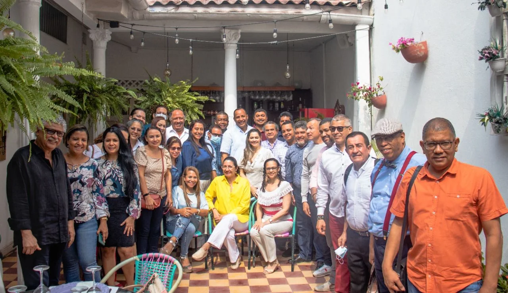
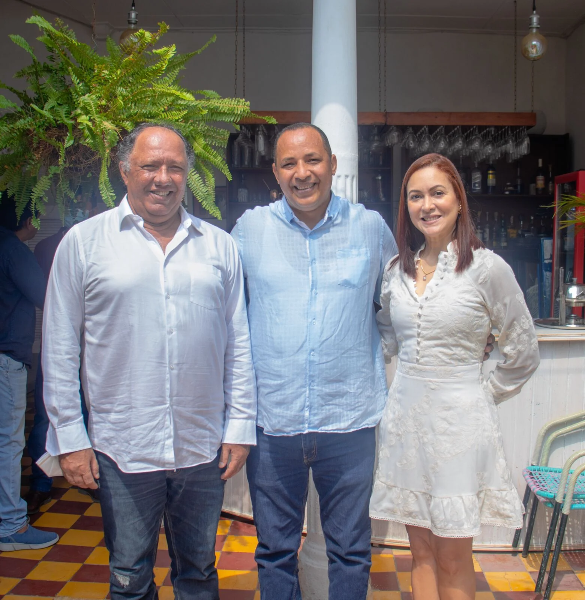
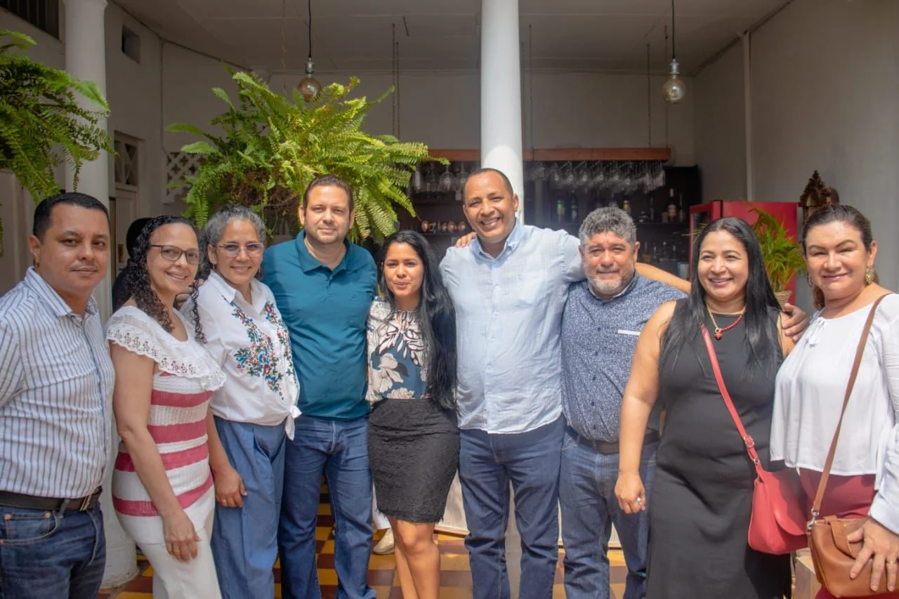
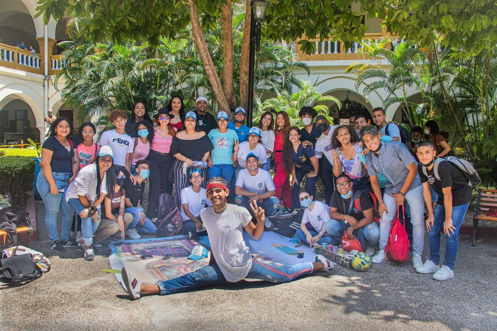
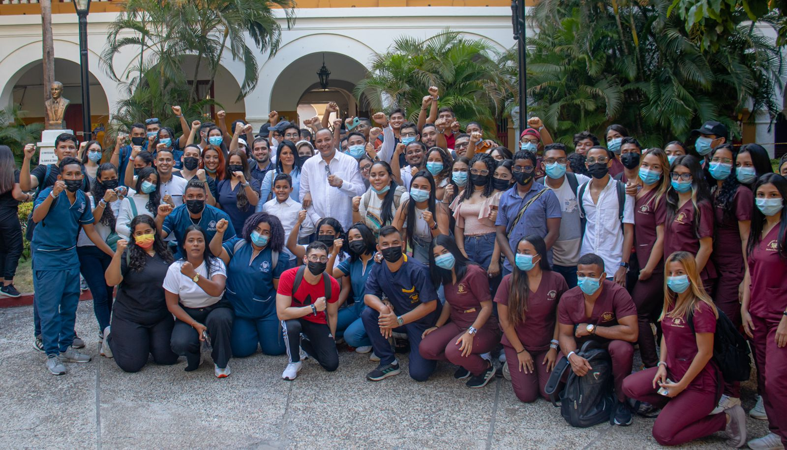
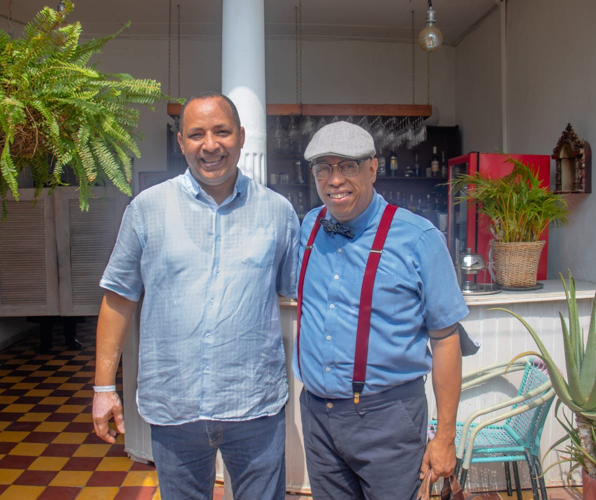

*Debate Universitario. William Malkún rodeado de candidatos y candidatas a decanatura y directores de programas. Asimismo de profesores, trabajadores y algunos estudiantes.*

Desde hoy, VoxPopuli Digital **abre el debate universitario.** El historiador y doctor en ciencia política, [**William Malkún Castillejo**](/articulos/in/willian-malkun-1271893b/?originalSubdomain=co), candidato a rector de la Universidad de Cartagena, tiene como objetivo fundamental construir una **institución transformadora y humana.** Es decir, una verdadera universidad humanista que tenga como centro al ser humano, sus necesidades y sus sueños.

En ese sentido, Malkún Castillejo se propone fortalecer un proyecto institucional de la Universidad de Cartagena, en el período 2022 – 2026, **desde la participación colectiva, el diálogo multiestamentario y una visión humanística, científica y académica.** Este fortalecimiento se erige en los principios de inclusión, equidad, democracia, autonomía, pertinencia y respeto a los derechos individuales y colectivos.

Es así que para alcanzar esa meta tiene 120 propuestas que redundará en el bienestar de estudiantes, profesores y trabajadores de la Universidad de Cartagena. Dichas propuestas están conducidas por tres ejes estratégicos: Sostenibilidad financiera y administrativa, Consolidación académica y científica, e Impacto en el medio y relaciones institucionales. En la segunda entrega desarrollaremos algunas de ellas.

## Vea la primera parte de la propuesta malkunista

https://youtu.be/6mS8pAsTxs4

Debate universitario. William Malkún aspira a reemplazar a Edgar Parra Chacón, rector de la Universidad de Cartagena.

Recordemos que **William Malkún Castillejo** llegó a la Universidad de Cartagena promediando el año 1996. De su pueblo del César salió a estudiar Ingeniería Mecánica a Bogotá. Cuando llegó a Cartagena se presentó en derecho, pero se quedó con la opción de Historia. Por ende, se hizo historiador. Aprendió a amar tanto la profesión que se hizo magister y doctor en Ciencia Política. Docente del departamento de Humanidades en el programa de Historia. Jefe del Departamento de Postgrado de la Facultad de Ciencias Humanas 2010 - 2018. **Fue vicerrector de Extensión y Proyección Social, Universidad de Cartagena (2018-2021).**

## Comienza el debate universitario

*William Malkún con María Cecilia García Espiñeira (candidata a medicina) y Antenogenes Coronel, candidato al Consejo Académico.*

Desde el 28 de marzo hasta el 30 de abril es el período electoral del Alma Máter, de acuerdo con la [Resolución No. 0603](/articulos/normatividad/resolucion-no-0603-reglamentacion-de-foros-programaticos/)  (puede darle clic) que reglamenta los **foros programáticos**. Se inscribieron debidamente tres candidatos a rector, en su orden de inscripción: **William Malkún Castillejo, José Morelo Gómez y Gerardo Rodríguez Estupiñán.** El primer foro se realizará el **5 de abril** en el campus de Piedra de Bolívar.

**E**n concomitancia con esa resolución**, VoxPopuli Digital** con el fin de contribuir a un debate con altura y, fundamentalmente académico, ahondará con cada uno de los tres candidatos sobre su propuesta rectoral inscritas en su candidatura. Empezamos con el historiador y profesor de humanidades Malkún Castillejo.

## ESCUCHE

/articulos/episode/77q5xzAnX1PZLJdkxIfLhV?si=71d8ab9d228c482b

William Malkún candidato a rector de la Universidad de cartagena

## Transformadora y humanista

No obstante, crear una universidad humanista no es simplemente ofrecer programa en el área de las humanidades. Se entiende también —y fundamentalmente— la construcción de un **perfil humanista de sus egresados** para que incida sobre la humanidad. Y esto es lo que se colige de la propuesta malkunista.

De hecho, debe entenderse un perfil humanista como la actitud reconocible en todos los procesos académicos, administrativos y de extensión social de la Universida de Cartagena. 

## Los tres ejes de Malkún

*Debate Universitario.*

La propuesta rectoral tiene tres ejes estratégicos, como lo habíamos anunciado: Sostenibilidad financiera y administrativa, Consolidación académica y científica, e Impacto en el medio y relaciones institucionales.

En el primer aspecto busca ampliar y garantizar las fuentes de financiación, desde un enfoque de gestión estratégica, participación colectiva y de planeación. Esto determina la priorización de recursos de acuerdo con los contextos externos e internos. La formulación de planes y proyectos pertinentes y la racionalidad en la ejecución. De igual manera, busca promover la descentralización de la gestión administrativa, delegando funciones en los jefes de las unidades académicas.

## Consolidación académica y científica

El proyecto académico —dice Malkún— debe responder a los retos de los tiempos actuales. Debe ser coherente con su historia bicentenaria, de impacto en la ciudad, el Departamento, la región Caribe y el país.

Ello trae como consecuencia fomentar y financiar procesos de creación de patentes, y transferencia de conocimientos. Y, por consiguiente, publicación de resultados de investigación (revistas propias indexadas, en formatos impresos y virtuales), libros de creación artística y de investigación, y libros de textos.

De igual forma, busca fortalecer la **Escuela de Formación Humana para el Trabajo y Desarrollo Humano** en el Área de la Salud, mediante la oferta de programas de Salud Oral, Mecánica Dental y Regencia en Farmacia. Con esto se consigue ampliar la cobertura a poblaciones que no acceden a la formación profesional.

## Impacto en el medio y relaciones institucionales

*Los estudiantes que apoyan a Malkún, entre ellos el representante estudiantil Daniel Herrera Blanco.*

En el marco de su función sustantiva de extensión y proyección social, del principio de responsabilidad social y del impacto institucional en los diferentes contextos espaciales y sociales, la Universidad debe emprender acciones fundamentales. La propuesta menciona varias acciones:

1.  Culminar la implementación del **Centro de Transferencia, Emprendimiento e Innovación de la Universidad.** Esta iniciativa fue aprobada en 2021 por el Consejo Superior con el fin de fortalecer los procesos institucionales y la relación con las entidades territoriales y nacionales, gremios y sector privado.
2.  Generar una relación dinámica y permanente con los gremios de la ciudad, la región y el país. El objetivo es generar espacios de diálogo entre estudiantes y docentes con egresados. También crear oportunidades para brindar una oferta de productos y servicios basada en sus necesidades
3.  Crear el Nodo de Universidades Hermanas. Permitirá relacionarse con instituciones y centros de investigación de prestigio nacional e internacional. Éstas podrán tener espacios físicos y virtuales que permitan una comunicación directa y fluida con el fin de consolidar procesos de cooperación.

## Para los estudiantes qué...?

*William Malkún rodeado de estudiantes de diferentes programas académicos de la Universidad de Cartagena. Laura Ibañez, exrepresentante estudiantil.*

El proyecto rectoral propone el fortalecimiento de la **relación Universidad – Empresa - Estado (UEE).** Se busca establecer convenios con entidades públicas y privadas, que impacten los índices de empleabilidad, posibiliten las prácticas y pasantías, y resuelvan las demandas y necesidades particulares de los agentes socioeconómicos que cooperan con la Institución.

También propone otras iniciativas de bienestar estudiantil, ampliar el subsidio de alimentación y preparar para la gestión empresarial a los estudiantes que sea complemento al concepto de empleabilidad.

## Para los docentes

Se propone la formación en segundo y tercer ciclo a los docentes de planta y de cátedra que no hayan cumplido estos ciclos. Se pretende ampliar los cupos en estudios de maestrías y doctorados propios, una vez se cumplan los puntos de equilibrio y los requisitos de sostenibilidad del programa respectivo.

Son muchas las propuestas que tiene para cada sector del estamento universitario, pero nos limitamos a reseñar algunas de ellas.

## Para los trabajadores

Uno de los objetivos es la formalización de un espacio de diálogos permanentes con los distintos sindicatos y con los empleados que no estén asociados a ellos. Se procura avanzar en las agendas de trabajo. Se implementará como estrategia de **mejoramiento continuo**.

Asimismo William Malkún pretende armonizar el Manual de Funciones, el Perfil de Cargos y la Escala Salarial, a fin de flexibilizar, abreviar y racionalizar situaciones de ascensos, encargos, concursos, entre otras.

## El debate universitario con candidatos a decano

*Debate Universitario. William Malkún con Ricardo Chica, candidato a decano en Ciencias Sociales y Educación.*

Los candidatos quedaron debidamente inscritos, ya que al término del período de impugnaciones, no se presentó ninguna. Así lo señala el [ACTA DE CIERRE DE IMPUGNACIONES,](/articulos/normatividad/acta-de-cierre-de-impugnaciones/) Esto promete que el debate se centrará más en las propuestas de los candidatos que de su condición legal para aspirar a sus respectivos cargos.

De la misma manera, [el acta de inscritos– 2022-2026](/articulos/normatividad/acta-de-inscritos-ce-2022-2026/) indica que los candidatos para los diversos cargos de gobierno que tiene la Universidad de Cartagena son los siguientes: 

*   José David Patiño: Ciencias Económicas. 
*   Ana Marín Ramírez: Ciencias Exactas y Naturales.
*   Ricardo Vivas Reyes: Ciencias Farmacéuticas.
*   Freddy Ávila Domínguez: Ciencias Humanas.
*   Ricardo Chica Gélis: Ciencias Sociales y Educación.
*   Álvaro Salgado González: Derecho.
*   Zuleima Cogollo Milanés: Enfermería.
*   Amaury Cabarcas Álvarez, Candelaria Tejada Tovar y Rocío Padilla Preston: Ingeniería.
*   Fredy Pomares Herrera y María García Espiñeira (Medicina).
*   Katherine Arrieta Vergara, Adel Martínez Martínez y Miguel Maturana Meléndez: Odontología.

## Directores de programa

*   Jesús Blanquicett Torralvo: Contaduría pública.
*   Adriana Bermúdez Tobón y Karick Jotty Arroyo: Biología.
*   Beatríz Jaramillo Colorado y Alfonso Marrugo González: Química.
*   Danilo de la Hoz Paez: Lingüística y literatura.
*   Irina Sysoeva: Lenguas extranjeras.
*   Lidys Agamez González: Trabajo social.
*   Patricia Garcés del Castillo: Ingeniería civil.
*   Clemente Granados Conde: Ingeniería de alimentos.
*   David Franco Borré: Ingeniería de sistema).
*   Lesly Tejada Benítez: Ingeniería química.

## Otros cargos

*   **Representante docente ante el Consejo Superior:**
*   \- Principal: Jaime Pérez Mendoza.
*   \- Segundo renglón: Elizabeth Romero Massa.
*   **Representante docente ante el Consejo Académico:**
*   \- Principal: Atenogenes Coronel Mera.
*   \- Segundo renglón: Piedad Montero Castillo.

Vox Populi cubrirá los foros programáticos con el fin de que la sociedad caribeña le tome el pulso a las propuestas universitarias.

**Puedes leer:**

/articulos/como-le-fue-a-la-costa-caribe-colombiana-en-la-coyuntura-electoral/

### [La clave del fraude electoral. ¿Qué va del «Tigrillo» Noriega al «Gatico» Vega?](/articulos/la-clave-del-fraude-electoral-que-va-del-tigrillo-noriega-al-gatico-vega/)