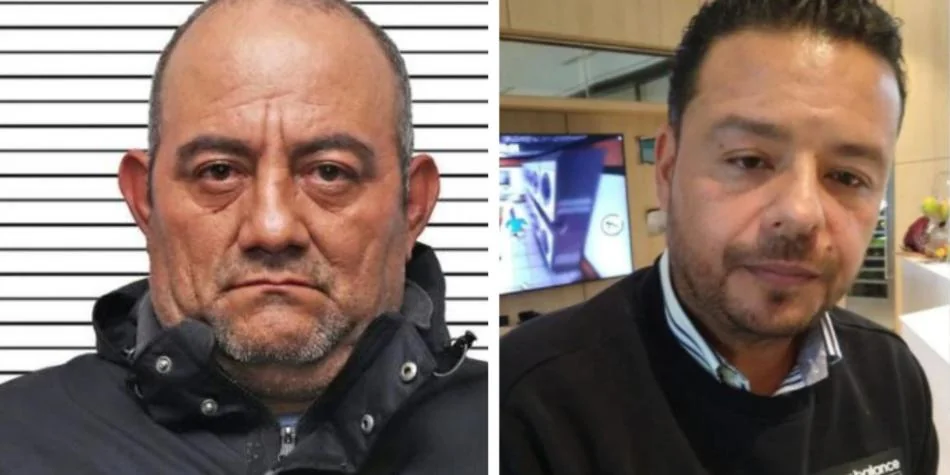
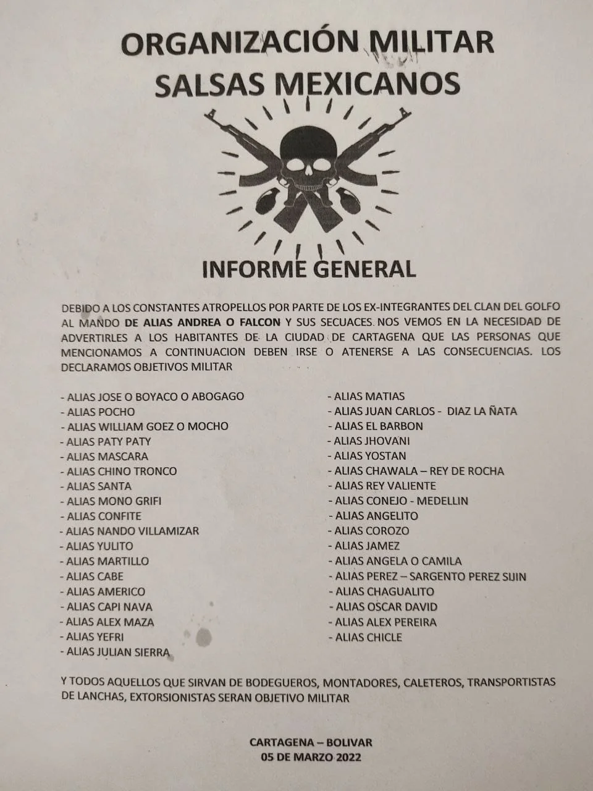
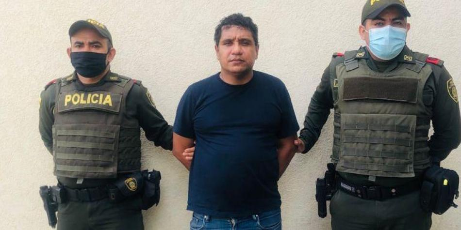
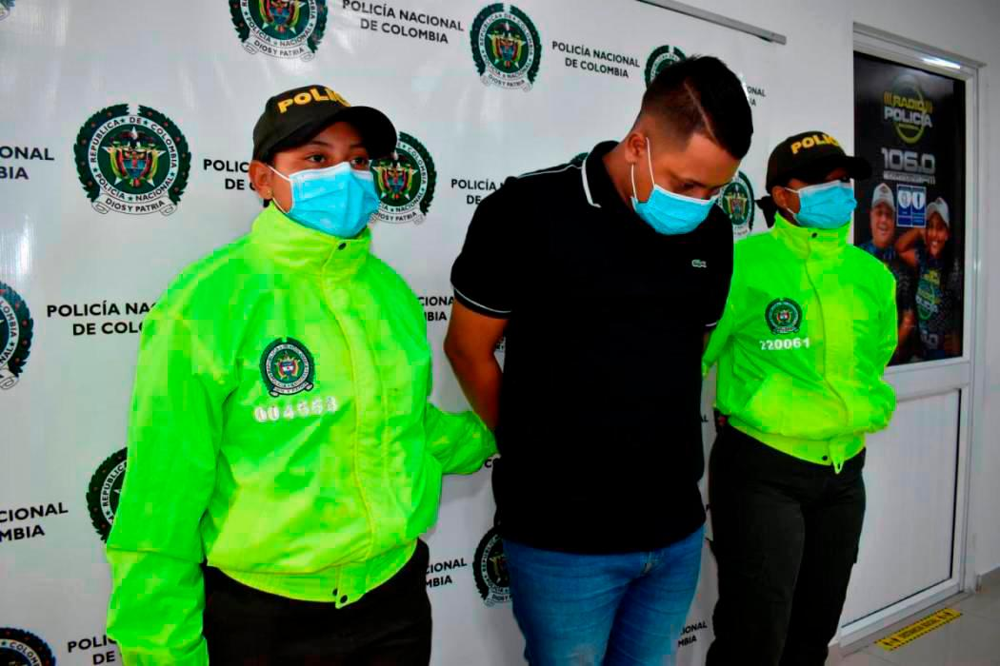

*La caída de Andrea (mayo 2021) y la entrega del jefe supremo del Clan El Golfo, Otoniel, causó una guerra interna que se traduce en mayores indicadores de homicidio y sicariato en la Costa Caribe. Cortesía.*

Declaran objetivo militar a **Chawala—Rey de Rocha, promotor de artistas Champeta.** También a 38 peces gordos del bajo mundo de Cartagena. Es una declaración de guerra, aparentemente, dictada por el alto rango del **Cartel Jalisco Nueva Generación** y de sus aliados colombianos. De acuerdo con las fuentes, la finalidad de esta declaración es conquistar el mercado de la exportación de la droga, la extorsión y el microtráfico en Cartagena.

Vale recordar que, desde el año pasado, viene una guerra interna del **Clan el Golfo** como producto de la detención en Llanogrande  de **Juan José Valencia Zuluaga, alias Falcon, Gordo, Florecita o Andrea.** Le **decomisaron 14 carros** Ferrari, Mustang y McLare**n. Andrea** manejaba la exportación de la cocaína desde Cartagena**. Según fuentes policivas, le pagaba a Otoniel una suma entre de $5 y $10 mil millones mensuales.**  Todo hace indicar que comenzó a sapear las rutas hacia Europa y México. **Esto llevó a la entrega de alias Otoniel,** el jefe supremo de esa organización delincuencial**.**  Y luego lo hicieron 7 de sus hombres más cercano. 

## ¿Es original?

*Este es el panfleto atribuido a la organización militar «Salsas Mexicanos». Amenaza a los peces gordos, presuntamente, del Cartel del Golfo.*

Cabe aclarar que las autoridades competentes no se han referido hasta ahora sobre la originalidad del  panfleto donde amenazan a los hombres que alguna vez estuvieron al mando de Andrea. Pero fue hecho con meticulosidad basada en una información de primera mano. Tal declaración de guerra aparece firmada por la agrupación autodenominada **Organización Militar Salsas Mexicanos**. Según fuentes de inteligencia, es una organización sucedánea del Cartel Jalisco. Pretende desplazar al Clan del Golfo y otras bandas que controlan la exportación, la extorsión y el microtráfico en las profundidades del mercado ilegal de la cocaína.

## ¿Por qué el Rey de Rocha?

*Noraldo Iriarte Arias Chawala-Rey de Rocha. Cortesía,*

La advertencia de la declaratoria de objetivo militar contra **Chawala—Rey de Rocha** está consignada en el documento o panfleto divulgado en el día de hoy por **«Salsas Mexicanos»**. Estuvimos tratando de dialogar con **Noraldo Iriarte Arias**, conocido como Chawala, pero no fue posible contactarlo antes de ser publicada esta nota. La idea es escuchar su impresión frente a este panfleto que circula por los canales del bajo mundo de Cartagena.

Sin embargo, una fuente que solicitó la reserva, dijo a **VoxPopuli Digital** que las fiestas populares de picó están asociadas al licor y a la droga. Por tanto, se constituye en un mercado muy importante para el microtráfico. Y como el Cartel Jalisco quiere entrar pisando fuerte en el mercado local, pretende controlar el negocio del microtráfico. Por esa razón, presiona a todos aquellos para someterlos a su dominio, como es el caso de los empresarios del negocio de la diversión y de las fiestas.

En ese sentido se podría entender que incluyan a Chawala en la lista donde solo aparecen los alias de 38 personas. La mayoría de ellas han tenido que ver con actividades del narcotráfico, el microtráfico, el sicariato y la extorsión.

## El bajo mundo tiembla

Cuando entran nuevas bandas y jefes de las actividades económicas del crimen organizado, los que se dedican a esos negocios ilegales tienen tres caminos. (1) Aceptar a los nuevos jefes. (2) Desplazarse para otras regiones (3) O resistir. El nuevo cartel ya comenzó a desplegar sus acciones sicariales en la ciudad, ¿hasta cuándo? Hasta cuando la competencia se someta.

¿Cómo eliminan a la competencia? Tienen dos formas. La primera es el atentado directo. Organizan el homicidio con un personal que proviene de otras regiones donde ejercen control. En lo local le organizan la logística y le brindan el apoyo necesario para la retirada de sus compinches. 

La segunda forma para salir de los peces gordos del bajo mundo, es el **sapeo**. La banda que quiere hegemonizar entrega la información a las autoridades competentes de las actividades ilícitas. Capturan al pez gordo y lo sacan del mercado.

## Peces gordos del bajo mundo

Son 38 personas que aparecen en la lista presentada por la banda **«Salsas Mexicanos».** Muchos de ellos son peces gordos. Otros no tan gordos. Algunos ya están fuera de circulación, presos o se desconoce su paradero. 

Lo anterior indica que muchos de los que aparecen en esa lista probablemente no se encuentran en actividades criminales. Pero algunos son verdaderos peces gordos que han hecho su travesura en el inframundo del narcotráfico y microtráfico. **Miremos solo tres nombres**.

## El Paty Paty

Alias **“Paty Paty”**, según la Policía, era el financiero de la subestructura Héroes del Caribe del Clan del Golfo.  El jefe de esta estructura era Juan José Valencia Zuluaga, **apodado “Falcón”, “Andrea” o “Babalao”**, capturado en mayo de 2021 en Llanogrande —Antioquia— en el marco de la campaña militar y policial Agamenón 2. En octubre del año pasado, en un operativo del GOES cayeron dos de los compinches de confianza de Paty Paty con 100 kilos de cocaína que debía ser exportada a Centroamérica. 

## Alias El Mocho

**José Carlos Benítez Martinez**, alias “El Mocho”, es uno de los jefes del Clan El Golfo.  Fue detenido por el delito de concierto para delinquir agravado al lado de Yaneth Martínez Pérez en el corregimiento de “Tenche”, zona rural del municipio de San Jacinto del Cauca. La captura contó con el apoyo de miembros del Ejército Nacional. Antes de su captura en 2018, su teatro de operaciones era Norosí, Altos del Rosario, Tiquisio, Montecristo y el área de influencia de la serranía de San lucas. Dirigía actividades delictivas como extorsiones, manejaba rutas de narcotráfico y minería ilegal que le sirven de financiamiento a la estructura criminal.

## El Chicle

*Alias Chicle, la caída de los peces gordos.*

**Amaury Alonso Brun Pérez.** Perteneció a varias bandas criminales. Cuando fue detenido en el barrio Bruselas de Cartagena de Indias, al parecer, pertenecía a las estructuras del Clan El Golfo. El pasado 31 de enero le imputaron, entre otros, los delitos de homicidio agravado, tentativa de homicidio agravado y concierto para delinquir agravado. Chicle’ pertenecía a la subestructura Héroes del Caribe del Clan del Golfo y era el jefe de zona en Cartagena.

### **Te puede interesar:**

#### [Inseguridad ciudadana: Cartagena ¿cómo Acapulco?](/articulos/cartagena-como-acapulco/)

## [Expediente No 114: La fortuna de los Char proviene de su sociedad con «el Caracol»](/articulos/expediente-no-114-la-fortuna-de-los-char-proviene-de-su-sociedad-con-el-caracol/)

[El Oso Ruso muerde a Ucrania y Europa se levanta](/articulos/el-oso-ruso-muerde-a-ucrania-y-europa-se-levanta/)